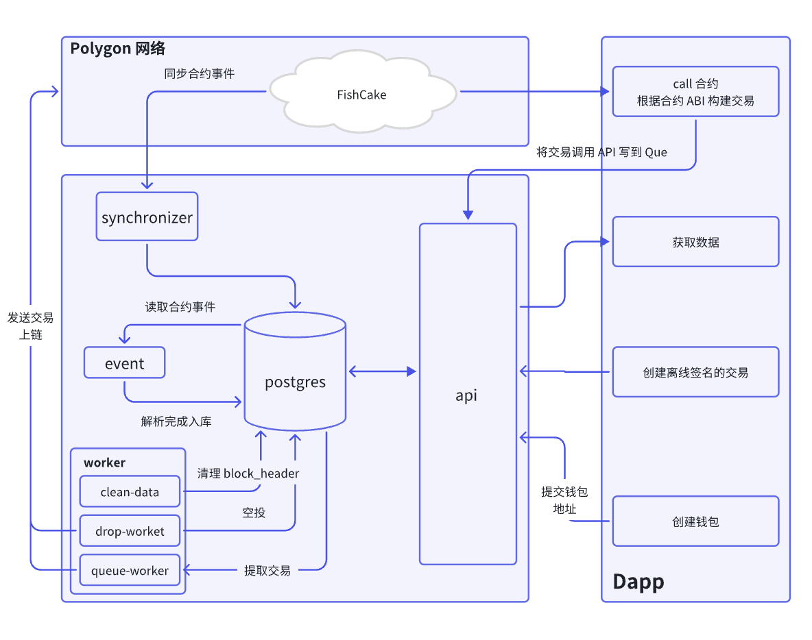
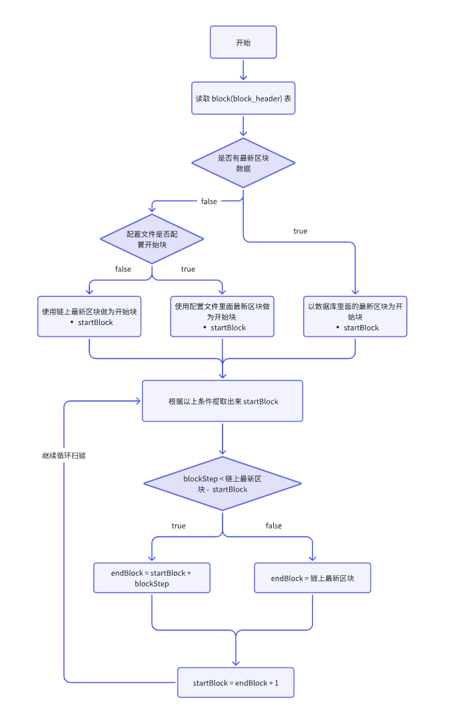
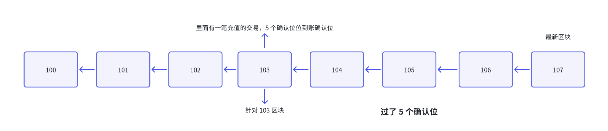
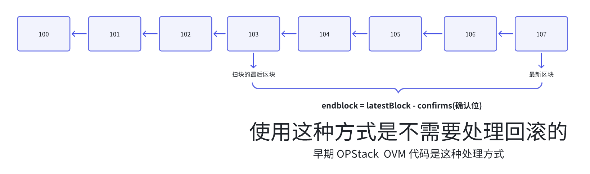
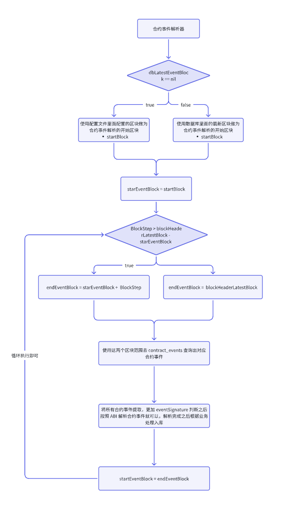
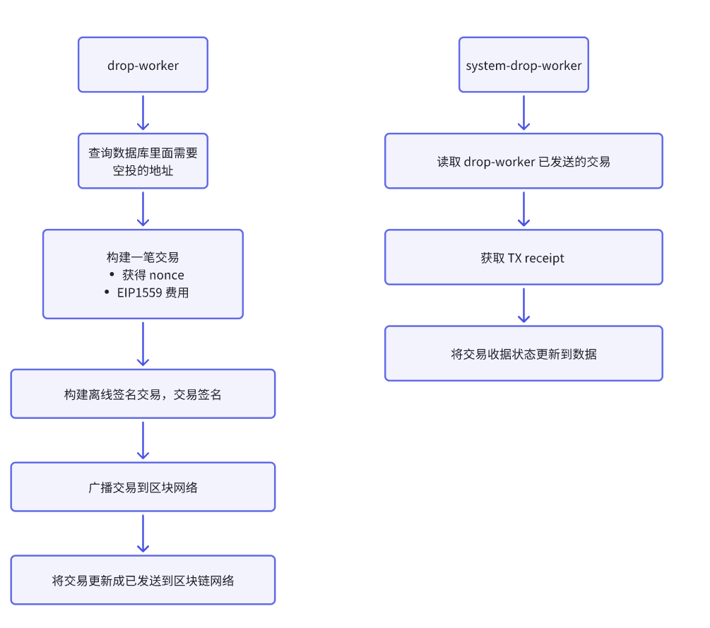
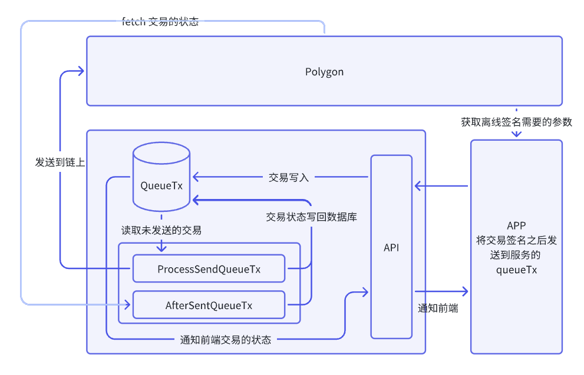

# 一.项目简介

- 官网：https://fishcake.org/
- APP 下载链接：https://fishcake.org/join
  - App store
  - Google Pay
- 事件网站地址：https://fishcake.io/zh

活动即挖矿，把活动做成 POW 的模式，集钱包，活动挖矿，经济模型和质押为一体的 Web3 项目

## 1. 平台消除了中间商

鱼饼是基于激励的这个营销平台消除了中间商，例如一个社区来帮助项目方做活动，项目方需要把资金打给社区，社区再通过黑客松活动奖励，或者其他活动方式将分给用户，在这个例子里面，社区就是中间商，我们需要消除中间商，项目可以直接将要做活动代币打入合约，代币不再经过社区团队手。

## 2. 通过过 FCC 的经济模型体系赋能活动

FCC 代币的很大一部分是给到社区活动挖矿

## 3. 质押体系

为了解决 FCC 市场的抛压问题

## 4. 钱包

目前是一个单链的钱包，Polygon, 接下来回去支持多链体系的钱包

# 二.项目的业务分析

## 1. 合约项目

- 代码：https://github.com/FishcakeLab/fishcake-contracts

## 2. FishCake 的整个后端项目

- 代码：https://github.com/FishcakeLab/fishcake-service/tree/main

### 2.1 FishCake 的扫快的逻辑

- client.go： 里面封装调用 eth 原生方法的接口
  - eth_getBlockByHash
  - eth_getBlockByNumber
  - eth_getTransactionByHash
  - eth_getTransactionReceipt
  - eth_getProof
  - eth_getLogs

#### 2.1.2 简单的一种扫块模式

- 不需要像我们这样存储整个 header,  只需要存储 block 的 number, hash 和 parent_hash
- 扫块一般扫一个范围，主要找扫块开始块和结束块，怎么去确定开始块和结束块
  - startBlock
    - 系统首次启动，一般数据库里面都是空的，所有要么使用配置的开始块，要么用链最新块做开始块
    - 系统重启，一般数据库里面都有数据，使用数据库里面最新区块做为开始块。

### 2.2 确认位的两种用法

- 第一种扫块还是要到最新区块，只是通知业务时候，最新区块 - 要通知块里面的数据 >= 确认位，这种方式钱包里面经常使用。

- 第二种用户，我不用扫到最新区块，而是扫最新区块 - 确认位（极少的用户，用户体验很差）

  

## 3. 合约事件监听器

整个项目需要监听的合约事件

- 活动创建
- 活动空投
- 活动结束
- NFT Mint

true 应该是 endEventBlock =blockHeaderLatestBlock 图中判断结果写反了

## 4. 业务处理 worker

### 4.1 空投 worker

- clean_data_worker: 清除数据库里面的 block_header 的数据，只保留 200000 条数据
- drop_worker 和 system_drop_worker：FCC 空投任务，第一次交互空投，第一次创建钱包地址空投

上面这样做的原因是：Ethereum 交易发送，并不代表成功，而是需要收据树生成，eth_getTransactionReceipt 返回 Recepit 的状态才能判断交易是否是成功, It is either 1 (success) or 0 (failure) encoded as a hexadecimal。

### 4.2 QueueTx 交易的任务

- `/v1/chain_info/submit-tx`：api 是将交易提价 QueueTx 表;
- 定时任务 `ProcessSendQueueTx` 将 QueueTx 表里面的交易发送到链上;
- 定时任务 `AfterSentQueueTx` 处理交易状态，获取 eth_getTransactionReceipt;
- `/v1/chain_info/txn_status`：检索交易状态;

为什么要这样做：FishCake 是空投，线下不断的空投，前端来做，要等交易一笔一笔的成功，如果用 QueueTx 就不用等了，直接将签名的交易全部丢上来，由后端处理完成告诉状态。