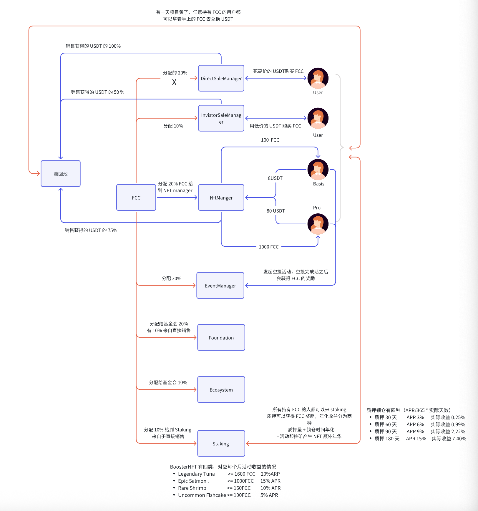

# 一.项目简介

- 官网：https://fishcake.org/
- APP 下载链接：https://fishcake.org/join
  - App store
  - Google Pay
- 事件网站地址：https://fishcake.io/zh

活动即挖矿，把活动做成 POW 的模式，集钱包，活动挖矿，经济模型和质押为一体的 Web3 项目

## 1. 平台消除了中间商

鱼饼是基于激励的这个营销平台消除了中间商，例如一个社区来帮助项目方做活动，项目方需要把资金打给社区，社区再通过黑客松活动奖励，或者其他活动方式将分给用户，在这个例子里面，社区就是中间商，我们需要消除中间商，项目可以直接将要做活动代币打入合约，代币不再经过社区团队手。

## 2. 通过过 FCC 的经济模型体系赋能活动

FCC 代币的很大一部分是给到社区活动挖矿

## 3. 质押体系

为了解决 FCC 市场的抛压问题

## 4. 钱包

目前是一个单链的钱包，Polygon, 接下来回去支持多链体系的钱包

# 二.项目的业务分析

# 三.代码实战

- https://github.com/FishcakeLab/fishcake-contracts