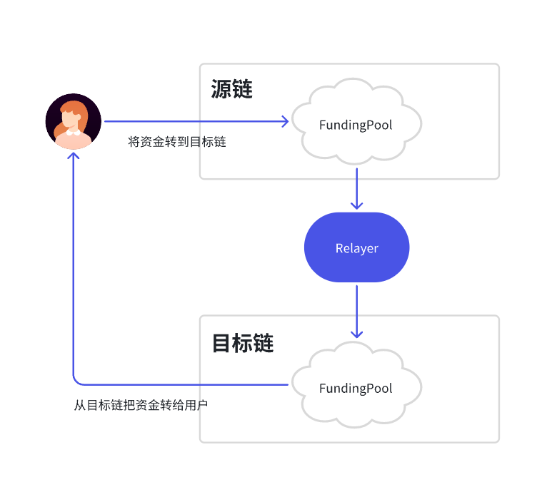
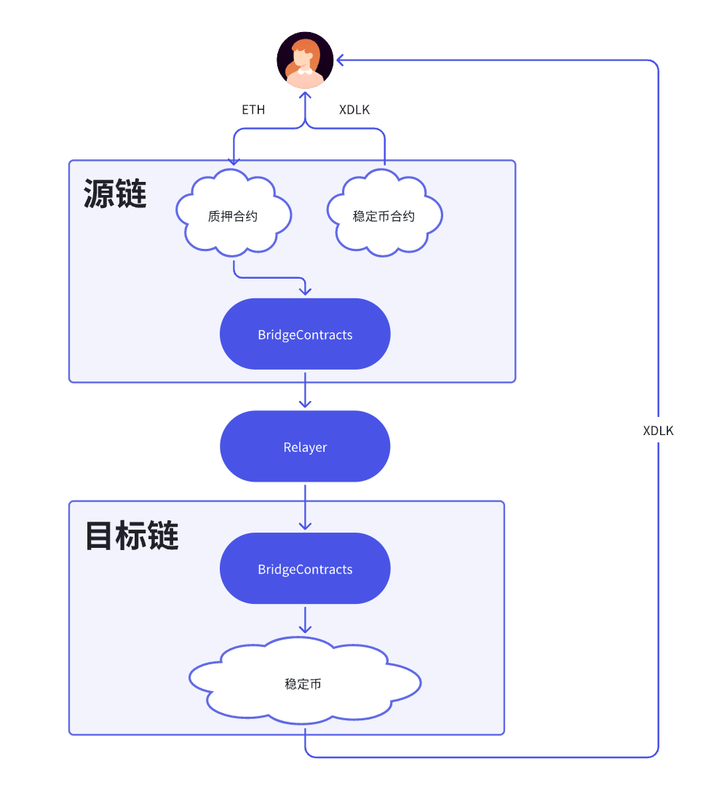
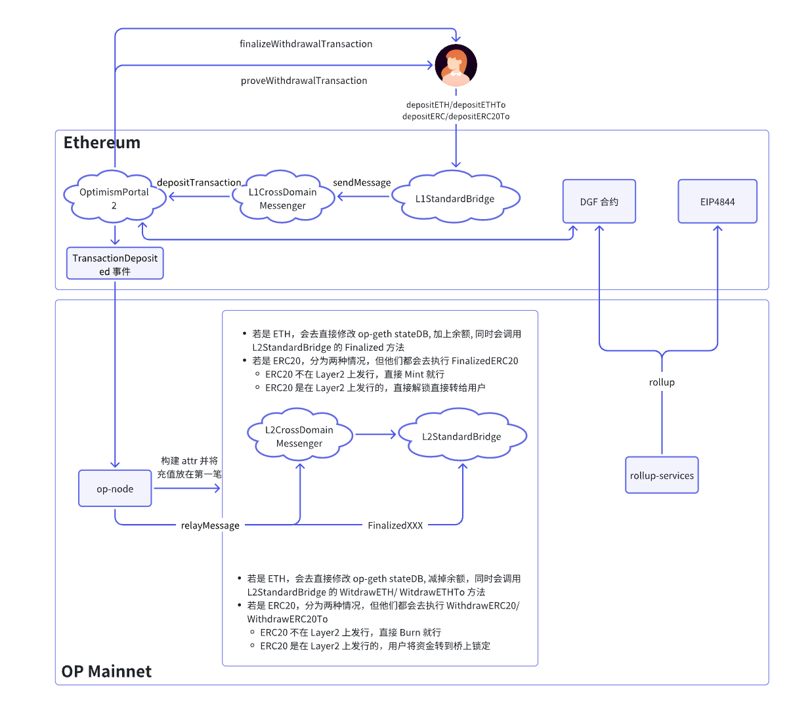
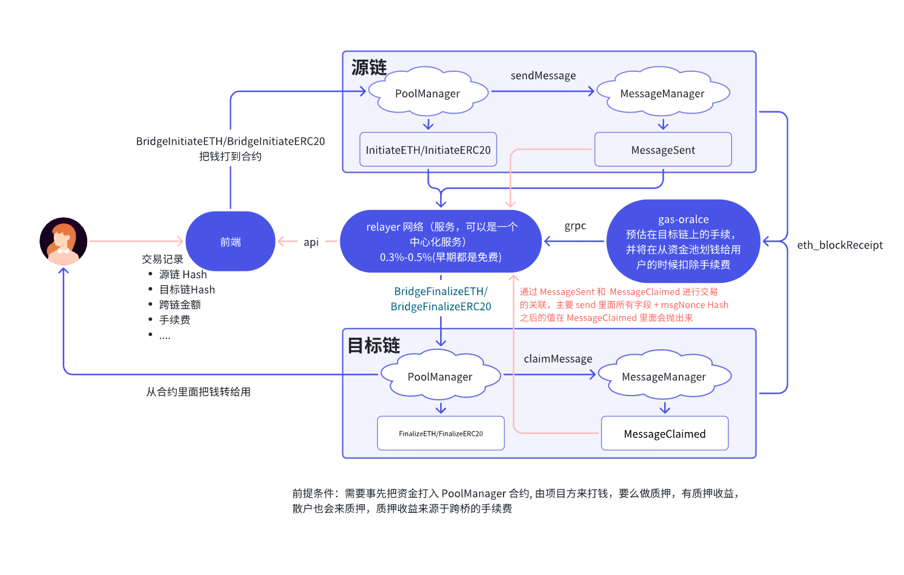
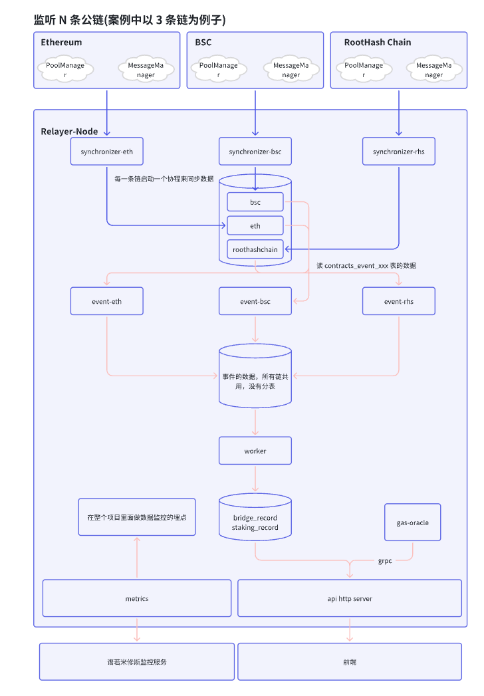
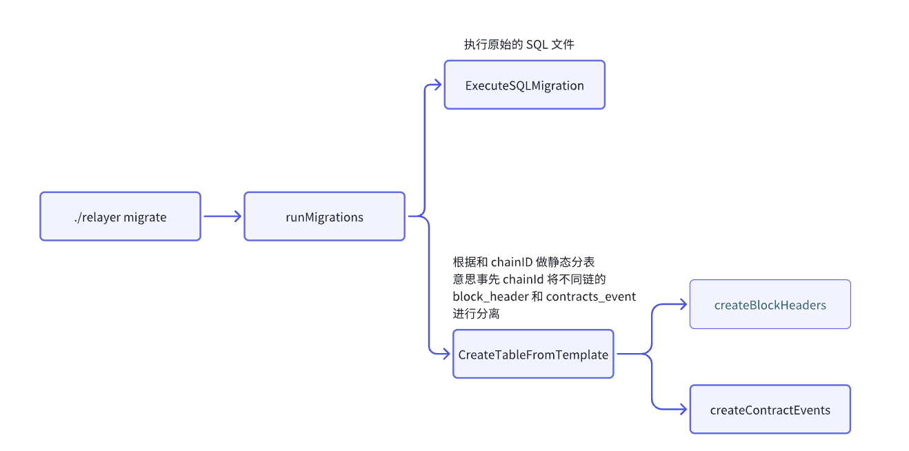
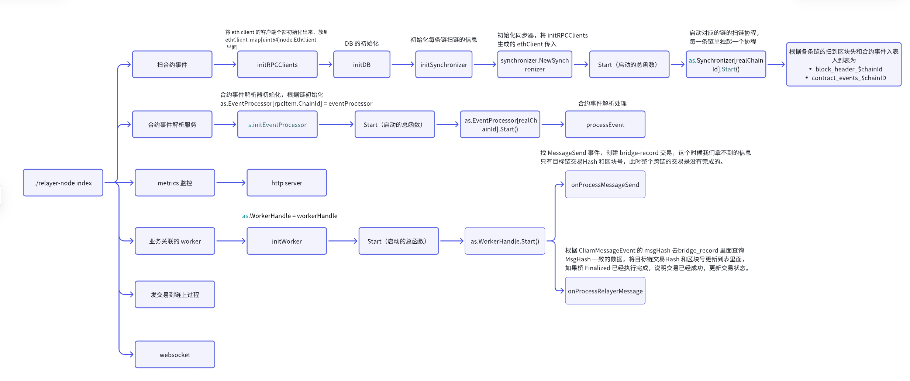

# 一.内容提要

- 跨链桥业务梳理
- 跨链桥合约代码编写
- 跨链桥链下服务编写
- 跨链桥合约部署
- 跨链桥整体测试

# 二.跨链桥业务梳理

链与链之间是独立，一般情况是无法传递资产和数据的，大多数项目都需要跨链互操作协议来承载，例如 Cosmos 的 IBC 机制就是承载跨链通信的，还有 Chainlink 的 CCIP，DapppLink CCIP, 都是为了解决跨链互操作。

- 资产跨链---跨链桥，跨链桥的核心理念，就是将资产从任意链跨转任意链
  - https://orbiter.finance/
  - https://portalbridge.com/
- 数据和资产跨链---> CCIP
  - Chain CCIP 
  - DappLink CCIP

## 1. 跨链的种类探讨

### 1.1 Lx<->Ly 桥

- 在 Layer2 比较多，比方 Op, Arbi, PolygonZkevm 等项目方的桥
  - L1-->L2 充值
  - L2-->L1 体现

### 1.2 资金池模式跨链桥



### 1.3 资金映射的桥



# 三.跨链桥的底层业务实现

## 1. Layer2 的桥的底层实现（以 OP 的跨链桥为例子说明）



## 2. DappLink 资金池模式跨链桥



- https://github.com/dapplink-labs/gas-oracle
- https://github.com/cpchain-network/bridge-contracts
- https://github.com/cpchain-network/relayer-node

### 2.1 合约代码讲解

#### 2.1.1 桥的流动性加入和移除的代码

depositEthToBridge 和 depositErc20ToBridge 是项目方将资金打入到资金池提供流动的性的逻辑

- depositEthToBridge

  - ```Plain
    function depositEthToBridge() public payable whenNotPaused nonReentrant returns (bool) {
        FundingPoolBalance[ETHAddress] += msg.value;
        emit DepositToken(
            ETHAddress,
            msg.sender,
            msg.value
        );
        return true;
    }
    ```

  - 打入了 msg.value 的资金到池子里面，ETH 模式使用 `address public constant `*`ETHAddress `*`= address(0xEeeeeEeeeEeEeeEeEeEeeEEEeeeeEeeeeeeeEEeE);` 做为合约地址

- depositErc20ToBridge

  - ```Java
    function depositErc20ToBridge(address tokenAddress, uint256 amount) public whenNotPaused nonReentrant returns (bool) {
        if (!IsSupportToken[tokenAddress]) {
            revert TokenIsNotSupported(tokenAddress);
        }
        IERC20(tokenAddress).safeTransferFrom(msg.sender, address(this), amount);
        FundingPoolBalance[tokenAddress] += amount;
        emit DepositToken(
            tokenAddress,
            msg.sender,
            amount
        );
        return true;
    }
    ```

    打入了 amount 的资金到池子里面

withdrawEthFromBridge 和 withdrawErc20FromBridge 从桥里面吧 ETH 和 ERC20 的资金提走

- withdrawEthFromBridge

```C++
function withdrawEthFromBridge(address payable withdrawAddress, uint256 amount) public payable whenNotPaused onlyWithdrawManager returns (bool) {
    require(address(this).balance >= amount, "PoolManager withdrawEthFromBridge: insufficient ETH balance in contract");
    FundingPoolBalance[ETHAddress] -= amount;
    (bool success, ) = withdrawAddress.call{value: amount}("");
    if (!success) {
        return false;
    }
    emit WithdrawToken(
        ETHAddress,
        msg.sender,
        withdrawAddress,
        amount
    );
    return true;
}
```

- withdrawErc20FromBridge

  - ```Java
    function withdrawErc20FromBridge(address tokenAddress, address withdrawAddress, uint256 amount) public whenNotPaused onlyWithdrawManager returns (bool) {
        require(
            FundingPoolBalance[tokenAddress] >= amount,
            "PoolManager withdrawEthFromBridge: Insufficient token balance in contract"
        );
        FundingPoolBalance[tokenAddress] -= amount;
        IERC20(tokenAddress).safeTransfer(withdrawAddress, amount);
        emit WithdrawToken(
            tokenAddress,
            msg.sender,
            withdrawAddress,
            amount
        );
        return true;
    }
    ```

#### 2.1.2 跨桥操作的合约

BridgeInitiateETH 和 BridgeInitiateERC20 将 ETH 和 ERC20 的资金转入到源链的合约

- BridgeInitiateETH

  - ```Java
    function BridgeInitiateETH(uint256 sourceChainId, uint256 destChainId, address destTokenAddress, address to) external whenNotPaused nonReentrant payable returns (bool) {
        if (sourceChainId != block.chainid) {
            revert sourceChainIdError();
        }
    
        if (!IsSupportChainId(destChainId)) {
            revert ChainIdIsNotSupported(destChainId);
        }
    
        if (msg.value < MinTransferAmount) {
            revert LessThanMinTransferAmount(MinTransferAmount, msg.value);
        }
    
        FundingPoolBalance[ETHAddress] += msg.value;
    
        uint256 fee = (msg.value * PerFee) / 1_000_000;
        uint256 amount = msg.value - fee;
    
        FeePoolValue[ETHAddress] += fee;
    
        messageManager.sendMessage(block.chainid, destChainId, ETHAddress, destTokenAddress, msg.sender, to, amount, fee);
    
        emit InitiateETH(sourceChainId, destChainId, destTokenAddress, msg.sender, to, amount);
    
        return true;
    }
    ```

  - messageManager.sendMessage：调用 MessageManager 抛出 MessageSent 的事件，这里面是所有跨桥的信息 + MessageNonce

  - ```Plain
    emit MessageSent(sourceChainId, destChainId, sourceTokenAddress, destTokenAddress, _from, _to, _fee, _value, messageNumber, messageHash);
    ```

  - InitiateETH 抛出来的事件，Relayer 监听的就是这个合约事件

- BridgeInitiateERC20

  - ```Java
    function BridgeInitiateERC20(uint256 sourceChainId, uint256 destChainId, address to, address sourceTokenAddress, address destTokenAddress, uint256 value) external whenNotPaused nonReentrant returns (bool) {
        if (sourceChainId != block.chainid) {
            revert sourceChainIdError();
        }
    
        if (!IsSupportChainId(destChainId)) {
            revert ChainIdIsNotSupported(destChainId);
        }
    
        if (!IsSupportToken[sourceTokenAddress]) {
            revert TokenIsNotSupported(sourceTokenAddress);
        }
    
        uint256 BalanceBefore = IERC20(sourceTokenAddress).balanceOf(address(this));
        IERC20(sourceTokenAddress).safeTransferFrom(msg.sender, address(this), value);
        uint256 BalanceAfter = IERC20(sourceTokenAddress).balanceOf(address(this));
    
        uint256 amount = BalanceAfter - BalanceBefore;
        FundingPoolBalance[sourceTokenAddress] += value;
        uint256 fee = (amount * PerFee) / 1_000_000;
    
        amount -= fee;
        FeePoolValue[sourceTokenAddress] += fee;
    
        messageManager.sendMessage(sourceChainId, destChainId, sourceTokenAddress, destTokenAddress, msg.sender, to, amount, fee);
    
        emit InitiateERC20(sourceChainId, destChainId, sourceTokenAddress, destTokenAddress, msg.sender, to, amount);
    
        return true;
    }
    ```

  - messageManager.sendMessage：调用 MessageManager 抛出 MessageSent 的事件，这里面是所有跨桥的信息 + MessageNonce,  

  - ```Plain
    emit MessageSent(sourceChainId, destChainId, sourceTokenAddress, destTokenAddress, _from, _to, _fee, _value, messageNumber, messageHash);
    ```

  - InitiateERC20 抛出来的事件，Relayer 监听的就是这个合约事件

BridgeFinalizeETH 和 BridgeFinalizeERC20 这两个是目标链上将资金转给用户

- BridgeFinalizeETH

  - ```C++
    function BridgeFinalizeETH(uint256 sourceChainId, uint256 destChainId, address sourceTokenAddress, address from, address to, uint256 amount, uint256 _fee, uint256 _nonce) external payable whenNotPaused onlyReLayer returns (bool) {
        if (destChainId != block.chainid) {
            revert sourceChainIdError();
        }
    
        if (!IsSupportChainId(sourceChainId)) {
            revert ChainIdIsNotSupported(sourceChainId);
        }
    
        (bool _ret, ) = payable(to).call{value: amount}("");
        if (!_ret) {
            revert TransferETHFailed();
        }
    
        FundingPoolBalance[ETHAddress] -= amount;
    
        messageManager.claimMessage(sourceChainId, destChainId, sourceTokenAddress, ETHAddress, from, to, amount, _fee, _nonce);
    
        emit FinalizeETH(sourceChainId, destChainId, sourceTokenAddress, address(this), to, amount);
    
        return true;
    }
    ```

  - 调用了  messageManager.claimMessage 方法，这里抛出一个合约事件

  - ```Plain
    emit MessageClaimed(sourceChainId, destChainId, sourceTokenAddress, destTokenAddress, messageHash, _nonce);
    ```

- BridgeFinalizeERC20

  - ```Java
    function BridgeFinalizeERC20(uint256 sourceChainId, uint256 destChainId, address from, address to,address sourceTokenAddress, address destTokenAddress, uint256 amount, uint256 _fee, uint256 _nonce) external whenNotPaused onlyReLayer returns (bool) {
        if (destChainId != block.chainid) {
            revert sourceChainIdError();
        }
    
        if (!IsSupportChainId(sourceChainId)) {
            revert ChainIdIsNotSupported(sourceChainId);
        }
    
        if (!IsSupportToken[destTokenAddress]) {
            revert TokenIsNotSupported(destTokenAddress);
        }
    
        require(IERC20(destTokenAddress).balanceOf(
            address(this)) >= amount,
            "PoolManager: insufficient token balance for transfer"
        );
    
        IERC20(destTokenAddress).safeTransfer(to, amount);
    
        FundingPoolBalance[destTokenAddress] -= amount;
    
        messageManager.claimMessage(sourceChainId, destChainId, sourceTokenAddress, destTokenAddress, from, to, amount, _fee, _nonce);
    
        emit FinalizeERC20(sourceChainId, destChainId, sourceTokenAddress, destTokenAddress, address(this), to, amount);
    
        return true;
    }
    ```

  - 调用了  messageManager.claimMessage 方法，这里抛出一个合约事件

  - ```Plain
    emit MessageClaimed(sourceChainId, destChainId, sourceTokenAddress, destTokenAddress, messageHash, _nonce);
    ```

## 3. 跨链桥的后端项目 （难点）

### 3.1 项目的整体架构



#### 3.1.1 数据初始化



#### 3.1.2 合约事件同步的代码流程

