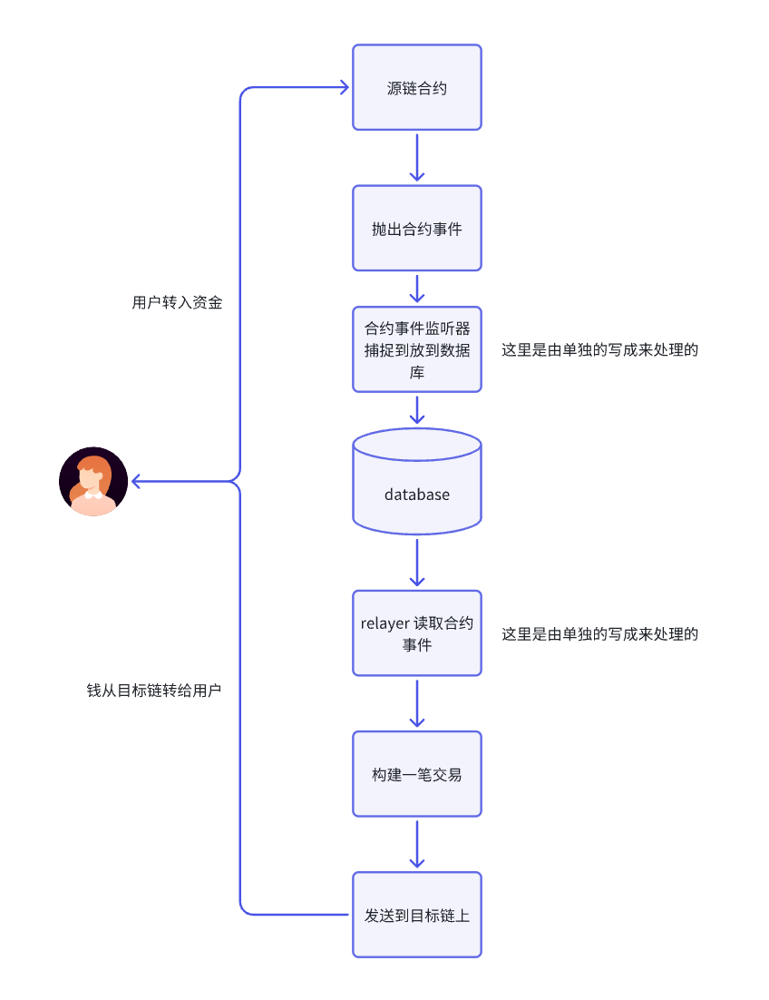
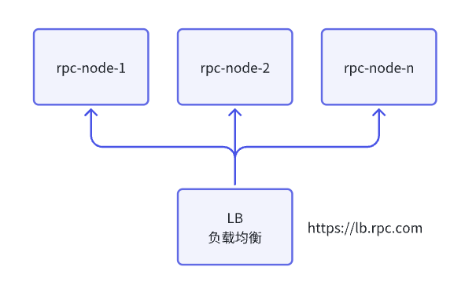
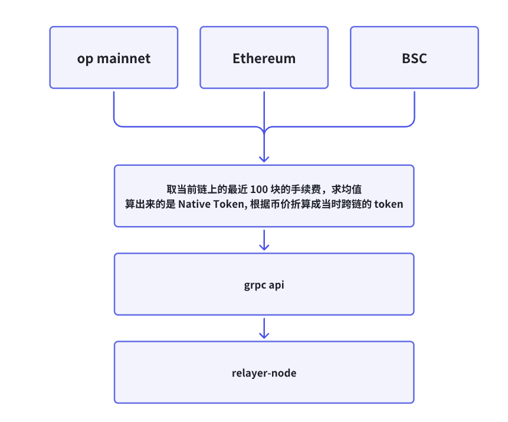

# 一.内容提要

- 跨链桥业务梳理
- 跨链桥合约代码编写
- 跨链桥链下服务编写
- 跨链桥合约部署
- 跨链桥整体测试

# 二.跨链桥业务梳理

链与链之间是独立，一般情况是无法传递资产和数据的，大多数项目都需要跨链互操作协议来承载，例如 Cosmos 的 IBC 机制就是承载跨链通信的，还有 Chainlink 的 CCIP，DapppLink CCIP, 都是为了解决跨链互操作。

- 资产跨链---跨链桥，跨链桥的核心理念，就是将资产从任意链跨转任意链
  - https://orbiter.finance/
  - https://portalbridge.com/
- 数据和资产跨链---> CCIP
  - Chain CCIP 
  - DappLink CCIP

## 1. 跨链的种类探讨

### 1.1 Lx<->Ly 桥

- 在 Layer2 比较多，比方 Op, Arbi, PolygonZkevm 等项目方的桥
  - L1-->L2 充值
  - L2-->L1 体现

### 1.2 资金池模式跨链桥


### 1.3 资金映射的桥


# 三.跨链桥的底层业务实现

## 1. Layer2 的桥的底层实现（以 OP 的跨链桥为例子说明）


## 2. DappLink 资金池模式跨链桥


- https://github.com/dapplink-labs/gas-oracle
- https://github.com/cpchain-network/bridge-contracts
- https://github.com/cpchain-network/relayer-node

### 2.1 合约代码讲解

#### 2.1.1 桥的流动性加入和移除的代码

depositEthToBridge 和 depositErc20ToBridge 是项目方将资金打入到资金池提供流动的性的逻辑

- depositEthToBridge

  - ```Plain
    function depositEthToBridge() public payable whenNotPaused nonReentrant returns (bool) {
        FundingPoolBalance[ETHAddress] += msg.value;
        emit DepositToken(
            ETHAddress,
            msg.sender,
            msg.value
        );
        return true;
    }
    ```

  - 打入了 msg.value 的资金到池子里面，ETH 模式使用 `address public constant `*`ETHAddress `*`= address(0xEeeeeEeeeEeEeeEeEeEeeEEEeeeeEeeeeeeeEEeE);` 做为合约地址

- depositErc20ToBridge

  - ```Java
    function depositErc20ToBridge(address tokenAddress, uint256 amount) public whenNotPaused nonReentrant returns (bool) {
        if (!IsSupportToken[tokenAddress]) {
            revert TokenIsNotSupported(tokenAddress);
        }
        IERC20(tokenAddress).safeTransferFrom(msg.sender, address(this), amount);
        FundingPoolBalance[tokenAddress] += amount;
        emit DepositToken(
            tokenAddress,
            msg.sender,
            amount
        );
        return true;
    }
    ```

    打入了 amount 的资金到池子里面

withdrawEthFromBridge 和 withdrawErc20FromBridge 从桥里面吧 ETH 和 ERC20 的资金提走

- withdrawEthFromBridge

```C++
function withdrawEthFromBridge(address payable withdrawAddress, uint256 amount) public payable whenNotPaused onlyWithdrawManager returns (bool) {
    require(address(this).balance >= amount, "PoolManager withdrawEthFromBridge: insufficient ETH balance in contract");
    FundingPoolBalance[ETHAddress] -= amount;
    (bool success, ) = withdrawAddress.call{value: amount}("");
    if (!success) {
        return false;
    }
    emit WithdrawToken(
        ETHAddress,
        msg.sender,
        withdrawAddress,
        amount
    );
    return true;
}
```

- withdrawErc20FromBridge

  - ```Java
    function withdrawErc20FromBridge(address tokenAddress, address withdrawAddress, uint256 amount) public whenNotPaused onlyWithdrawManager returns (bool) {
        require(
            FundingPoolBalance[tokenAddress] >= amount,
            "PoolManager withdrawEthFromBridge: Insufficient token balance in contract"
        );
        FundingPoolBalance[tokenAddress] -= amount;
        IERC20(tokenAddress).safeTransfer(withdrawAddress, amount);
        emit WithdrawToken(
            tokenAddress,
            msg.sender,
            withdrawAddress,
            amount
        );
        return true;
    }
    ```

#### 2.1.2 跨桥操作的合约

BridgeInitiateETH 和 BridgeInitiateERC20 将 ETH 和 ERC20 的资金转入到源链的合约

- BridgeInitiateETH

  - ```Java
    function BridgeInitiateETH(uint256 sourceChainId, uint256 destChainId, address destTokenAddress, address to) external whenNotPaused nonReentrant payable returns (bool) {
        if (sourceChainId != block.chainid) {
            revert sourceChainIdError();
        }
    
        if (!IsSupportChainId(destChainId)) {
            revert ChainIdIsNotSupported(destChainId);
        }
    
        if (msg.value < MinTransferAmount) {
            revert LessThanMinTransferAmount(MinTransferAmount, msg.value);
        }
    
        FundingPoolBalance[ETHAddress] += msg.value;
    
        uint256 fee = (msg.value * PerFee) / 1_000_000;
        uint256 amount = msg.value - fee;
    
        FeePoolValue[ETHAddress] += fee;
    
        messageManager.sendMessage(block.chainid, destChainId, ETHAddress, destTokenAddress, msg.sender, to, amount, fee);
    
        emit InitiateETH(sourceChainId, destChainId, destTokenAddress, msg.sender, to, amount);
    
        return true;
    }
    ```

  - messageManager.sendMessage：调用 MessageManager 抛出 MessageSent 的事件，这里面是所有跨桥的信息 + MessageNonce

  - ```Plain
    emit MessageSent(sourceChainId, destChainId, sourceTokenAddress, destTokenAddress, _from, _to, _fee, _value, messageNumber, messageHash);
    ```

  - InitiateETH 抛出来的事件，Relayer 监听的就是这个合约事件

- BridgeInitiateERC20

  - ```Java
    function BridgeInitiateERC20(uint256 sourceChainId, uint256 destChainId, address to, address sourceTokenAddress, address destTokenAddress, uint256 value) external whenNotPaused nonReentrant returns (bool) {
        if (sourceChainId != block.chainid) {
            revert sourceChainIdError();
        }
    
        if (!IsSupportChainId(destChainId)) {
            revert ChainIdIsNotSupported(destChainId);
        }
    
        if (!IsSupportToken[sourceTokenAddress]) {
            revert TokenIsNotSupported(sourceTokenAddress);
        }
    
        uint256 BalanceBefore = IERC20(sourceTokenAddress).balanceOf(address(this));
        IERC20(sourceTokenAddress).safeTransferFrom(msg.sender, address(this), value);
        uint256 BalanceAfter = IERC20(sourceTokenAddress).balanceOf(address(this));
    
        uint256 amount = BalanceAfter - BalanceBefore;
        FundingPoolBalance[sourceTokenAddress] += value;
        uint256 fee = (amount * PerFee) / 1_000_000;
    
        amount -= fee;
        FeePoolValue[sourceTokenAddress] += fee;
    
        messageManager.sendMessage(sourceChainId, destChainId, sourceTokenAddress, destTokenAddress, msg.sender, to, amount, fee);
    
        emit InitiateERC20(sourceChainId, destChainId, sourceTokenAddress, destTokenAddress, msg.sender, to, amount);
    
        return true;
    }
    ```

  - messageManager.sendMessage：调用 MessageManager 抛出 MessageSent 的事件，这里面是所有跨桥的信息 + MessageNonce,  

  - ```Plain
    emit MessageSent(sourceChainId, destChainId, sourceTokenAddress, destTokenAddress, _from, _to, _fee, _value, messageNumber, messageHash);
    ```

  - InitiateERC20 抛出来的事件，Relayer 监听的就是这个合约事件

BridgeFinalizeETH 和 BridgeFinalizeERC20 这两个是目标链上将资金转给用户

- BridgeFinalizeETH

  - ```C++
    function BridgeFinalizeETH(uint256 sourceChainId, uint256 destChainId, address sourceTokenAddress, address from, address to, uint256 amount, uint256 _fee, uint256 _nonce) external payable whenNotPaused onlyReLayer returns (bool) {
        if (destChainId != block.chainid) {
            revert sourceChainIdError();
        }
    
        if (!IsSupportChainId(sourceChainId)) {
            revert ChainIdIsNotSupported(sourceChainId);
        }
    
        (bool _ret, ) = payable(to).call{value: amount}("");
        if (!_ret) {
            revert TransferETHFailed();
        }
    
        FundingPoolBalance[ETHAddress] -= amount;
    
        messageManager.claimMessage(sourceChainId, destChainId, sourceTokenAddress, ETHAddress, from, to, amount, _fee, _nonce);
    
        emit FinalizeETH(sourceChainId, destChainId, sourceTokenAddress, address(this), to, amount);
    
        return true;
    }
    ```

  - 调用了  messageManager.claimMessage 方法，这里抛出一个合约事件

  - ```Plain
    emit MessageClaimed(sourceChainId, destChainId, sourceTokenAddress, destTokenAddress, messageHash, _nonce);
    ```

- BridgeFinalizeERC20

  - ```Java
    function BridgeFinalizeERC20(uint256 sourceChainId, uint256 destChainId, address from, address to,address sourceTokenAddress, address destTokenAddress, uint256 amount, uint256 _fee, uint256 _nonce) external whenNotPaused onlyReLayer returns (bool) {
        if (destChainId != block.chainid) {
            revert sourceChainIdError();
        }
    
        if (!IsSupportChainId(sourceChainId)) {
            revert ChainIdIsNotSupported(sourceChainId);
        }
    
        if (!IsSupportToken[destTokenAddress]) {
            revert TokenIsNotSupported(destTokenAddress);
        }
    
        require(IERC20(destTokenAddress).balanceOf(
            address(this)) >= amount,
            "PoolManager: insufficient token balance for transfer"
        );
    
        IERC20(destTokenAddress).safeTransfer(to, amount);
    
        FundingPoolBalance[destTokenAddress] -= amount;
    
        messageManager.claimMessage(sourceChainId, destChainId, sourceTokenAddress, destTokenAddress, from, to, amount, _fee, _nonce);
    
        emit FinalizeERC20(sourceChainId, destChainId, sourceTokenAddress, destTokenAddress, address(this), to, amount);
    
        return true;
    }
    ```

  - 调用了  messageManager.claimMessage 方法，这里抛出一个合约事件

  - ```Plain
    emit MessageClaimed(sourceChainId, destChainId, sourceTokenAddress, destTokenAddress, messageHash, _nonce);
    ```

## 3. 跨链桥的后端项目 （难点）

### 3.1 项目的整体架构

代码：https://github.com/the-web3-contracts/relayer-node


#### 3.1.1 数据初始化


#### 3.1.2 合约事件同步的代码流程


#### 3.1.3 发交易到链上整体过程



#### 3.1.4 假设跨桥的人很多，交易很拥堵，怎么解决



- 需要加从目标链转资金给用户地址
  - n 个地址，里面有 m 笔交易，将 m 笔交易均分给地址处理，每个地址开一协程，处理完成之后将 recepit 的机会丢到 channel,  然后有一个单独进程去操作数据库。
- 或者把你的桥的合约做成批量给用户转账
  - 合约支持，单地址调用

封装交易处理的比较优秀的代码：https://github.com/ethereum-optimism/optimism/tree/develop/op-service/txmgr

# 四. GasOracle 

## 1. 为什么需要 GasOracle

- GasOracle 预测目标要消耗的 GasFee, GasFee 是链上消耗的手续费

## 2. 做法结构




项目代码：https://github.com/cpchain-network/gas-oracle

# 五.整套系统运行部署

## 1. 部署合约

- 生成钱包地址 cast wallet n

```Plain
Address:     0x55225359b717dA1EA4270F78ddA384b0A9f53E28
Private key: 0xa3c456042022db6b15af6697ad215032881b1842e763e89ec5d4bebc16a443aa
```

- 配置环境变量

```Plain
export PRIVATE_KEY=0xa3c456042022db6b15af6697ad215032881b1842e763e89ec5d4bebc16a443aa
export RELAYER_ADDRESS=0x55225359b717dA1EA4270F78ddA384b0A9f53E28
export MULTI_SIGNER=0x55225359b717dA1EA4270F78ddA384b0A9f53E28
```

- 部署合约

```Plain
forge script ./script/DeployerCpChainBridge.s.sol:DeployerCpChainBridge --rpc-url https://rpc-testnet.roothashpay.com --private-key $PRIVATE_KEY --broadcast
```

- 部署的合约地址(RootHash Chain TestNet)

```Plain
  deploy proxyMessageManager: 0x81Ec84f2ADE4e28717f72957F8ABEF85675f2501
  deploy proxyPoolManager: 0x9B3F87aa9ABbC18b78De9fF245cc945F794F7559
```

- Sepolia(Ethereum TestNet)

```Plain
  deploy proxyMessageManager: 0x81Ec84f2ADE4e28717f72957F8ABEF85675f2501
  deploy proxyPoolManager: 0x9B3F87aa9ABbC18b78De9fF245cc945F794F7559
```

- 在 Sepolia 和 RootHash Chain TestNet 部署一个 TWT(TheWebThree)代币，用来做跨链

```Plain
forge script ./script/TheWebThree.s.sol:TreasureManagerScript  --rpc-url  $RPC_URL --private-key $PRIVATE_KEY --broadcast
```

- Sepolia

```Plain
  theWebThree address====== 0x12E60438898FB3b4aac8439DEeD57194Dc9C87aa
```

- RootHash Chain TestNet

```Plain
  theWebThree address====== 0x12E60438898FB3b4aac8439DEeD57194Dc9C87aa
```

## 2. 合约的初始化配置

- Sepolia 桥合约初始化

```Plain
获取 chainID:  cast chain-id --rpc-url 

给桥合约设置 ChainId: 
cast send --rpc-url $S_URP_URL --private-key $PRIVATE_KEY 0x9B3F87aa9ABbC18b78De9fF245cc945F794F7559 "setValidChainId(uint256,bool)" 90101 true

cast send --rpc-url $S_URP_URL --private-key $PRIVATE_KEY 0x9B3F87aa9ABbC18b78De9fF245cc945F794F7559 "setValidChainId(uint256,bool)" 11155111  true

cast send --rpc-url $S_URP_URL --private-key $PRIVATE_KEY 0x9B3F87aa9ABbC18b78De9fF245cc945F794F7559 "setSupportERC20Token(address,bool)" 0x12E60438898FB3b4aac8439DEeD57194Dc9C87aa true

往合约里面打入 TWT Token
cast send --rpc-url $S_URP_URL --private-key $PRIVATE_KEY 0x12E60438898FB3b4aac8439DEeD57194Dc9C87aa "approve(address,uint256)" 0x9B3F87aa9ABbC18b78De9fF245cc945F794F7559 100000000000000000000000000

cast send --rpc-url $S_URP_URL --private-key $PRIVATE_KEY 0x9B3F87aa9ABbC18b78De9fF245cc945F794F7559 "depositErc20ToBridge(address,uint256)" 0x12E60438898FB3b4aac8439DEeD57194Dc9C87aa 10000000000000000000000000

校验余额
cast call --rpc-url $S_URP_URL 0x9B3F87aa9ABbC18b78De9fF245cc945F794F7559 "FundingPoolBalance(address)(uint256)" 0x12E60438898FB3b4aac8439DEeD57194Dc9C87aa
```

- RootHash Chain TestNet

```Plain
cast send --rpc-url $R_URP_URL --private-key $PRIVATE_KEY 0x9B3F87aa9ABbC18b78De9fF245cc945F794F7559 "setValidChainId(uint256,bool)" 90101 true
 
cast send --rpc-url $R_URP_URL --private-key $PRIVATE_KEY 0x9B3F87aa9ABbC18b78De9fF245cc945F794F7559 "setValidChainId(uint256,bool)" 11155111 true

cast send --rpc-url $R_URP_URL --private-key $PRIVATE_KEY 0x9B3F87aa9ABbC18b78De9fF245cc945F794F7559 "setSupportERC20Token(address,bool)" 0x12E60438898FB3b4aac8439DEeD57194Dc9C87aa true


往合约里面打入 TWT Token
cast send --rpc-url $R_URP_URL --private-key $PRIVATE_KEY 0x12E60438898FB3b4aac8439DEeD57194Dc9C87aa "approve(address,uint256)" 0x9B3F87aa9ABbC18b78De9fF245cc945F794F7559 100000000000000000000000000

cast send --rpc-url $R_URP_URL --private-key $PRIVATE_KEY 0x9B3F87aa9ABbC18b78De9fF245cc945F794F7559 "depositErc20ToBridge(address,uint256)" 0x12E60438898FB3b4aac8439DEeD57194Dc9C87aa 10000000000000000000000000

校验余额
cast call --rpc-url $R_URP_URL 0x9B3F87aa9ABbC18b78De9fF245cc945F794F7559 "FundingPoolBalance(address)(uint256)" 0x12E60438898FB3b4aac8439DEeD57194Dc9C87aa
```

## 3. 启动 GasOracle 服务

- 配置环境变量

```YAML
slave_db_enable: false
enable_api_cache: false
back_offset: 2
loop_internal: 5s

server:
  host: 0.0.0.0
  port: 8081

skyeye_url: http://54.169.32.230:38980 //暂时未使用， token行情价使用写死的数据
symbols:
  - name: "btc"
    decimal: 6
  - name: "eth"
    decimal: 18
  - name: "rhs"
    decimal: 18
  - name: "usdc"
    decimal: 6
  - name: "twt"
    decimal: 18

rpcs:
  - rpc_url: $RPC_URL
    chain_id: 11155111
    native_token: ETH
    decimal: 18

  - rpc_url: 'https://rpc-testnet.roothashpay.com'
    chain_id: 90101
    native_token: RHS
    decimal: 18

master_db:
  db_host: "127.0.0.1"
  db_port: 5432
  db_user: "theweb3"
  db_password: ""
  db_name: "gasoracle"

slave_db:
  db_host: "127.0.0.1"
  db_port: 5432
  db_user: "theweb3"
  db_password: ""
  db_name: "gasoracle"
```

- 数据库初始化

```Plain
create database gasoracle;

选择 go 的版本并编译代码

make


./gas-oracle migrate -c ./gas-oracle.local.yaml


guoshijiang=# \c gasoracle
您现在已经连接到数据库 "gasoracle",用户 "theweb3".
gasoracle=#
gasoracle=# \d
                   关联列表
 架构模式 |    名称     |  类型  |   拥有者
----------+-------------+--------+-------------
 public   | gas_fee     | 数据表 | guoshijiang
 public   | token_price | 数据表 | guoshijiang
(2 行记录)

gasoracle=#
```

- 启动服务

```Plain
启动手续费扫链服务：./gas-oralce index -c ./gas-oracle.local.yaml

启动 RPC 服务：./gas-oralce grpc -c ./gas-oracle.local.yaml

RPC 调用：grpcui --plaintext 127.0.0.1:8080
```

- 给新部署的代币插入一条价行情 (暂时写死)

```SQL
INSERT INTO token_price (
    token_name,
    token_symbol,
    skeye_symbol,
    market_price,
    decimal,
    timestamp
) VALUES (
    'ETH',
    'ETH',
    'eth_usdt',
    '3480',
    18,
    EXTRACT(EPOCH FROM NOW())::integer
);
```

- 调度 RPC

```Plain
grpcurl -plaintext -d '{
  "chainId": "11155111",
  "symbol": "TWT"
}' 127.0.0.1:8081 cpchain.gasfee.TokenGasPriceServices.getTokenPriceAndGasByChainId
```

## 4. 启动 Relayer-Node

- 配置环境变量

```YAML
slave_db_enable: false
private_key: "a3c456042022db6b15af6697ad215032881b1842e763e89ec5d4bebc16a443aa"
num_confirmations: 3
safe_abort_nonce_too_low_count: 3
caller_address: "0x55225359b717dA1EA4270F78ddA384b0A9f53E28"
enable_api_cache: false
gas_oracle_endpoint: "127.0.0.1:8081"

server:
  host: 0.0.0.0
  port: 8082

metrics:
  host: 0.0.0.0
  port: 8083

rpcs:
  - rpc_url: 'https://eth-sepolia.g.alchemy.com/v2/afSCtxPWD3NE5vSjJm2GQ'
    chain_id: 11155111
    start_block: 9618149
    header_buffer_size: 50
    event_unpack_block: 9618149
    contracts:
      pool_manager_address: "0x9B3F87aa9ABbC18b78De9fF245cc945F794F7559"
      message_manager_address: "0x81Ec84f2ADE4e28717f72957F8ABEF85675f2501"

  - rpc_url: 'https://rpc-testnet.roothashpay.com'
    chain_id: 90101
    start_block: 1650800
    header_buffer_size: 500
    event_unpack_block: 1650800
    contracts:
      pool_manager_address: "0x9B3F87aa9ABbC18b78De9fF245cc945F794F7559"
      message_manager_address: "0x81Ec84f2ADE4e28717f72957F8ABEF85675f2501"

master_db:
  db_host: "127.0.0.1"
  db_port: 5432
  db_user: "guoshijiang"
  db_password: ""
  db_name: "relayernode"

slave_db:
  db_host: "127.0.0.1"
  db_port: 5432
  db_user: "guoshijiang"
  db_password: ""
  db_name: "relayernode"
```

- 初始化数据库

```Plain
create database relayernode;

./relayer-node migrate -c ./relayer-node.local.yaml

relayernode=# \d
没有找到任何关系.
relayernode=# \d
                          关联列表
 架构模式 |           名称           |  类型  |   拥有者
----------+--------------------------+--------+-------------
 public   | block_headers            | 数据表 | guoshijiang
 public   | block_headers_11155111   | 数据表 | guoshijiang
 public   | block_headers_90101      | 数据表 | guoshijiang
 public   | bridge_finalize          | 数据表 | guoshijiang
 public   | bridge_initiate          | 数据表 | guoshijiang
 public   | bridge_msg_hash          | 数据表 | guoshijiang
 public   | bridge_msg_sent          | 数据表 | guoshijiang
 public   | bridge_record            | 数据表 | guoshijiang
 public   | claim_reward             | 数据表 | guoshijiang
 public   | contract_events          | 数据表 | guoshijiang
 public   | contract_events_11155111 | 数据表 | guoshijiang
 public   | contract_events_90101    | 数据表 | guoshijiang
 public   | event_block              | 数据表 | guoshijiang
 public   | lp_withdraw              | 数据表 | guoshijiang
 public   | staking_record           | 数据表 | guoshijiang
 public   | token_config             | 数据表 | guoshijiang
(16 行记录)
```

- 启动服务

```Plain
./relayer-node index -c relayer-node.local.yaml

./relayer-node api -c ./relayer-node.local.yaml
INFO [11-13|11:17:40.787] running api...
INFO [11-13|11:17:40.793] API server started                       addr=[::]:8082
```

- 开始跨桥

```Plain
Address:     0xf7BA939820b38684d122D13a879639C151fBD230
Private key: 0xe72e9e352fa975ddbeeed5cff23d90416e1e6a3447fae7d6e46e2ecf021d5ef5
```

```
function BridgeInitiateERC20(uint256 sourceChainId, uint256 destChainId, address to, address sourceTokenAddress, address destTokenAddress, uint256 value) external whenNotPaused nonReentrant returns (bool) 
```

```Plain
cast send --rpc-url $S_URP_URL --private-key $PRIVATE_KEY 0x9B3F87aa9ABbC18b78De9fF245cc945F794F7559 "BridgeInitiateERC20(uint256,uint256,address,address,address,uint256)" 11155111 90101 0xf7BA939820b38684d122D13a879639C151fBD230 0x12E60438898FB3b4aac8439DEeD57194Dc9C87aa 0x12E60438898FB3b4aac8439DEeD57194Dc9C87aa 120000000000000000000
```

可能的错误

Rpc 查询区块头失败，是因为一次查询区块数量太多，导致请求超时

```SQL
database operation                       
module=db duration_ms=0 rows_affected=3 sql="INSERT INTO \"block_headers_90101\" (\"hash\",\"parent_hash\",\"number\",\"timestamp\",\"rlp_bytes\") VALUES (...)" ERROR[11-13|11:23:32.910] Call eth_getBlockByNumber method fail    err="Post \"https://eth-sepolia.g.alchemy.com/v2/afSCtxPWD3NE5vSjJm2GQ\": context deadline exceeded" ERROR[11-13|11:23:32.910] sync                                     
"chain "=11155111 "error querying for headers err"="unable to query latest block: Post \"https://eth-sepolia.g.alchemy.com/v2/afSCtxPWD3NE5vSjJm2GQ\": context deadline exceeded"
```

报错了，忘记配置第二个 token 

```Plain
INFO [11-13|11:29:24.552] database operation                       module=db duration_ms=0  rows_affected=0  sql="SELECT * FROM \"token_config\" WHERE token_address = '0x12e60438898fb3b4aac8439deed57194dc9c87aa' and chain_id = 90101 LIMIT 1"
ERROR[11-13|11:29:24.552] "Query token by source chain fail, ❌❌❌ maybe you must config token ❌❌❌" err=<nil>

解决：
INSERT INTO token_config (
    chain_id,
    token_address,
    token_name,
    token_decimal,
    timestamp
) VALUES (
    90101,
    '0x12E60438898FB3b4aac8439DEeD57194Dc9C87aa',  // 这里的地址要小写
    'twt',
    '18',
    EXTRACT(EPOCH FROM NOW())::integer
);
```