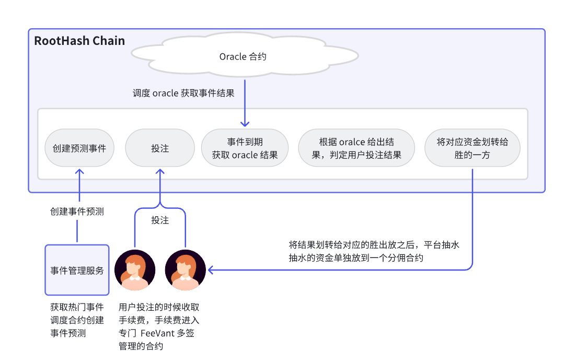

# 事件预测平台

## 一. 项目概述

依赖于 DappLink Oracle 开发事件预测平台，需要实现合约代码和链下数据索引服务，第一阶段（从 10 月 20 开始到 11 月 10 日止）完成合约代码开发，第二阶段（从11 月 10 日到 12 月 30 日）完成链下服务开发。

## 二. 项目的架构设计

## 三. 项目要求

- 第一步：研究清楚 DappLink Oracle 运行机制（DappLink 的公众号里面有文章）；
- 第二步：做详细项目逻辑设计（执行逻辑过程和伪代码）；
- 第三步：将代码实现（前端代码使用 AI 写一下就行，能基本交互通）；
- 第四步：将合约部署到链上--测试网；
- 第五步：大家互相进行代码审计，输出审计报告；
- 第六步：上线主网，进行真实产品试用；

--------------------------------------------------------------------------------------------------------------------------

## 四.事件预测市场（业务需求）

