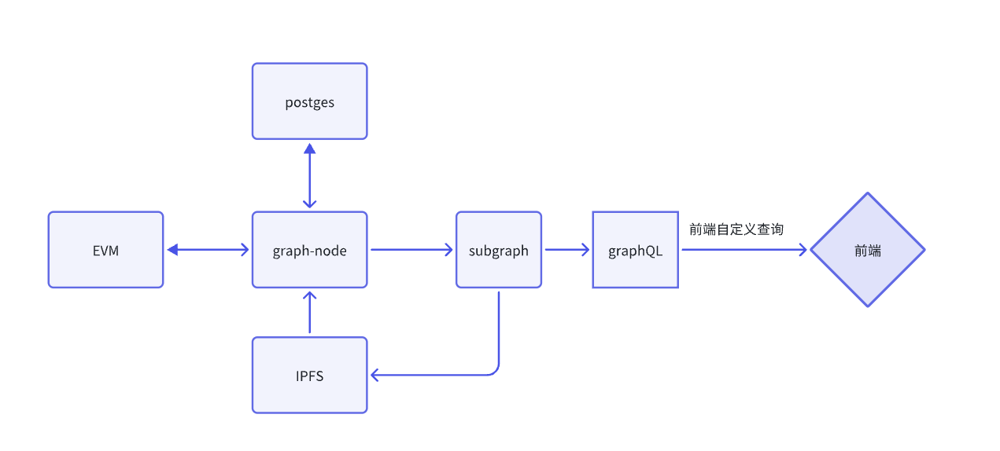
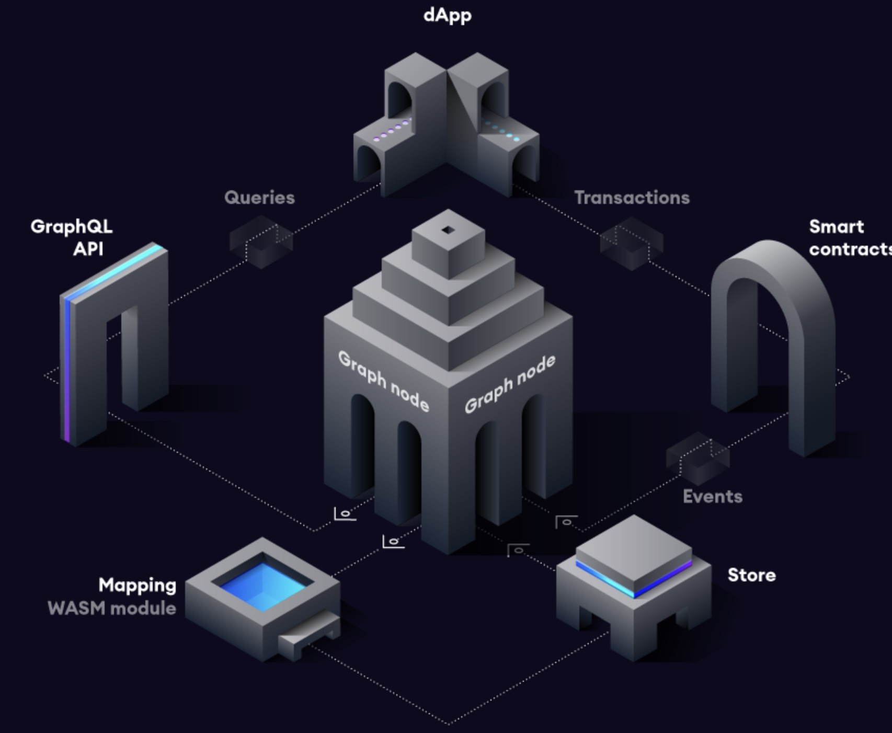

# 一.内容提要

- TheGraph 监听合约事件
- 原生 NodeJs 监听合约
- 使用 Go 监听合约事件

# 二.合约事件监听的方式

## 1. 从 Ethereum 原生接口来看

### (1) eth_getLog

- eth_getLog: 可以传入起始区块，终止区块，合约地址，要过滤的合约签名，参数都是可选的
  - fromBlock（可选）：从中开始查找日志的块号。
  - toBlock（可选）：停止查找日志的块号。
  - 地址（可选）：获取日志的合约地址。
  - 主题（可选）：主题过滤器数组。

- 调用接口

```SQL
curl --location --request POST 'https://go.getblock.io/<ACCESS-TOKEN>/' \
--header 'Content-Type: application/json' \
--data-raw '{
    "jsonrpc": "2.0",
    "method": "eth_getLogs",
    "params": [
        {
            "fromBlock": "0x107D7B0",
            "toBlock": "0x107D7B0",
            "address": "0x901c7C311d39e0b26257219765E71E8DB3107A81",
            "topics": []
        }
    ],
    "id": "getblock.io"
}'
```

### (2) eth_getTransactionReceipt 

### 按照交易 Hash 查询交易

- 返回来的 Logs 就是对应的合约事件
- 参数 
  - 数据：交易的 32 字节哈希值。

- request

```SQL
curl --location --request POST 'https://go.getblock.io/<ACCESS-TOKEN>/' \
--header 'Content-Type: application/json' \
--data-raw '{
    "jsonrpc": "2.0",
    "method": "eth_getTransactionReceipt",
    "params": [
        "0xcd718a69d478340dc28fdf6bf8056374a52dc95841b44083163ced8dfe29310c"
    ],
    "id": "getblock.io"
}'
```

- Response

```JSON
{
    "id": "getblock.io",
    "jsonrpc": "2.0",
    "result": {
        "blockHash": "0xe6262c1924326d12b88aaa35a95a0c7cdd11f2d20ebae84618484120bd037c34",
        "blockNumber": "0x107d7b0",
        "contractAddress": null,
        "cumulativeGasUsed": "0x19aac9a",
        "effectiveGasPrice": "0xb9029a7ea",
        "from": "0x901c7c311d39e0b26257219765e71e8db3107a81",
        "gasUsed": "0x27fb4",
        "logs": [
            {
                "address": "0xdac17f958d2ee523a2206206994597c13d831ec7",
                "blockHash": "0xe6262c1924326d12b88aaa35a95a0c7cdd11f2d20ebae84618484120bd037c34",
                "blockNumber": "0x107d7b0",
                "data": "0x0000000000000000000000000000000000000000000000000000000103f1bfef",
                "logIndex": "0x24e",
                "removed": false,
                "topics": [
                    "0xddf252ad1be2c89b69c2b068fc378daa952ba7f163c4a11628f55a4df523b3ef",
                    "0x000000000000000000000000a82f91562e1cef9dec93a4ad328d01ea7827910a",
                    "0x000000000000000000000000901c7c311d39e0b26257219765e71e8db3107a81"
                ],
                "transactionHash": "0xcd718a69d478340dc28fdf6bf8056374a52dc95841b44083163ced8dfe29310c",
                "transactionIndex": "0xfc"
            },
            {
                "address": "0xb7135877cd5d40aa3b086ac6f21c51bbafbbb41f",
                "blockHash": "0xe6262c1924326d12b88aaa35a95a0c7cdd11f2d20ebae84618484120bd037c34",
                "blockNumber": "0x107d7b0",
                "data": "0x00000000000000000000000000000000000000000003f6526b99745385c00000",
                "logIndex": "0x24f",
                "removed": false,
                "topics": [
                    "0x8c5be1e5ebec7d5bd14f71427d1e84f3dd0314c0f7b2291e5b200ac8c7c3b925",
                    "0x000000000000000000000000901c7c311d39e0b26257219765e71e8db3107a81",
                    "0x000000000000000000000000000000000022d473030f116ddee9f6b43ac78ba3"
                ],
                "transactionHash": "0xcd718a69d478340dc28fdf6bf8056374a52dc95841b44083163ced8dfe29310c",
                "transactionIndex": "0xfc"
            },
            {
                "address": "0xb7135877cd5d40aa3b086ac6f21c51bbafbbb41f",
                "blockHash": "0xe6262c1924326d12b88aaa35a95a0c7cdd11f2d20ebae84618484120bd037c34",
                "blockNumber": "0x107d7b0",
                "data": "0x000000000000000000000000000000000000000000000a968163f0a57b400000",
                "logIndex": "0x250",
                "removed": false,
                "topics": [
                    "0xddf252ad1be2c89b69c2b068fc378daa952ba7f163c4a11628f55a4df523b3ef",
                    "0x000000000000000000000000901c7c311d39e0b26257219765e71e8db3107a81",
                    "0x000000000000000000000000a82f91562e1cef9dec93a4ad328d01ea7827910a"
                ],
                "transactionHash": "0xcd718a69d478340dc28fdf6bf8056374a52dc95841b44083163ced8dfe29310c",
                "transactionIndex": "0xfc"
            },
            {
                "address": "0xa82f91562e1cef9dec93a4ad328d01ea7827910a",
                "blockHash": "0xe6262c1924326d12b88aaa35a95a0c7cdd11f2d20ebae84618484120bd037c34",
                "blockNumber": "0x107d7b0",
                "data": "0x000000000000000000000000000000000000000000000a968163f0a57b400000fffffffffffffffffffffffffffffffffffffffffffffffffffffffefc0e40110000000000000000000000000000000000000000000004f77993b72687d0b8d40000000000000000000000000000000000000000000000002672ab0fa51842cafffffffffffffffffffffffffffffffffffffffffffffffffffffffffffb6981",
                "logIndex": "0x251",
                "removed": false,
                "topics": [
                    "0xc42079f94a6350d7e6235f29174924f928cc2ac818eb64fed8004e115fbcca67",
                    "0x000000000000000000000000ef1c6e67703c7bd7107eed8303fbe6ec2554bf6b",
                    "0x000000000000000000000000901c7c311d39e0b26257219765e71e8db3107a81"
                ],
                "transactionHash": "0xcd718a69d478340dc28fdf6bf8056374a52dc95841b44083163ced8dfe29310c",
                "transactionIndex": "0xfc"
            }
        ],
        "logsBloom": "0x00000000000000000000000000000000000000000000000000001000000000000000000000000000000000000000010000000000800020000000000000200000000040000000000800104008000000000000000000000800000000001200000000000000000000000000000000000000000000000020000000020010000800000000000000000000000000000000000000000000000000000000000000120000020800000000000000100084000000000000000000000000000000000000000000000002000000000000001000000000400000000000000000000000000000000010000000000000000000000000000000000000000000000000000090000000",
        "status": "0x1",
        "to": "0xef1c6e67703c7bd7107eed8303fbe6ec2554bf6b",
        "transactionHash": "0xcd718a69d478340dc28fdf6bf8056374a52dc95841b44083163ced8dfe29310c",
        "transactionIndex": "0xfc",
        "type": "0x2"
    }
}
```

- logs 对应的就是合约事件

### (3) eth_getBlockReceipts 

### 返回来的是整个区块的收据，里面的 logs 就是合约事件

- eth_getBlockReceipts 方法接受以下参数：
  - 数据，32 字节。
- request

```SQL
curl --location 'https://ethereum-rpc.publicnode.com' \
--header 'Content-Type: application/json' \
--data '{
    "jsonrpc":"2.0",
    "method":"eth_getBlockReceipts",
    "params":["finalized"],
    "id":83
}'
```

- Response

```JSON
"jsonrpc": "2.0",
    "id": 83,
    "result": [
        {
            "blockHash": "0x194a7d4414cfa2fcf3e8633cd4858d89acfe21fe0372d997e19e81e9f698c0d2",
            "blockNumber": "0x1691d78",
            "contractAddress": null,
            "cumulativeGasUsed": "0xb1ef9",
            "effectiveGasPrice": "0x800be708",
            "from": "0xee0b0271918ba62b939437af831efc689365112b",
            "gasUsed": "0xb1ef9",
            "logs": [
                {
                    "address": "0xa258c4606ca8206d8aa700ce2143d7db854d168c",
                    "topics": [
                        "0xddf252ad1be2c89b69c2b068fc378daa952ba7f163c4a11628f55a4df523b3ef",
                        "0x000000000000000000000000062bf725dc4cdf947aa79ca2aaccd4f385b13b5c",
                        "0x0000000000000000000000007e30fc3411afd4c0381a4ec6e6ba09e19b9edb5b"
                    ],
                    "data": "0x00000000000000000000000000000000000000000000000005ba990c30c62696",
                    "blockNumber": "0x1691d78",
                    "transactionHash": "0x2f57d38f9bf7b9b041351cdda6aaa2b6ab9f936c513b82be137667917bf29bf6",
                    "transactionIndex": "0x0",
                    "blockHash": "0x194a7d4414cfa2fcf3e8633cd4858d89acfe21fe0372d997e19e81e9f698c0d2",
                    "logIndex": "0x0",
                    "removed": false,
                    "blockTimestamp": "0x68fee3d7"
                },
                {
                    "address": "0x87870bca3f3fd6335c3f4ce8392d69350b4fa4e2",
                    "topics": [
                        "0x804c9b842b2748a22bb64b345453a3de7ca54a6ca45ce00d415894979e22897a",
                        "0x000000000000000000000000c02aaa39b223fe8d0a0e5c4f27ead9083c756cc2"
                    ],
                    "data": "0x0000000000000000000000000000000000000000000f2bef3104bb5b7bccb4420000000000000000000000000000000000000000000000000000000000000000000000000000000000000000000000000000000000146d41d0eef784aff97189000000000000000000000000000000000000000003687d696442795167585eb200000000000000000000000000000000000000000380a6cf6fc4f10b14f94ca1",
                    "blockNumber": "0x1691d78",
                    "transactionHash": "0x2f57d38f9bf7b9b041351cdda6aaa2b6ab9f936c513b82be137667917bf29bf6",
                    "transactionIndex": "0x0",
                    "blockHash": "0x194a7d4414cfa2fcf3e8633cd4858d89acfe21fe0372d997e19e81e9f698c0d2",
                    "logIndex": "0x1",
                    "removed": false,
                    "blockTimestamp": "0x68fee3d7"
                },
                {
                    "address": "0x4d5f47fa6a74757f35c14fd3a6ef8e3c9bc514e8",
                    "topics": [
                        "0xddf252ad1be2c89b69c2b068fc378daa952ba7f163c4a11628f55a4df523b3ef",
                        "0x00000000000000000000000090759801579208b28d2d36d13b1ed7443d1b717f",
                        "0x0000000000000000000000000000000000000000000000000000000000000000"
                    ],
                    "data": "0x00000000000000000000000000000000000000000000000005d937ff96d7172b",
                    "blockNumber": "0x1691d78",
                    "transactionHash": "0x2f57d38f9bf7b9b041351cdda6aaa2b6ab9f936c513b82be137667917bf29bf6",
                    "transactionIndex": "0x0",
                    "blockHash": "0x194a7d4414cfa2fcf3e8633cd4858d89acfe21fe0372d997e19e81e9f698c0d2",
                    "logIndex": "0x2",
                    "removed": false,
                    "blockTimestamp": "0x68fee3d7"
                },
                     "blockHash": "0x194a7d4414cfa2fcf3e8633cd4858d89acfe21fe0372d997e19e81e9f698c0d2",
            "blockNumber": "0x1691d78",
            "contractAddress": null,
            "cumulativeGasUsed": "0x1f4ace3",
            "effectiveGasPrice": "0x8d65308",
            "from": "0x4838b106fce9647bdf1e7877bf73ce8b0bad5f97",
            "gasUsed": "0x5208",
            "logs": [],
            "logsBloom": "0x00000000000000000000000000000000000000000000000000000000000000000000000000000000000000000000000000000000000000000000000000000000000000000000000000000000000000000000000000000000000000000000000000000000000000000000000000000000000000000000000000000000000000000000000000000000000000000000000000000000000000000000000000000000000000000000000000000000000000000000000000000000000000000000000000000000000000000000000000000000000000000000000000000000000000000000000000000000000000000000000000000000000000000000000000000000",
            "status": "0x1",
            "to": "0x396e52f7ee3f3b3094ba9de35932f0b10ebee54e",
            "transactionHash": "0x348fe63c7ed9f416ff8190b099e7a8895e60ba246d0c2ef56314b64502b683f7",
            "transactionIndex": "0x196",
            "type": "0x2"
        }
    ]
}
```

## 2. 从使用的开发框架来看

- TheGraph 的合约事件缩引器
- 自己编码 go 和 nodejs 索引

# 三.合约事件监听实战

## 一. TheGraph 监听合约事件实战



### 1. The Graph 项目介绍

#### 1.1 什么是Graph

Graph 是一个去中心化的协议，用于索引和查询区块链的数据。 它使查询那些难以直接查询的数据成为可能。它的主要作用包括：

- **数据索引和查询**：The Graph 提供了一种高效的方式来索引和查询区块链上的数据。通过 Subgraph，开发者可以定义他们想要索引的数据以及如何查询这些数据。
- **简化 DApp 开发**：开发者可以通过 The Graph 快速获取他们应用所需的数据，而不需要自己编写复杂的后端代码来从区块链节点获取和处理数据。这简化了去中心化应用（DApp）的开发过程。
- **提高查询速度**：直接从区块链节点查询数据可能会非常慢，因为区块链数据通常是未索引的且分布在多个节点上。The Graph 通过预先索引数据，显著提高了查询速度，使得实时应用成为可能。
- **支持多种区块链网络**：虽然 The Graph 最初是为以太坊设计的，但它现在支持多个区块链网络，包括 IPFS、Polkadot 和 NEAR 等，使得它成为跨链应用的一个有力工具。
- **去中心化和社区驱动**：The Graph 是一个去中心化的协议，由社区运行的节点（Indexers）来处理索引和查询请求。这使得它具有高可用性和抗审查性。
- **GraphQL 查询语言**：The Graph 使用 GraphQL 作为查询语言。GraphQL 提供了强大的查询能力，使得开发者可以轻松地获取他们所需的精确数据，而不会有多余的数据传输。

#### 1.2 Graph 的工作流程



流程遵循这些步骤：

- 一个去中心化的应用程序通过智能合约上的交易向以太坊添加数据。
- 智能合约在处理交易时，会发出一个或多个事件。
- Graph 节点不断扫描以太坊的新区块和它们可能包含的子图的数据。
- Graph 节点在这些区块中为你的子图找到以太坊事件并运行你提供的映射处理程序。 映射是一个 WASM 模块，它创建或更新 Graph 节点存储的数据实体，以响应以太坊事件。
- 去中心化的应用程序使用Graph节点的 GraphQL 端点，从区块链的索引中查询 Graph 节点的数据。 Graph 节点反过来将 GraphQL 查询转化为对其底层数据存储的查询，以便利用存储的索引功能来获取这些数据。 去中心化的应用程序在一个丰富的用户界面中为终端用户显示这些数据，他们用这些数据在以太坊上发行新的交易。 就这样周而复始。

#### 1.3 Graph 网络组成和 The Graph Studio

Graph 网络由索引人、策展人和委托人组成，为网络提供服务，并为 Web3 应用程序提供数据。 消费者使用应用程序并消费数据。


##### 1.3.1 索引人 (Indexers)

**作用**:

- **运行节点**：索引人在 The Graph 网络中运行全节点，处理和存储来自区块链的数据。
- **创建和维护索引**：索引人负责创建和维护 Subgraph 的索引，以便快速处理查询请求。
- **处理查询**：他们接收并处理来自去中心化应用（DApps）的 GraphQL 查询请求。
- **赚取奖励**：通过处理查询和维护索引，索引人可以赚取查询费用和通胀奖励。

**要求**:

- **技术能力**：需要有运行和维护节点的技术知识。
- **GRT 抵押**：索引人需要抵押一定数量的 GRT 代币，以确保他们的行为诚实并激励他们提供高质量的服务。

##### 1.3.2 策展人 (Curators)

**作用**:

- **信号 Subgraphs**：策展人使用 GRT 代币对高质量的 Subgraphs 进行信号，以表示这些 Subgraphs 包含有价值的数据。
- **帮助索引人**：通过对 Subgraphs 进行信号，策展人帮助索引人确定哪些数据应该被索引，从而提高索引效率和数据质量。
- **赚取奖励**：策展人可以通过他们的信号获得查询费用的一部分作为奖励。

**要求**:

- **知识和判断力**：需要对区块链数据和去中心化应用有深入了解，以识别和信号高质量的 Subgraphs。
- **GRT 投资**：策展人需要投资 GRT 代币用于信号。

##### 1.3.3 委托人 (Delegators)

**作用**:

- **支持索引人**：委托人将他们的 GRT 代币委托给索引人，以帮助索引人增加抵押和提高服务能力。
- **赚取奖励**：通过委托 GRT 代币，委托人可以获得索引人赚取的查询费用和通胀奖励的一部分。

**要求**:

- **选择索引人**：需要了解和评估不同的索引人，以选择那些他们认为最有能力和信誉的索引人。
- **GRT 代币**：需要拥有 GRT 代币并将其委托给索引人。

#### 1.4 The Graph Studio

The Graph Studio 是一个用于构建、部署和管理子图（Subgraph）的用户界面工具。它为开发者提供了一种简化的方式来与 The Graph 协议进行交互，特别是在构建基于区块链的应用时。

##### 1.4.1 **创建子图**：

允许开发者通过图形化界面创建子图。你可以定义你想要索引的智能合约和事件，以及如何将这些数据映射到实体（Entities）中。

##### 1.4.2 **部署子图**：

- 在完成子图的开发后，可以将其部署到 The Graph Network 上的主网或测试网（如 Rinkeby 或 Goerli）。
- 部署子图后，它会开始从区块链上索引数据，并允许你通过 GraphQL API 查询这些数据。

##### 1.4.3 **管理子图**：

- The Graph Studio 提供了一个仪表板，允许你查看子图的状态、索引进度和性能。
- 你还可以在子图发生错误时，查看日志并进行调试。

##### 1.4.4 **测试和调试**：

- 在部署到主网之前，可以在 The Graph Studio 中测试你的子图，确保它正确索引和处理数据。
- Studio 提供了一个交互式的 GraphQL Playground，让你可以直接在浏览器中运行查询并检查响应。

##### 1.4.5 **更新和迁移**：

- 如果你需要对子图进行更新（例如修改映射逻辑或添加新的数据源），可以在 The Graph Studio 中进行更新和重新部署。
- The Graph Studio 支持子图的版本控制和迁移功能，使得管理不同版本的子图变得容易。


### 2. Studio 部署使用过程

- 打开 https://thegraph.com/studio/， 创建一个字图
- 安装 Graph cli

```Bash
npm install -g @graphprotocol/graph-cli
或者
yarn global add @graphprotocol/graph-cli
```

- 交互式命令行输入网络，合约等信息

```Bash
graph init --studio dapplink-treasure
```

- 认证和部署

```Bash
graph auth --studio 903b14f15185df1f843fb76f33bed1ab
cd dapplink-treasure
graph codegen && graph build
graph deploy --studio dapplink-treasure
```

## 3. 自建这个 The Graph 网络

### 3.1 本地启动 GraphNode 和 IPFS 网络

```YAML
version: '3'
services:
  postgres:
    image: postgres:15
    environment:
      POSTGRES_USER: postgres
      POSTGRES_DB: graph-node
      POSTGRES_HOST_AUTH_METHOD: trust
    ports:
      - '5432:5432'
    volumes:
      - pgdata:/var/lib/postgresql/data

  ipfs:
    image: ipfs/go-ipfs:v0.4.23
    ports:
      - '5001:5001'
      - '8080:8080'
      - '4001:4001'
    volumes:
      - ipfsdata:/data/ipfs

  graph-node:
    image: graphprotocol/graph-node:latest
    ports:
      - '8000:8000'
      - '8020:8020'
      - '8030:8030'
      - '8040:8040'
      - '8001:8001'
    depends_on:
      - postgres
      - ipfs
    environment:
      postgres_host: postgres
      postgres_user: postgres
      postgres_pass: ''
      postgres_db: graph-node
      ipfs: 'ipfs:5001'
      ethereum: 'mainnet:https://eth-holesky.g.alchemy.com/v2/BvSZ5ZfdIwB-5SDXMz8PfGcbICYQqwrl'
    volumes:
      - ./data:/data

volumes:
  pgdata:
  ipfsdata:
```

- 启动命令：docker-compose up -d
- 查看日志：docker-compose logs -f 