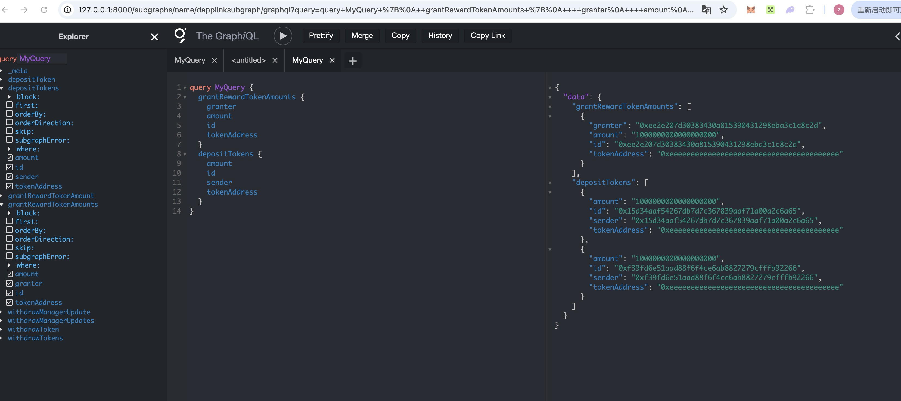
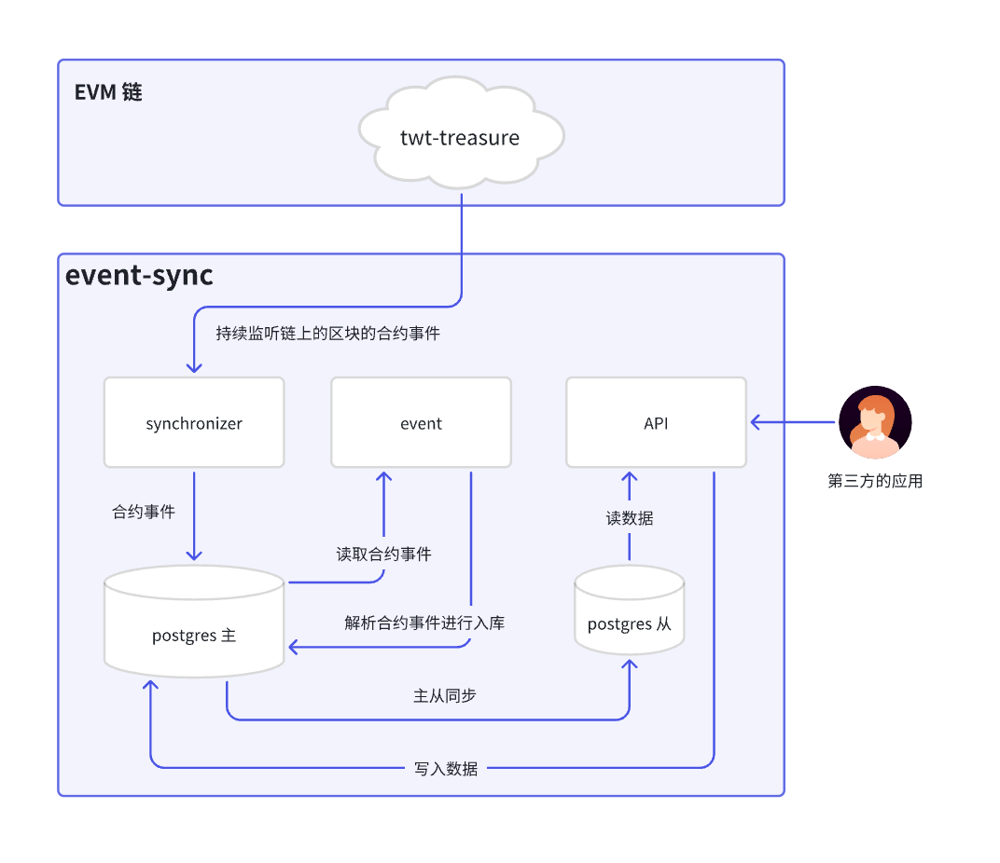
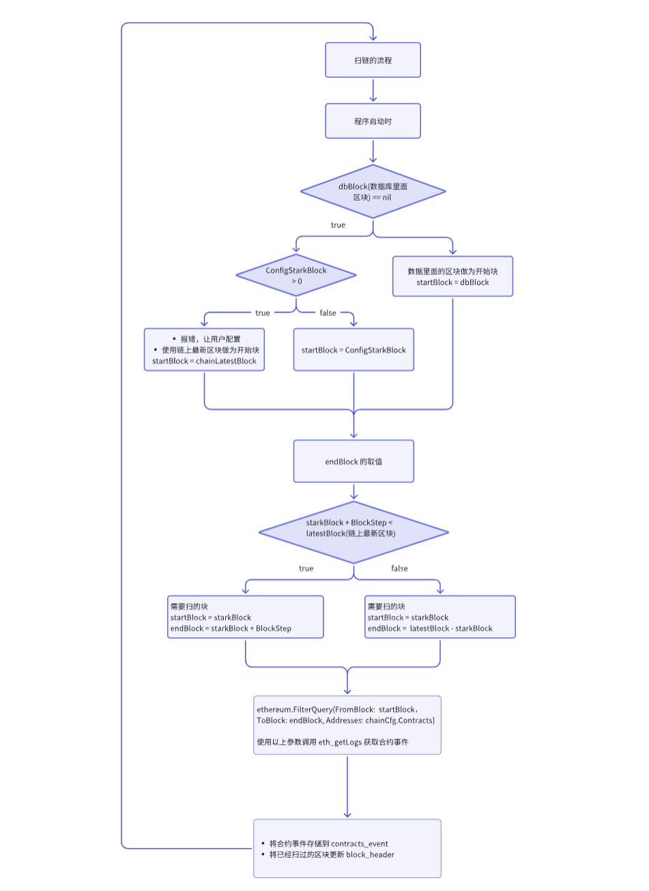
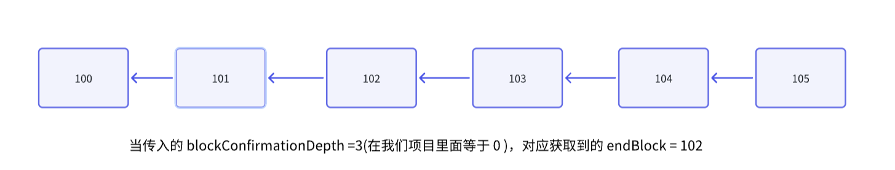

# 一.内容提要

- TheGraph 监听合约事件
- 原生 NodeJs 监听合约
- 使用 Go 监听合约事件

# 二.合约事件监听的方式

## 1. 从 Ethereum 原生接口来看

### (1) eth_getLog

- eth_getLog: 可以传入起始区块，终止区块，合约地址，要过滤的合约签名，参数都是可选的
  - fromBlock（可选）：从中开始查找日志的块号。
  - toBlock（可选）：停止查找日志的块号。
  - 地址（可选）：获取日志的合约地址。
  - 主题（可选）：主题过滤器数组。

- 调用接口

```SQL
curl --location --request POST 'https://go.getblock.io/<ACCESS-TOKEN>/' \
--header 'Content-Type: application/json' \
--data-raw '{
    "jsonrpc": "2.0",
    "method": "eth_getLogs",
    "params": [
        {
            "fromBlock": "0x107D7B0",
            "toBlock": "0x107D7B0",
            "address": "0x901c7C311d39e0b26257219765E71E8DB3107A81",
            "topics": []
        }
    ],
    "id": "getblock.io"
}'
```

### (2) eth_getTransactionReceipt 

按照交易 Hash 查询交易

- 返回来的 Logs 就是对应的合约事件
- 参数 
  - 数据：交易的 32 字节哈希值。

- request

```SQL
curl --location --request POST 'https://go.getblock.io/<ACCESS-TOKEN>/' \
--header 'Content-Type: application/json' \
--data-raw '{
    "jsonrpc": "2.0",
    "method": "eth_getTransactionReceipt",
    "params": [
        "0xcd718a69d478340dc28fdf6bf8056374a52dc95841b44083163ced8dfe29310c"
    ],
    "id": "getblock.io"
}'
```

- Response

```JSON
{
    "id": "getblock.io",
    "jsonrpc": "2.0",
    "result": {
        "blockHash": "0xe6262c1924326d12b88aaa35a95a0c7cdd11f2d20ebae84618484120bd037c34",
        "blockNumber": "0x107d7b0",
        "contractAddress": null,
        "cumulativeGasUsed": "0x19aac9a",
        "effectiveGasPrice": "0xb9029a7ea",
        "from": "0x901c7c311d39e0b26257219765e71e8db3107a81",
        "gasUsed": "0x27fb4",
        "logs": [
            {
                "address": "0xdac17f958d2ee523a2206206994597c13d831ec7",
                "blockHash": "0xe6262c1924326d12b88aaa35a95a0c7cdd11f2d20ebae84618484120bd037c34",
                "blockNumber": "0x107d7b0",
                "data": "0x0000000000000000000000000000000000000000000000000000000103f1bfef",
                "logIndex": "0x24e",
                "removed": false,
                "topics": [
                    "0xddf252ad1be2c89b69c2b068fc378daa952ba7f163c4a11628f55a4df523b3ef",
                    "0x000000000000000000000000a82f91562e1cef9dec93a4ad328d01ea7827910a",
                    "0x000000000000000000000000901c7c311d39e0b26257219765e71e8db3107a81"
                ],
                "transactionHash": "0xcd718a69d478340dc28fdf6bf8056374a52dc95841b44083163ced8dfe29310c",
                "transactionIndex": "0xfc"
            },
            {
                "address": "0xb7135877cd5d40aa3b086ac6f21c51bbafbbb41f",
                "blockHash": "0xe6262c1924326d12b88aaa35a95a0c7cdd11f2d20ebae84618484120bd037c34",
                "blockNumber": "0x107d7b0",
                "data": "0x00000000000000000000000000000000000000000003f6526b99745385c00000",
                "logIndex": "0x24f",
                "removed": false,
                "topics": [
                    "0x8c5be1e5ebec7d5bd14f71427d1e84f3dd0314c0f7b2291e5b200ac8c7c3b925",
                    "0x000000000000000000000000901c7c311d39e0b26257219765e71e8db3107a81",
                    "0x000000000000000000000000000000000022d473030f116ddee9f6b43ac78ba3"
                ],
                "transactionHash": "0xcd718a69d478340dc28fdf6bf8056374a52dc95841b44083163ced8dfe29310c",
                "transactionIndex": "0xfc"
            },
            {
                "address": "0xb7135877cd5d40aa3b086ac6f21c51bbafbbb41f",
                "blockHash": "0xe6262c1924326d12b88aaa35a95a0c7cdd11f2d20ebae84618484120bd037c34",
                "blockNumber": "0x107d7b0",
                "data": "0x000000000000000000000000000000000000000000000a968163f0a57b400000",
                "logIndex": "0x250",
                "removed": false,
                "topics": [
                    "0xddf252ad1be2c89b69c2b068fc378daa952ba7f163c4a11628f55a4df523b3ef",
                    "0x000000000000000000000000901c7c311d39e0b26257219765e71e8db3107a81",
                    "0x000000000000000000000000a82f91562e1cef9dec93a4ad328d01ea7827910a"
                ],
                "transactionHash": "0xcd718a69d478340dc28fdf6bf8056374a52dc95841b44083163ced8dfe29310c",
                "transactionIndex": "0xfc"
            },
            {
                "address": "0xa82f91562e1cef9dec93a4ad328d01ea7827910a",
                "blockHash": "0xe6262c1924326d12b88aaa35a95a0c7cdd11f2d20ebae84618484120bd037c34",
                "blockNumber": "0x107d7b0",
                "data": "0x000000000000000000000000000000000000000000000a968163f0a57b400000fffffffffffffffffffffffffffffffffffffffffffffffffffffffefc0e40110000000000000000000000000000000000000000000004f77993b72687d0b8d40000000000000000000000000000000000000000000000002672ab0fa51842cafffffffffffffffffffffffffffffffffffffffffffffffffffffffffffb6981",
                "logIndex": "0x251",
                "removed": false,
                "topics": [
                    "0xc42079f94a6350d7e6235f29174924f928cc2ac818eb64fed8004e115fbcca67",
                    "0x000000000000000000000000ef1c6e67703c7bd7107eed8303fbe6ec2554bf6b",
                    "0x000000000000000000000000901c7c311d39e0b26257219765e71e8db3107a81"
                ],
                "transactionHash": "0xcd718a69d478340dc28fdf6bf8056374a52dc95841b44083163ced8dfe29310c",
                "transactionIndex": "0xfc"
            }
        ],
        "logsBloom": "0x00000000000000000000000000000000000000000000000000001000000000000000000000000000000000000000010000000000800020000000000000200000000040000000000800104008000000000000000000000800000000001200000000000000000000000000000000000000000000000020000000020010000800000000000000000000000000000000000000000000000000000000000000120000020800000000000000100084000000000000000000000000000000000000000000000002000000000000001000000000400000000000000000000000000000000010000000000000000000000000000000000000000000000000000090000000",
        "status": "0x1",
        "to": "0xef1c6e67703c7bd7107eed8303fbe6ec2554bf6b",
        "transactionHash": "0xcd718a69d478340dc28fdf6bf8056374a52dc95841b44083163ced8dfe29310c",
        "transactionIndex": "0xfc",
        "type": "0x2"
    }
}
```

- logs 对应的就是合约事件

### (3) eth_getBlockReceipts 

返回来的是整个区块的收据，里面的 logs 就是合约事件

- eth_getBlockReceipts 方法接受以下参数：
  - 数据，32 字节。
- request

```SQL
curl --location 'https://ethereum-rpc.publicnode.com' \
--header 'Content-Type: application/json' \
--data '{
    "jsonrpc":"2.0",
    "method":"eth_getBlockReceipts",
    "params":["finalized"],
    "id":83
}'
```

- Response

```JSON
"jsonrpc": "2.0",
    "id": 83,
    "result": [
        {
            "blockHash": "0x194a7d4414cfa2fcf3e8633cd4858d89acfe21fe0372d997e19e81e9f698c0d2",
            "blockNumber": "0x1691d78",
            "contractAddress": null,
            "cumulativeGasUsed": "0xb1ef9",
            "effectiveGasPrice": "0x800be708",
            "from": "0xee0b0271918ba62b939437af831efc689365112b",
            "gasUsed": "0xb1ef9",
            "logs": [
                {
                    "address": "0xa258c4606ca8206d8aa700ce2143d7db854d168c",
                    "topics": [
                        "0xddf252ad1be2c89b69c2b068fc378daa952ba7f163c4a11628f55a4df523b3ef",
                        "0x000000000000000000000000062bf725dc4cdf947aa79ca2aaccd4f385b13b5c",
                        "0x0000000000000000000000007e30fc3411afd4c0381a4ec6e6ba09e19b9edb5b"
                    ],
                    "data": "0x00000000000000000000000000000000000000000000000005ba990c30c62696",
                    "blockNumber": "0x1691d78",
                    "transactionHash": "0x2f57d38f9bf7b9b041351cdda6aaa2b6ab9f936c513b82be137667917bf29bf6",
                    "transactionIndex": "0x0",
                    "blockHash": "0x194a7d4414cfa2fcf3e8633cd4858d89acfe21fe0372d997e19e81e9f698c0d2",
                    "logIndex": "0x0",
                    "removed": false,
                    "blockTimestamp": "0x68fee3d7"
                },
                {
                    "address": "0x87870bca3f3fd6335c3f4ce8392d69350b4fa4e2",
                    "topics": [
                        "0x804c9b842b2748a22bb64b345453a3de7ca54a6ca45ce00d415894979e22897a",
                        "0x000000000000000000000000c02aaa39b223fe8d0a0e5c4f27ead9083c756cc2"
                    ],
                    "data": "0x0000000000000000000000000000000000000000000f2bef3104bb5b7bccb4420000000000000000000000000000000000000000000000000000000000000000000000000000000000000000000000000000000000146d41d0eef784aff97189000000000000000000000000000000000000000003687d696442795167585eb200000000000000000000000000000000000000000380a6cf6fc4f10b14f94ca1",
                    "blockNumber": "0x1691d78",
                    "transactionHash": "0x2f57d38f9bf7b9b041351cdda6aaa2b6ab9f936c513b82be137667917bf29bf6",
                    "transactionIndex": "0x0",
                    "blockHash": "0x194a7d4414cfa2fcf3e8633cd4858d89acfe21fe0372d997e19e81e9f698c0d2",
                    "logIndex": "0x1",
                    "removed": false,
                    "blockTimestamp": "0x68fee3d7"
                },
                {
                    "address": "0x4d5f47fa6a74757f35c14fd3a6ef8e3c9bc514e8",
                    "topics": [
                        "0xddf252ad1be2c89b69c2b068fc378daa952ba7f163c4a11628f55a4df523b3ef",
                        "0x00000000000000000000000090759801579208b28d2d36d13b1ed7443d1b717f",
                        "0x0000000000000000000000000000000000000000000000000000000000000000"
                    ],
                    "data": "0x00000000000000000000000000000000000000000000000005d937ff96d7172b",
                    "blockNumber": "0x1691d78",
                    "transactionHash": "0x2f57d38f9bf7b9b041351cdda6aaa2b6ab9f936c513b82be137667917bf29bf6",
                    "transactionIndex": "0x0",
                    "blockHash": "0x194a7d4414cfa2fcf3e8633cd4858d89acfe21fe0372d997e19e81e9f698c0d2",
                    "logIndex": "0x2",
                    "removed": false,
                    "blockTimestamp": "0x68fee3d7"
                },
                     "blockHash": "0x194a7d4414cfa2fcf3e8633cd4858d89acfe21fe0372d997e19e81e9f698c0d2",
            "blockNumber": "0x1691d78",
            "contractAddress": null,
            "cumulativeGasUsed": "0x1f4ace3",
            "effectiveGasPrice": "0x8d65308",
            "from": "0x4838b106fce9647bdf1e7877bf73ce8b0bad5f97",
            "gasUsed": "0x5208",
            "logs": [],
            "logsBloom": "0x00000000000000000000000000000000000000000000000000000000000000000000000000000000000000000000000000000000000000000000000000000000000000000000000000000000000000000000000000000000000000000000000000000000000000000000000000000000000000000000000000000000000000000000000000000000000000000000000000000000000000000000000000000000000000000000000000000000000000000000000000000000000000000000000000000000000000000000000000000000000000000000000000000000000000000000000000000000000000000000000000000000000000000000000000000000",
            "status": "0x1",
            "to": "0x396e52f7ee3f3b3094ba9de35932f0b10ebee54e",
            "transactionHash": "0x348fe63c7ed9f416ff8190b099e7a8895e60ba246d0c2ef56314b64502b683f7",
            "transactionIndex": "0x196",
            "type": "0x2"
        }
    ]
}
```

## 2. 从使用的开发框架来看

- TheGraph 的合约事件缩引器
- 自己编码 go 和 nodejs 索引

# 三.合约事件监听实战-TheGraph

## 1. TheGraph 监听合约事件实战


## 2. The Graph 项目介绍

### 2.1 什么是Graph

Graph 是一个去中心化的协议，用于索引和查询区块链的数据。 它使查询那些难以直接查询的数据成为可能。它的主要作用包括：

- **数据索引和查询**：The Graph 提供了一种高效的方式来索引和查询区块链上的数据。通过 Subgraph，开发者可以定义他们想要索引的数据以及如何查询这些数据。
- **简化 DApp 开发**：开发者可以通过 The Graph 快速获取他们应用所需的数据，而不需要自己编写复杂的后端代码来从区块链节点获取和处理数据。这简化了去中心化应用（DApp）的开发过程。
- **提高查询速度**：直接从区块链节点查询数据可能会非常慢，因为区块链数据通常是未索引的且分布在多个节点上。The Graph 通过预先索引数据，显著提高了查询速度，使得实时应用成为可能。
- **支持多种区块链网络**：虽然 The Graph 最初是为以太坊设计的，但它现在支持多个区块链网络，包括 IPFS、Polkadot 和 NEAR 等，使得它成为跨链应用的一个有力工具。
- **去中心化和社区驱动**：The Graph 是一个去中心化的协议，由社区运行的节点（Indexers）来处理索引和查询请求。这使得它具有高可用性和抗审查性。
- **GraphQL 查询语言**：The Graph 使用 GraphQL 作为查询语言。GraphQL 提供了强大的查询能力，使得开发者可以轻松地获取他们所需的精确数据，而不会有多余的数据传输。

### 2.2 Graph 的工作流程


流程遵循这些步骤：

##### **第1步：数据产生（DApp 写入数据）**

- **用户操作**：你在 DApp 上执行操作（比如买卖 NFT、交易代币）
- **链上记录**：DApp 调用智能合约，交易被打包到以太坊区块中
- **事件触发**：智能合约处理交易时，会**发出事件** - 这些事件就像“数据信号”，包含了操作的关键信息

##### **第2步：数据监听（Graph 节点扫描）**

- **持续监控**：Graph 节点像“监控摄像头”一样，7×24小时扫描每个新区块
- **目标筛选**：节点根据**子图定义**来筛选：“我只关心特定合约发出的特定事件”
- **实时捕获**：一旦发现相关事件，立即准备处理

##### **第3步：数据加工（映射处理）**

这是最核心的步骤：

- **原始事件 → 结构化数据**：Graph 节点运行你编写的**映射程序**（WASM模块）
- **例子**：
  - 原始事件：`Transfer(from, to, tokenId)`
  - 映射处理：更新“用户A的NFT数量-1，用户B的NFT数量+1，地板价重新计算...”
- **数据存储**：处理后的结构化数据被存储到 Graph 节点的高效数据库中

##### **第4步：数据查询（DApp 读取数据）**

- **前端请求**：DApp 界面需要显示数据时，不再直接查询区块链
- **GraphQL 查询**：向 Graph 节点发送类似“给我用户0x123...的所有NFT”的请求
- **快速响应**：Graph 节点从自己的数据库中秒级返回结果，而不是遍历整个区块链历史

##### **第5步：闭环循环**

- **用户体验**：用户看到流畅的界面数据，基于这些信息做出决策
- **新的交易**：用户发起新的操作，产生新的交易和事件
- **持续循环**：整个过程周而复始，形成完整的数据流动闭环

### 2.3 Graph 网络组成和 The Graph Studio

Graph 网络由索引人、策展人和委托人组成，为网络提供服务，并为 Web3 应用程序提供数据。 消费者使用应用程序并消费数据。


#### 2.3.1 索引人 (Indexers) （运行节点、提供算力和存储的服务商）

**作用**:

- **运行节点**：索引人在 The Graph 网络中运行全节点，处理和存储来自区块链的数据。
- **创建和维护索引**：索引人负责创建和维护 Subgraph 的索引，以便快速处理查询请求。
- **处理查询**：他们接收并处理来自去中心化应用（DApps）的 GraphQL 查询请求。
- **赚取奖励**：通过处理查询和维护索引，索引人可以赚取查询费用和通胀奖励。

**要求**:

- **技术能力**：需要有运行和维护节点的技术知识。
- **GRT 抵押**：索引人需要抵押一定数量的 GRT 代币，以确保他们的行为诚实并激励他们提供高质量的服务。

#### 2.3.2 策展人 (Curators) （发现和标记优质子图的专家）

**作用**:

- **信号 Subgraphs**：策展人使用 GRT 代币对高质量的 Subgraphs 进行信号，以表示这些 Subgraphs 包含有价值的数据。
- **帮助索引人**：他们用 GRT 代币给有价值的子图“投票”，指引索引器优先索引这些数据
- **赚取奖励**：如果推荐的子图被频繁查询，他们能分享收益

**要求**:

- **知识和判断力**：需要对区块链数据和去中心化应用有深入了解，以识别和信号高质量的 Subgraphs。
- **GRT 投资**：策展人需要投资 GRT 代币用于信号。

#### 2.3.3 委托人 (Delegators) （普通用户，不想自己运行节点但想参与生态）

**作用**:

- **支持索引人**：委托人将他们的 GRT 代币委托给索引人，以帮助索引人增加抵押和提高服务能力。
- **赚取奖励**：通过委托 GRT 代币，委托人可以获得索引人赚取的查询费用和通胀奖励的一部分。

**要求**:

- **选择索引人**：需要了解和评估不同的索引人，以选择那些他们认为最有能力和信誉的索引人。
- **GRT 代币**：需要拥有 GRT 代币并将其委托给索引人。

#### 2.4 The Graph Studio

The Graph Studio 是一个用于构建、部署和管理子图（Subgraph）的用户界面工具。它为开发者提供了一种简化的方式来与 The Graph 协议进行交互，特别是在构建基于区块链的应用时。

##### 1.4.1 **创建子图**：

允许开发者通过图形化界面创建子图。你可以定义你想要索引的智能合约和事件，以及如何将这些数据映射到实体（Entities）中。

##### 1.4.2 **部署子图**：

- 在完成子图的开发后，可以将其部署到 The Graph Network 上的主网或测试网（如 Rinkeby 或 Goerli）。
- 部署子图后，它会开始从区块链上索引数据，并允许你通过 GraphQL API 查询这些数据。

##### 1.4.3 **管理子图**：

- The Graph Studio 提供了一个仪表板，允许你查看子图的状态、索引进度和性能。
- 你还可以在子图发生错误时，查看日志并进行调试。

##### 1.4.4 **测试和调试**：

- 在部署到主网之前，可以在 The Graph Studio 中测试你的子图，确保它正确索引和处理数据。
- Studio 提供了一个交互式的 GraphQL Playground，让你可以直接在浏览器中运行查询并检查响应。

##### 1.4.5 **更新和迁移**：

- 如果你需要对子图进行更新（例如修改映射逻辑或添加新的数据源），可以在 The Graph Studio 中进行更新和重新部署。
- The Graph Studio 支持子图的版本控制和迁移功能，使得管理不同版本的子图变得容易。


### 3. Studio 部署使用过程

- 打开 https://thegraph.com/studio/， 创建一个字图
- 安装 Graph cli

```Bash
npm install -g @graphprotocol/graph-cli
或者
yarn global add @graphprotocol/graph-cli
```

- 交互式命令行输入网络，合约等信息

```Bash
graph init --studio dapplink-treasure
```

- 认证和部署

```Bash
graph auth --studio 903b14f15185df1f843fb76f33bed1ab
cd dapplink-treasure
graph codegen && graph build
graph deploy --studio dapplink-treasure
```

### 4. 自建这个 The Graph 网络

#### 4.1 本地启动 GraphNode 和 IPFS 网络

```YAML
version: '3'
services:
  postgres:
    image: postgres:15
    environment:
      POSTGRES_USER: postgres
      POSTGRES_DB: graph-node
      POSTGRES_HOST_AUTH_METHOD: trust
    ports:
      - '5432:5432'
    volumes:
      - pgdata:/var/lib/postgresql/data

  ipfs:
    image: ipfs/go-ipfs:v0.4.23
    ports:
      - '5001:5001'
      - '8080:8080'
      - '4001:4001'
    volumes:
      - ipfsdata:/data/ipfs

  graph-node:
    image: graphprotocol/graph-node:latest
    ports:
      - '8000:8000'
      - '8020:8020'
      - '8030:8030'
      - '8040:8040'
      - '8001:8001'
    depends_on:
      - postgres
      - ipfs
    environment:
      postgres_host: postgres
      postgres_user: postgres
      postgres_pass: ''
      postgres_db: graph-node
      ipfs: 'ipfs:5001'
      ethereum: 'mainnet:https://eth-holesky.g.alchemy.com/v2/BvSZ5ZfdIwB-5SDXMz8PfGcbICYQqwrl'
    volumes:
      - ./data:/data

volumes:
  pgdata:
  ipfsdata:
```

- 启动命令：docker-compose up -d
- 查看日志：docker-compose logs -f 

#### 4.2 自己开发一个 Subgraph 的项目

- 初始化项目

```Plain
mkdir subgraph
npm init
```

- 编写 package.json

```json
{
  "name": "subgraph",
  "version": "1.0.0",
  "description": "",
  "main": "index.js",
  "scripts": {
    "codegen": "graph codegen",
    "build": "graph build",
    "depoy": "graph deploy --node https://api.studio.thegraph.com/deploy/ dapplinksubgraph",
    "create-local": "graph create --node http://127.0.0.1:8020/ dapplinksubgraph",
    "remove-local": "graph remove --node http://127.0.0.1:8020/ dapplinksubgraph",
    "deploy-local": "graph deploy --node http://127.0.0.1:8020/ --ipfs http://127.0.0.1:5001 dapplinksubgraph",
    "meda": "yarn remove-local && yarn create-local && yarn deploy-local",
    "test": "graph test"
  },
  "author": "",
  "license": "ISC",
  "dependencies": {
    "@graphprotocol/graph-cli": "^0.80.0",
    "@graphprotocol/graph-ts": "^0.35.1"
  }
}
```

- 将合约生成 ABI 文件拿过来

{"abi":[{"type":"receive","stateMutability":"payable"},{"type":

```
{"abi":[{"type":"receive","stateMutability":"payable"},{"type":"function","name":"DEFAULT_ADMIN_ROLE","inputs":[],"outputs":[{"name":"","type":"bytes32","internalType":"bytes32"}],"stateMutability":"view"},{"type":"function","name":"claimAllTokens","inputs":[],"outputs":[],"stateMutability":"nonpayable"},{"type":"function","name":"claimToken","inputs":[{"name":"tokenAddress","type":"address","internalType":"address"}],"outputs":[],"stateMutability":"nonpayable"},{"type":"function","name":"depositERC20","inputs":[{"name":"tokenAddress","type":"address","internalType":"contract IERC20"},...
```

- 根据业务流去编写 schema.graphql 

```yaml
type DepositToken @entity {
    id: ID!
    tokenAddress: Bytes!
    sender: Bytes!
    amount: BigInt!
}

type WithdrawToken @entity {
    id: ID!
    tokenAddress: Bytes!
    sender: Bytes!
    withdrawAddress: Bytes!
    amount: BigInt!
}

type GrantRewardTokenAmount @entity {
    id: ID!
    tokenAddress: Bytes!
    granter: Bytes!
    amount: BigInt!
}

type WithdrawManagerUpdate @entity {
    id: ID!
    withdrawManager: Bytes!
}
```

- 根据合约事件编写 subgraph.yaml

```yaml
dataSources:
  - kind: ethereum
    mapping:
      abis:
        - file: ./abis/TreasureManager.json
          name: TreasureManager
      apiVersion: 0.0.7
      entities:
        - DepositToken
        - WithdrawToken
        - GrantRewardTokenAmount
        - WithdrawManagerUpdate
      eventHandlers:
        - event: DepositToken(indexed address,indexed address,uint256)
          handler: handleDepositToken
          receipt: true
        - event: WithdrawToken(indexed address,address,address,uint256)
          handler: handleWithdrawToken
          receipt: true
        - event: GrantRewardTokenAmount(indexed address,address,uint256)
          handler: handleGrantRewardTokenAmount
          receipt: true
        - event: WithdrawManagerUpdate(indexed address)
          handler: handleWithdrawManagerUpdate
          receipt: true
      file: ./src/treasuremanager.ts
      kind: ethereum/events
      language: wasm/assemblyscript
    name: TreasureManager
    network: mainnet
    source:
      abi: TreasureManager
      address: '5FC8d32690cc91D4c39d9d3abcBD16989F875707'
      startBlock: 0
schema:
  file: ./schema.graphql
specVersion: 0.0.5
```

- yarn codegen 生成代码，引用 codegen 生成的代码来写对应的业务，./src/treasuremanager.ts 代码，自己编写的业务代码

```javascript
import  {
    DepositToken as NewDepositToken,
    WithdrawToken as NewWithdrawToken,
    GrantRewardTokenAmount as NewGrantRewardTokenAmount,
    WithdrawManagerUpdate as NewWithdrawManagerUpdate
}  from '../generated/TreasureManager/TreasureManager'
import { DepositToken, WithdrawToken, GrantRewardTokenAmount,WithdrawManagerUpdate } from '../generated/schema'
import { crypto , log } from '@graphprotocol/graph-ts'

export function handleDepositToken(event: NewDepositToken): void {
    log.info('start handleDepositToken', [])
    let eventId = event.params.sender.toHex();
    let depositToken = new DepositToken(eventId);
    depositToken.tokenAddress = event.params.tokenAddress;
    depositToken.sender = event.params.sender;
    depositToken.amount = event.params.amount;
    depositToken.save()
    log.info('end handleDepositToken', [])
}

export function handleWithdrawToken(event: NewWithdrawToken): void {
    log.info('start handleWithdrawToken', [])
    let eventId = event.params.withdrawAddress.toHex();
    let withdrawToken = new WithdrawToken(eventId);
    withdrawToken.tokenAddress = event.params.tokenAddress;
    withdrawToken.withdrawAddress = event.params.withdrawAddress;
    withdrawToken.amount = event.params.amount;
    withdrawToken.save()
    log.info('end handleWithdrawToken', [])
}

export function handleGrantRewardTokenAmount(event: NewGrantRewardTokenAmount): void {
    log.info('start handleGrantRewardTokenAmount', [])
    let eventId = event.params.granter.toHex();
    let grantRewardsEvent = new GrantRewardTokenAmount(eventId)
    grantRewardsEvent.amount = event.params.amount;
    grantRewardsEvent.tokenAddress = event.params.tokenAddress;
    grantRewardsEvent.granter = event.params.granter;
    grantRewardsEvent.save();
    log.info('end handleGrantRewardTokenAmount', [])
}

export function handleWithdrawManagerUpdate(event: NewWithdrawManagerUpdate): void {
    log.info('start handleWithdrawManagerUpdate', [])
    let eventId = event.params.withdrawManager.toHex();
    let withdrawManagerUpdate = new WithdrawManagerUpdate(eventId)
    withdrawManagerUpdate.withdrawManager = event.params.withdrawManager
    withdrawManagerUpdate.save();
    log.info('end handleWithdrawManagerUpdate', [])
}
```

- yarn build  将代码编译成 wasm 文件，后续上传到 graphnode 里面监听合约事件

### 5. The Graph 合约事件监听器实战

启动本地的 L1 Ethereum 网络，使用的 anvil

```Plain
anvil
```

启动本地的 the graph 的模拟环境，docker 启动的环境是一样

```Plain
task up-da-gph
```

- graphnode
- 本地的 ipfs 
- postgres 

部署合约

```Plain
forge script ./script/TreasureManagerScript.s.sol:TreasureManagerScript --rpc-url 127.0.0.1:8545 --private-key 0xac0974bec39a17e36ba4a6b4d238ff944bacb478cbed5efcae784d7bf4f2ff80 --broadcast
```

将合约地址配置到 subgraph.yaml 和 networks.json 文件中

- networks.json 

```Plain
{"mainnet": {"TreasureManager": {"address": "0x5FC8d32690cc91D4c39d9d3abcBD16989F875707"}}}
```

- ubgraph.yaml

```Plain
source:
  abi: TreasureManager
  address: '5FC8d32690cc91D4c39d9d3abcBD16989F875707'
  startBlock: 0
```

重新 yarn codegen 和 yarn build 生成代码

将 subgraph 部署到本地模拟 the graph 环境

```Plain
yarn meda
```

发交易监听合约事件，自己操作注意要改合约地址

```Plain
cast send --rpc-url 127.0.0.1:8545 --private-key 0x47e179ec197488593b187f80a00eb0da91f1b9d0b13f8733639f19c30a34926a 0x5FC8d32690cc91D4c39d9d3abcBD16989F875707 --value 1000000000000000000

cast send --rpc-url 127.0.0.1:8545 --private-key 0xac0974bec39a17e36ba4a6b4d238ff944bacb478cbed5efcae784d7bf4f2ff80 0x5FC8d32690cc91D4c39d9d3abcBD16989F875707 "grantRewards(address,address,uint256)" 0xEeeeeEeeeEeEeeEeEeEeeEEEeeeeEeeeeeeeEEeE 0xee2E207D30383430a815390431298EBa3c1C8c2d 1000000000000000000
```

通过 graphql 查询语句查询

- Base url: http://127.0.0.1:8000/subgraphs/name/dapplinksubgraph
- 查询结果如下图



- 大佬自己编写的类似 The Graph 的解决方案，可以灵活处理合约事件的监听器代码：https://github.com/supagraph/supagraph

### 6. 通过 eth_getTransactionReceipt 和 eth_getLog 监听合约事件实战

- https://etherscan.io/tx/0xfd26d40e17213bcafcf94bab9af92343302df9df970f20e1c9d515525e86e23e#eventlog

- event.go

```go
package event_case

import (
    "context"
    "math/big"

    "github.com/ethereum/go-ethereum"
    "github.com/ethereum/go-ethereum/common"
    "github.com/ethereum/go-ethereum/core/types"
    "github.com/ethereum/go-ethereum/ethclient"
    "github.com/ethereum/go-ethereum/log"
)

type EthClient struct {
    client *ethclient.Client
}

func NewEthClient(rpcUrl string) (*EthClient, error) {
    ethClient, err := ethclient.DialContext(context.Background(), rpcUrl)
    if err != nil {
       log.Error("new eth client fail", "err", err)
       return nil, err
    }
    return &EthClient{client: ethClient}, err
}

// GetTxReceiptByHash eth_getTransactionReceipt
func (eth *EthClient) GetTxReceiptByHash(txHash string) (*types.Receipt, error) {
    return eth.client.TransactionReceipt(context.Background(), common.HexToHash(txHash))
}

// GetLogs eth_getLogs
func (eth *EthClient) GetLogs(startBlock, endBlock *big.Int, contractAddressList []common.Address) ([]types.Log, error) {
    filterQueryParams := ethereum.FilterQuery{
       FromBlock: startBlock,
       ToBlock:   endBlock,
       Addresses: contractAddressList,
    }
    return eth.client.FilterLogs(context.Background(), filterQueryParams)
}
```

- event_test.go

```go
package event_case

import (
    "fmt"
    "math/big"
    "strings"
    "testing"

    "github.com/ethereum/go-ethereum/accounts/abi"
    "github.com/ethereum/go-ethereum/common"
    "github.com/ethereum/go-ethereum/crypto"
)

/*
 *  txReceipt, logs
 *  getLogs    logs
 */

const ConfirmDataStoreEventABI = "ConfirmDataStore(uint32,bytes32)"

var ConfirmDataStoreEventABIHash = crypto.Keccak256Hash([]byte(ConfirmDataStoreEventABI))

const DataLayrServiceManagerAddr = "0x5BD63a7ECc13b955C4F57e3F12A64c10263C14c1"

func TestEthClient_GetTxReceiptByHash(t *testing.T) {
    fmt.Println("test start for tx receipt")
    clint, err := NewEthClient("https://rpc.mevblocker.io")
    if err != nil {
       fmt.Println("New eth client fail", err)
    }
    txReceipt, err := clint.GetTxReceiptByHash("0xfd26d40e17213bcafcf94bab9af92343302df9df970f20e1c9d515525e86e23e")
    if err != nil {
       fmt.Println("get tx receipt fail", err)
    }

    abiUint32, err := abi.NewType("uint32", "uint32", nil)
    if err != nil {
       fmt.Println("new uint32 abi type fail", err)
    }

    abiBytes32, err := abi.NewType("bytes32", "bytes32", nil)
    if err != nil {
       fmt.Println("new uint32 abi type fail", err)
    }
    confirmDataStoreArgs := abi.Arguments{
       {
          Name:    "dataStoreId",
          Type:    abiUint32,
          Indexed: false,
       }, {
          Name:    "headerHash",
          Type:    abiBytes32,
          Indexed: false,
       },
    }
    var dataStoreData = make(map[string]interface{})
    for _, rLog := range txReceipt.Logs {
       fmt.Println("address====", rLog.Address.String())
       if strings.ToLower(rLog.Address.String()) != strings.ToLower(DataLayrServiceManagerAddr) {
          continue
       }
       if rLog.Topics[0] != ConfirmDataStoreEventABIHash {
          continue
       }
       if len(rLog.Data) > 0 {
          err = confirmDataStoreArgs.UnpackIntoMap(dataStoreData, rLog.Data)
          if err != nil {
             fmt.Println("unpack data into mapping fail", err)
             continue
          }

          if dataStoreData != nil {
             fmt.Println("dataStoreId====", dataStoreData["dataStoreId"].(uint32))
             fmt.Println("dataStoreId====", dataStoreData["headerHash"])
          }
       }
    }
}

func TestEthClient_GetLogs(t *testing.T) {
    startBlock := big.NewInt(20483831)
    endBlock := big.NewInt(20483833)
    var contractList []common.Address
    addressCm := common.HexToAddress(DataLayrServiceManagerAddr)
    contractList = append(contractList, addressCm)
    clint, err := NewEthClient("https://rpc.payload.de")
    if err != nil {
       fmt.Println("connect ethereum fail", "err", err)
       return
    }
    logList, err := clint.GetLogs(startBlock, endBlock, contractList)
    if err != nil {
       fmt.Println("get log fail")
       return
    }
    abiUint32, err := abi.NewType("uint32", "uint32", nil)
    if err != nil {
       fmt.Println("Abi new uint32 type error", "err", err)
       return
    }
    abiBytes32, err := abi.NewType("bytes32", "bytes32", nil)
    if err != nil {
       fmt.Println("Abi new bytes32 type error", "err", err)
       return
    }
    confirmDataStoreArgs := abi.Arguments{
       {
          Name:    "dataStoreId",
          Type:    abiUint32,
          Indexed: false,
       }, {
          Name:    "headerHash",
          Type:    abiBytes32,
          Indexed: false,
       },
    }
    var dataStoreData = make(map[string]interface{})
    for _, rLog := range logList {
       fmt.Println(rLog.Address.String())
       if strings.ToLower(rLog.Address.String()) != strings.ToLower(DataLayrServiceManagerAddr) {
          continue
       }
       if rLog.Topics[0] != ConfirmDataStoreEventABIHash {
          continue
       }
       if len(rLog.Data) > 0 {
          err := confirmDataStoreArgs.UnpackIntoMap(dataStoreData, rLog.Data)
          if err != nil {
             fmt.Println("Unpack data into map fail", "err", err)
             continue
          }
          if dataStoreData != nil {
             dataStoreId := dataStoreData["dataStoreId"].(uint32)
             headerHash := dataStoreData["headerHash"]
             fmt.Println(dataStoreId)
             fmt.Println(headerHash)
          }
          return
       }
    }
}
```

# 四. Go 监听智能合约实战

## 1. 项目要点

- GO 初中级项目设计
- 数据库框架的使用
- 合约 ABI 编译成 go
- 扫链设计
- Rest API 编写

## 2. 项目设计

项目的目标就是监听 twt-treasure 这个项目的合约事件，完整的项目，自动化的去执行



## 3. 以太坊项目如何扫快

- 使用 eth_getLogs 监听合约事件



## 4. 确认位的概念



- 既然有了the graph，自己再写这个项目有啥意义吗
  - TheGraph 强依赖于 Graph 的整个体系，当 TheGraph 挂了，项目完蛋了
  - TheGraph 的查询是使用 graphQL,  这种的接口查询模式接口的 QPS 是极低的
  - TheGraph 全部用 NodeJS 处理，在大型项目是不适配
  - TheGraph 在 Defi 项目里面比较多，但是在数据平台，钱包，公链里面几乎不会用