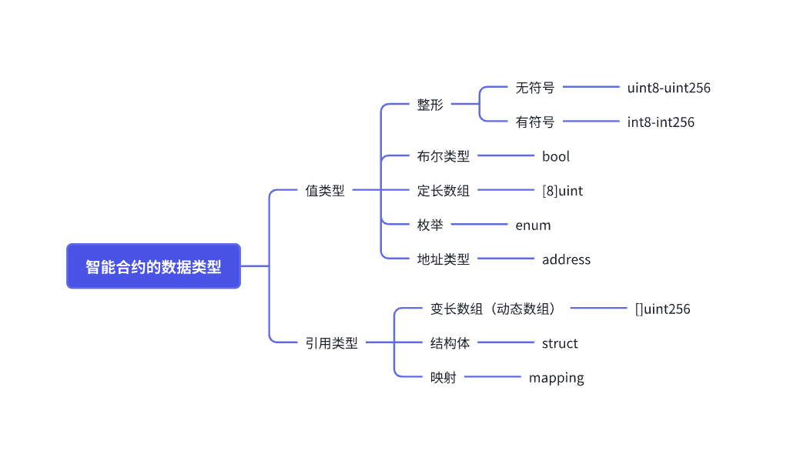
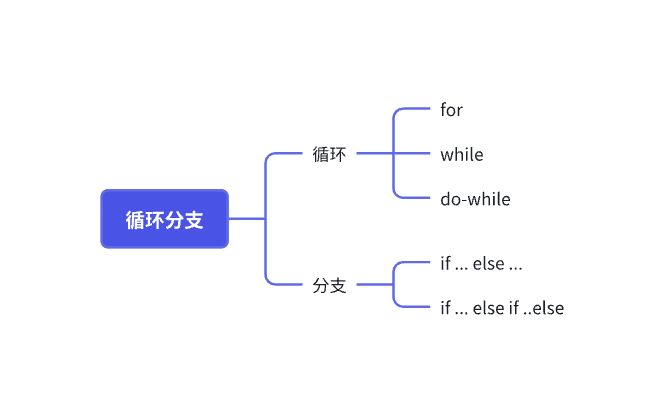

# 一.内容提要

- 数据类型
- 循环分之
- 合约函数
- 合约事件
- 抽象合约与接口
- 异常处理
- 变量作用域和数据存储 
- Solidity 内存布局 

# 二.智能合约的数据类型

## 1. 数据类型概览



## 2. 值类型和引用类型的区别

值类型：是指直接存储在合约里面的状态变量或者函数栈中数据类型，与引用类型不一样的是值类型赋值和传递的过程通过复制整个数据对象的值进行的，而不是引用或者指针。

引用类型：引用类型是一种特殊的数据类型，用于存储复杂的数据结构或者允许通过引用传递数据类型，与值类型不一样的是，引用类型的赋值和传递是通用引用或者指针进行的，在内存中是通引用地址来操作。

| 特性         | 值类型              | 引用类型                           |
| :----------- | :------------------ | :--------------------------------- |
| **存储方式** | 直接存储值          | 存储引用（指针）                   |
| **赋值行为** | 复制整个值          | 共享引用                           |
| **修改影响** | 不影响原始值        | 可能影响原始值                     |
| **数据位置** | 不需要指定          | 必须指定 (memory/storage/calldata) |
| **Gas 消耗** | 通常较低            | 通常较高                           |
| **示例**     | uint, bool, address | array, struct, mapping             |

## 3. 逻辑运算符

### 3.1 逻辑运算符

- 逻辑与 `&&`
- 逻辑或 `||`
- 逻辑非`!`

和其他语言是一样的，`&&` 和 `||` 运算遵循短路原则

### 3.2 数学运算

```
+， -， *, /, mod, = !=
```

### 3.3 位运算

移位与 `&`

移位或 `｜`

## 4. 值类型

### 4.1 Bool 类型

- Bool 数据类型的定义

```Plain
bool 修饰 变量名
bool public isActive
```

- 初始化变量

```Plain
bool public isActive = true/false
```

- 布尔值在逻辑运算符里面的使用

```Plain
bool a = true
bool b = false

//  a 是 true 需要判断 b， b 是 false，返回 false; 
bool retAndOne= a && b // false  
//  b 是 false, 直接返回 false, 不再去计算 b 是; 
bool retAndTwo =  b && a // false 

//  a 是 true 直接返回 true, 不在做 b 的运算; 
bool retOr = a || b // true
//  b 是 false, 计算 a 之后，a true 返回 true
bool retOr = b || a // true

bool retNotA = !a // false
bool retNotB = !b // true
```

#### 代码案例

- https://github.com/the-web3-contracts/basic-evm-contracts/tree/main/data-type

### 4.2 整形

在 solidity 中，整形用于表示整数，支持有符号和无符号类型,  整形支持数算运算符和移位运算符的计算

#### 4.2.1 无符号类型

无符号表示的是非负整数，关键字 `uint`, 宽度从 `uint8` 到 `uint256` , 中间加 8 位（例如 `uint8, uint16, uint32 ... uint256`）, 如果定义的 `uint`, 默认是 `uint256`。

```Plain
uint + 位数  修饰符  变量名字

uint256 public a
uint32 public b
uint16 public c
uint8 public d
```

#### 4.2.1 有符号类型

有符号类型表示正负数，关键字 `int` , 宽度从 `int8` 到 `int256` , 中间加 8 位, 例如 `int8, int16, uint32 ... int256`）, 如果定义的 `int`, 默认是 `int256`。

```Plain
int + 位数  修饰符  变量名字

int256 public a
int32 public b
int16 public c
int8 public d
```

#### 4.2.2 溢出和下溢

在 solidty 早期版本，指的是 0.8.0 之前的版本，整数的溢出是一个常见的问题，需要人为处理这个问题，如果你项目还在使用 0.8.0 之前的版本，需要使用别人封住好的 SafeMath 库;  在 0.8.0 之后的版本里面，智能合约内部把这个问题解决了。

```Plain
pragma solidity ^0.8.0;

contract OverflowExample {
    uint8 public maxUint8 = 255;

    function increment() public {
        maxUint8 += 1; // 这将导致运行时错误，因为 uint8 的最大值是 255
    }
}
```

- Uniswap V2 的 SafeMath 库

```JavaScript
library SafeMath {
    function add(uint x, uint y) internal pure returns (uint z) {
        require((z = x + y) >= x, 'ds-math-add-overflow');
    }

    function sub(uint x, uint y) internal pure returns (uint z) {
        require((z = x - y) <= x, 'ds-math-sub-underflow');
    }

    function mul(uint x, uint y) internal pure returns (uint z) {
        require(y == 0 || (z = x * y) / y == x, 'ds-math-mul-overflow');
    }
}
```

#### 4.2.3 常用的整型运算符包括：

- 比较运算符（返回布尔值）： `<=`， `<`，`==`， `!=`， `>=`， `>`
- 算数运算符： `+`， `-`， `*`， `/`， `%`（取余），`**`（幂）

#### 代码案例

- https://github.com/the-web3-contracts/basic-evm-contracts/tree/main/data-type

### 4.3 地址类型

在 Solidity 中，地址类型 (`address`) 是一种特殊的数据类型，用于存储 Ethereum 地址。一个 Ethereum 地址是一个 20 字节（160 位）的值，通常用于表示账户（包括外部账户和合约账户）。地址类型有一些特定的功能和方法，允许开发者与区块链上的账户进行交互。

#### 4.3.1 地址的声明与初始化

- 地址声明方式

```Plain
address 修饰符 变量名字

address public reciptant
```

- 声明并初始化

```Plain
address public reciptant = address(0);

address public sender = 0x45Bd8ea16cFEB0D937a2D98cBEb0300e3E689Fe7
```

#### 4.3.2 地址特定的方法

- 获取 balance

```Plain
address public sender = 0x45Bd8ea16cFEB0D937a2D98cBEb0300e3E689Fe7
uint256 balance = sender.balance;
```

- `address` 与 `address payable`, 在 Solidity 中，`address` 类型的变量不能接收或发送 Ether。如果需要进行这些操作，需要使用 `address payable` 类型。

```Plain
address payable public reciptant = 0x45Bd8ea16cFEB0D937a2D98cBEb0300e3E689Fe7
```

- 发送 ETH

```Plain
payable(reciptant).transfer(1 ether);

bool success = recipient.send(1 ether);
require(success, "Transfer failed");

(bool success, ) = recipient.call{value: 1 ether}("");
require(success, "Transfer failed");
```

- 面试重点

| 对比项     | call                                   | transfer                           | send                               |
| ---------- | -------------------------------------- | ---------------------------------- | ---------------------------------- |
| 本质       | 低层次的消息调用（message call）       | 原生的方法和 balance 类似          | send 是一个 基于 call 的封装       |
| 用途       | 调用合约函数（可带 data、value）       | 向地址转账（只发 ETH，不调用函数） | 向地址转账（只发 ETH，不调用函数） |
| 返回值     | 返回 (bool success, bytes memory data) | 没有返回                           | 返回 bool success                  |
| Gas 限制   | 可以自定义 gas                         | 固定只提供 2300 gas                | 固定只提供 2300 gas                |
| 调用失败时 | 不会自动 revert，需手动处理            | 会自动 revert, 不需要手动处理      | 不会自动 revert，返回 false        |
| 常见用途   | 调用外部合约函数或执行低层操作         | 安全发送 ETH                       | 安全地发送 ETH，不影响主逻辑       |

### 4.4 定长字节数组

定长字节数组是一种特定长度的字节序列，它们的长度在声明时就被固定。Solidity 提供了几种不同长度的定长字节数组类型，例如 `bytes1` 到 `bytes32`。

- 定义方式如下

```Plain
bytes1 public byteArray1
bytes2 public byteArray2
bytes3 public byteArray3

....

bytes32 public byteArray32
```

这些类型都是用来存储固定长度的字节序列的。它们在声明时会占据固定的存储空间，而不像动态大小的字节数组那样可以动态调整大小。

- 代码案例

```TypeScript
contract ByteType {
    bytes3 public bytes2Array1 = hex"abcdef";
    bytes3 public bytes2Array2 = hex"abcdee";


    function getByte2Length() public view returns(uint256) {
        return bytes2Array1.length;
    }

    function getBytesIndex(uint256 index) public view returns(bytes1) {
        require(index < bytes2Array1.length, "index out of bounds");
        return bytes2Array1[index];
    }

    function compareArrays() public view returns(bool) {
        return keccak256(abi.encodePacked(bytes2Array1)) == keccak256(abi.encodePacked(bytes2Array2));
    }
}
```

- 注意事项
  - 定长字节数组的长度在声明时确定，并且不能更改。
  - 当操作定长字节数组时，需要确保索引不超出数组的有效范围，以避免访问越界错误。
  - 定长字节数组不支持动态大小调整，因此在使用时需要考虑到存储空间和 gas 成本。

### 4.5 枚举

枚举是一种用户定义的数据类型，用于定义一组变量，枚举类型允许开发者在代码中以易读的方式引用这些常量，而不必直接使用数值或字符串。

#### 4.5.1 定义枚举

通过 `enum` 关键字定义，做一个代码示范

```TypeScript
// SPDX-License-Identifier: UNLICENSED
pragma solidity ^0.8.0;

contract EnumType {
    enum BettorType {
        Big,
       Small,
       Single,
       Double
    }

    BettorType public bettorType;

    function setBettorType(BettorType _bettorType) public  {
        bettorType = _bettorType;
    }

    function getBettorBigType() public pure returns(uint8) {
        return uint8(BettorType.Big);
    }

    function getBettorSmallType() public pure returns(uint8) {
        return uint8(BettorType.Small);
    }
}
```

#### 4.5.2 枚举值和默认值

枚举的每个成员都会自动分配一个整数索引，从 `0` 开始递增。在上面的例子中，*Big* 的值为 `0`，*Small* 的值为 `1`，以此类推。如果没有显式地指定枚举成员的值，它们将按顺序从 `0` 开始递增。

#### 4.5.3 使用枚举的优势

枚举的主要优势在于增强代码的可读性和可维护性。例如，在状态机中，使用枚举可以更清晰地表示不同的状态。另外，枚举类型在合约中的内部使用也有助于避免使用硬编码的数值或字符串。

#### 4.5.4 注意事项

- 枚举类型在 Solidity 中是值类型，它们在存储和传递时是按值复制的。
- 枚举成员名称必须是唯一的。

使用枚举类型可以使 Solidity 合约中的代码更加清晰和易于理解，特别是在涉及状态管理或者有限集合的情况下。

## 5. 引用类型

### 5.1 结构体

结构体是一种用户自定义的复合数据类型，用户存储多个不同类型的数据，它是一组数据的结合；在 solidity 中属于引用类型，赋值和传递是通过引用进行。

#### 5.1.1 定一个结构体

 通过关键字 `struct` 定义

- 代码示范

```TypeScript
// SPDX-License-Identifier: UNLICENSED
pragma solidity ^0.8.0;

contract StructType {
    struct PersonInfo {
        string university;
        uint256 hometown;
        string homeAddress;
    }

    struct Person {
        string name;
        uint256 age;
        address walletAddress;
        PersonInfo info;
    }

    PersonInfo public userInfo ;
    PersonInfo public user2Info ;
    Person public user;
    Person public user2;

    function setPerson(string memory _name,  uint256 _age, address _walletAddress) public {
        user.name = _name;
        user.age = _age;
        user.walletAddress = _walletAddress;
        userInfo.university = "深圳大学";
        userInfo.hometown = "湖南(xxx)";
        userInfo.homeAddress = "深圳龙华";
        user.info = userInfo;
    }

    function setPersonTwo()  public {
        user2Info = PersonInfo({
            university: "深圳大学",
            hometown: "湖南(xxx)",
            homeAddress: "深圳龙华"
        });

        user2 = Person({
            name: "zhangsan",
            age: 100,
            walletAddress: msg.sender,
            info : user2Info
        });
    }

    function getUser() public view returns (string memory, uint256, address) {
        return (user.name, user.age, user.walletAddress);
    }

    function getUser2() public view returns (string memory, uint256, address) {
        return (user2.name, user2.age, user2.walletAddress);
    }

    function getUserAllInfo() public view returns (Person memory) {
        return user;
    }
}
```

- 注意事项
  - 成员变量访问：结构体的成员变量可以通过点号 (`.`) 访问，例如 `myPerson.name`。
  - 内存与存储：在函数内部使用结构体时，需要注意是否需要在存储区域（storage）或者内存区域（memory）中处理。
  - 嵌套结构体：Solidity 支持结构体的嵌套定义，允许在一个结构体中包含另一个结构体作为成员变量。
  - Gas 成本：对于复杂的结构体或者包含大量数据的结构体，需要注意 gas 成本和执行效率问题。

结构体是 Solidity 中用于组织和管理数据的重要工具，特别适用于复杂数据结构的描述和操作。在设计合约时，合理使用结构体可以使代码更加清晰、模块化和易于维护。

### 5.2 数组

数组在 Solidity 中也被视为引用类型，特别是动态大小的数组。动态大小的数组允许在运行时动态增加或减少其长度，这意味着它们的操作是基于引用的。

#### 5.2.1 定长数组 (`type[N]`)

定长数组在声明时就需要指定数组的长度 `N`，且长度不能更改。定长数组通常用于固定大小的数据集合，如固定数量的数据元素存储。

```Solidity
pragma solidity ^0.8.0;

contract FixedArrayExample {
    uint[5] public fixedArray;

    // 设置数组元素
    function setFixedArray(uint index, uint value) public {
        require(index < 5, "Index out of bounds");
        fixedArray[index] = value;
    }

    // 获取数组元素
    function getFixedArray(uint index) public view returns (uint) {
        require(index < 5, "Index out of bounds");
        return fixedArray[index];
    }
}
```

在上面的示例中，`fixedArray` 是一个包含 5 个 `uint` 元素的定长数组。通过 `setFixedArray` 函数可以设置数组的元素值，通过 `getFixedArray` 函数可以获取指定索引处的元素值。

#### 5.2.2 动态数组 (`type[]`)

动态数组是在 Solidity 中比较常见和灵活的数组类型，它的长度可以在运行时动态增加或减少。

```Solidity
pragma solidity ^0.8.0;

contract DynamicArrayExample {
    uint[] public dynamicArray;

    // 添加元素到数组
    function addElement(uint value) public {
        dynamicArray.push(value);
    }

    // 获取数组长度
    function getLength() public view returns (uint) {
        return dynamicArray.length;
    }

    // 获取数组指定索引处的值
    function getElement(uint index) public view returns (uint) {
        require(index < dynamicArray.length, "Index out of bounds");
        return dynamicArray[index];
    }
}
```

在上面的示例中，`dynamicArray` 是一个动态大小的 `uint` 数组。通过 `addElement` 函数可以向数组末尾添加新的元素，通过 `getLength` 函数可以获取当前数组的长度，通过 `getElement` 函数可以获取指定索引处的元素值。

#### 5.2.3 特点和使用注意事项

- **Gas 成本**：动态数组在增加元素时会消耗 gas，因此对于大型数组或频繁修改的数组操作，需要注意 gas 成本问题。
- **内存管理**：动态数组在 Solidity 中会自动管理内存，无需手动释放或调整。
- **返回值**：在 Solidity 中，函数不能返回完整的动态数组，如果需要返回数组，则通常需要返回数组的长度和元素的部分内容，或者使用外部函数接口。
- **多维数组**：Solidity 支持多维数组，即数组中包含数组。

```solidity
// SPDX-License-Identifier: MIT
pragma solidity ^0.8.20;

contract MultiDimensionalArrayExample {
    uint[][] public multiArray;

    function addElement(uint[] memory values) public {
        multiArray.push(values);
    }

    function getLength() public view returns (uint) {
        return multiArray.length;
    }

    function getElement(uint row, uint col) public view returns (uint) {
        require(row < multiArray.length, "Row index out of bounds");
        require(col < multiArray[row].length, "Column index out of bounds");
        return multiArray[row][col];
    }
}
```

在上面的示例中，`multiArray` 是一个二维动态数组，可以通过 `addElement` 添加一维数组到二维数组中，并通过 `getLength` 和 `getElement` 函数获取二维数组的长度和指定位置的元素值。

数组是 Solidity 中重要的数据结构之一，用于存储和操作大量相同类型的数据。合理使用数组可以有效管理和操作数据集合，提高合约的灵活性和效率。

#### 5.2.4 定长数组和动态数组使用案例

```Plain
// SPDX-License-Identifier: MIT
pragma solidity ^0.8.20;

contract ArrayExample {
    
    uint256[] public dynamicArray;

    uint256[5] public fixedArray;

    function getDynamicArrayLength() public view returns (uint256) {
        return dynamicArray.length;
    }

    function getFixedArrayLength() public view returns (uint256) {
        return fixedArray.length;
    }

    function setFixedArray() public  {
        fixedArray[0] = 1;
        fixedArray[1] = 2;
        fixedArray[2] = 3;
        fixedArray[3] = 4;
    }

    function pushElementToDynamicArray(uint256 value) public  {
        dynamicArray.push(value);
    }

    function getElementFromDynamicArray(uint256 index) public view returns (uint256)  {
        return dynamicArray[index];
    }

    function getElementFromFixedArray(uint256 index) public view returns (uint256)  {
        return fixedArray[index];
    }

    function popElementFromDynamicArray() public  {
        dynamicArray.pop();
    }

    function deletemDynamicArray() public  {
       delete dynamicArray;
    }
}
```

### 5.3 映射

映射是 Solidity 中的一种特殊数据结构，用于存储键值对。映射也被视为引用类型，因为它们在内存中使用引用地址来操作.

#### 5.3.1 定义映射

```
maping(key=>value) public 变量名字
```

Solidity 中的映射通过 `mapping` 关键字定义，如下所示：

```Java
pragma solidity ^0.8.0;

contract MappingExample {
    // 定义映射，将地址映射到整数
    mapping(address => uint) public balances;

    // 设置地址对应的余额
    function setBalance(address _address, uint _balance) public {
        balances[_address] = _balance;
    }

    // 获取地址对应的余额
    function getBalance(address _address) public view returns (uint) {
        return balances[_address];
    }
}
```

#### 5.3.2 映射的特性(面试题目)

- 键类型：映射的键可以是任何值类型，包括基本类型（如 `uint`、`address`)。
- 值类型：映射的值可以是任何 Solidity 支持的数据类型，包括基本类型、复合类型（如 `struct`）和数组类型。
- 默认值：如果映射中不存在某个键对应的值，则返回该值类型的默认值。例如，`uint` 类型的默认值是 `0`，`address` 类型的默认值是 `address(0)`。
- Gas 成本：读取映射中的值（查找操作）是 gas 消耗较低的操作，而写入映射中的值（更新操作）可能会消耗更多的 gas，特别是在扩展映射时可能需要大量的 gas。

#### 5.3.3 映射的应用场景

映射在 Solidity 合约中有广泛的应用，特别是用于管理状态数据、存储关联数据和实现查找表。以下是一些常见的应用场景：

- 存储账户余额：如上面示例所示，映射可以用来存储多个账户的余额信息。
- ERC20 Token 实现：映射通常用于存储 ERC20 Token 的余额和授权信息。
- 存储关联数据：映射可以用于存储任何需要通过某种键快速查找和访问的关联数据。
- 索引和查找：映射可以作为索引来优化查找和检索操作，例如根据地址查找合约用户的信息。

#### 5.3.4 注意事项

- 映射与数组：映射和数组都是 Solidity 中常用的数据结构，但它们的适用场景不同。**映射适合于需要快速查找和更新的情况**，而**数组适合于顺序访问和处理的情况**。
- 内存管理：**映射中的键和值通常存储在存储区域（storage）**，这意味着它们在区块链上永久保存，并且可以在不同的合约函数之间共享和访问。
- 映射的限制：Solidity 中的映射不支持遍历操作，即**不能直接遍历映射中的所有键或值**。如果需要遍历操作，通常需要结合其他数据结构或模式来实现。

映射是 Solidity 中重要且强大的数据结构之一，合理使用映射可以有效提高合约的效率和可维护性。在设计合约时，根据具体需求选择合适的数据结构非常重要。

## 6. 变量和常量

在 Solidity 中，常量（Constants）和变量（Variables）是两种不同的数据存储方式，它们在合约中的使用和特性有所不同。下面将分别介绍 Solidity 中的常量和变量，并举例说明它们的使用方法和注意事项。

#### 3.1.常量 (Constants)

常量在 Solidity 中是指一旦声明后其值无法更改的数据。常量的声明方式是使用 `constant` 或 `immutable` 关键字。主要特点包括：

- **初始化后不可更改**：**常量在声明时需要立即赋值**，并且其值在合约的生命周期内保持不变。
- **编译时确定**：**常量的值在编译时确定**，并且在部署时被写入合约的字节码中。
- **不占用存储空间**：**常量不占用合约的存储空间**，而是在代码中直接使用其值。

下面是常量的示例：

```Solidity
pragma solidity ^0.8.0;

contract ConstantsExample {
    // 声明常量
    uint constant public MAX_NUMBER = 100;
    address constant public OWNER = 0x1234567890123456789012345678901234567890;
    string constant public VERSION = "1.0.0";

    // 常量不可更改，以下语句会引发编译错误
    // function updateConstants() public {
    //     MAX_NUMBER = 200;
    // }
}
```

在上面的示例中：

- `MAX_NUMBER`、`OWNER` 和 `VERSION` 都是常量，它们分别代表最大数值、合约拥有者的地址和版本号，它们的值在声明时确定，并且无法在合约内部更改。

#### 3.2.变量 (Variables)

变量是 Solidity 中用于存储和管理数据的可变容器。主要特点包括：

- 可变性：变量在声明后可以根据需要进行修改和更新。
- 存储空间：变量**会占用合约的存储空间**，可以存储状态和临时数据。
- 作用域：变量可以是**合约级别的状态变量**，也可以**是函数内的局部变量**。

下面是变量的示例：

```Solidity
pragma solidity ^0.8.0;

contract VariablesExample {
    // 状态变量
    uint public count;

    // 函数示例，包含局部变量
    function updateCount(uint _newCount) public {
        uint localVar = 42;  // 局部变量
        count = _newCount;
    }
}
```

在上面的示例中：

- `count` 是一个公共的状态变量，用于存储合约中的一个整数值。
- `updateCount` 函数包含一个局部变量 `localVar`，用于存储临时数据，`_newCount` 参数用于更新 `count` 的值。

#### 3.3.使用建议

- 常量 vs 变量：根据需求选择合适的常量或变量。常量适用于在合约中需要固定且不可变的值，而变量适用于需要存储和修改的动态数据。
- Gas 成本：读取常量的 gas 成本较低，因为它们的值在编译时已经确定；而更新变量或者读取状态变量可能会涉及更高的 gas 成本，尤其是在合约存储空间的使用方面。
- 安全性：在编写合约时，合理使用常量和变量可以提高合约的安全性和可读性，避免不必要的状态变化和复杂的逻辑。

通过合理使用常量和变量，Solidity 开发者可以有效管理和操作合约中的数据，确保合约的功能和逻辑符合预期，并且在 gas 使用和执行效率方面进行优化。

#### 3.4 Immutable

一次初始化之后不可以修改，定义成 immutable 的变量是可以节省 gas 

| 特性           | 常量（constant）           | 不可变量（immutable）                                |
| :------------- | :------------------------- | :--------------------------------------------------- |
| 赋值时机       | 编译时                     | 部署时（在构造函数中）                               |
| 初始化         | 声明时必须初始化           | 可以在声明时初始化，也可以在构造函数中初始化         |
| 支持的数据类型 | 值类型和字符串             | 仅值类型                                             |
| 存储           | 不占用存储，直接嵌入字节码 | 占用一个存储槽，但通过编译器优化，访问时不会读取存储 |
| Gas成本        | 读取时gas成本低            | 读取时gas成本较低，但比常量稍高                      |
| 灵活性         | 值必须编译时确定           | 值可以在部署时确定，因此可以依赖构造函数参数         |

# 三. 循环分支

在 Solidity 中，与大多数编程语言类似，循环和分支控制语句用于控制程序的流程和逻辑。这些结构使得 Solidity 合约能够根据条件执行特定的代码块或者重复执行代码。以下是 Solidity 中常用的循环和分支控制语句：



## 1. 分支控制

### 1.1 **条件语句 (****`if`****,** **`else if`****,** **`else`****)**

条件语句用于根据表达式的结果选择性地执行代码块。

```Solidity
pragma solidity ^0.8.0;

contract ControlStructures {
    uint public number;

    // 条件语句示例
    function setNumber(uint _num) public {
        if (_num > 10) {
            number = _num;
        } else if (_num == 5) {
            number = 5;
        } else {
            number = 0;
        }
    }
}
```

在上面的例子中：

- 如果 `_num` 大于 10，则将 `number` 设置为 `_num`。
- 如果 `_num` 等于 5，则将 `number` 设置为 5。
- 否则，将 `number` 设置为 0。

## 2. 循环结构

### 2.1.**`for`** **循环**：

`for` 循环用于按照指定的次数重复执行代码块。

```Solidity
pragma solidity ^0.8.0;

contract LoopExample {
    uint[] public numbers;

    // for 循环示例
    function addNumbers(uint _count) public {
        for (uint i = 0; i < _count; i++) {
            numbers.push(i);
        }
    }
}
```

在上面的例子中，`addNumbers` 函数通过 `for` 循环将从 0 到 `_count-1` 的整数依次添加到 `numbers` 数组中。

### 2.2.**`while`** **循环**

`while` 循环用于在条件为真时重复执行代码块。

```Solidity
pragma solidity ^0.8.0;

contract WhileLoopExample {
    uint public number;

    // while 循环示例
    function incrementUntilTen() public {
        while (number < 10) {
            number++;
        }
    }
}
```

在上面的例子中，`incrementUntilTen` 函数会持续增加 `number` 直到它大于或等于 10。

### 2.3.**`do-while`** **循环**：

`do-while` 循环首先执行代码块，然后在条件为真时重复执行代码块。

```Solidity
pragma solidity ^0.8.0;

contract DoWhileLoopExample {
    uint public number;

    // do-while 循环示例
    function incrementUntilTen() public {
        do {
            number++;
        } while (number < 10);
    }
}
```

在上面的例子中，`incrementUntilTen` 函数首先会增加 `number`，然后检查条件，如果条件满足则继续执行，直到 `number` 大于或等于 10。

### 2.4.注意事项

- Gas 成本：在 Solidity 合约中，循环和分支控制语句的执行会消耗 gas。**特别是在循环中使用动态数据结构时要注意 gas 成本**，避免不必要的 gas 消耗。
- 避免复杂逻辑：尽量避免在合约中使用复杂的逻辑或者深层嵌套的控制结构，以确保合约的可读性和维护性。
- 安全性：合约中的条件和断言语句对于确保合约的状态和操作是安全的非常重要，确保适当地使用断言和条件检查来验证输入和状态。

合理使用循环和分支控制结构可以帮助开发者实现复杂的逻辑和业务需求，同时也需要注意避免陷入不必要的复杂性和高 gas 消耗。

# 四.函数与事件

函数是用来执行特定任务或操作的代码块。函数可以包含逻辑、访问状态变量，进行计算，并且可以接受参数和返回值;  在 solidity 里面，通过 `function` 关键字来定义函数

```Plain
function add(uint256 a, uint256 b) public view returns(uint256) {
    a++;
    b++;
    return a + b;
}
```

## 1. 函数的特性

- 可见性修饰符：函数可以使用 public, internal, external 和 private 来指定访问权限，默认修饰符是 public, 同时这些修饰符也可以修饰状态变量。
- 状态变量的访问：函数可以读取和修改合约里面的状态变量
- 参数和返回值：函数可以接收参数，也可以返回值，参数可以是任何 solidity 支持的类型，包含基本类型和引用类型
- 函数修饰符：函数可以通过 pure, view, payable 和 virtual 来进行修饰，例如：view 和 payable
  - view: 只读取数据，但是不修改状态变量,  payable 表示函数可以收发 native token
- 事件触发：函数事件通过 emit 来触发

### 1.1 **可见性修饰符（面试题目）**

函数可以使用 `public`、`internal`、`external` 和 `private` 来指定访问权限。默认为 `public`。

- 修饰符的作用讲解
  - `public` 修饰符指定函数或状态变量可以被合约内部的其他合约和外部账户访问。对于函数而言，它们可以被合约内部和外部调用；对于状态变量而言，它们可以被合约内部和外部读取。
  - `internal` 修饰符指定函数或状态变量只能被当前合约及其派生合约内部访问。外部账户和合约无法直接访问或调用带有 `internal` 修饰符的函数或状态变量。
  - `private` 修饰符指定函数或状态变量只能被当前合约内部访问，即使是合约的派生合约也无法直接访问带有 `private` 修饰符的成员。
  - `external` 修饰符指定函数只能被外部账户和合约调用，即只能从合约外部进行访问。`external` 函数不能在合约内部或者合约的其他函数中直接调用。
- 注意事项
  - 默认可见性：如果不显示指定可见性修饰符，则默认为 `public`。这意味着如果你只想让函数或状态变量在合约内部使用，应该显式使用 `internal` 或 `private`。
  - Gas 成本：不同的可见性修饰符可能会影响函数调用的 gas 成本，特别是 `external` 函数的 gas 成本较高，因为它们需要进行消息调用。
  - 安全性：合理使用可见性修饰符可以提高合约的安全性和可读性，避免不必要的访问和操作。

### 1.2 **函数修饰符（面试题目）**

`pure`、`view`、`payable` 和 `virtual` 是函数修饰符，用于定义函数的行为和特性。它们在函数的调用方式、状态变更、gas 消耗等方面有所不同。下面详细介绍这些修饰符的区别和用法：

- Pure
  - **作用**：`pure` 修饰符用于声明函数不读取合约状态，也不修改合约状态，即完全不访问状态变量。
  - **特点**：
    - 不允许访问 `this` 和 `msg` 对象。
    - 可以在编译时被内联优化。
    - 不能发送以太币（Ether）。
  - **示例**：

```Solidity
pragma solidity ^0.8.0;

contract PureExample {
    // pure 函数示例
    function add(uint a, uint b) public pure returns (uint) {
        return a + b;
    }
}
```

- View
  - **作用**：`view` 修饰符用于声明函数不修改合约状态，但可以读取合约的状态变量。
  - **特点**：
    - 可以调用其他 `view` 或 `pure` 函数。
    - 不允许修改状态变量。
    - 不允许发送以太币（Ether）。
  - **示例**：

```Solidity
pragma solidity ^0.8.0;

contract ViewExample {
    uint public data;

    // view 函数示例
    function getData() public view returns (uint) {
        return data;
    }
}
```

- Payable
  - **作用**：`payable` 修饰符用于声明函数可以接收以太币（Ether）支付。
  - **特点**：
    - 允许函数接收以太币。
    - 可以调用其他 `payable` 函数。
    - `view` 可以读取合约状态变量
    - 不能修改状态变量（如果是 `view` 和 `pure`函数）。
- **示例**：

```Solidity
pragma solidity ^0.8.0;

contract PayableExample {
    // payable 函数示例
    function receiveEther() public payable {
        // 接收以太币
    }
}
```

- Virtual
  - **作用**：`virtual` 修饰符用于声明函数可以被派生合约重写（覆盖）。
  - **特点**：
    - 在父合约中声明函数为 `virtual`，表示该函数可以在派生合约中被重写。
    - 派生合约中可以使用 `override` 关键字重写 `virtual` 函数。
    - `virtual` 函数可以有默认实现，但也可以是纯虚函数（即没有实现，只是声明）。
  - **示例**：

```Solidity
pragma solidity ^0.8.0;

contract Base {
    // virtual 函数示例
    function getValue() public virtual returns (uint) {
        return 10;
    }
}

contract Derived is Base {
    // override 覆盖基类函数
    function getValue() public virtual override returns (uint) {
        return 20;
    }
}
```

### 1.3 `pure`，`view`， `payable` 和 `virtual` 的总结（面试题目）

- `pure`：不读取状态变量，不修改状态，不能发送以太币。
- `view`：不修改状态变量，可以读取状态变量，不能发送以太币。
- `payable`：可以接收以太币，可以读取状态变量（如果是 `view` 或 `pure` 函数），不能修改状态变量（如果是 `view` 函数）。
- `virtual`：声明函数可以被派生合约重写，派生合约中使用 `override` 关键字进行重写。

### 1.4. 函数重写和重载

在 Solidity 中，函数重写（override）和函数重载（overload）是两个概念，它们在面向对象编程中有特定的含义和用法。

#### 1.4.1 函数重写（Override）

函数重写指的是在派生合约（子合约）中重新定义父合约中已存在的虚函数（virtual function）。在 Solidity 中，通过在派生合约中使用 `override` 关键字来标识要重写的函数。

```Solidity
pragma solidity ^0.8.0;

contract Base {
    function getValue() public virtual returns (uint) {
        return 10;
    }
}

contract Derived is Base {
    function getValue() public virtual override returns (uint) {
        return 20;
    }
}
```

在上面的示例中：

- `Base` 合约中定义了一个虚函数 `getValue`，返回固定的整数值 10。
- `Derived` 合约继承自 `Base` 合约，并重写了 `getValue` 函数，返回整数值 20。使用了 `override` 关键字标识。

函数重写允许派生合约在不改变原有合约结构的情况下，根据具体的需求重定义函数的行为。

#### 1.4.2 函数重载（Overload）

函数重载指的是在同一个合约中定义多个具有相同函数名但不同参数列表的函数。Solidity 支持函数重载，根据参数的类型和数量来区分不同的函数定义。

```Solidity
pragma solidity ^0.8.0;

contract OverloadExample {
    function foo(uint _value) public pure returns (uint) {
        return _value;
    }

    function foo(uint _value, uint _value2) public pure returns (uint) {
        return _value + _value2;
    }

    function foo(string memory _text) public pure returns (string memory) {
        return _text;
    }
}
```

在上面的示例中：

- `OverloadExample` 合约定义了三个名为 `foo` 的函数，它们分别接受不同类型和数量的参数，但函数名相同。

函数重载允许在同一个合约中根据参数的不同，提供不同的函数实现。Solidity 编译器会根据函数的参数列表生成唯一的函数签名，以便区分不同的函数定义。

#### 1.4.3.区别总结

- 函数重写（Override）：发生在派生合约中，重新定义父合约中已存在的虚函数，使用 `override` 关键字标识。
- 函数重载（Overload）：发生在同一个合约中，定义具有相同函数名但不同参数列表的多个函数，根据参数的类型和数量来区分。

#### 1.4.4. 注意事项

- Solidity 中的函数重写和重载可以帮助开发者根据具体的需求和逻辑，更灵活地设计和实现合约的功能。
- 在使用函数重载时，应当注意参数列表的唯一性，避免出现二义性，确保函数能够正确地被调用和使用。
- 函数重写通常用于实现继承中的多态特性，而函数重载则用于提供不同的功能选项或操作符号重载等场景。

## 2. 函数的事件

在 Solidity 中，事件（Events）是一种合约特有的通信机制，用于向外部应用程序通知关键信息。事件允许合约与区块链上的外部系统进行交互，典型的应用包括记录状态变化、提供数据查询以及与前端应用程序进行实时通信等。下面详细说明 Solidity 中事件的定义、使用和特性。

### 2.1 合约的事件定义

在 solidity 中，合约的事件通过关键字 `Event` 来定义，事件定义通常是放在合约的顶层，其语法如下

```Plain
event EventName(address indexed _addressParam, uint _uintParam, string _stringParam);


indexed: 合约索引，在对应字段定义哥 indexed, 可以快速索引合约
```

- `EventName` 是事件的名称。
- `address indexed _addressParam`、`uint _uintParam`、`string _stringParam` 是事件的参数列表。在事件中可以定义多个参数，可以是任何 Solidity 支持的数据类型，包括基本类型、结构体、数组和映射等。
- `indexed` 关键字用于指定该参数为索引参数，允许外部应用程序通过该参数进行快速检索。

### 2.2 合约事件的触发

在 Solidity 合约中，使用 `emit` 关键字触发事件。通常在合约内部的函数中触发事件，以记录合约状态的重要变化或者向外部应用程序发送通知。

```Plain
emit EventName(address, 1000, "xxxx")
```

- 案例代码

```Java
pragma solidity ^0.8.0;

contract EventExample {
    event NewUserRegistered(address indexed user, uint timestamp);

    function registerUser() public {
        // 假设有一些逻辑用来注册新用户
        address newUser = msg.sender;
        uint timestamp = block.timestamp;

        // 触发事件
        emit NewUserRegistered(newUser, timestamp);
    }
}
```

在上面的示例中：

- `NewUserRegistered` 是一个事件，它记录了新用户注册的信息，包括用户地址和注册时间戳。
- `registerUser` 函数是一个示例函数，用来模拟注册新用户的过程。当用户成功注册时，通过 `emit` 关键字触发 `NewUserRegistered` 事件，并传递相应的参数。

### 2.3 合约事件的特征

- Gas 成本：触发事件会消耗 gas，特别是如果事件有多个索引参数或者频繁触发。应当注意控制事件触发的频率和消耗，以避免不必要的 gas 费用。
- 事件日志：事件触发后，相关的数据将会被记录在区块链上的事件日志中。外部应用程序可以通过扫描事件日志来获取历史记录或者进行数据分析。
- 隐私性：事件的参数可以是公开的（例如用户地址），但也可以通过合适的权限控制保护隐私。

使用事件是 Solidity 中常见的编程模式，能够有效地增强合约与外部世界的交互性和实时通信能力，是 DApp 开发中不可或缺的一部分。


# 五.继承，抽象合约和接口

## 1. 抽象合约

抽象合约是一种约束合约行为的机制，它本身无法被实例化，需要通过继承的方式来实现它的方法。抽象合约通常**包含未实现的函数定义**，而**具体的实现逻辑则由继承它的子合约来完成**。

### 1.1 定义抽象合约

在 Solidity 中，抽象合约通过使用 `abstract` 关键字来声明。如果一个智能合约里至少有一个未实现的函数，即某个函数缺少主体`{}`中的内容，则必须将该合约标为`abstract`，不然编译会报错；另外，未实现的函数需要加`virtual`，以便子合约重写

```Java
pragma solidity ^0.8.0;

// 抽象合约
abstract contract MyAbstractContract {
    function getValue() public view virtual returns (uint);
    function setValue(uint _value) public virtual;
}
```

在上面的示例中，`MyAbstractContract` 是一个抽象合约，它定义了两个函数 `getValue` 和 `setValue`，但没有实现它们的具体逻辑。抽象合约可以包含状态变量以及完整函数。

### 1.2 实现抽象函数

```Java
// SPDX-License-Identifier: UNLICENSED
pragma solidity ^0.8.0;

abstract contract MyAbstractContract {
    uint256 public value;

    function getValue() public view virtual returns (uint) {} 

    function setValue(uint _value) public  {
        value = _value;
    }
}

contract OneContract is AbstractContract {
    function getValue() public view override returns (uint) {
        return value;
    }

    function setValueOne(uint _value) public  {
       setValue(_value);
    }
}
```

- virtual：虚函数修饰符
- override：重写函数

## 2. 接口

接口是一种更加轻量级的约束机制，用于定义合约的外部行为而不关心具体实现。接口定义了合约应该实现的函数，但不提供函数的实现细节。

### 2.1 定义接口

接口使用 `interface` 关键字来声明，并且不允许包含任何状态变量或函数实现：

1. 不能包含状态变量
2. 不能包含构造函数
3. 不能继承除接口外的其他合约
4. 所有函数都必须是**external**且不能有函数体
5. 继承接口的非抽象合约必须实现接口定义的所有功能

```Solidity
pragma solidity ^0.8.0;

interface InterfaceType{
    function getValue() external view returns (uint256);
    function setValue(uint256 _value) external;
}
```

在上面的示例中，`InterfaceType` 是一个接口，定义了两个函数 `getValue` 和 `setValue`，这些函数只有声明没有实现, 修饰符是 external。

### 2.2 实现接口

与抽象合约不同，实现接口的合约需要显式声明它实现了该接口，并提供函数的具体实现。

```Solidity
// SPDX-License-Identifier: UNLICENSED
pragma solidity ^0.8.0;

interface InterfaceType{
    function getValue() external view returns (uint256);
    function setValue(uint256 _value) external;
}

contract InterfaceImplement is InterfaceType {
    uint256 public value;

    function getValue() public view returns (uint256) {
        return value;
    }

    function setValue(uint256 _value) public {
        value = _value;
    }
}
```

在上面的示例中，`InterfaceImplement` 合约实现了 `InterfaceType` 接口，并提供了 `getValue` 和 `setValue` 函数的具体实现。

## 3. 抽象合约 vs 接口

- 抽象合约：
  - 构造函数
  - 已实现的函数
  - 未实现的函数（需要由继承的子合约实现）
  -  状态变量。
- 接口: 接口是一种特殊的抽象合约，只包含未实现的函数。
- 接口中不允许：
  - 状态变量
  - 构造函数
  - 已实现的函数
  - 继承除接口外的其他合约

## 4. 使用建议

- 使用抽象合约来定义具有共同行为和功能的合约族。
- 使用接口来定义外部行为和服务接口，以提高合约的互操作性和可扩展性。
- 合理设计和使用抽象合约和接口，可以帮助提高合约的模块化和可维护性，以及更好地符合面向对象编程的设计原则。

## 5. 继承

继承使用关键字 `is` 来继承，语法格式如下

```Plain
contract A {
}

contract B {
}

contract C is A {
}

contract D is A, B{
}
```

- 构造继承

```Plain
abstract contract IsAbstractContract {
    address public manageAddress;

    constructor(address _manageAddress){
        manageAddress = _manageAddress;
    }

    function getAddress() public view virtual returns (address) {
        return manageAddress;
    }
}

contract ContractImplement is IsAbstractContract {
    address public operatorAddress;

    constructor (
        address _manageAddress,
        address _operatorAddress
    ) IsAbstractContract(_manageAddress) {
        operatorAddress = _operatorAddress;
    }
    
    - 正常写代码就行了
}
```

- 继承完整代码示范

```TypeScript
// SPDX-License-Identifier: UNLICENSED
pragma solidity ^0.8.0;

abstract contract IsAbstractContract {
    address public manageAddress;

    constructor(address _manageAddress){
        manageAddress = _manageAddress;
    }

    function getAddress() public view virtual returns (address) {
        return manageAddress;
    }
}

interface InterfaceContract{
    function setOperatorAddress(address _operatorAddress) external;
    function setManagerAddress(address _operatorAddress) external;
}

contract MyContract {
    uint256 public value;

    function getValue() public view returns (uint256) {
        return value;
    }

    function setValue(uint256 _value) public {
        value = _value;
    }
}

contract ContractImplement is IsAbstractContract, InterfaceContract, MyContract {
    address public operatorAddress;

    constructor (
        address _manageAddress,
        address _operatorAddress
    ) IsAbstractContract(_manageAddress) {
        operatorAddress = _operatorAddress;
    }

    function setOperatorAddress(address _operatorAddress) external {
        operatorAddress = _operatorAddress;
    }

    function setManagerAddress(address _manageAddress) external {
        manageAddress = _manageAddress;
    }

    function getAddress() public view override returns (address) {
        return operatorAddress;
    }
}
```

# 六. 异常处理

在 Solidity 中，异常处理是一种用于管理和处理错误情况的机制。异常处理允许开发者在智能合约中进行错误检测和处理，以确保合约的健壮性和安全性。Solidity 提供了几种内置的错误处理机制，包括 `require`、`assert` 和 `revert`，它们在不同的场景下使用。

## 1.`require` 函数

`require` 函数用于**检查输入条件或状态变量的有效性**。如果条件不满足，合约会抛出异常并恢复到初始状态，同时**返回剩余的 gas**。

#### 用法

- 检查函数参数的有效性。
- 检查合约状态是否符合预期。

#### 示例

```Solidity
pragma solidity ^0.8.0;

contract RequireExample {
    uint public balance;

    // 存款函数，检查存款金额是否大于0
    function deposit(uint amount) public {
        require(amount > 0, "Amount must be greater than zero");
        balance += amount;
    }

    // 取款函数，检查余额是否足够
    function withdraw(uint amount) public {
        require(amount <= balance, "Insufficient balance");
        balance -= amount;
    }
}
```

## 2. `assert` 函数

`assert` 函数用于**检查不变量或内部错误**。如果条件不满足，合约会抛出异常并**消耗所有剩余的 gas**。通常用于**检测不应该发生的逻辑错误**。

#### 用法

- 检查不变量。
- 检查内部错误和逻辑一致性。

#### 示例

```Solidity
pragma solidity ^0.8.0;

contract AssertExample {
    uint public balance;

    // 更新余额后检查不变量
    function updateBalance(uint newBalance) public {
        balance = newBalance;
        assert(balance >= 0); // 余额不应该为负
    }
}
```

## 3.`revert` 函数

`revert` 函数用于**显式地抛出异常**并恢复到初始状态，同时**返回剩余的 gas**。可以**携带错误信息**，便于调试和错误处理。

#### 用法

- 在复杂条件下抛出异常。
- 携带错误信息以便调试。

#### 示例

```Solidity
pragma solidity ^0.8.0;

contract RevertExample {
    uint public balance;

    // 取款函数，使用 revert 抛出异常
    function withdraw(uint amount) public {
        if (amount > balance) {
            revert("Insufficient balance");
        }
        balance -= amount;
    }
}
```

## 3. 自定义错误

从 Solidity 0.8.4 开始，支持自定义错误，以节省 gas 并提高代码可读性。自定义错误使用 `error` 关键字定义，并在需要抛出异常时使用 `revert` 抛出。

#### 示例

```Solidity
pragma solidity ^0.8.0;

contract CustomErrorExample {
    uint public balance;

    // 定义自定义错误
    error InsufficientBalance(uint requested, uint available);

    // 取款函数，使用自定义错误抛出异常
    function withdraw(uint amount) public {
        if (amount > balance) {
            revert InsufficientBalance(amount, balance);
        }
        balance -= amount;
    }
}
```

## 4.事件日志

在处理异常时，可以使用事件日志记录错误信息，以便后续查询和调试。

#### 示例

```Solidity
pragma solidity ^0.8.0;

contract EventLogExample {
    uint public balance;

    // 定义事件
    event LogError(string message, uint timestamp);

    // 取款函数，记录错误信息到事件日志
    function withdraw(uint amount) public {
        if (amount > balance) {
            emit LogError("Insufficient balance", block.timestamp);
            revert("Insufficient balance");
        }
        balance -= amount;
    }
}
```

## 5.总结（面试重点）

- `require`：用于输入验证和状态检查，失败时返回剩余 gas 并恢复状态。
- `assert`：用于检测不变量和内部错误，失败时消耗所有剩余 gas 并恢复状态。
- `revert`：用于显式抛出异常，支持携带错误信息，失败时返回剩余 gas 并恢复状态。
- 自定义错误：从 Solidity 0.8.4 开始引入，使用 `error` 关键字定义，通过 `revert` 抛出，节省 gas 并提高代码可读性。
- 事件日志：用于记录错误信息，便于后续查询和调试。