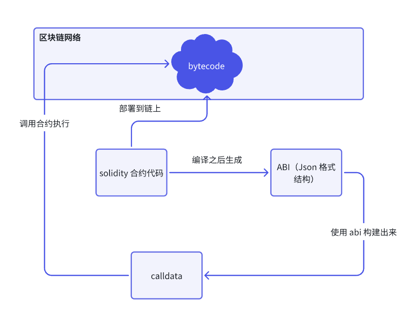
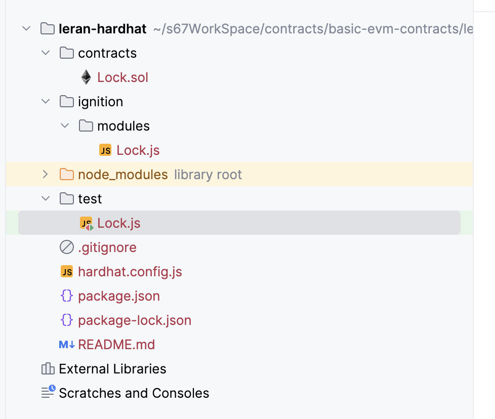

# 一.内容提要

- 合约简介
- 合约文件结构
- 合约的定义
- Remix 使用初体验
- HardHat 使用介绍
- Foundry 使用介绍
- 合约，合约 ABI 和 CallData 的关系

# 二.Solidity 智能合约的简介

Solidity 是一种面向智能合约的高级编程语言，是在 EVM 链上开发，部署和运行的智能合约代码，由 Ethereum 团队开发，创建和管理，主要是为简化智能合约开发的创建和管理，语言特点如下：

- **面向合约编程：**Solidity 专为编写智能合约设计，这些合约运行在以太坊虚拟机（EVM）上，执行和管理区块链上的交易和协议。
- **静态类型：**Solidity 是一种静态类型语言，变量类型在编译时确定，提供了更严格的类型检查和更高的代码安全性。
- **合约继承：**Solidity 支持合约继承，允许开发者创建可重用的合约组件，从而简化代码结构和提高代码的可维护性。
- **库和接口：**Solidity 提供了库和接口功能，帮助开发者模块化代码，提高代码的重用性和可维护性。
- **事件和日志：**Solidity 支持事件和日志功能，可以在合约执行过程中生成日志记录，方便在区块链上进行事件追踪和调试。
- **访问控制和权限管理：**Solidity 提供了灵活的访问控制机制，可以定义不同的访问权限和角色，确保合约的安全性。
- **ABI 和 CallData:** 根据合约的 ABI 构建 calldata 去调用合约

# 三.合约的文件结构

```Java
// SPDX-License-Identifier: UNLICENSED
pragma solidity ^0.8.13;


import "@openzeppelin/contracts-upgradeable/token/ERC20/ERC20Upgradeable.sol";
import "@openzeppelin/contracts-upgradeable/token/ERC20/extensions/ERC20BurnableUpgradeable.sol";
import "@openzeppelin/contracts-upgradeable/access/OwnableUpgradeable.sol";
import "@openzeppelin/contracts-upgradeable/proxy/utils/Initializable.sol";

contract TheWebThree is Initializable, ERC20Upgradeable, ERC20BurnableUpgradeable, OwnableUpgradeable {
    string private constant NAME = "Holesky USDT";
    string private constant SYMBOL = "HUSDT";

    uint256 public constant MIN_MINT_INTERVAL = 365 days;

    uint256 public constant MINT_CAP_DENOMINATOR = 10_000;

    uint256 public constant MINT_CAP_MAX_NUMERATOR = 200;

    uint256 public mintCapNumerator;

    uint256 public nextMint;
    
    address public managerAddress;

    event MintCapNumeratorChanged(address indexed from, uint256 previousMintCapNumerator, uint256 newMintCapNumerator);

    error TheWeb3Token_ImproperlyInitialized();

    error TheWeb3Token_MintAmountTooLarge(uint256 amount, uint256 maximumAmount);

    error TheWeb3Token_NextMintTimestampNotElapsed(uint256 currentTimestamp, uint256 nextMintTimestamp);

    error TheWeb3Token_MintCapNumeratorTooLarge(uint256 numerator, uint256 maximumNumerator);

    modifier OnlyManager(){
        require(msg.send == managerAddress, "only manager can call this function");
        _;
    }
    
    constructor() {
        _disableInitializers();
    }

    function initialize(uint256 _initialSupply, address _owner) public initializer {
        if (_initialSupply == 0 || _owner == address(0)) revert TheWeb3Token_ImproperlyInitialized();

        __ERC20_init(NAME, SYMBOL);
        __ERC20Burnable_init();
        __Ownable_init(_owner);

        _mint(_owner, _initialSupply);

        nextMint = block.timestamp + MIN_MINT_INTERVAL;

        _transferOwnership(_owner);
    }

    function mint(address _recipient, uint256 _amount) public onlyOwner {
        uint256 maximumMintAmount = (totalSupply() * mintCapNumerator) / MINT_CAP_DENOMINATOR;
        if (_amount > maximumMintAmount) {
            revert TheWeb3Token_MintAmountTooLarge(_amount, maximumMintAmount);
        }
        if (block.timestamp < nextMint) revert TheWeb3Token_NextMintTimestampNotElapsed(block.timestamp, nextMint);

        nextMint = block.timestamp + MIN_MINT_INTERVAL;
        super._mint(_recipient, _amount);
    }

    function setMintCapNumerator(uint256 _mintCapNumerator) public OnlyManager {
        if (_mintCapNumerator > MINT_CAP_MAX_NUMERATOR) {
            revert TheWeb3Token_MintCapNumeratorTooLarge(_mintCapNumerator, MINT_CAP_MAX_NUMERATOR);
        }
        emit MintCapNumeratorChanged(msg.sender, mintCapNumerator, _mintCapNumerator);
        mintCapNumerator = _mintCapNumerator;
    }
}
```

- 版本声明： 指定合约编译器版本

```Plain
pragma solidity ^0.8.13;
```

- 导入声明：如果合约依赖其他代码库，可以使用 `import` 关键字导入

```Python
import "@openzeppelin/contracts-upgradeable/token/ERC20/ERC20Upgradeable.sol";
import "@openzeppelin/contracts-upgradeable/token/ERC20/extensions/ERC20BurnableUpgradeable.sol";
import "@openzeppelin/contracts-upgradeable/access/OwnableUpgradeable.sol";
import "@openzeppelin/contracts-upgradeable/proxy/utils/Initializable.sol";
```

- 合约声明：使用 `contract` 关键字进行合约声明，合约的主体代码在大括号内，如果合约有继承的话，使用 `is` 关键字来处理, 下面的 TheWebThree 合约继承了 *`Initializable, ERC20Upgradeable, ERC20BurnableUpgradeable, OwnableUpgradeable`*

```Plain
contract TheWebThree is Initializable, ERC20Upgradeable, ERC20BurnableUpgradeable, OwnableUpgradeable {
   合约的代码逻辑
}
```

- 常量

```Java
string private constant NAME = "Holesky USDT";
string private constant SYMBOL = "HUSDT";

uint256 public constant MIN_MINT_INTERVAL = 365 days;

uint256 public constant MINT_CAP_DENOMINATOR = 10_000;

uint256 public constant MINT_CAP_MAX_NUMERATOR = 200;
```

- 状态变量：状态变量是存在在区块链的上，合约中可以访问修饰这些变量，如果是 `public` 修饰的变量从外部可以读取

```Java
uint256 public mintCapNumerator;

uint256 public nextMint;
```

- 合约事件定义，合约执行状态发生改变，一般都会抛出合约事件

```Plain
event MintCapNumeratorChanged(address indexed from, uint256 previousMintCapNumerator, uint256 newMintCapNumerator);
```

- 合约自定错误

```Plain
error TheWeb3Token_ImproperlyInitialized();

error TheWeb3Token_MintAmountTooLarge(uint256 amount, uint256 maximumAmount);

error TheWeb3Token_NextMintTimestampNotElapsed(uint256 currentTimestamp, uint256 nextMintTimestamp);

error TheWeb3Token_MintCapNumeratorTooLarge(uint256 numerator, uint256 maximumNumerator);
```

- 修饰符：限制函数调用权限， 代码 *`setMintCapNumerator`* *被修饰，只能这个* *`managerAddress`* *调用*

```Plain
 modifier OnlyManager(){
    require(msg.send == managerAddress, "only manager can call this function");
    _;
}
```

**构造函数：**构造函数在合约部署时执行，用于初始化状态变量。

```Solidity
constructor() {
    _disableInitializers();
}
```

**初始化函数:** 参数初始化，函数职能执行一次

```Bash
 function initialize(uint256 _initialSupply, address _owner) public initializer {
    if (_initialSupply == 0 || _owner == address(0)) revert TheWeb3Token_ImproperlyInitialized();

    __ERC20_init(NAME, SYMBOL);
    __ERC20Burnable_init();
    __Ownable_init(_owner);

    _mint(_owner, _initialSupply);

    nextMint = block.timestamp + MIN_MINT_INTERVAL;

    _transferOwnership(_owner);
}
```

**普通函数**： 满足一定条件就可以 *`mint`* *token* 

```Plain
 function mint(address _recipient, uint256 _amount) public onlyOwner {
    uint256 maximumMintAmount = (totalSupply() * mintCapNumerator) / MINT_CAP_DENOMINATOR;
    if (_amount > maximumMintAmount) {
        revert TheWeb3Token_MintAmountTooLarge(_amount, maximumMintAmount);
    }
    if (block.timestamp < nextMint) revert TheWeb3Token_NextMintTimestampNotElapsed(block.timestamp, nextMint);

    nextMint = block.timestamp + MIN_MINT_INTERVAL;
    super._mint(_recipient, _amount);
}
```

- 其他的结构， `interface` `abstract` 等等后面会讲到

# 四. 合约的定义

合约的定义使用的是 *`contract`* *定义格式如下*

```Plain
contract xxx {
    代码块
}
```

- xxx 代表的是合约的名字
- 代码块可以包含上面合约文件结构里面的任意结构

# 五.合约的运行之---Remix 使用初体验

真正的一个项目一般都是不会使用 Remix, 学习时候使用的小工具，提供丰富界面操作，但是功能并没有 foundry 和 hardhat 这样工具强大；实际中 hardhat 和 foundy 更使用大项目项目的管理。

使用 Remix 部署合约到 RootHash Chain, 下面是 RootHashChain 的网络信息

- 测试网 RPC 与浏览器
  - https://rpc-testnet.roothashpay.com
  - https://wss-testnet.roothashpay.com
  - https://explorer-testnet.roothashpay.com

- 主网 RPC 与浏览器
  - https://rpc.roothashpay.com
  - https://wss.roothashpay.com
  - https://explorer.roothashpay.com

## 1.Remix 本地网络部署

- 操作流程请看视频

## 2.将 Remix 自带的合约部署到 RootHash Chain

将 RootHash Chain 的 RPC 链接添加到 MetaMask, 链接 MetaMask 部署合约即可,  操作流程请回看视频

## 3.用 Remix 写一个简单合约进行部署操作

- 代码如下

```Java
// SPDX-License-Identifier: GPL-3.0

pragma solidity >=0.8.2 <0.9.0;

contract TheWeb3First {

    uint256 public number;

    constructor(uint256 _number) {
        number = _number;
    }

    function add(uint256 a, uint256 b) public pure returns (uint256){
        return a + b;
    }

  
    function mul(uint256 a, uint256 b) public pure returns (uint256){
        return a * b;
    }

    function sub(uint256 a, uint256 b) public pure returns (uint256) {
        return  a - b;
    }

     function div(uint256 a, uint256 b) public pure returns (uint256) {
        return  a / b;
    }

     function returnNumber() public view returns (uint256){
        return number;
    }
}
```

# 六. EVM 链的 RPC 节点

## 1. 开放 RPC 节点的寻找办法

开放节点能满足日常的开发需求，但是当数据请求量过大或者生产环境都不会使用开发的 RPC 

### 1.1 项目方的官方文档

- Cpchain: https://cpchain.gitbook.io/cpchaingitbook/user-guides/connecting-wallet-to-cp-chain
- Mantle: https://docs.mantle.xyz/network/for-developers/resources-and-tooling/node-endpoints-and-providers
- Manta: https://docs.manta.network/docs/manta-pacific/Tools/Node%20Providers

### 1.2 Chainlist 

- https://chainlist.org/
- 搜索 manta, 在红线可以找到


- 如果需要测试网，include 测试网就行


## 2. 付费 RPC 

如果需要大批量数据请求或者生产环境使用，需要自建 RPC 或者使用付费 RPC 

- 使用付费 RPC 可以选择的厂商
  - https://www.alchemy.com/ 稳定性比较高的厂商
  - https://www.ankr.com/ 稳定性比较高的厂商
  - https://getblock.io/
- 自建 RPC 节点
  - 按照官方文档的指导搭建，但是需要做负载均衡


# 七.合约，合约 ABI 和 CallData 的关系

在 Remix 里面我们提到了几个东西，一个是合约，一个 abi,  还有 calldata, 那么合约，abi 和 calldata 之间的关系是什么呢




"Solidity合约编译后生成**字节码**和**ABI**。字节码部署到链上形成可执行的合约，而ABI作为接口描述文件，用于生成调用合约函数所需的calldata。当用户发起交易时，根据ABI将函数调用编码为calldata，EVM据此执行合约中对应的逻辑。"

- Solidity 智能合约编译之后得到是 **abi** 文件（是一个**接口描述文件**（JSON格式））和**字节码**
- Solidity 智能合约部署到链上是形成字节码**(Bytecode)**形成可执行的合约
- 调用者根据ABI将函数调用编码为calldata放到交易里面发送到链上，EVM链上回去解析 calldata 执行对应合约逻辑

# 八.智能合约开发工具

- Remix: 适合小白学习的时候使用，不太适合工程化的项目
- Truffle: 很早使用的一个智能合约编译工具，现在已经过时了
- 纯白矩阵：xxx
- **Hardhat: 比较流行智能合约开发工程化软件**
- **Foundry: 使用最广泛，最受欢迎智能合约工程化软件** 

# 九.hardhat 的使用

目前比较流行智能合约开发工具，用于构建，测试，部署和维护以太坊的智能合约开发工具，提供很多工具、插件给到了我们开发使用，方便开发者提供工作效率。

## 1. Hardhat 的安装和初始化

```Plain
npm install hardhat -g
npm install --save-dev hardhat
```

## 2. 使用 hardhat 初始化一个项目

```Plain
mkdir projectName(由开发者自己定义)
cd projectName
npx hardhat 或者 npx hardhat init
```

- 输出结果

```Plain
? What do you want to do? …
❯ Create a JavaScript project
  Create a TypeScript project
  Create a TypeScript project (with Viem)
  Create an empty hardhat.config.js
  Quit
```

- 选择你最喜欢的方式往下执行，执行之后可以看到以下的目录结构（选择：Create a JavaScript project）



- Contacts: 合约代码
- ignition/modules：是部署脚本
- Test: 测试脚本

## 3. Hardhat 测试合约代码

```Plain
npx hardhat test

npx hardhat test ./test/TheWeb3First.t.sol
```

## 4. 用 hardhat 本地节点

```Plain
npx hardhat node
```

## 5. 本地部署合约

```Plain
npx hardhat ignition deploy ./ignition/modules/xxx.ts --network localhost
```

## 6. 合约代码验证

```Plain
npx hardhat ignition deploy ./ignition/modules/xxx.ts --network localhost --verify
```

- 即部署也验证

```Plain
npx hardhat verify --network roothash 0x97558950aD19247f3C1eeF271be6A32f8b836B2B
```

- 需要配置一下浏览器的信息，如果是默认支持的链是简化配置方式，不需要配置 customChains 的内容

```YAML
etherscan: {
  apiKey: {
    'roothash': 'empty'
  },
  customChains: [
    {
      network: "roothash",
      chainId: 90102,
      urls: {
        apiURL: "https://explorer.roothashpay.com/api",
        browserURL: "https://explorer.roothashpay.com"
      }
    }
  ]
}
```

## 7. 其他的命令

```Plain
npx hardhat ignition visualize ./ignition/modules/TheWeb3First.ts
```

- 执行完命令之后会生成一个 html, 里面展示了你 js 的所有函数调用情况

## 8. 清除先前的执行

```Bash
npx hardhat ignition wipe deploymentId futureId
```

## 9. 使用 reset 清除现有的部署

```Bash
npx hardhat ignition deploy ignition/modules/Apollo.ts --network localhost --reset
```

## 10. 使用 create2 部署

```Bash
npx hardhat ignition deploy ignition/modules/Apollo.js --network sepolia --strategy create2
```

## 11. 课程的项目链接

- https://github.com/the-web3-contracts/basic-evm-contracts/tree/main/learn-hardhat
- [basic-evm-contracts/leran-hardhat at main · the-web3-contracts/basic-evm-contracts](https://github.com/the-web3-contracts/basic-evm-contracts/tree/main/leran-hardhat)

# 十.foundry 的使用介绍

为 EVM 链审计的一个工具链，帮助开发快速构建项目，编写合约测试，部署项目到链上等，Foundry 主要有以下组成部分

- Forge: 
  - 是 foundry 的核心工具，用于编译，测试和部署智能合约
  - 支持 Solidity 和 Yul 语言，提供高效的编译器，并于 EVM 链紧密集成
  - 允许开发轻松运行单元测试，测试覆盖率和模拟测试环境
- Cast 
  - Cast 是 foundry 的命令行工具，用于与以太坊区块链进行交互
  - 支持常见的区块链操作，例如查询区块，交易，账户余额
  - Cast 还支持脚本编写，帮助开发者自动化重复的区块链交互操作
- Avnil
  - Anvil foundy 本地开发节点，用户模拟以太坊网络环境
  - 提供本地的一个轻量级别测试网络，支持合约的快速部署和测试
  - 运行开发在本地调试合约，方便快速迭代和调整

## 1. 安装与简单的命令

```Plain
curl -L https://foundry.paradigm.xyz | bash

foundryup
```

## 2. 使用 foundry 创建项目

```Plain
forge init project-name
```

## 3. 使用 foundry 编译，构建和测试合约

```Plain
forge test 可以指定测试文件，也可以直接，直接执行时全量的文件执行
forge build 构建合约
forge comepile 编译合约
```

## 4. Foundry 安装依赖

```Plain
forge install xxx

例子
forge install OpenZeppelin/openzeppelin-contracts --no-commit
forge install OpenZeppelin/openzeppelin-contracts-upgradeable --no-commit
```

## 5. Remapping 文件的生成

```Plain
forge remappings 
```

## 6. 使用 foundry 部署验证合约

```Plain
 forge script ./script/TheWebThree.s.sol:TreasureManagerScript --rpc-url https://rpc.roothashpay.com --private-key 0x5cee86cfac9b46271055a89bd872e0dd6c3764f71354f790d151ab210e7c10ec --broadcast
forge verify-contract --rpc-url https://rpc.roothashpay.com --verifier blockscout --verifier-url 'https://explorer.roothashpay.com/api/' 0x0e4B5e7c52EBB0a471716fBcc215Ef84eD752e16 ./src/TheWebThree.sol:TheWebThree
```

## 7. Cast 常用方法举例

- 创建钱包

```Plain
cast wallet n
```

- 获取链上最新区块

```Plain
cast bn --rpc-url https://rpc.roothashpay.com
```

- 获取特定区块的信息

```Plain
cast bl 248995 --rpc-url https://rpc.roothashpay.com
```

- 获取 tx 的详情

```Plain
cast tx 0xa058cc51f2f6f707846d536747bb1ad34837829beb715ef3c0366b460e0596a6 --rpc-url https://rpc.roothashpay.com
```

- 使用 cast call 合约读

```Plain
 cast call --rpc-url https://rpc.roothashpay.com 0x0e4B5e7c52EBB0a471716fBcc215Ef84eD752e16 "nextMint()(uint256)"
```

- 使用 cast call 合约写

```Plain
cast send --rpc-url https://rpc.roothashpay.com --private-key 0x5cee86cfac9b46271055a89bd872e0dd6c3764f71354f790d151ab210e7c10ec 0x0e4B5e7c52EBB0a471716fBcc215Ef84eD752e16 "mint(address,uint256)" 0x5d9BD107AF4E4C305408EA376D376afD4Df1bE39 1000000000000000000000000000
```

## 8. Anvil 的本地测试

- 部署合约

```Plain
 forge script ./script/TheWebThree.s.sol:TreasureManagerScript --rpc-url http://127.0.0.1:8545 --private-key 0xac0974bec39a17e36ba4a6b4d238ff944bacb478cbed5efcae784d7bf4f2ff80 --broadcast
```

- 读合约数据

```Plain
 cast call --rpc-url http://127.0.0.1:8545 0xe7f1725E7734CE288F8367e1Bb143E90bb3F0512 "nextMint()(uint256)" 
```

- 写合约数据

```Plain
cast send --rpc-url http://127.0.0.1:8545 --private-key 0xac0974bec39a17e36ba4a6b4d238ff944bacb478cbed5efcae784d7bf4f2ff80 0xe7f1725E7734CE288F8367e1Bb143E90bb3F0512 "mint(address,uint256)" 0xf39Fd6e51aad88F6F4ce6aB8827279cffFb92266 1000000000000000000000000000
```

# 十一.总结

- 熟悉 rpc 寻找方式，根据业务判断是否需要自己搭建节点
- 了解 Remix 的使用
- 了解合约，abi, bytecode 和 calldata 之间的关系
- Hardhat 和 Foundry 需要能够熟练操作
