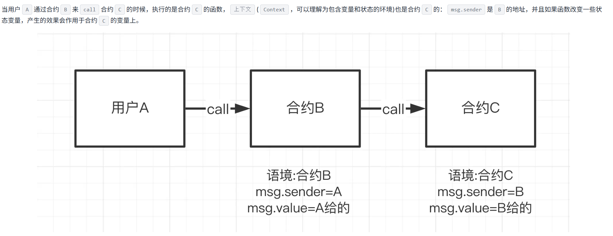
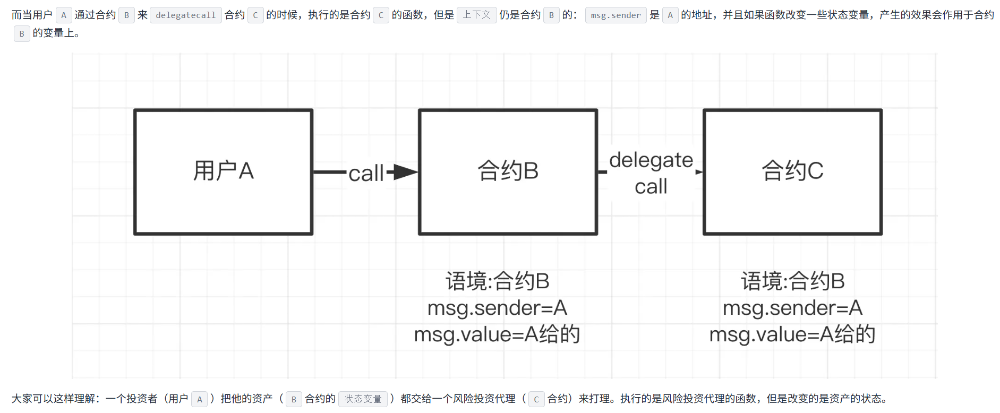
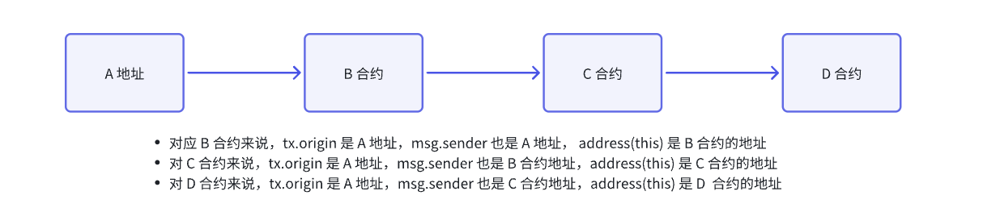
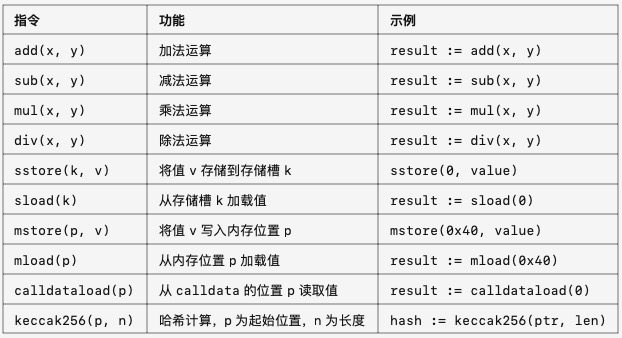
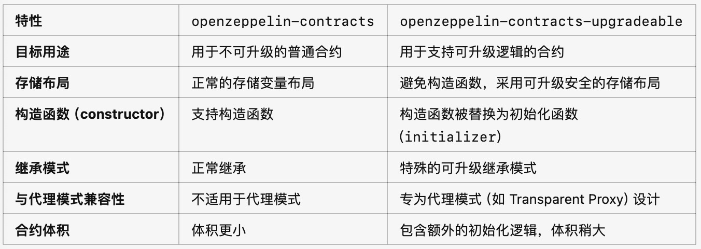
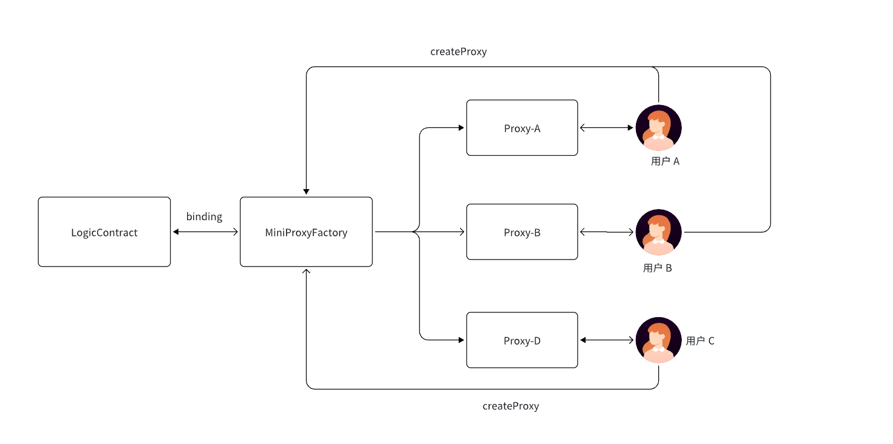

# 一.内容提要

- call, delegatecall, staticcall 和 multicall 基本使用
- 跨合约的调用方式
- 函数选择器
- create2 底层原理与实现机制
- 合约删除(合约自毁)
- Solidity 内联汇编
- 合约的 lib 库 
- OZ 代码库讲解 
- 基于 OZ 发行第一个 ERC20 代币

# 二. call, delegatecall, staticcall 和 multicall 基本使用

在Solidity中，call、delegatecall、staticcall 和 multicall 是用于合约间交互的四种重要机制。`call` 和 `delegatecall` 是用于执行外部合约调用的低级函数, staticcall 是一种只读调用，用于调用另一个合约的只读函数, `Multicall` 是一种实现，可以一次性执行多个合约调用，减少交易成本和提高效率。

## 1. Call 



### 1.1 Call 的基本使用

- **定义**
  - call 是 Solidity 中最基础的底层函数调用方法。
  - 用于调用另一个合约的方法，可以发送 ETH 并附带数据，前面已经讲过了
- **特性**
  - 调用目标合约的函数，代码在目标合约的上下文中执行
  - 可以附加 ETH（value）
  - 可以调用未知的合约或动态指定调用数据
  - 调用成功与否需要手动检查返回值

### 1.2 代码案例

```TypeScript
// SPDX-License-Identifier: UNLICENSED
pragma solidity ^0.8.13;

contract CallFunction {
    uint256 public number;

    function setNumber(uint256 newNumber) public {
        number = newNumber;
    }

    function increment() public {
        number++;
    }
}

contract CallFunctionImplement {
    function callSetNumber(address _target, uint256 _umber) public {
        (bool success, ) = _target.call(
            abi.encodeWithSignature("setNumber(uint256)", _umber)
        );
        require(success, "call set number fail");
    }

    function callIncrement(address _target) public {
        (bool success, ) = _target.call(
            abi.encodeWithSignature("increment()")
        );
        require(success, "call increment fail");
    }
}
```

以上面的代码为例子，CallFunctionImplement 调用 CallFunction 的函数逻辑，改变的是 CallFunction 合约的状态，并不是改变 CallFunctionImplement 合约的状态，也就是说 call 调用合约就改变被调用合约的状态。

## 2. delegatecall



### 2.1 基本使用

- **定义：**delegatecall 是一种特殊的调用方式，用于在当前合约的上下文中执行另一个合约的代码
- **特性**
  - 目标合约的代码在调用合约的上下文中执行（msg.sender 和 msg.value 保持不变）
  - 目标合约的代码操作的是调用合约的存储。
- **适用场景**
  - 实现代理合约（Proxy Contract）
  - 支持合约升级

### 2.2 课堂代码案例

```TypeScript
// SPDX-License-Identifier: UNLICENSED
pragma solidity ^0.8.13;

contract DelegateCallFunction {
    uint256 public number;

    function setNumber(uint256 newNumber) public {
        number = newNumber;
    }

    function increment() public {
        number++;
    }
}

contract DelegateCallFunctionImplement {
    uint256 public number;

    function callSetNumber(address _target, uint256 _umber) public {
        (bool success, ) = _target.delegatecall(
            abi.encodeWithSignature("setNumber(uint256)", _umber)
        );
        require(success, "call set number fail");
    }

    function callIncrement(address _target) public {
        (bool success, ) = _target.delegatecall(
            abi.encodeWithSignature("increment()")
        );
        require(success, "call increment fail");
    }
}
```

## 3. Staticcall 的使用

### 3.1 基本使用

- 定义
  - staticcall 是一种只读调用，用于调用另一个合约的只读函数
  - 引入于 Solidity 0.4.21，用于防止调用中对状态进行修改
- 特性
  - 只读：无法在调用中更改状态变量
  - 安全性：确保调用的函数不会意外修改状态
  - 用途：适用于需要执行计算或获取数据但不希望更改状态的场景

## 4. Multicall 的使用

- 课程代码案例

```TypeScript
// SPDX-License-Identifier: UNLICENSED
pragma solidity ^0.8.0;

import { console} from "forge-std/Test.sol";

contract TargetContract {
    uint256 public number;

    function setNumber(uint256 newNumber) public {
        number = newNumber;
    }

    function increment() public {
        number++;
    }
}

contract TargetContractOne {
    uint256 public number;

    function setNumber(uint256 newNumber) public {
        number = newNumber;
    }

    function increment() public {
        number++;
    }
}


contract MultiCall {
    struct Call {
        address targetAddress;
        bytes callData;
    }

    // 最重要的问题，无限 for 循环可能存在
    // - gas 消耗很大
    // - 区块链区块大小是有现在，不懂的用户 calls 传得很多，会撑破区块
    function multicall(Call[] memory calls) public {
        for(uint256 i = 0; i < calls.length; i++) {
            (bool success, ) = calls[i].targetAddress.call(calls[i].callData);
            require(success, "call item failed");
        }
    }
}


contract MultiCaller {
    MultiCall public multiCall;

    constructor(address _multiCall){
        multiCall = MultiCall(_multiCall);
    }

    function setNumbers(address target, uint256 number, address targetOne, uint256 numberOne) public {
        console.log("target==", target);
        console.log("data==", number);
        console.log("targetOne==", targetOne);
        console.log("dataOne==", numberOne);

        MultiCall.Call[] memory calls = new MultiCall.Call[](2);

        calls[0] = MultiCall.Call({
            targetAddress: target,
            callData: abi.encodeWithSignature("setNumber(uint256)", number)
        });

        calls[1] = MultiCall.Call({
            targetAddress: targetOne,
            callData: abi.encodeWithSignature("setNumber(uint256)", numberOne)
        });

        multiCall.multicall(calls);

    }
}
```

# 三.常见的 address(this)，tx.origin 和 msg.sender 语句解释

- *address(this): 当前合约地址，若我在 CommonUse 里面使用，address(this) 代表的就是 CommonUse 合约地*
- *tx.origin: 合约调用的源地址*
- *msg.sender: 合约的调用者*
- *msg.value: 合约调用者要转入合约的 NativeToken 的数量*
- *msg.data: 合约的调用者携带的 data*
- *block.number: 合约部署所在链最新区块高度*
- *block.gasLimit: 合约部署所在链最新区块 gasLimit*
- *block.timestamp: 合约部署所在链最新区块 timestamp*
- *tx.gasprice: 合约当前交易的 gasprice*

## 1. 图解 *tx.origin，msg.sender 和  address(this)*



# 四. 跨合约的调用方式

- 第一种：合约调用合约，传入合约地址。

  ```
  function callSetX(address _Address, uint256 x) external{
      OtherContract(_Address).setX(x);
  }
  ```
  
- 第二种：call，delegatecall 和 static 可以实现跨合约的调用，参考第二部分的内容;

```
// SPDX-License-Identifier: MIT
pragma solidity ^0.8.0;

contract CallExamples {
    address public target;
    
    function setTarget(address _target) external {
        target = _target;
    }
    
    // 1. 使用 call（可发送ETH）
    function callWithCall(uint _value) external payable returns (bool) {
        (bool success, ) = target.call{value: msg.value}(
            abi.encodeWithSignature("setValue(uint256)", _value)
        );
        return success;
    }
    
    // 2. 使用 delegatecall（在调用者上下文中执行）
    function callWithDelegateCall(uint _value) external returns (bool) {
        (bool success, ) = target.delegatecall(
            abi.encodeWithSignature("setValue(uint256)", _value)
        );
        return success;
    }
    
    // 3. 使用 staticcall（只读调用）
    function callWithStaticCall() external view returns (uint) {
        (bool success, bytes memory data) = target.staticcall(
            abi.encodeWithSignature("getValue()")
        );
        require(success, "Static call failed");
        return abi.decode(data, (uint));
    }
    
    // 接收ETH的函数
    receive() external payable {}
}
```

- 第三种：通过 interface结合地址 调用

```
// SPDX-License-Identifier: MIT
pragma solidity ^0.8.0;

// 定义接口
interface ITargetContract {
    function setValue(uint _value) external;
    function getValue() external view returns (uint);
    function transferOwnership(address newOwner) external;
}

contract InterfaceCaller {
    ITargetContract public target;
    
    event CallResult(bool success, bytes data);
    
    // 设置目标合约
    function setTarget(address _target) external {
        target = ITargetContract(_target);
    }
    
    // 通过接口调用 - 标准方式
    function callViaInterface(uint _value) external {
        target.setValue(_value);
    }
    
    // 通过接口调用视图函数
    function getValueViaInterface() external view returns (uint) {
        return target.getValue();
    }
    
    // 带返回值的接口调用
    function callWithTryCatch(uint _value) external {
        try target.setValue(_value) {
            // 调用成功
            emit CallResult(true, "");
        } catch Error(string memory reason) {
            // 调用失败，带有错误信息
            emit CallResult(false, bytes(reason));
        } catch (bytes memory lowLevelData) {
            // 底层调用失败
            emit CallResult(false, lowLevelData);
        }
    }
}
```

| 调用方式     | 优点                            | 缺点                         | 适用场景                    |
| :----------- | :------------------------------ | :--------------------------- | :-------------------------- |
| **直接调用** | 简单直观，类型安全              | 需要导入合约代码，编译时依赖 | 已知合约ABI，简单交互       |
| **底层调用** | 灵活，可处理未知接口，可发送ETH | 类型不安全，需要手动编码     | 与未知合约交互，需要发送ETH |
| **接口调用** | 类型安全，无需导入完整合约      | 需要预定义接口               | 推荐方式，已知接口定义      |

# 五.函数选择器

**函数选择器**（Function Selector）是 Solidity 中用于标识特定函数的机制。它是**函数签名的哈希值的前 4 个字节**，主要用于在低级调用（如 call、delegatecall，staticcall）中指定要调用的目标函数。

## 1. **函数选择器的生成方式**

### 1.1 第一步：提取函数名字和参数类型

- 函数签名由函数名和参数类型组成，不包括返回值

```Plain
functionName(typeN1,typeN2,typeN3....typeN)
```

- functionName: 函数名字
- typeN1,typeN2,typeN3....typeN: 函数参数列表

### 1.2 第二步: 计算函数哈希值

- 使用 keccake-256 对 `functionName(typeN1,typeN2,typeN3....typeN)`进行 Hash

### 1.3 第三步: 提取前 4 个字节

- 取第二步生成的 Hash 值做为函数调用的 calldata 的一部分

### 1.4 实际使用案例

```Plain
function mintSelector() external pure returns(bytes4 mSelector){
    return bytes4(keccak256("mint(address)"));
}
```

## 2. **ABI 系列函数**

在 Solidity 中，abi.encode 和相关的方法主要用于将数据编码成字节数组，便于存储、传输或计算哈希值。这些方法是以太坊 ABI 编码标准的一部分。

- abi.encode：将参数编码为标准 ABI 格式的字节数组，不带任何长度信息，适合用于哈希计算。
- abi.encodePacked：将参数紧凑编码为字节数组，去除了动态类型的填充字节，适合用于签名和哈希计算。
- abi.encodeWithSelector：编码数据并添加函数选择器（4 字节的函数签名 hash），常用于构造函数调用数据。
- abi.encodeWithSignature：根据函数签名（字符串形式）和参数编码数据，等价于 abi.encodeWithSelector 的扩展版。

### 2.1 **abi.encode**

- **功能**：以标准 ABI 编码格式对参数编码。
- **特点**
  - 所有数据被编码为 32 字节的倍数
  -  动态数据（如字符串、数组）在编码中会包含指向其内容的偏移量
- **示例**

```Java
pragma solidity ^0.8.0;

contract ABIEncodeExample {
    function encodeExample(uint256 a, string memory b) public pure returns (bytes memory) {
        return abi.encode(a, b);
    }
}
```

- **编码结果：**对 encodeExample(1, "hello") 的结果：

```Java
0x
0000000000000000000000000000000000000000000000000000000000000001 // uint256 a
0000000000000000000000000000000000000000000000000000000000000040 // 偏移量（字符串 b 的起始位置）
0000000000000000000000000000000000000000000000000000000000000005 // 字符串 b 的长度
68656c6c6f000000000000000000000000000000000000000000000000000000 // 字符串 b 的内容（hello）
```

### 2.2 **abi.encodePacked**

- **功能**：以紧凑格式编码参数。
- **特点**
  - 移除了动态类型的填充字节，编码结果更短。
  - 适合用于哈希计算（如 keccak256）或签名场景
  - 需要注意不同类型可能导致编码结果冲突。
- **示例：**

```Java
pragma solidity ^0.8.0;

contract ABIEncodePackedExample {
    function encodePackedExample(uint256 a, string memory b) public pure returns (bytes memory) {
        return abi.encodePacked(a, b);
    }
}
```

- **编码结果：**对 encodePackedExample(1, "hello") 的结果

```Java
0x
010000000000000000000000000000000000000000000000000000000000000068656c6c6f
```

### 2.3 **abi.encodeWithSelector**

- **功能**：将数据编码，并在开头添加函数选择器
- **特点**
  - 用于构造函数调用数据
  - 选择器是目标函数签名的前 4 字节  bytes4(keccak256("functionName(arg1Type,arg2Type)") ）。
- **示例：**

```Java
pragma solidity ^0.8.0;

contract ABIEncodeWithSelectorExample {
    function encodeWithSelectorExample(address recipient, uint256 amount) public pure returns (bytes memory) {
        return abi.encodeWithSelector(bytes4(keccak256("transfer(address,uint256)")), recipient, amount);
    }
}
```

- **编码结果：**对 encodeWithSelectorExample(0xAbCdEf0000000000000000000000000000000000, 100) 的结果：

```Java
0xa9059cbb // 函数选择器 transfer(address,uint256)
000000000000000000000000abcdef0000000000000000000000000000000000 // recipient
0000000000000000000000000000000000000000000000000000000000000064 // amount
```

### 2.4 **abi.encodeWithSignature**

- **功能**：根据字符串形式的函数签名生成编码数据。
-  **特点**
  - 等价于 abi.encodeWithSelector，但更直观
  - 可直接传入函数签名字符串，省去手动计算选择器的步骤。
- **示例：**

```Java
pragma solidity ^0.8.0;

contract ABIEncodeWithSignatureExample {
    function encodeWithSignatureExample(address recipient, uint256 amount) public pure returns (bytes memory) {
        return abi.encodeWithSignature("transfer(address,uint256)", recipient, amount);
    }
}
```

- **编码结果：**对 encodeWithSignatureExample(0xAbCdEf0000000000000000000000000000000000, 100) 的结果

```Java
0xa9059cbb // 函数选择器 transfer(address,uint256)
000000000000000000000000abcdef0000000000000000000000000000000000 // recipient
0000000000000000000000000000000000000000000000000000000000000064 // amount
```

### 2.5 **实践中的注意事项**

- abi.encodePacked **的哈希冲突**：
  -  动态类型（如 string 和 bytes）的编码结果可能导致冲突
  - 例如：abi.encodePacked("abc", "def") 和 abi.encodePacked("ab", "cdef") 的结果相同。
  - 解决方法：加入额外信息，如长度。
- **函数选择器冲突**
  - 确保选择器唯一，避免多个函数签名产生相同选择器。
- **与哈希结合**
  -  keccak256(abi.encode(...)) 和 keccak256(abi.encodePacked(...)) 用途不同。
  - 标准 ABI 用于数据验证，紧凑编码多用于签名和验证。

## 3. 案例说明

### 3.1 transfer 示范

- 函数

  ```
  function transfer(address recipient, uint256 amount) public;
  ```

- **函数签名**

  ```
  transfer(address,uint256)
  ```

-  **Keccak-256 哈希计算**

```Go
keccak256("transfer(address,uint256)")
```

- **函数选择器**

假设哈希值为：

```Go
ddf252ad 1be2c89b69c2b068fc378daa952ba7f1638f98f9f543ef38e70eb4cc
```

- 选择器为前 4 个字节

```Go
0xddf252ad
```

### 3.2 自定义合约

- 代码

```Solidity
pragma solidity ^0.8.0;

contract ExampleContract {
    uint256 public value;

    function setValue(uint256 _value) public {
        value = _value;
    }
}
```

- `setValue` 函数的函数选择器计算示例：
  - **ABI 编码**：`setValue(uint256)` 的 ABI 编码为 `0x552410770000000000000000000000000000000000000000000000000000000000000042`。
  - **计算哈希**：对 ABI 编码进行 keccak256 哈希计算得到 `0x55241077...`。
  - **函数选择器**：取哈希值的前 4 个字节，即 `0x55241077`。

## 4. **函数选择器的用途**

### 4.1 **智能合约调用**

在低级调用（如 call）中，函数选择器用于标识目标函数。

```Go
contract Example {
    function callTransfer(address target, address recipient, uint256 amount) public {
        bytes memory data = abi.encodeWithSelector(
            bytes4(keccak256("transfer(address,uint256)")),
            recipient,
            amount
        );
        (bool success, ) = target.call(data);
        require(success, "Call failed");
    }
}
```

### 4.2 **Fallback 函数**

当合约接收到调用但没有匹配函数时，会触发 fallback 函数，开发者可以通过 msg.data 获取函数选择器。

```Go
contract FallbackExample {
    receive() external payable {}
        bytes4 selector = bytes4(msg.data[:4]); // depositETH 函数选择器
        // 根据 selector 执行相应逻辑
    }
    
     receive() external payable {
        depositETH()
    }
    
    // 上面两个 receive 方法的效果有
    function depositETH() public {
        
    }
}
```

### 4.3 **EIP-2535（Diamond Standard）**

在模块化合约（如钻石标准）中，函数选择器用于路由到不同的实现模块。

## 5.**生成函数选择器的工具**

- **使用 Solidity 内置工具**

```Go
bytes4 selector = bytes4(keccak256("transfer(address,uint256)"));
```

- **使用 JavaScript/TypeScript**

```Go
const ethers = require("ethers");
const selector = ethers.utils.id("transfer(address,uint256)").slice(0, 10);
console.log(selector); // 输出: 0xa9059cbb
```

- **使用 Python**

```Go
from web3 import Web3
selector = Web3.keccak(text="transfer(address,uint256)").hex()[:10]
print(selector)  # 输出: 0xa9059cbb
```

## 6.**注意事项**

-  **函数签名的唯一性**
  - 不同函数可能会生成相同的函数选择器（**哈希碰撞**），但这种概率极低。
  - 开发时避免设计过于相似的函数签名。
- **参数顺序和类型敏感**
  - transfer(address,uint256) 和 transfer(uint256,address) 的选择器不同。
- **不包括返回值**
  - 返回值类型不会影响函数选择器。

## 7. **应用场景**

- **动态函数调用：**通过函数选择器动态调用任意函数

```Go
contract DynamicCaller {
    function callFunction(address target, bytes4 selector, bytes memory args) public {
        (bool success, ) = target.call(abi.encodePacked(selector, args));
        require(success, "Call failed");
    }
}
```

-  **插件化合约：**在模块化合约中，使用函数选择器映射到具体实现

```Go
mapping(bytes4 => address) public selectorToImplementation;

function delegateCall(bytes4 selector, bytes memory args) public {
    address implementation = selectorToImplementation[selector];
    require(implementation != address(0), "Selector not implemented");
    (bool success, ) = implementation.delegatecall(abi.encodePacked(selector, args));
    require(success, "Delegatecall failed");
}
```

# 六.合约删除 (合约自毁，目前已废弃,  了解的内容)

- **Solidity 0.8.18（2023年2月）**：根据 EIP-6049，`selfdestruct` 被标记为弃用。编译器会对其使用发出警告，建议开发者避免使用该函数。 
- **以太坊 Cancun 升级**：依据 EIP-6780，`selfdestruct` 的行为将被修改。除了在合约部署交易中立即调用的情况外，`selfdestruct` 将不再删除合约的代码和存储，仅会转移合约中的以太币余额。

即使你是低版本的合约，一般不建议使用合约自毁，建议在合约里面加开关，可以通过开关来暂停合约的业务功能。

以下合约自毁的内容可以阅读以下，了解，能应付面试即可，不用做过多的关注

## 1.**合约删除的基本概念**

### 1.1 **selfdestruct 的作用**

- 删除合约的代码
  - 合约地址将不再关联任何代码
  - 合约的所有存储数据将被清除
-  释放存储空间
  -  减少状态存储的消耗，释放 Gas（适用于存储退款机制）
- 将合约余额发送到指定地址。

### 1.2 语法

```Go
selfdestruct(address payable recipient);
```

### 1.3 **使用场景**

- 合约生命周期结束
- 合约需要升级或替换
- 合约遭受攻击或存在安全问题

## 2. 案例代码分析

### 2.1 **基本示例**

```Go
pragma solidity ^0.8.0;

contract SelfdestructCase {
    address public owner;

    constructor() {
        owner = msg.sender;
    }

    modifier onlyOwner() {
        require(msg.sender == owner, "Not the owner");
        _;
    }

    // 销毁合约并将余额发送到指定地址
    function destroyContract(address payable recipient) public onlyOwner {
        selfdestruct(recipient);  // 从合约里面转到 recipient
    }

    // 接受以太币
    receive() external payable {}
}
```

- 只有合约所有者可以调用 destroyContract
-  合约被销毁后，余额会转移到 recipient

## 3.**合约删除的影响**

- **合约地址仍然存在**
  - 虽然代码被移除，但地址仍然可以接收 ETH。
  - 再次部署到相同地址是不可能的，除非使用 CREATE2。
- **事件和交易记录**
  - 合约的销毁不会影响之前的交易记录。
  - 销毁事件可以通过链上交易日志（Event Logs）追踪。

## 4. **selfdestruct 的优点与风险**

-  **优点**

  - **节约存储成本**:  删除合约后释放存储空间，可能获得部分 Gas 退款。
  - **清除无用合约:**  对废弃或不再需要的合约进行销毁

- **风险**

  - **潜在误操作**：如果代码设计不当，可能意外销毁合约。

  - **恶意使用**：攻击者可能利用 selfdestruct 将 ETH 强制发送到目标地址。

    - 示例

    - ```Go
      contract Malicious {
          constructor(address target) payable {
              selfdestruct(payable(target));
          }
      }
      ```

- **存储清除**：所有存储的数据都会被清除，无法恢复

## 5. **使用 selfdestruct 的场景**

### 5.1 **合约生命周期结束**

合约完成所有功能或达到预期目的时，销毁以释放存储资源

```Go
function terminateContract() public onlyOwner {
    selfdestruct(payable(owner));
}
```

### 5.2 **升级合约**

在需要替换合约逻辑时，可以销毁旧合约，部署新合约

```Go
function upgradeContract(address payable newContract) public onlyOwner {
    selfdestruct(newContract);
}
```

## 6. **注意事项**

- **使用权限控制**
  - 确保只有受信任的用户（例如合约所有者）可以调用 selfdestruct
  - 使用 modifier 或 require 语句进行访问限制。
- **资金接收地址**
  - 确保 recipient 是有效的地址，避免丢失资金。
- **避免与 Proxy 合约冲突**
  - 如果合约使用了代理模式（如 delegatecall），需要特别注意删除逻辑可能影响代理行为。
- **存在的问题**
  - **状态清理的复杂性**：现有实现会立即清除合约存储，但在未来的状态分片中可能会增加复杂性
  - **合约地址的可重用性：**CREATE2 可预测的地址可能引发潜在安全问题

# 七.Solidity 内联汇编

内联汇编（Inline Assembly）是 Solidity 提供的一种直接操作 Ethereum 虚拟机（EVM）指令的机制，允许开发者编写底层的 EVM 指令。它适用于性能优化、直接访问内存或实现 Solidity 不支持的低级功能。

## 1. **基本概念**

- 内联汇编的关键字：assembly
- 使用场景
  - 精细控制 Gas 消耗
  - 实现 Solidity 中无法直接实现的功能
  - 优化复杂逻辑，减少冗余代码
  - 与 EVM 原生指令交互（如 CALL, STATICCALL）

## 2. 语法结构

### 2.1 **基本语法**

```Plain
assembly {
    // 汇编指令块
}
```

### 2.2 示例

```Go
pragma solidity ^0.8.0;

contract InlineAssemblyExample {
    function addNumbers(uint256 a, uint256 b) public pure returns (uint256 result) {
        assembly {
            result := add(a, b)
        }
    }
}
```

- add(a, b)：EVM 的加法指令，计算并返回 a + b
  -  表现在 `OP_ADD` 上

## 3. **内联汇编的特性**

### 3.1 **内存与存储访问**

内联汇编允许直接访问内存（memory）、存储（storage）和调用数据（calldata）。

- 0x20：当前内存分配的起始位置

  - 0x20 是 EVM 内存中的第一个动态内存指针。
  -  内存地址从 0x00 开始
  -  0x00 - 0x1F 通常存储临时或状态变量
  - 0x20 之后的地址专用于动态数据的存储（如数组、字符串、字节等）。

- 0x40：空闲内存指针

  -  0x40 是存储空闲内存位置的标准内存位置
  - 当 Solidity 合约需要分配内存时，会读取 0x40 的值，找到当前空闲内存的起始地址
  - 每次分配后，0x40 中的值会更新为新的空闲内存位置。

- 访内存（memory):

  ```
  内存位置       内容
  data         [32字节: 数据长度][实际数据...]
  0x40         空闲内存指针（指向可用内存起始位置）
  ```

```Go
pragma solidity ^0.8.0;

contract MemoryExample {
    function readWriteMemory(uint256 input) public pure returns (uint256 output) {
        assembly {
            let pointer := mload(0x40) // 获取内存的空闲位置
            mstore(pointer, input)    // 将 input 写入内存
            output := mload(pointer) // 从内存读取值
        }
    }
}
```

- **存储访问示范代码storage**

```Go
pragma solidity ^0.8.0;

contract StorageExample {
    uint256 public data; // 0 slot

    function setAndGet(uint256 value) public returns (uint256) {
        assembly {
            sstore(0, value)  // 将 value 存储到 slot 0
            let result := sload(0)  // 从 slot 0 加载值
            return(0, 32)     // 返回值（32 字节）
        }
    }
}
```

### 3.2 **调用数据（calldata）操作**

- **读取函数选择器**
- calldataload(0) 的含义
  - `calldataload(0)` 从 calldata 的 **第0字节位置** 开始读取32字节数据
  - 但由于函数选择器只占前4字节，所以实际上读取的是：
    - 前4字节：函数选择器
    - 后28字节：可能是0或者参数的部分数据（取决于参数）

```Go
pragma solidity ^0.8.0;

contract SelectorExample {
    function getSelector() public pure returns (bytes4 selector) {
        assembly {
            selector := calldataload(0) // 从 calldata 中读取前 4 字节（函数选择器） 
                                        // calldataload(0) 中的 0 指的是 calldata 的起始偏移量（offset） 
            // transafer , calldataload(0) 函数选择器的值 ddf252ad
        }
    }
}
```

## 4.**常用指令**




## 5. (面试题) 在合约里面如何判断地址是 EOA 地址还是合约地址

可以使用内联汇编中的`extcodesize`操作码来获取一个地址的代码大小

### EVM 层面

- `EXTCODESIZE` 是 EVM 操作码
- 查询指定地址的合约代码长度
- 返回 `uint256` 类型的代码大小

如果代码大小大于0，则该地址是一个合约地址；如果为0，则是一个外部账户（EOA）地址。

```
function isContract(address addr) internal view returns (bool) {
    uint256 size;
    assembly {
        size := extcodesize(addr)
    }
    return size > 0;
}
```

### 状态数据库层面

```
// Go-Ethereum 中的实现
func (s *StateDB) GetCodeSize(addr common.Address) int {
    return len(s.GetCode(addr))
}
```

```
EOA 地址:
extcodesize(addr) → 0
stateDB.getCodeSize() → 0

合约地址:
extcodesize(addr) → 代码长度(>0)
stateDB.getCodeSize() → 代码长度(>0)
```

## **6. 高级应用**

### 6.1 动态数组操作

直接操作内存中的动态数组。

```Go
pragma solidity ^0.8.0;

contract DynamicArray {
    function createArray(uint256 size) public pure returns (uint256[] memory) {
        assembly {
            let ptr := mload(0x40)     // 获取空闲内存位置
            mstore(ptr, size)         // 设置数组长度
            let data := add(ptr, 0x20) // 指向数组内容区域
            for { let i := 0 } lt(i, size) { i := add(i, 1) } {
                mstore(add(data, mul(i, 0x20)), i) // 存储数组元素
            }
            mstore(0x40, add(data, mul(size, 0x20))) // 更新空闲内存指针
            return(ptr, add(0x20, mul(size, 0x20))) // 返回数组
        }
    }
}
```

### 6.2 **实现低级调用**

通过 call 指令与其他合约交互。

```Go
pragma solidity ^0.8.0;

contract LowLevelCall {
    function callAnother(address target, bytes memory data) public returns (bytes memory) {
        assembly {
            let result := call(gas(), target, 0, add(data, 0x20), mload(data), 0, 0) 
            switch result
            case 0 { revert(0, 0) } //  调用失败，回滚
            default {
                let returndata_size := returndatasize() // 获取返回数据大小
                let returndata := mload(0x40)  // 获取空闲内存指针
                returndatacopy(returndata, 0, returndata_size)  // 复制返回数据到内存
                return(returndata, returndata_size) // 返回数据
            }
        }
    }
}
```

## 7.**注意事项**

- 安全性
  - 内联汇编直接操作底层资源，容易引发**安全问题**，如**存储错位或越界访问**
  - 确保变量访问和内存操作严格符合预期。
- 可读性：**内联汇编代码较难阅读和维护**，尽量仅用于性能关键或 Solidity 不支持的场景。
- Gas 优化：虽然汇编可以减少部分冗余代码，但并非总能显著优化 Gas 消耗。需要根据具体场景分析。
- 版本限制：Solidity 0.8.x 开始增强了安全性检查，某些低级操作可能被限制。

## 8. 总结

- **优点**        
  - 精细控制 EVM 操作，提升灵活性        
  - 实现 Solidity 无法直接支持的功能       
  - 在性能关键场景中降低 Gas 消耗      
- **缺点**
  - 可读性差，调试和维护困难
  - 易引入安全漏洞，**尤其是内存和存储操作**
  - 需要深入了解 EVM 和 Solidity 原理
- **适用场景**
  - 性能优化：减少冗余逻辑或复杂循环
  - 特殊需求：操作内存、存储或实现复杂的低级逻辑
  - 与 EVM 指令直接交互：如 CALL、DELEGATECALL

内联汇编是一把双刃剑，需谨慎使用。如果不是性能或功能瓶颈，应优先使用 Solidity 提供的高级语法。

# 八.合约的 lib 库 

在 Solidity 中，库（Library） 是一种特殊的智能合约，用于封装可复用的逻辑或功能。库可以被其他合约直接调用，从而减少代码冗余，提高开发效率。

他和普通合约主要有以下几点不同：

1. 不能存在状态变量
2. 不能够继承或被继承
3. 不能接收以太币
4. 不可以被销毁

## 1. 库的特点

- 代码复用：封装通用逻辑，多个合约可以共享同一库
- 无状态：库不能定义或修改状态变量
- 直接调用：使用 delegatecall 将库的逻辑运行在调用合约的上下文中
- 不可部署独立逻辑：库的函数必须是内部函数或通过合约调用，不能独立执行

## 2.**库的类型**

### 2.1**内部库**

- 函数直接被编译器内联到调用合约中
- 没有单独的部署地址
- 调用成本低，无需 delegatecall

```Go
library Math {
    function add(uint256 a, uint256 b) internal pure returns (uint256) {
        return a + b;
    }
}

contract Example {
    using Math for uint256;

    function sum(uint256 a, uint256 b) public pure returns (uint256) {
        return a.add(b); // 调用库的 add 函数
    }
}
```

### 2.2 **外部库**

- 需要单独部署，库有自己的地址

- 调用时通过 delegatecall 运行在调用合约的上下文中

- 优点：可共享逻辑，减少重复部署

- 示范

  - 库代码

  - ```Go
    library ExternalMath {
        function multiply(uint256 a, uint256 b) public pure returns (uint256) {
            return a * b;
        }
    }
    ```

  - 调用代码

  - ```Go
    contract Example {
        using ExternalMath for uint256;
    
        function product(uint256 a, uint256 b) public pure returns (uint256) {
            return a.multiply(b); // 调用库的 multiply 函数
        }
    }
    ```

## 3. **声明与使用**

### 3.1 **定义库**

- 使用 library 关键字定义
- 通常包含纯函数（pure）或只读函数（view）

```Go
library Math {
    function add(uint256 a, uint256 b) internal pure returns (uint256) {
        return a + b;
    }

    function subtract(uint256 a, uint256 b) internal pure returns (uint256) {
        require(a >= b, "Underflow");
        return a - b;
    }
}
```

### 3.2 **使用库**

- **直接调用**：合约可以直接调用库中的函数。

  代码案例

  ```
  // 直接通过库合约名调用 
  function compute(uint256 a, uint256 b) public pure returns (uint256){    
  	return Math.add(a, b); 
  }
  ```

- using for **语法糖：**将库函数附加到基础类型，调用更简洁:

  指令`using A for B;`可用于附加库合约（从库 A）到任何类型（B）。添加完指令后，库`A`中的函数会自动添加为`B`类型变量的成员，可以直接调用 :注意：在调用的时候，这个变量会被当作第一个参数传递给函数：

  代码案例

```Go
contract Example {
    using Math for uint256;

    function compute(uint256 a, uint256 b) public pure returns (uint256) {
        return a.add(b); // 等同于 Math.add(a, b)
    }
}
```

## 4. **库的部署**

- **内联库**

  - 编译时直接将代码内联到合约中
  - 不需要单独部署

- **外部库**

  - 单独部署到链上
  - 调用时通过链接库地址

- **外部库部署流程**

  - 部署库合约：使用工具（如 hardhat、foundry）部署库

  - 链接库地址: 在部署主合约时，将库地址与主合约链接

  - 部署脚本示例（Hardhat）

  - ```Go
    async function main() {
        const MathLibrary = await ethers.getContractFactory("ExternalMath");
        const mathLib = await MathLibrary.deploy();
        await mathLib.deployed();
        console.log("Math Library deployed at:", mathLib.address);
    
        const ExampleContract = await ethers.getContractFactory("Example", {
            libraries: {
                ExternalMath: mathLib.address,
            },
        });
        const example = await ExampleContract.deploy();
        await example.deployed();
        console.log("Example Contract deployed at:", example.address);
    }
    main();
    ```

## 5. 库的使用场景

- **数学计算：**实现通用的数学运算逻辑，如加、减、乘、除等

```Go
library SafeMath {
    function add(uint256 a, uint256 b) internal pure returns (uint256) {
        uint256 c = a + b;
        require(c >= a, "Addition overflow");
        return c;
    }
}
```

- **字符串操作：**提供字符串拼接、比较等操作

```Go
library StringUtils {
    function concat(string memory a, string memory b) internal pure returns (string memory) {
        return string(abi.encodePacked(a, b));
    }
}
```

-  **数组工具：** 操作数组，如插入、删除等

```Go
library ArrayUtils {
    function find(uint256[] memory arr, uint256 value) internal pure returns (int256) {
        for (uint256 i = 0; i < arr.length; i++) {
            if (arr[i] == value) return int256(i);
        }
        return -1; // 未找到
    }
}
```

## 6. 库的优缺点

- 优点       
  - 代码复用，减少合约冗余
  - 提高代码可读性和模块化设计
  - 减少逻辑错误，便于维护
-  缺点
  - 外部库调用增加了 Gas 消耗
  - 内联库可能导致主合约体积增大
  - 如果库被错误使用，可能导致存储冲突问题

## 7. 注意事项

- 权限管理：库函数不能直接访问状态变量，但通过 delegatecall 运行时，仍可以访问调用合约的上下文，需谨慎使用。
- Gas 成本
  - 内联库的函数更节省 Gas，但会增加合约大小。
  - 外部库调用会使用 delegatecall，增加调用成本。
- 存储冲突：库运行在调用合约的存储上下文中，确保存储布局一致。
- 不可变性： 库一旦部署，逻辑不可更改。对于可升级场景，需设计代理模式。

# 九.OZ 代码库讲解 

OpenZeppelin 是 Solidity 开发的标准工具库，覆盖了从代币实现到安全工具的各个方面。其模块化设计帮助开发者快速实现安全、标准化的智能合约，同时减少了开发和审计的成本。通过合理使用 OpenZeppelin 的模块，可以显著提高智能合约的开发效率和安全性。

Oz Github: https://github.com/Openzeppelin

Oz 提供的最为主流的两个代码库

- openzeppelin-contracts：用于不可升级的普通合约
- openzeppelin-contracts-upgradeable：用于支持可升级逻辑的合约

## 1. 核心区别



## 2. openzeppelin-contracts

- access: 权限控制板块
  - AccessControl: 角色权限授权与检查
  - Ownable 和 Ownable2Step：Owner 的权限管理，包含 owner 权限初始化，权限转移，权限销毁等
- account 
  - 对抽象账户钱包的封装，包括 EIP4337 和 EIP7702 的内容
- finance
  - Vesting Wallet 的模块
- governance
  - 治理板块，时间锁控制等
- metatx: ERC2771 的实现
- proxy
  - 透明代理
  - UUPS 
  - 信标代理
  - ERC1967 代理
  - 最小代理
- Token
  - ERC20 
  - ERC721
  - ERC1155
  - ERC6909
- Utils
  - 密码学库
  - address
  - create2
  - 这里面很多很多工具类，自己可以下去看一下

## 3. openzeppelin-contracts-upgradeable

模块和不可升级的差不多，部分合约代码在不可升级里面实现，upgradeable 里面不会再实现，而是做扩展实现


# 十.create2 底层原理与实现机制

CREATE2 是以太坊的一条 EVM 指令，用于部署智能合约。与传统的 CREATE 指令不同，CREATE2 允许通过计算得到合约地址，而不是依赖发送方的 nonce。这种方式使得合约地址在部署之前就可以被预测，方便一些高级用例，例如 工厂模式和合约钱包的预部署地址。

## 1. init_code 与 runtime_code 对比

init_code = 构造函数逻辑 + 参数 + 运行时字节码部署代码

| 特性         | init_code                       | runtime_code   |
| :----------- | :------------------------------ | :------------- |
| **用途**     | 部署时执行                      | 部署后执行     |
| **内容**     | 构造函数逻辑 + 运行时字节码部署 | 纯业务逻辑     |
| **大小**     | 较大（包含额外代码）            | 较小           |
| **持久性**   | 执行后丢弃                      | 永久存储在链上 |
| **访问方式** | `.creationCode`                 | `.runtimeCode` |

### 1.1 手动构造init_code

```
contract ManualFactory {
    bytes public storedInitCode;
    
    // 获取合约的完整字节码（包含构造函数）
    function getContractBytecode() public pure returns (bytes memory) {
        return type(SimpleStorage).creationCode;
    }
    
    // 注意：如果构造函数有参数，需要编码进去
	// 例如：abi.encodePacked(type(SimpleContract).creationCode, abi.encode(...))
    // 获取带参数的 init_code
    function getInitCodeWithArgs(uint256 _data) public pure returns (bytes memory) {
        return abi.encodePacked(
            type(SimpleStorage).creationCode,
            abi.encode(_data)
        );
    }
    
    function precomputeAddress(
        bytes32 salt,
        uint256 constructorArg
    ) public view returns (address) {
        bytes memory initCode = getInitCodeWithArgs(constructorArg);
        
        return address(uint160(uint256(keccak256(abi.encodePacked(
            bytes1(0xFF),
            address(this),
            salt,
            keccak256(initCode)
        )))));
    }
}
```


## 2. **CREATE 与 CREATE2 的对比**

### 1.1 **CREATE**

- `create`的用法很简单，就是`new`一个合约，并传入新合约构造函数所需的参数：

```
Contract x = new Contract{value: _value}(params)
```

- 合约地址通过以下公式计算

```Go
address = keccak256(rlp(deployer, nonce))[12:] //新地址 = hash(创建者地址, nonce)
```

- deployer：创建合约的地址
- nonce：发送方的交易计数器

合约地址依赖部署者的 nonce，在部署前无法预测地址，部署顺序改变时地址也会变化。


### 1.2 **CREATE2**

- `CREATE2`的用法和之前讲的`CREATE`类似，同样是`new`一个合约，并传入新合约构造函数所需的参数，只不过要多传一个`salt`参数：

  ```
  Contract x = new Contract{salt: _salt, value: _value}(params)
  ```

- 合约地址通过以下公式计算

```Go
address = keccak256(0xFF, deployer, salt, keccak256(init_code))[12:] //新地址 = hash("0xFF",创建者地址, salt, initcode)
```

- 0xFF：固定字节前缀，避免和`CREATE`冲突
-  deployer：合约创建者的地址, 调用 CREATE2 的当前合约（创建合约）地址
-  salt：部署时指定的随机数
-  init_code：部署合约的初始化代码 (包括合约的创建字节码和构造函数参数)

- 特点：
  - 合约地址由 deployer、salt 和 init_code 决定
  - 地址可以在部署前预测
  -  如果提供相同的 salt 和 init_code，地址是唯一且可复现的

#### 1.2.1 **CREATE2 的部署机制**

- 部署流程

  - 生成合约地址
    -  使用上述公式计算出目标地址
    -  地址是唯一的，只要 salt 和 init_code 不变，地址也不会变化
  -  校验地址是否已存在: 如果目标地址上已有合约代码，部署会失败
  - 执行合约初始化代码: 合约的 init_code 在目标地址处运行，生成运行时字节码
  - 完成部署: 如果 init_code 执行成功，生成的运行时字节码会被存储在目标地址

- 底层实现（EVM 指令）

  - CREATE2 是 EVM 中的一个指令，操作码为 0xF5

  - 参数栈

    - ```Go
      [value, offset, size, salt] -> [new_contract_address]
      ```

    - value：要发送的 ETH 数量

    -  offset 和 size：表示初始化代码在内存中的位置和大小

    -  salt：一个用户定义的 32 字节值，用于唯一标识部署

    - 返回值是新合约的地址

#### 1.2.2 **CREATE2 的地址计算公式解析**

- 公式：

```Go
address = keccak256(0xFF, deployer, salt, keccak256(init_code))[12:]
```

- 步骤解析
  -   固定前缀 0xFF：防止与 CREATE 生成的地址冲突
  -  部署者地址 deployer：当前创建合约的账户地址
  - 盐值 salt:  
    - 用户提供的一个`bytes32`类型的值，用于指定不同的合约部署场景
    - 通常用于生成不同的合约地址。
  - 初始化代码哈希 keccak256(init_code)：
    - 合约部署时的初始化代码
    - 包括合约构造函数的逻辑 
  - 计算地址： 整个哈希结果的后 20 字节（即 [12:]）被用作最终的合约地址。

#### 1.2.3 **示例实现**

- **合约中使用 CREATE2**

  基础工厂合约

```Go
pragma solidity ^0.8.0;

contract SimpleContract {
    address public owner;
    uint256 public value;
    
    constructor(address _owner, uint256 _value) {
        owner = _owner;
        value = _value;
    }
}

contract Factory {
    event ContractDeployed(address predicted, address actual, bytes32 salt);
    
    // 预计算合约地址
    function predictAddress(
        bytes32 salt,
        address owner,
        uint256 value
    ) public view returns (address) {
        bytes memory initCode = getInitCode(owner, value);
        
        return address(uint160(uint256(keccak256(abi.encodePacked(
            bytes1(0xFF),
            address(this),
            salt,
            keccak256(initCode)
        )))));
    }
    
    // 获取初始化代码
    function getInitCode(
        address owner,
        uint256 value
    ) public pure returns (bytes memory) {
        return abi.encodePacked(
            type(SimpleContract).creationCode,
            abi.encode(owner, value)
        );
    }
    
    // 部署合约
    function deploy(
        bytes32 salt,
        address owner,
        uint256 value
    ) public returns (address) {
        bytes memory initCode = getInitCode(owner, value);
        address predictedAddress = predictAddress(salt, owner, value);
        
        address deployedAddress;
        assembly {
            deployedAddress := create2(0, add(initCode, 0x20), mload(initCode), salt)
        }
        
        require(deployedAddress == predictedAddress, "Address mismatch");
        emit ContractDeployed(predictedAddress, deployedAddress, salt);
        
        return deployedAddress;
    }
}
```

- 调用流程
  - 部署新合约： 调用 deploy 函数，传入 salt 和目标合约的字节码
  - 计算合约地址： 使用 computeAddress 提前计算合约地址，确保预测地址正确

#### 1.2.4 应用场景

- 工厂合约： 工厂合约（Factory Contract）可以使用 CREATE2 部署子合约，使子合约地址可预测
  - 工厂合约是一种专门用于**部署其他合约**的智能合约，它通过 CREATE2 操作码实现**确定性地址部署**，使得子合约地址在部署前就可预测。	

- 合约钱包： 使用 CREATE2 预先计算钱包地址，允许用户在创建钱包前接收资金
- 可升级合约： 将合约地址与特定逻辑绑定，通过 CREATE2 确保逻辑的唯一性和可预测性
- DeFi 合约： 用于创建和管理流动性池等可预测地址的合约


# 十一. 最小代理(EIP-1167)

EIP-1167 是一种标准化的代理合约实现，旨在通过最小的字节码和委托调用的方式实现合约逻辑的复用。这种模式不仅节省部署和存储成本，还提供了开发者灵活的合约管理能力。

## 1. **核心概念**

EIP-1167 定义了一种代理合约标准，代理合约的作用是将用户的调用委托到另一个逻辑合约（目标合约）。它通过 delegatecall 操作将调用转发给目标合约，从而实现代码复用，同时代理自身不存储逻辑，只存储状态。

代理合约的主要特点：

- **极低的部署成本**：代理合约的字节码极短，部署成本低
- 逻辑复用：多个代理可以复用一个逻辑合约，节省存储
- **地址确定性**：结合 CREATE2 实现可预测地址
- **快速部署**：批量创建合约实例（通过工厂合约模型）
- 易于升级：通过调整代理指向的目标地址，可以实现逻辑的动态升级



### 1.1 实例：最小代理合约工厂

```
pragma solidity ^0.8.0;

contract MinimalProxyFactory {
    event ProxyCreated(address proxy, address implementation);
    
    // 部署最小代理
    function deployMinimalProxy(address implementation, bytes32 salt) 
        public 
        returns (address proxy) 
    {
        bytes memory bytecode = generateMinimalProxyBytecode(implementation);
        
        assembly {
            proxy := create2(0, add(bytecode, 0x20), mload(bytecode), salt)
        }
        
        emit ProxyCreated(proxy, implementation);
    }
    
    // 生成最小代理字节码
    function generateMinimalProxyBytecode(address implementation) 
        public 
        pure 
        returns (bytes memory) 
    {
        bytes20 targetBytes = bytes20(implementation);
        
        bytes memory bytecode = new bytes(45);
        
        // 固定前缀
        bytes memory prefix = hex"3d602d80600a3d3981f3363d3d373d3d3d363d73";
        for (uint i = 0; i < 20; i++) {
            bytecode[i] = prefix[i];
        }
        
        // 插入实现合约地址
        for (uint i = 0; i < 20; i++) {
            bytecode[20 + i] = targetBytes[i];
        }
        
        // 固定后缀
        bytes memory suffix = hex"5af43d82803e903d91602b57fd5bf3";
        for (uint i = 0; i < 15; i++) {
            bytecode[40 + i] = suffix[i];
        }
        
        return bytecode;
    }
    
    
    // 预计算代理地址
    function computeAddress(address implementation, bytes32 salt)
        public
        view
        returns (address)
    {
        bytes memory bytecode = generateMinimalProxyBytecode(implementation);
        
        bytes32 hash = keccak256(
            abi.encodePacked(
                bytes1(0xff),
                address(this),
                salt,
                keccak256(bytecode)
            )
        );
        
        return address(uint160(uint256(hash)));
    }
}
```


## 2. **EIP-1167 的标准字节码**

代理合约的字节码模板如下：

```Go
0x363d3d373d3d3d363d73<logic_contract_address>5af43d82803e903d91602b57fd5bf3
```

### 2.1 **字节码结构详解**

| **字节码**          | **解释**                                 |
| ------------------- | ---------------------------------------- |
| 0x36                | CALLDATASIZE：获取调用数据的大小         |
| 0x3d                | RETURNDATASIZE：设置初始内存大小为 0     |
| 0x37                | CALLDATACOPY                             |
| 0x73<logic_address> | 将逻辑合约地址放入内存                   |
| 0x5af4              | 5a:GAS, f4: 执行 delegatecall            |
| 0x3d82...fd         | 处理 delegatecall 的返回值并返回给调用者 |

### 2.2 **生成代理字节码的 Solidity 代码**

```Go
function createProxyBytecode(address logic) public pure returns (bytes memory) {
    return abi.encodePacked(
        hex"363d3d373d3d3d363d73",
        logic,
        hex"5af43d82803e903d91602b57fd5bf3"
    );
}
```

## 3. **EIP-1167 的工作原理**

- 代理合约的部署
  -  使用上述标准字节码和目标逻辑implementation合约地址，通过 create 部署代理合约
  -  部署后的代理只包含标准字节码，并指向逻辑合约的地址
- 函数调用的转发
  - 用户调用代理合约时，代理合约通过 delegatecall 将调用转发到逻辑合约
  - delegatecall 的特点是使用调用者的上下文（代理合约的存储和余额），执行逻辑合约的代码
- 逻辑合约的复用
  - 一个逻辑合约可以被多个代理合约复用，从而节约存储成本和开发成本
- 可升级性
  - 如果代理合约使用了灵活的目标地址存储方式（如 EIP-1967 中的存储槽规范），可以动态改变逻辑合约地址，从而实现逻辑升级

## **4. EIP-1167 使用场景**

- 多实例工厂模式:  工厂合约可以快速部署多个代理合约实例，这些实例共享同一个逻辑合约
- 可升级合约: 可以通过设置存储中的逻辑合约地址，实现合约逻辑的动态升级
- 模块化合约:  通过代理合约实现模块化设计，各模块分离逻辑代码和状态存储，提高合约的可维护性

## **5. EIP-1167 的优缺点**

- 优点
  -  **部署成本低**: **代理合约的字节码极短**，**部署**时消耗的 Gas 显著减少
  - **逻辑代码复用**: 多个代理合约共享一个逻辑合约，节省存储空间
  - 灵活性强: 支持通过 delegatecall 动态转发调用，轻松实现复杂的功能
  - 升级便捷: 如果代理设计支持动态目标地址，可以实现逻辑的动态更新
- 缺点
  - 调试复杂: 由于状态存储在代理合约，而逻辑在目标合约中，调试时需要查看两者。
  - 无内置的升级机制: **EIP-1167 本身并未提供升级机制**，需要开发者自行设计目标地址的存储方案。
  - Gas 成本稍高: 每次**函数调用都需要额外的 delegatecall**，略微增加了执行成本