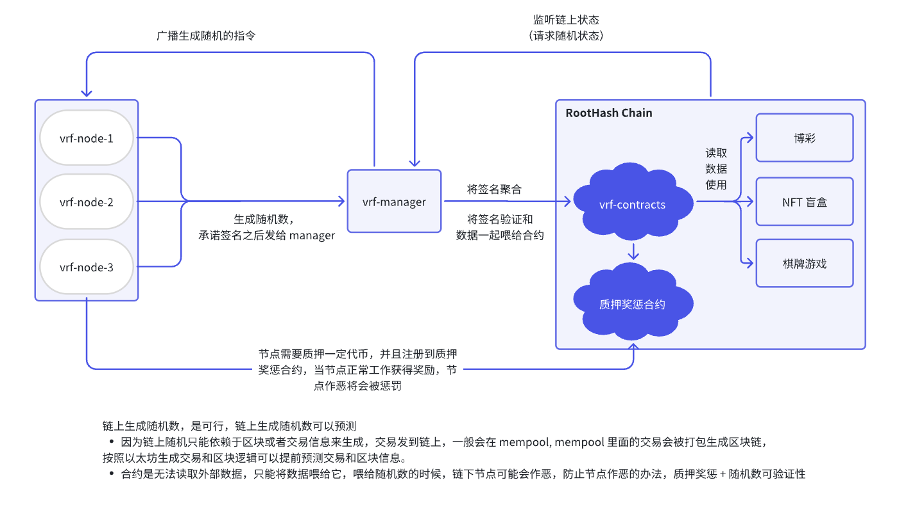
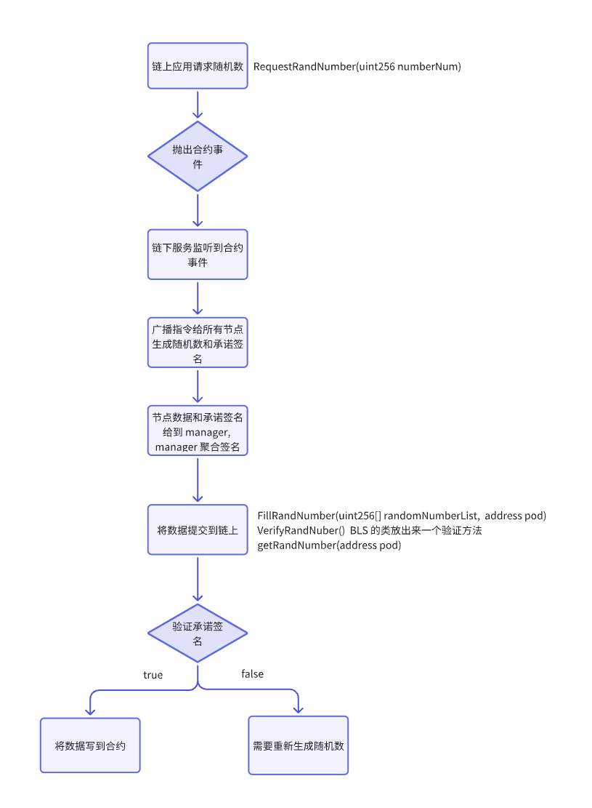

# 一.需求

链下生成的可验证的随机数，验证算法使用的 BLS 的算法

- 用最小代理实现一个随机数的提交和链上使用，每一个项目开一个逻辑一致的最小代理合约，最小代理合约创建处理之后添加到一个管理合约，管理合约管理所有代理合约，部署合约使用 create2 的方式进行部署
- 使用 BLS 的算法进行链下提交上来的随机数的验证，真实性和有效性验证

# 二.项目详细设计

## 1. VRF 的合约部分需求基础版

- 链上的应用请求随机数，请求随机数的方法抛出合约事件
- 链下服务（VRF 节点网络）监听到合约事件，将链下生成的随机数写到合约
- 链上合约验证通过之后，将随机数写到对应的 Pod 合约
- 接下来链上的其他应用就可以调 Pod 合约里面的随机数进行使用

## 2. 合约基础实现代码

- https://github.com/the-web3-contracts/theweb3-vrf-contracts

# 三.总结

若觉得自己学得很好的，参考 https://github.com/the-web3-contracts/mantalayer 这个代码完善质押模型，将质押模型写入整个项目里面去。