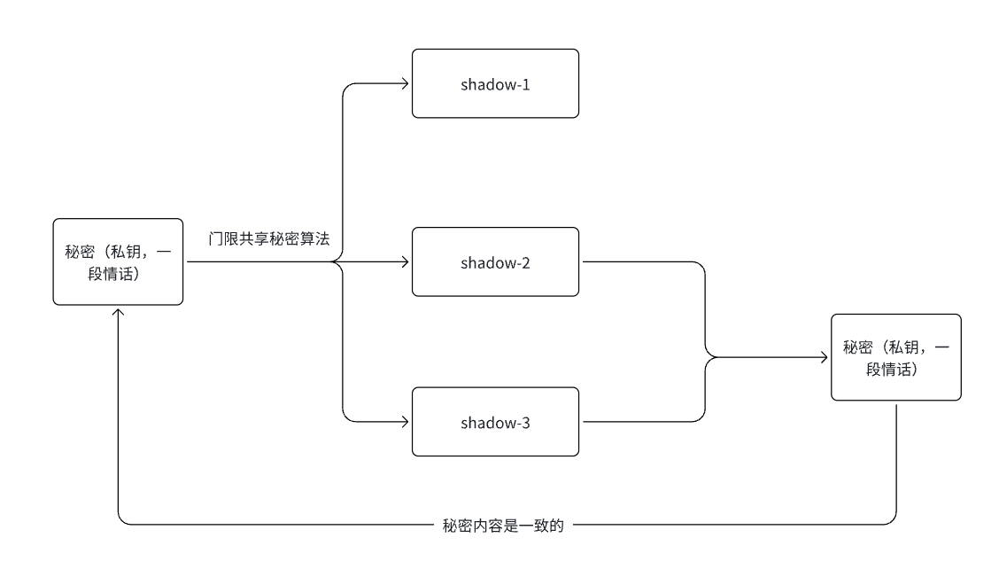
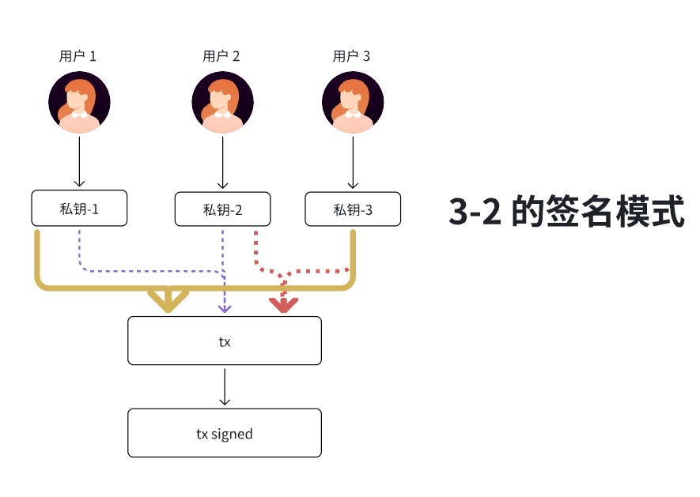

## 二. 区块链和密码学

密码学是区块的底层的依赖，区块链以密码学为基础构建的，没有密码学就无法实现区块链的逻辑，数字货币也叫加密货币。

### 1. Hash 函数

**哈希函数**，也称为单向散列函数或杂凑函数，是一种将任意长度输入数据（如文本、文件）转换为固定长度、唯一输出字符串（即哈希值）的密码学算法

**核心特性：**

- **单向性**（不可逆）：给定输入 X，可以轻松计算出其哈希值 H(X)。但无法从哈希值 H(X) 反向推导出原始输入 X。

- **碰撞性**：

  理论上：不同的输入应产生不同的哈希值。实际：由于输出长度固定，而输入无限，因此存在两个不同的输入（X 和 X'）产生相同哈希值（H(X) = H(X')）的可能性，这被称为“哈希碰撞”。

- **雪崩效应**：输入的任何一个微小的变动（哪怕只是一个比特），都会导致输出的哈希值产生巨大、不可预测的变化。

### 2. 对称加密和非对称加密

- 对称加密（单密钥加密）：

  (1) 加密密钥和解密密钥是同一把密钥

  (2) 常见密码学算法代表 AES,DES,3DES

- 非对称加密（公钥密码学）：

  密钥：加密密钥是公开的，称为公钥；解密密钥是需要保密的，称为私钥

  加解密过程：用公钥加密，私钥解密

  签名验签过程：用私钥签名，用公钥验签

  常用算法：RSA，

  ECC(几乎所有公链都是椭圆曲线算法)

  - ECDSA
    - Secp256k1
    - Secp256r1
  - EdDSA
    - ed25519
  - BLS 底层依赖椭圆曲线的点的映射
  - Schnnor

### 3. 门限共享和门限签名：

1. **门限共享**

将一个秘密拆分为 n 个份额（称为影子份额），并设置一个阈值 k（其中 n ≥ k），使得只需获取任意 k 个份额即可恢复原始秘密，而少于 k 个份额则无法获得任何秘密信息。



以上图为例子：我们将秘密拆分成 3 份(n = 3)， 分别是 shadow-1, shadow-2 和 shadow-3，设置 2 份可以恢复（k = 2）,  当我们需要恢复时候，我们只需要其中 2 份（可以是 shadow-1 和 shadow-2 组合，也可以是 shadow-1 和 shadow -3 的组合，也可以是 shadow-2 和 shadow-3 的组合）就可以恢复完整的秘密。

2. **门限签名**

我们一共有 n 个人，设置 k 个人签名交易有效（n >= k）, 当一笔交易通过 k 个签名之后就有效了



- 私钥-1 和私钥-2 签名交易有效
- 私钥-2 和私钥-3 签名交易有效
- 私钥-1 和私钥-3 签名交易有效

### 4. BLS 签名

BLS 基于椭圆曲线映射的算法，每一个参与方 G1 和 G2 Point 都会持有一个对BLS  公私钥,  BLS 里面也是门限签名机制。特点是支持签名聚合的数字签名方案，能将多个签名合并成一个，从而实现高效的批量验证。

#### （1）特点：

签名快，验证签名慢。

对比**ECDSA**：

| 签名方案  | 验证 N 个签名所需操作         | 特点                                                         |
| :-------- | :---------------------------- | :----------------------------------------------------------- |
| **ECDSA** | **需要验证 N 次**             | 每个签名都必须单独验证。验证时间随签名数量 **线性增长**。验证 1000 个签名，就需要做 1000 次独立的验签操作。 |
| **BLS**   | **只需要验证 1 次（聚合后）** | 无论有多少个签名，都可以聚合成一个单一的签名。验证这个聚合签名**只需要一次配对运算**（和单个验证的代价几乎一样）。验证时间**是常数**，不随 N 增加。 |

#### （2）BLS 聚合签名图解：


- **图解蓝色部分**

  - 一共四个参与对 message 进行签名，签名之后分别产生 signature-1,   signature-2,  signature-3 和  signature-4；  signature-1 是参与方-1 用自己的私钥签名得到,  signature-2 是 参与方-2 用自己的私钥签名得到,  依此类推。

  - 生成聚合签名

    - ```
      聚合签名 = signature-1 +  signature-2 + signature-3 +  signature-4
      ```

  - 参与方 1，2，3， 4 用户自己的公钥聚合成 apk 

    - ```
      apk(聚合公钥) = 参与方-1 的 pubkey-1(G1 Point)  + 参与方-2 的 pubkey-2(G1 Point) + 参与方-3 的 pubkey-3(G1 Point) + 参与方-4 的 pubkey-4(G1 Point)
      ```

  - 验证签名：由于聚合是 4 参与方签名，图中也是 4 个参与方，4-4 的签名模式，4 个参与方的聚合公钥验证4 个参与方的聚合签名。

- **图解绿色部分**

  - 虽然我们网络有 4 个参与方，但是只有参与方-1和参与方-2对消息进行签名， 参与方-1签名得到 sig-1, 参与方-2签名得到 sig-2

    - ```
      聚合签名 = sig-1 + sig-2
      ```

      这里聚合签名是 4-2

  - 网络中是有完整的聚合公钥(也就是蓝色部分聚合公钥)， 由于真实聚合签名只有`参与方-1` 和 `参与方-2` 参与签名, 所以验证聚合聚合也只能是`参与方-1` 和`参与方-2` 的聚合公钥。

    - ```
      聚合公钥 = 完整聚合公钥 - （参与方-3 的公钥 + 参与方-4 的公钥）
      ```

  - 使用聚合公钥对签名进行验证即可