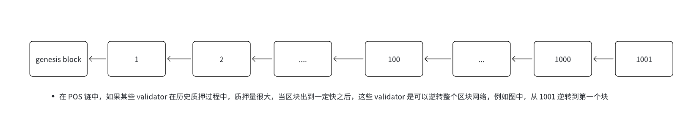
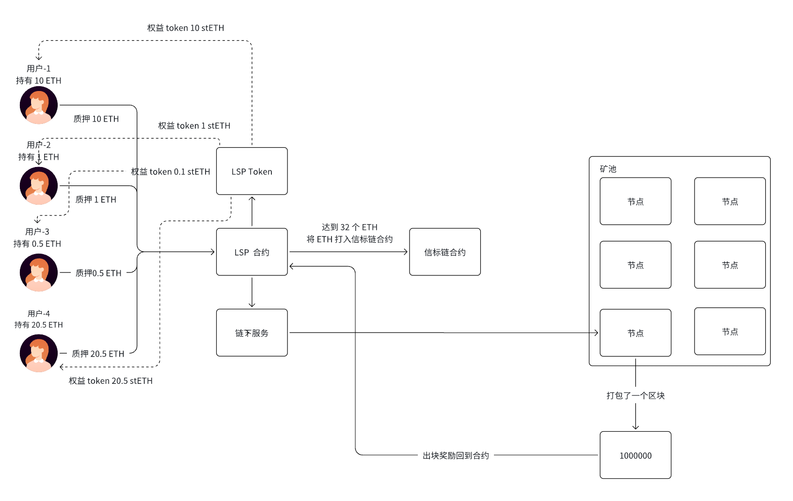

# 八. 以以太坊为角度细说区块链项目的整体架构

## 一. 内容提要

- 以太坊的发展过程
- ETH2.0 的介绍
- ETH 的 EVM 
- 以太坊的智能合约
- 以太坊生态项目分析

## 二. 以太坊的发展过程

### **1. 以太坊的起源（2013-2015）**

#### 1.1**维塔利克·布特林（Vitalik Buterin）提出以太坊**

2013 年，**比特币**（Bitcoin）已经成为全球最大的加密货币，但它主要作为点对点电子现金系统，缺乏可编程性。**Vitalik Buterin** 认为区块链不仅仅是支付工具，它可以作为**全球计算机**，支持复杂的应用逻辑。于是，他在 2013 年底发表了 **《以太坊白皮书》**（Ethereum Whitepaper），提出：

- **图灵完备的智能合约**（比特币的脚本语言不支持复杂计算）。
- **通用区块链平台**，可运行各种去中心化应用（DApps）。
- **以太坊虚拟机（EVM）**，支持智能合约执行。

#### **1.2 以太坊 ICO 募资（2014）**

- 2014 年 7 月，以太坊团队发起了**首次代币发行（ICO）**，通过比特币众筹，筹集了 **3.1 万 BTC**（当时价值约 **1800 万美元**）。
-  以太坊采用 **PoW（工作量证明）** 作为共识机制，并计划后续升级为 **PoS（权益证明）**。

#### **1.3 以太坊创世区块（2015 年 7 月 30 日）**

- 2015 年 7 月 30 日，以太坊**创世区块（Genesis Block）** 诞生，主网正式上线，代号 **Frontier**。
- 开发者开始部署智能合约，探索以太坊的去中心化应用（DApps）潜力。

### **2. 早期发展与 The DAO 事件（2016）**

- **Homestead（2016 年 3 月）:** 以太坊完成首个硬分叉升级 **Homestead**，增强网络稳定性，为更复杂的 DApp 打下基础。

- **The DAO 事件 以太坊分裂:**  **The DAO（去中心化自治组织）** 是 2016 年以太坊上最大的智能合约众筹项目，筹集了 **1.5 亿美元** 的 ETH 资金。但 2016 年 6 月，**黑客利用智能合约漏洞**盗取了约 **5000 万美元**的 ETH。

-  以太坊社区陷入分歧：
  - **支持回滚交易**（软分叉+硬分叉）：Vitalik Buterin 提议通过硬分叉将被盗资金还给投资者。
  -  **坚持不可篡改性**（反对回滚）：一部分开发者认为区块链不可逆，拒绝分叉。

- 最终，以太坊硬分叉成两个区块链：
  -  **Ethereum（ETH）**：恢复被盗资金，继续发展。
  -  **Ethereum Classic（ETC）**：保留原链，不篡改历史。

### 3. **以太坊生态爆发（2017-2020）**

#### 3.1 **以太坊与 ICO 热潮（2017）**

2017 年，以太坊成为**全球 ICO（首次代币发行）** 的首选平台：

- ERC-20 代币标准被广泛采用，项目方可以快速发行代币。
- **DeFi（去中心化金融）** 开始萌芽，MakerDAO 发行 DAI 稳定币。
- 以太坊价格从 **10 美元** 飙升至 **1400 美元**（2018 年 1 月）。

但 ICO 泡沫导致：

- 许多项目欺诈或失败，市场信任度下降。
- 以太坊网络拥堵，Gas 费上涨。

#### **3.2 以太坊网络扩容压力（2018-2019）**

-  由于 ICO、DApps 活跃，以太坊面临交易确认延迟、Gas 费高昂问题。
-  2018 年底，**熊市来临**，ETH 价格跌至 **90 美元**。

#### **3.3 Ethereum 1.x 过渡与 Istanbul（2019）**

- 以太坊进行 **Istanbul 硬分叉**，优化 Gas 费用、提升安全性，为 Layer2 方案（如 zk-Rollup）做准备。

### **4. DeFi、NFT 与 Layer2 时代（2020-2021）**

#### **4.1 DeFi Summer（2020）**

-  2020 年，DeFi 进入**爆发期**：
  - **Uniswap**：去中心化交易所（DEX）。
  -  **Aave、Compound**：去中心化借贷平台。
  -  **Yearn Finance**：自动化收益聚合器。
-  **以太坊 Gas 费飙升**，用户开始寻求 Layer2 解决方案，如 **Optimistic Rollup** 和 **zk-Rollup**。

#### **4.2NFT 热潮（2021）**

- 以太坊成为 **NFT（非同质化代币）** 主要平台，推动艺术、游戏、音乐行业数字化：
- **OpenSea** 成为最大 NFT 市场。
- **Axie Infinity** 和 **Decentraland** 引领 GameFi（区块链游戏）。

但问题依然存在：

- 交易费用高昂（Gas 费达到 100 美元以上）。
- 交易确认时间长，导致用户体验下降。

### **5. 以太坊 2.0 与 PoS 时代（2022-2023）**

#### **5.1 以太坊合并（The Merge, 2022）**

-  **2022 年 9 月 15 日**，以太坊完成 **The Merge**，正式从 **PoW（工作量证明）** 切换到 **PoS（权益证明）**：
-  以太坊主网与信标链（Beacon Chain）合并，**能耗降低 99.95%**。
- 取消矿工奖励，ETH 发行量减少，开启**通缩时代**。

#### **5.2 Shanghai 升级（2023）**

- 2023 年 4 月，以太坊进行 **Shanghai 升级**：
- 允许用户**提现质押的 ETH**，进一步增强 PoS 经济模型。
- LSD/LST/LSP 
- EigenLayer: 重新质押协议，AVS 主动验证

#### **5.3 Layer2 和 Layer3 生态崛起**

- **Arbitrum、Optimism**：成为最主要的 Layer2 解决方案。
- **zkEVM（ZK 以太坊虚拟机）** 发展迅速，如 
  - Polygon zkEVM、
  - Scroll
  - Linea
  - ZkSyncEra
- 技术框架
  - OpStack
    - Base
    - Blast
    - Mantle
    - Manta
  - Polygon CDK
    - X-Layer
  - 基于 Arbi Obit 构建 Layer3
  - Zklink
  - DappLink

## 三. ETH2.0

ETH2.0 由信标链和执行客户端组成，信标链负责共识过程，执行客户端负责交易执行，信标链和执行客户端之间通过 engine-api 进行通信；一般执行客户端为 reth 和 geth

EVM: 以太坊虚拟机，用于执行职能合约


### 1. 以太坊里面的区块组织结构


区块里面也是由区块头和区块体组成， 使用以下接口可以获取到 Ethereum 的区块信息

```sql
curl --location 'https://1rpc.io/eth' \
--header 'Content-Type: application/json' \
--data '{
    "jsonrpc":"2.0",
    "method":"eth_getBlockByNumber",
    "params":["0x153be83", true],
    "id":83
}'
```

- Block Head
  - Hash
  - ParentHash
  - Stateroot
  - TransactionRoot
  - TransactionRecepitRoot
  - Gaslimit
  - TimeStamp
- Block Body
  - Tx List

### 2. 以太坊的三棵树

#### 2.1 以太坊和区块链数据结构区别

| 特性             | 比特币                       | 以太坊                          | 核心区别                                                     |
| :--------------- | :--------------------------- | :------------------------------ | :----------------------------------------------------------- |
| **主要账户模型** | **UTXO 模型（交易账本）**    | **账户模型（状态机）**          | 哲学基础不同                                                 |
| **核心数据结构** | 单一的 Merkle 树             | 三棵 Merkle Patricia Trie       | 复杂度不同                                                   |
| **交易完整性**   | **Merkle Root**（在区块头）  | **TransactionRoot**（在区块头） | 目的相似，数据结构不同                                       |
| **执行结果证明** | **无**                       | **ReceiptRoot**（在区块头）     | 以太坊独有，用于证明事件和Gas消耗                            |
| **全局状态**     | **无**。只有UTXO集合的快照。 | **StateRoot**（在区块头）       | **最根本的区别**。以太坊的每个区块都“知道”整个世界的当前状态。 |

#### 2.2 以太坊的三棵MPT树

- **（1）TransactionRoot**: 一个区块里面交易的 merkle 树根
  - **类比**：这**直接对应**于比特币的Merkle Root。
  - **内容**：由该区块中所有交易构建的 Merkle Patricia Trie 的根哈希。
  - **作用**：
    - 提供该区块所有交易的承诺。
    - 轻节点可以快速验证某笔交易是否存在于区块中。
  - **与比特币的区别**：虽然目的相同，但使用的数据结构是更复杂的 Merkle Patricia Trie 而不是简单的二叉 Merkle 树，这主要是为了能高效地生成和验证证明。
- **（2）TransactionRecepitRoot**（收据树根）：一个区块里面所有交易收据的 merkle 树根
  - **概念**：这是以太坊的**新发明**，比特币中没有对应物。
  - **内容**：由该区块中所有交易的**执行结果（收据）** 构建的 Merkle Patricia Trie 的根哈希。交易收据包含诸如：
    - 交易执行后消耗的 Gas。
    - 交易执行过程中产生的日志（Logs，对智能合约开发至关重要）。
    - 交易执行状态（成功或失败）。
  - **作用**：
    - 提供交易**执行效果**的承诺，而不仅仅是交易本身。
    - 允许外部系统（如去中心化应用 DApps）或轻客户端，通过 Merkle 证明来验证某个特定事件（如代币转账）是否在链上发生。这是通过验证日志的存在来实现的。
- **（3）stateroo**t: 全局状态状态，由于区块里面有交易，都会发生状态的变更，故而每个区块的状态根都不一致

- **概念**：这是以太坊作为“世界计算机”的**核心**，是它与比特币最根本的区别。
- **内容**：由**全球所有账户的当前状态**构建的 Merkle Patricia Trie 的根哈希。这个“状态”包括：
  - **外部账户**：地址、余额、Nonce。
  - **合约账户**：地址、余额、Nonce、代码哈希、存储根哈希。
- **关键特性**：
  - **全局性**：StateRoot 不代表单个区块的内容，它代表了截至该区块为止，整个以太坊网络的**全局状态**。
  - **动态更新**：每个区块被执行后，由于交易改变了账户余额或合约存储，状态都会发生变化，从而生成一个新的 StateRoot 并记录在下一个区块的头部。
- **作用**：
  - 任何人都可以基于一个已知的 StateRoot，验证某个账户在特定时间点的状态（例如，“在区块高度 1000 时，地址 A 的余额是 5 ETH”）。
  - 它是“状态机”转换的锚点。从父块的 StateRoot 转换到当前块的 StateRoot，证明了状态转换的正确执行。


### 3. 以太坊出块流程

信标链的共识算法是 POS

- 每启动一个 validator 需要质押 32 ETH，质押范围 32-2048 ETH，这里的 validator 就代表矿工，质押完成之后 validator 就可以参与整个网络的区块提议和区块投票。

  

- Epoch:  Ethereum 里面一个质押周期就是一个 epoch，一个 epoch 包含 32 个slot

- Slot:  每 12 秒出一个 slot, slot 是用来装载区块的，一个slot装一个区块

- Block：block 放在 slot, 如果在一次 slot 里面以太坊没有出块，那么 slot 就是空

#### 3.1 长程攻击



- checkpoint: 检查点来避免整个长程攻击,  以以太坊为例
  - 每一个 epoch 有一个检查点
  - 当过一个 checkpoint,  在这个检查点之前的区块全部是 safe
  - 当过了两个 checkpoint 之后，在这两个检查点之前区块都变成了Finalized


- 当达到 checkpoint-2 时，checkpoint-1 之前的区块都变成 safe
- 当到达 checkpoint-3 的是，checkpoint-1 之前的区块都变成 Finalized,  checkpoint-1 到 checkpoint-2 之间的区块是 safe
- 回滚 finalized 难度是极大的，几乎不可能, 避免长程攻击。

### 4. 32-2048 ETH 问题

- LSD/LST/LSP 产品思路
  - 很多人的手上持有的 ETH 数量极大可能是低于 32 个 ETH，这样很多人都无法参与以太坊质押收益，lido 横空出世。
  - 将散户 ETH 收集起来，再去启动节点进行质押给信标链，再去启动节点参与网络共识
- 图解 LSD/LST/LSP 产品



## 四. Ethereum 虚拟机

### 1. EVM 虚拟机的结构


### 2. 一笔交易在 Ethereum 里面的生命周期

- **交易创建**：用户通过钱包或应用程序构建一笔交易，交易内容包括：
  - `nonce`：发送方地址已发交易的数量，用于防止重放攻击。
  - `gasPrice`：愿意为单位Gas支付的费用（在EIP-1559之后，可能包括基础费和小费）。
  - `gasLimit`：愿意为执行该交易支付的最大Gas数量。
  - `to`：接收方地址（如果是合约创建，则为空）。
  - `value`：要发送的以太币数量。
  - `data`：如果是合约调用，则包含调用数据；如果是合约创建，则包含初始化代码。
  - `chainId`：链标识，防止跨链重放攻击。
  
- **交易签名**：使用发送方的私钥对交易进行签名，以证明交易确实由发送方授权。签名后的交易包括`v, r, s`签名值。

- **交易广播**：将签名后的交易广播到以太坊网络，通常通过连接的一个或多个节点传播到整个网络。

- **交易验证**：将交易发送到以太坊网络，网络中的节点（验证者）收到交易后，会进行验证，包括：
  - nonce 校验
  - 检查发送方余额是否足够支付交易费用（gasLimit * gasPrice + value）
  - 检查gasLimit是否大于等于交易所需的基础Gas
  - 手续校验
  - 签名验证
  
- **交易进入交易池**：验证通过的交易会被放入节点的交易池（mempool）中，等待被打包进区块。矿工（验证者）会根据Gas价格和其他策略选择交易打包。

- **交易执行**：
  
  运行以太坊虚拟机（EVM）来处理交易:
  
  - **预扣费用**：从发送方账户扣除预交的交易费用（gasLimit * gasPrice）。
  
  - 交易进入 EVM 里面进行，按照 Op-Code 执行实施，据交易类型（转账或合约调用）执行相应操作。
  - 在执行过程中，每执行一个操作都会消耗Gas，如果Gas耗尽则执行回滚（但已消耗的Gas不会退回）。
  - 如果执行成功，则扣除实际消耗的Gas费用，并将剩余Gas按gasPrice退还给发送方（在EIP-1559中，基础费会被燃烧，只退还小费部分）。
  
  信标链:
  
  - 通过 newPayload 生成数据
  - getPayLoad 获取到执行的区块数据，提议者对区块进行投票，投票通过之后调用 updateForce 将区块插入链，区块的状态初始化状态
  
- **区块传播与验证**：矿工将打包的区块广播给其他节点，其他节点会验证区块中的每一笔交易，包括重新执行交易以确保状态变更正确。

- **最终确认**：区块状态变更流程
  - 当过一次检查点(一个 epoch（32个slot))，区块状态从初始化状态变成 safe
  - 当过了两个检查点，区块状态从 safe 变成 Finalized, 变成 Finalized 的区块状态就不可逆(回滚 finalized 难度是极大的，几乎不可能)了
  - 交易执行导致的世界状态变更（如账户余额变化、合约存储更新等）被永久记录在区块链上。

## 五. Ethereum 的生态项目

应用层

- Defi（首次出现 Ethereum）
  - 去中心化交易所
    - UniSwap
    - PanCake
    - Izumi
  - 质押借贷
    - Aave
    - Compound
  - NFT 
    - OpenSea
  - 重新质押
    - Eigenlayer
    - Symbiotic
  - LSD 
    - Lido
    - BinaceLsd
    - Swell
    - AnkrEth
    - mEth
  - 去中心化衍生品（Cosmos 应用链）
    - Apex
    - Dydx

基础设施

- 跨链（首次出现在 Cosmos 生态）
  - 跨链桥
    - Layerzero
    - Orbit
    - 虫洞
  - 跨链互操作协议
    - ChainLink CCIP
    - DappLink CCIP 
- Layer2 
  - Op rollup
    - Op---->基于 OpStack: Base, mantle, Manta, HashkeyChain 等等
    - Arbi----> 基于 Orbit
  - Zk rollup
    - Scroll
    - PolygonZkEvm
    - PolygonZkVm
    - ZksyncEra
    - Lina
    - Starknet
- Layer3
  - Zklink
  - DappLink 
- DA
  - EigenDA
  - EIP4844
- AVS 
  - Einglayer
  - Symbiotic