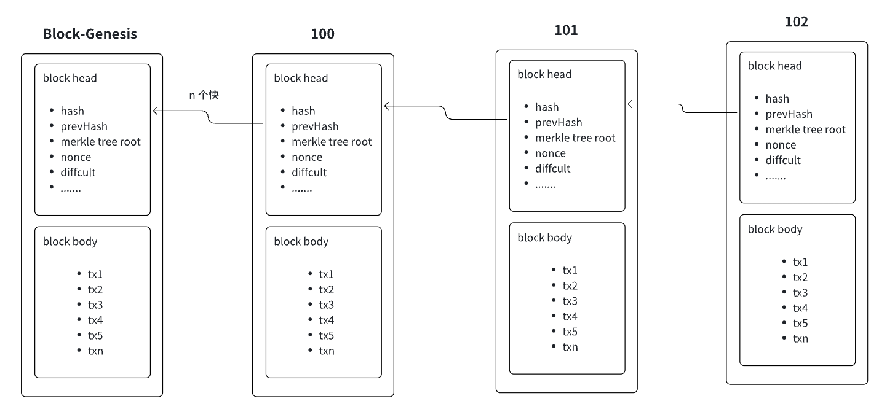
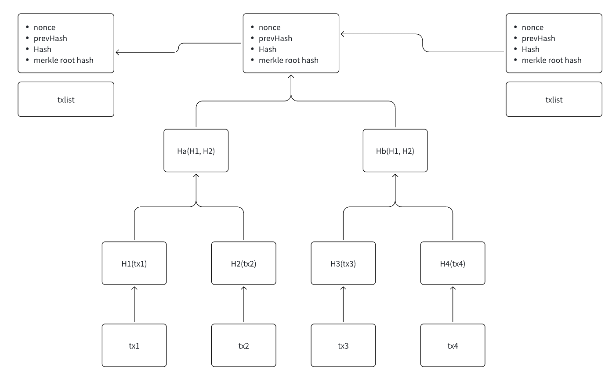
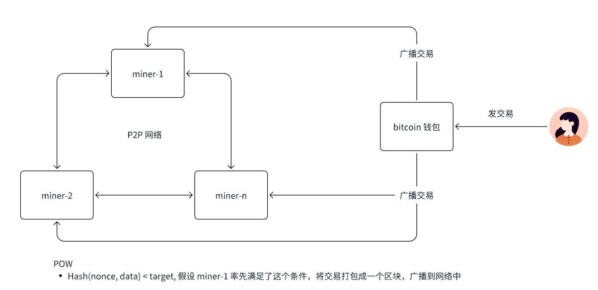
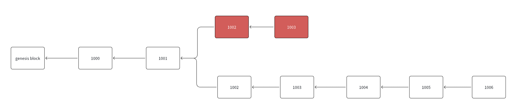
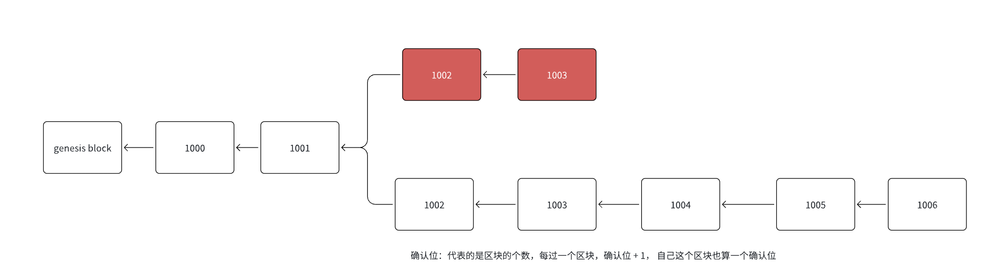
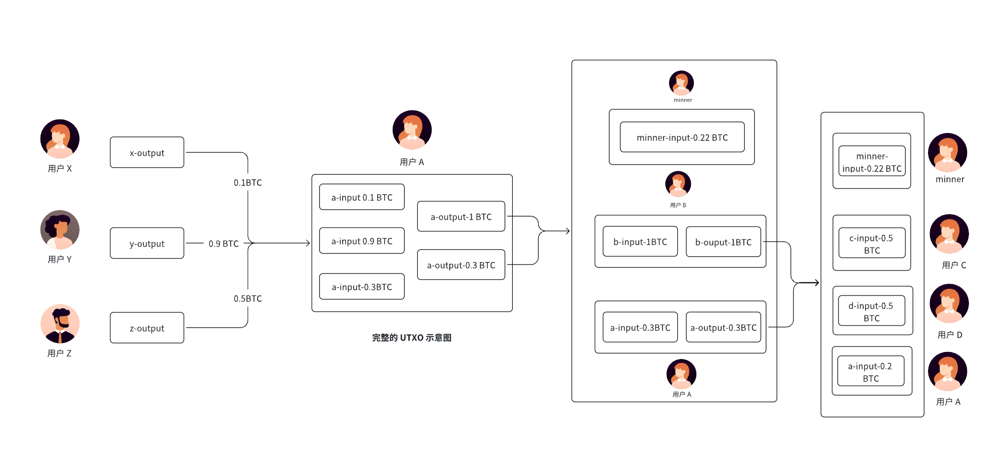
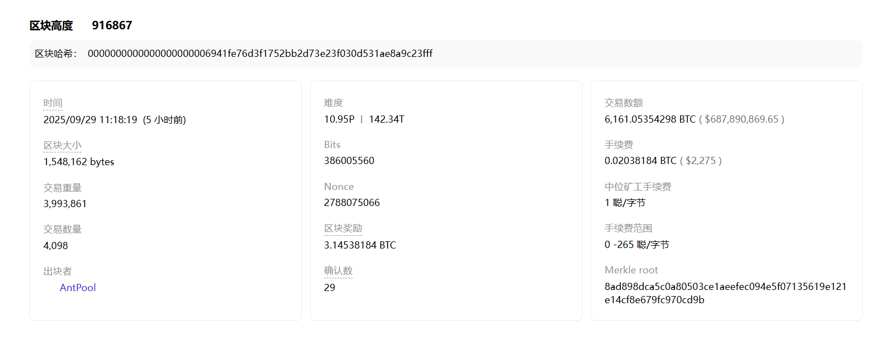
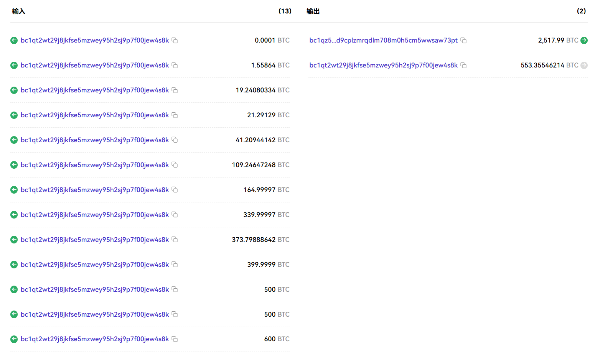

# 七. 以比特币为角度细说区块链项目的整体架构

## 一.内容提要

- 比特币的基本介绍
- Bitcoin 的数据结构
- Bitcoin 共识算法
- Bitcoin 挖矿相关概念
- UTXO 模型
- 比特地址，版本迭代过程
- 比特币的脚本编程
- Taproot 升级
- 比特生态的项目

## 二.Bitcoin 基本介绍

08 年的金融危机，中心金融，美元崩塌会导致全球经济崩溃，全球的国家为美国的经济买单；比特币全球流通性，资产去中心化发行，强调去中心化性和全球性，不会因为局部经济崩塌而崩溃，比特币崩溃全球经济才会崩溃；数字来取代传统金融，提高资产主权和全球性经济问题。

比特币是第一个区块项目，也是目前为止去中心化程度最高，市值，受欢迎程度最高公链和数字货币，甚至已经成为全球各国央行的储备货币。

Bitccoin **具备银行功能**

- 银行的资产发行在比特币是怎么做，比特币通过 POW 来挖矿铸币
- Bitcoin 通过侧链/BRC20/铭文/符文协议，发行数字货币

Bitcoin **具备法币的属性**

- 法币具备支付功能，比特币也是具备支付功能
- 法币具备投资，比特币也具备投资

Bitcoin **具备法币不具备的功能**，有自己的特性

- **去中心化属性**，银行发行代币，去中心，只有银行自己可以发行；比特币是去中心化，任何参与比特挖矿人都可以获得比特币
- **不可篡改**
- 法币可以无限发行，比特币是不可以无限发行，它是由上限，上限 2100 万枚
- **可追溯性**，任何都可以追溯比特代币发行，交易等，但是银行不具备可追溯性

Bitcoin 比起**中心化的金融机构**，比特币更强调

- **价值主权/资产主权**： 资产控制在掌握私钥的人手里面
- **数据主权**：比特币具备隐私性，没有和 KYC，钱包地址并没有和人进行绑定，资产无法对应实体，更强调隐私属性，UTXO 和 schnnor 使得比特币的隐私性更强
- **全球流通性**：比特币强调全球流通性； 美元，人民币，泰铢更多的是本地流通性
- **金融效率**问题：拿着在美国可以花费，在中国可以花费，拿着泰铢只能泰国消费，来中国肯定需要换成人民币。

## 三.Bitcoin 的数据结构

### 1. Bitcoin 的基本的区块结构

- Genesis Block: 创始块，链启动的时候生成的第一个块

### 2. 区块的产生流程

### 3. 比特币解决区块分叉的问题

- 比特币遵循最长链原则，短的链会被丢弃，分叉的区块是没有奖励的

### 4. 确认位

## 四.Bitcoin 的共识算法

POW 挖矿流程

- 找 nonce, 满足 Hash(nonce,  data) < target, 率先找到满足条件的 nonce 节点具备出块的权利
- 找到满足条件的 nonce 之后呢，立即生成该区块并广播给其他节点
- 打包区块的节点会获得奖励
  - 打包的奖励（挖矿奖励），每一区块里面第一笔就是挖矿奖励（coinbase 交易）
  - 区块里面的交易手续费奖励

找 nonce, 满足 Hash(nonce,  data) < target

- target: 挖矿的目标值，越小代表挖矿难度越大
- Hash 算法是一个 Sha256 算法

挖矿难度问题

- 每过 2016 个块，会进行一次难度调整，按照每 10 分钟出一个块的话，每次调整大约是两周
- new_diffcult = old_diffcult * (target_time/ actual_time )
- 出块时间控制在 10 分钟左右，保证区块不会发生分叉丢失

Bitcoin 的总量 2100 万枚，每隔 21 万个块会发生一次减半

- 50
- 50 / 2
- 50 / 4
- 50 / 8
- 50 / n

减半的公式：50 (1/2 + 1/4 + 1/8 + ... + 1/n) = 2100万

## 五. Bitcoin 挖矿相关的概念

- 节点
  - 全节点：拥有全量的数据的节点
  - 轻节点：区块头的数据
- 矿工：去找出 nonce 值得出 hash(nonce + data) < target
- 矿池：所有的矿工节点组成的一个集合
- 矿机：专用于 Bitcoin 的挖矿机器， 专用 CPU 或者 GPU 

## 六. UTXO账户模型

当矿工/或者普通持有比特币，他们需要去转帐，把钱转给别人，接收别人转钱给他，在传统银行里面，也有转账的整个操作。

- 传统银行
  - Source: 出资账户
  - Dest: 接收资金账户
  - Amount: 转账的金额
  - Fee: 转账银行要收取手续费, 也有可能 0 收费转账
- 在区块世界里面，有两种模式，一种和传统银行是类似（账户模型，eth），另一个是和传统银行模式完全不一致（UTXO）

我们**比特币**使用模式和传统银行完全不一样，**使用 UTXO**；

UTXO（为花费的输入输出）： A 向用户 B 转账

- **A 以前的未花费输出（UTXO）**：假设 A 有 3 个未花费输出，总余额为 1.4 BTC：

  - UTXO-1: 0.1 BTC
  - UTXO-2: 0.9 BTC
  - UTXO-3: 0.5 BTC

- **A 向 B 转账 1 BTC**，并支付手续费 0.1 BTC。

  - 总输入：0.1 + 0.9 + 0.5 = 1.4 BTC
  - 总输出：给 B 的 1 BTC + 找零给 A 的金额
  - 手续费：0.1 BTC（由输入输出差决定）

- **交易过程**：

  - A 需要消耗所有三个 UTXO 作为输入（因为单个 UTXO 可能不足，或者为了整合资金）。
  - 输出包括：
    - 给 B 的输出：1 BTC（这是一个新的 UTXO，归属 B 的地址）
    - 找零给 A 的输出：0.3 BTC（这是一个新的 UTXO，归属 A 的地址）
  - 手续费计算：输入总和 (1.4 BTC) - 输出总和 (1 BTC + 0.3 BTC) = 0.1 BTC，这笔手续费会被矿工在打包交易时获取。

- **交易完成后**：

  - B 地址有一个新的 UTXO，价值 1 BTC。
  - A 地址有一个新的 UTXO，价值 0.3 BTC（找零）。
  - 矿工获得了 0.1 BTC 的手续费。

  | 交易输入 (Inputs)                       | 交易输出 (Outputs)               |
  | :-------------------------------------- | :------------------------------- |
  | Input-1: 0.1 BTC (来自 A)               | Output1: 1 BTC (到 B 地址)       |
  | Input-2: 0.9 BTC (来自 A)               | Output2: 0.3 BTC (找零到 A 地址) |
  | Input-3: 0.5 BTC (来自 A)               |                                  |
  | **输入总和: 1.4 BTC**                   | **输出总和: 1.3 BTC**            |
  | **手续费: 0.1 BTC** (1.4 BTC - 1.3 BTC) |                                  |

- UTXO 过程图解

**转账的过程**

- Input 是收入，没有花费掉的
- Output 输出，是已经花费掉了
- 在比特币里面可以多对一，一对多，多对多的转账模式
- 当一个地址上有多个 Input 的时候，可以选择消费其中的任意一个或者任意几个，或者全部都可以
- 对于一个地址来说，所有的 input 的金额加起来减去所有的 output 加起来的值就是该地址的余额

**实际交易截图**

