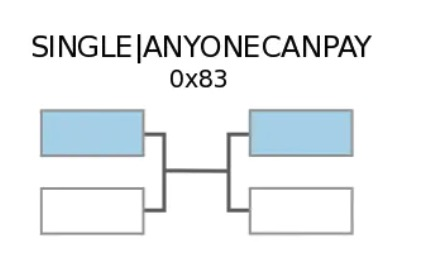

# （七）. 以比特币为角度细说区块链项目的整体架构

## 一. 内容提要

- 比特币的基本介绍
- Bitcoin 的数据结构
- Bitcoin 共识算法
- Bitcoin 挖矿相关概念
- UTXO 模型
- 比特地址，版本迭代过程
- 比特币的脚本编程
- Taproot 升级
- 比特生态的项目


## 二. Bitcoin 基本介绍

08 年的金融危机，中心金融，美元崩塌会导致全球经济崩溃，全球的国家为美国的经济买单；比特币全球流通性，资产去中心化发行，强调去中心化性和全球性，不会因为局部经济崩塌而崩溃，比特币崩溃全球经济才会崩溃；数字来取代传统金融，提高资产主权和全球性经济问题。

比特币是第一个区块项目，也是目前为止去中心化程度最高，市值，受欢迎程度最高公链和数字货币，甚至已经成为全球各国央行的储备货币。

Bitccoin **具备银行功能**

- 银行的资产发行在比特币是怎么做，比特币通过 POW 来挖矿铸币
- Bitcoin 通过侧链/BRC20/铭文/符文协议，发行数字货币

Bitcoin **具备法币的属性**

- 法币具备支付功能，比特币也是具备支付功能
- 法币具备投资，比特币也具备投资

Bitcoin **具备法币不具备的功能**，有自己的特性

- **去中心化属性**，银行发行代币，去中心，只有银行自己可以发行；比特币是去中心化，任何参与比特挖矿人都可以获得比特币
- **不可篡改**
- 法币可以无限发行，比特币是不可以无限发行，它是由上限，上限 2100 万枚
- **可追溯性**，任何都可以追溯比特代币发行，交易等，但是银行不具备可追溯性

Bitcoin 比起**中心化的金融机构**，比特币更强调

- **价值主权/资产主权**： 资产控制在掌握私钥的人手里面
- **数据主权**：比特币具备隐私性，没有和 KYC，钱包地址并没有和人进行绑定，资产无法对应实体，更强调隐私属性，UTXO 和 schnnor 使得比特币的隐私性更强
- **全球流通性**：比特币强调全球流通性； 美元，人民币，泰铢更多的是本地流通性
- **金融效率**问题：拿着在美国可以花费，在中国可以花费，拿着泰铢只能泰国消费，来中国肯定需要换成人民币。

## 三. Bitcoin 的数据结构

### 1. Bitcoin 的基本的区块结构


- Genesis Block: 创始块，链启动的时候生成的第一个块


### 2. 区块的产生流程


### 3. 比特币解决区块分叉的问题


- 比特币遵循最长链原则，短的链会被丢弃，分叉的区块是没有奖励的

### 4. 确认位


## 四. Bitcoin 的共识算法

POW 挖矿流程

- 找 nonce, 满足 Hash(nonce,  data) < target, 率先找到满足条件的 nonce 节点具备出块的权利
- 找到满足条件的 nonce 之后呢，立即生成该区块并广播给其他节点
- 打包区块的节点会获得奖励
  - 打包的奖励（挖矿奖励），每一区块里面第一笔就是挖矿奖励（coinbase 交易）
  - 区块里面的交易手续费奖励

找 nonce, 满足 Hash(nonce,  data) < target

- target: 挖矿的目标值，越小代表挖矿难度越大
- Hash 算法是一个 Sha256 算法

挖矿难度问题

- 每过 2016 个块，会进行一次难度调整，按照每 10 分钟出一个块的话，每次调整大约是两周

- new_target = old_target * (actual_time / target_time)

  new_difficulty = target_before  /  new_target

- 出块时间控制在 10 分钟左右，保证区块不会发生分叉丢失

Bitcoin 的总量 2100 万枚，每隔 21 万个块会发生一次减半

- 50
- 50 / 2
- 50 / 4
- 50 / 8
- 50 / n

减半的公式：50 (1/2 + 1/4 + 1/8 + ... + 1/n) = 2100万


## 五. Bitcoin 挖矿相关的概念

- 节点
  - 全节点：拥有全量的数据的节点
  - 轻节点：区块头的数据
- 矿工：去找出 nonce 值得出 hash(nonce + data) < target
- 矿池：所有的矿工节点组成的一个集合
- 矿机：专用于 Bitcoin 的挖矿机器， 专用 CPU 或者 GPU 


## 六. UTXO账户模型

当矿工/或者普通持有比特币，他们需要去转帐，把钱转给别人，接收别人转钱给他，在传统银行里面，也有转账的整个操作。

- 传统银行
  - Source: 出资账户
  - Dest: 接收资金账户
  - Amount: 转账的金额
  - Fee: 转账银行要收取手续费, 也有可能 0 收费转账
- 在区块世界里面，有两种模式，一种和传统银行是类似（账户模型，eth），另一个是和传统银行模式完全不一致（UTXO）

我们**比特币**使用模式和传统银行完全不一样，**使用 UTXO**；

UTXO（为花费的输入输出）： A 向用户 B 转账

- **A 以前的未花费输出（UTXO）**：假设 A 有 3 个未花费输出，总余额为 1.4 BTC：

  - UTXO-1: 0.1 BTC
  - UTXO-2: 0.9 BTC
  - UTXO-3: 0.5 BTC

- **A 向 B 转账 1 BTC**，并支付手续费 0.1 BTC。

  - 总输入：0.1 + 0.9 + 0.5 = 1.4 BTC
  - 总输出：给 B 的 1 BTC + 找零给 A 的金额
  - 手续费：0.1 BTC（由输入输出差决定）

- **交易过程**：

  - A 需要消耗所有三个 UTXO 作为输入（因为单个 UTXO 可能不足，或者为了整合资金）。
  - 输出包括：
    - 给 B 的输出：1 BTC（这是一个新的 UTXO，归属 B 的地址）
    - 找零给 A 的输出：0.3 BTC（这是一个新的 UTXO，归属 A 的地址）
  - 手续费计算：输入总和 (1.4 BTC) - 输出总和 (1 BTC + 0.3 BTC) = 0.1 BTC，这笔手续费会被矿工在打包交易时获取。

- **交易完成后**：

  - B 地址有一个新的 UTXO，价值 1 BTC。
  - A 地址有一个新的 UTXO，价值 0.3 BTC（找零）。
  - 矿工获得了 0.1 BTC 的手续费。

  | 交易输入 (Inputs)                       | 交易输出 (Outputs)               |
  | :-------------------------------------- | :------------------------------- |
  | Input-1: 0.1 BTC (来自 A)               | Output1: 1 BTC (到 B 地址)       |
  | Input-2: 0.9 BTC (来自 A)               | Output2: 0.3 BTC (找零到 A 地址) |
  | Input-3: 0.5 BTC (来自 A)               |                                  |
  | **输入总和: 1.4 BTC**                   | **输出总和: 1.3 BTC**            |
  | **手续费: 0.1 BTC** (1.4 BTC - 1.3 BTC) |                                  |

- UTXO 过程图解


**转账的过程**

- Input 是收入，没有花费掉的
- Output 输出，是已经花费掉了
- 在比特币里面可以多对一，一对多，多对多的转账模式
- 当一个地址上有多个 Input 的时候，可以选择消费其中的任意一个或者任意几个，或者全部都可以
- 对于一个地址来说，所有的 input 的金额加起来减去所有的 output 加起来的值就是该地址的余额

**实际交易截图**


## 七. 比特币的版本迭代过程

### 1. 版本迭代

比特币自 2009 年发布以来，经历了多次重要升级。这些升级旨在提高比特币网络的安全性、效率和功能性。

并且比特币的 Taproot 升级给比特币带来更多的可能性，Taproot 升级带动了 BRC20 和 Bitcoin-Layer2 的发展，这里我们不再做过多的介绍，在未来的 Layer2. 的课程中我们会深入讲解这部分的内容

**P2SH（Pay-to-Script-Hash）**

💡💡时间：2012年

💡💡BIP（Bitcoin Improvement Proposal）：BIP-0016

💡💡内容：允许更复杂的交易脚本，**支持多重签名地址**。这种升级使得比特币交易更加灵活和安全

**比特币改进提案 BIP 66**

💡💡时间：2015年

💡💡BIP：BIP-0066

💡💡内容：规范了交易中 DER 格式的签名，解决了**交易签名的一致性**问题，增强了网络的安全性。

**CheckSequenceVerify（CSV）**

💡💡时间：2016年

💡💡BIP：BIP-0112

💡💡内容：**增加了相对时间锁功能**，使得交易可以在指定的时间或块高度之后才生效，这为更复杂的支付通道铺平了道路。

**Segregated Witness（SegWit）**

💡💡时间：2017年

💡💡BIP：BIP-0141, BIP-0143, BIP-0144

💡💡内容：**分离交易签名数据**，**提高了区块的有效容量**，减小了交易体积，降低了交易费用。还解决了交易的可塑性问题，**使得闪电网络等侧链解决方案**成为可能。

**隔离见证2x（SegWit2x）**

💡💡时间：2017年

💡💡内容：这次升级是对 SegWit 的后续提案，旨在进一步增加区块大小。然而，由于社区共识未达成，这次升级最终未能实现。

**Taproot**

💡💡时间：2021年

💡💡BIP：BIP-0340, BIP-0341, BIP-0342

💡💡内容：引入了 **Schnorr 签名和默克尔化抽象语法树**（MAST），**增强了隐私性和执行脚本验证**的功能，进一步提高了交易的灵活性和效率。这是自2017年 SegWit 以来**最重要的一次升级**。

**（1）MAST（Merkelized Abstract Syntax Trees）**

💡💡时间：2021年

💡💡BIP：作为 Taproot 的一部分

💡💡内容：**允许将多种条件的智能合约合并为一个**，使得只有满足条件的部分才被公开，**提高了隐私性和效率**。

**（2）Schnorr Signatures**

💡💡时间：2021年

💡💡BIP：作为 Taproot 的一部分

💡💡内容：提供了一种更高效和安全的签名算法，**允许多重签名聚合**，提高了**交易的隐私性**和可扩展性


### 2. 地址格式

Bitcoin 钱包地址有几种不同的类型，每种类型都有其特定的用途和特点。主要的几种类型包括：

- P2PKH（Pay-to-PubKeyHash）地址：

  - 格式：以 1 开头，例如，1A1zP1eP5QGefi2DMPTfTL5SLmv7DivfNa。
  - 特点：这是最传统和最常见的地址类型，广泛用于比特币的早期交易。
  - 优点：兼容性好，几乎所有钱包和交易所都支持。
  - 缺点：随着时间的推移，这种地址类型的使用效率较低，交易费用可能会较高。

- P2SH（Pay-to-Script-Hash）地址：

  - 格式：以 3 开头，例如，3J98t1WpEZ73CNmQviecrnyiWrnqRhWNLy。
  - 特点：这种地址允许更复杂的交易脚本，例如多重签名地址。
  - 优点：支持更复杂的交易和脚本，安全性更高。
  - 缺点：创建和管理比 P2PKH 地址更复杂。

- Bech32（SegWit）地址：

  - 格式：以 bc1 开头，例如，bc1qar0srrr7xfkvy5l643lydnw9re59gtzzwfvenl。
  - 特点：这是比特币改进提案BIP-0173中引入的新地址格式，旨在提高交易效率和减少费用。
  - 优点：交易费用更低，处理速度更快，且有助于减少交易体积。
  - 缺点：并非所有的钱包和交易所都支持这种地址类型，尽管支持率在逐步增加。

- Bech32m

  - 格式：P2TR（Pay-to-Taproot）和使用 Bech32m 编码。P2TR 地址以“bc1p”开头

  - 特点

    - Bech32m 是基于比特币改进提案（BIP-350）设计的，主要用于生成更具鲁棒性的地址。**它将地址表示为一串以字母和数字组成的字符串**（不区分大小写），确保不会出现混淆字符。
    -  与 Bech32 的区别在于校验和的算法不同，Bech32m 使用了新的校验和常数 `0x2bc830a3`，这一改动提高了校验的准确性，并且能够避免常见的人为错误。
    - Bech32m 主要用于 Taproot 升级，为比特币未来的扩展性而设计。

  - 优点：

    - Bech32m 格式非常注重防止用户在手动输入地址时的复制和输入错误。通过精确的校验和设计，能够高效地检测和纠正错误输入
    - Bech32m 编码不区分大小写，避免了用户在输入地址时因为大小写混淆而犯错误，提升了使用体验。
    - Bech32m 使用了一种简洁、易于理解的格式，长度相对固定，使用的字符集限制在 32 个字符，避免了难以区分的字符（如 1 和 l、0 和 O），使得地址较为直观。
    - Bech32m 可以检测单个字符的错误和交换错误，进一步减少手动输入地址的风险。

  - 缺点：平台兼容性问题

    

    每种地址类型都有其特定的应用场景和优缺点，用户可以根据自己的需求选择合适的地址类型来存储和交易比特币


## 八. 比特币的脚本编程

比特币脚本编程是比特币区块链的核心组成部分，它定义了如何验证和执行比特币交易。比特币的脚本是一种基于堆栈的编程语言，用来处理比特币的交易验证逻辑。比特币脚本的编写和使用并不像智能合约那样复杂，它主要用于验证交易的合法性，而不是执行复杂的程序逻辑。

以下是比特币脚本编程的一些基本概念和特点：

### **1. 堆栈式语言**

比特币脚本使用堆栈（stack）来进行操作。每个操作码（opcode）会从堆栈中获取输入，然后对其进行处理，并将结果放回堆栈中。堆栈语言是一种后缀表达式语言，执行顺序是按照指令顺序来进行。

### **2. 图灵不完备**

比特币脚本并不是图灵完备的编程语言。这意味着它不能执行循环或递归，目的是确保脚本的执行是确定且有限的，从而避免像以太坊那样需要“Gas”机制来防止无限循环。

### **3. 脚本结构**

比特币交易脚本一般分为两个部分：

- **锁定脚本（ScriptPubKey）**：规定接收方要花费比特币时需要满足的条件。
- **解锁脚本（ScriptSig）**：由花费者提供，证明他们有权花费这个比特币，通常是一个签名和公钥。

当一个比特币交易被广播时，比特币客户端会先执行解锁脚本，然后执行锁定脚本。如果整个执行流程成功且堆栈顶端有一个 `True` 值，那么交易被认为是合法的。

### **4. 常见操作码**

比特币脚本包含一系列操作码，常见的操作码包括：

- **OP_DUP**：复制栈顶的元素。
- **OP_HASH160**：对栈顶的元素进行哈希操作。
- **OP_EQUALVERIFY**：验证两个栈顶元素是否相等。
- **OP_CHECKSIG**：检查提供的签名是否有效。

### **5. 脚本的应用**

- **P2PKH（Pay-to-PubKey-Hash）**：最常见的交易类型，要求提供公钥和签名以解锁比特币。
- **P2SH（Pay-to-Script-Hash）**：允许使用复杂的自定义脚本，交易的条件由锁定脚本来定义。
- **多重签名（Multisig）**：需要多个签名来共同花费比特币，通常用于共享控制钱包。

### **6. 示例**

以下是一个典型的 P2PKH 脚本示例：

**锁定脚本（ScriptPubKey）**：

- `OP_DUP OP_HASH160 <PubKeyHash> OP_EQUALVERIFY OP_CHECKSIG`
  - `OP_DUP`：复制栈顶的公钥。
  - `OP_HASH160`：对公钥进行哈希，得到公钥的哈希值。
  - `<PubKeyHash>`：预期的公钥哈希值。
  - `OP_EQUALVERIFY`：验证两个哈希值是否相等。
  - `OP_CHECKSIG`：检查签名是否有效。

**解锁脚本（ScriptSig）**：

- `<Signature> <PublicKey>`
  - 提供解锁这个比特币所需的签名和公钥。

比特币脚本是强大的工具，但由于其有限的表达能力，它主要用于交易验证和基本的多签名机制。想要编写更复杂的逻辑，通常需要借助二层协议或其他区块链平台。


## 九.Taproot 的升级（后面钱包会细讲,大概了解下）

###  1. Taproot 升级的主要内容

- Schnorr 签名(BIP 340)、Taproot (BIP 341)和TapScript (BIP 342): 
  - schnorr 签名在专利期，减小交易体，使得交易具备一定隐私性（schnorr 签名底层有类似零知识证明的相关东西）
  -  Merkel 抽象语法树(MAST)：使得 Bitcoin 具备一些智能合约相关功能，可以对简单数据进行验证

### 2. Taproot 概述

比特币改进提案（BIPs）是为比特币引入新功能和信息的设计文档，而 Taproot 升级则是三个 BIPs 的汇编，这三个 BIPs 分别是 Schnorr 签名(BIP 340)、Taproot (BIP 341) 和 TapScript (BIP 342)，这三个升级统称为 BIP Taproot，它将为比特币带来了更高效、更灵活、更私密的传输方式，其核心在于使用了 **Schnorr 签名**和 **Merkel 抽象语法树**(MAST)。


Taproot的原理，简单来说，就是定义了一种输出和两种花费路径。如上图所示，有Alice和Bob两个参与者，Taproot的运作过程如下:

- 将Alice和Bob的公钥聚合为： C=P_A+P_B
- 加入MerkleRoot，公钥聚合为：P=C+H(C||MerkleRoot)G，其中 H(C||MerkleRoot) 表示C和MerkleRoot的组合hash
- 锁定脚本中填入聚合公钥P，格式类似Segwit：`[ver] [P]`。ver表示版本号，Taproot中ver=1。
- 花费路径有两个，二选一：
  - 签名模式：Alice和Bob全部签名产生聚合签名，填入见证脚本。利用聚合公钥P,对签名进行验证后即可花费。
  - 脚本模式：Alice和Bob，有一个拒绝签名，可以走脚本模式。此时Alice想要完成花费，那么见证脚本中需要填入：`符合Script 1的执行数据D, Script 1, C, Hash 2 `。为了验证签名，首先利用`Script 1, Hash2`，计算MerkleRoot，然后验证 P==C+H(C||MerkleRoot)G 是否成立，最后构建完整脚本`D||Script 1`并执行脚本，验证结果是否为真。当上述验证通过后，即可完成花费。

Taproot按照签名模式进行花费时，多个参与方和单个参与方在区块链上看起来都长得是一样的，所以许多区块链分析将不可用，从而为所有 Taproot 用户保留隐私。与此同时，Taproot的脚本花费模式让用户可以实现复杂的支出条件。Taproot可以有效压缩交易脚本字节数。签名模式下随着参与者增加，EDSA交易脚本大小线性增长，Taproot交易脚本大小保持不变。脚本模式下随着脚本数量的增加，EDSA交易脚本大小线性增长，Taproot交易脚本大小对数增长。

#### **2.1 Huffman Tree**

 给定N个权值作为N个叶子结点，构造一棵二叉树，若该树的带权路径长度达到最小，称这样的二叉树为最优二叉树，也称为哈夫曼树(Huffman Tree)。哈夫曼树是带权路径长度最短的树，权值较大的结点离根较近。


哈夫曼树的构造过程是利用贪心的思想，每次选择权重最小的两个结点组合成新的节点，加入到原始集合，重复上述过程，直至结束。如上图所示，存在权重集合为 (1, 2, 3, 4, 5)  的5个结点，构造哈夫曼树的过程如下：

- 从集合中选择权重最小的 1, 2 结点，组合成权重为3的结点，集合变成 (3,3,4,5)
- 从集合中选择权重最小的 3, 3 结点，组合成权重为6的结点，集合变成 (4, 5, 6)
- 从集合中选择权重最小的 4, 5 结点，组合成权重为9的结点，集合变成 (6, 9)
- 从集合中选择权重最小的 6, 9 结点，组合成权重为15的结点，集合变成 (15) , 构造过程结束

可以看出，在哈夫曼树中，权重越大的结点离根越近，权重越小的结点离根越远。


#### **2.2 Huffman Tree在Taproot的应用**

Taproot相比于ECDSA多签算法，一大优势是Schnorr聚合签名可以将多个签名数据压缩合并成单个聚合签名。使用聚合签名技术后，交易脚本的字节数大大减少，可以有效减少交易费用的支出。当我们按照脚本模式进行花费时，借助MAST的树形结构，交易脚本大小随着脚本数量对数增长。然而利用Huffman Tree，可以通过改进MAST的构造过程，帮助我们进一步减少脚本花费模式下见证脚本的字节数，最终达到降低交易手续费的目的。


前文提到，当Taproot按照脚本模式进行花费时，需要提供脚本在MAST中的Proof。如上图，当我们想通过script_A进行花费，见证脚本中需要提供：

- 符合script_A的执行数据D
- script_A
- P
- TaggedHash(B), TaggedHash(C) TaggedHash表示带标签的hash，固定长度32字节，使用带标签的hash目的是减少hash碰撞

 忽略前两项的字节数，可以看出，最后一项的字节数可以表示为 32*(d-1) ，d=3表示 script_A在MAST中的高度。换句话说，最后一项的字节数与脚本在MAST中高度线性相关。因此，对于 script_A, script_B, script_C 三个脚本，我们可以根据脚本使用频率赋予权重，构造哈夫曼树，作为MAST。最终，根据Huffman的特性，使用频率越高的 script , 在哈夫曼树中的高度越低，见证脚本中字节数越少，交易手续费越低。

 总而言之，交易手续费与交易脚本的字节数息息相关。Taproot的聚合签名可以帮助我们有效减少按签名模式花费时的交易脚本字节数，但是利用Huffman构造MAST可以进一步帮助我们减少按脚本模式花费时的交易脚本字节数。

### 3. taproot交易过程

Taproot的核心是由Schnorr 签名和MAST抽象语法树组成，Taproot交易过程本文主要从Taproot公钥的创建和Taproot的花费模式两个方面阐述。

#### **3.1 创建Taproot公钥**

为了创建Taproot公钥，首先需要了解Taproot聚合公钥和聚合签名的产生过程。目前关注度较高的相关研究包括MuSig1和MuSig2。相比于MuSig2两轮通信，MuSig1最大的缺点在于它创建签名需要三轮通信，而每一轮通信都由来回传递的消息组成。由于本文未涉及网络间通信，因此这里主要讨论的是聚合公钥和聚合签名的基本生成过程。

##### **3.1.1 聚合公钥**


从上图可以看出聚合公钥的生成过程可以分三步：1）相互传递公钥，并对所有公钥拼接进行一次聚合hash，生成c_all。 2）c_all和i的公钥拼接hash后生成因子c_i。 3) 根据因子c_i进行线性组合得到聚合公钥P_agg。

```Bash
privkey1, pubkey1 = generate_key_pair(sha256(b'key0'))
privkey2, pubkey2 = generate_key_pair(sha256(b'key1'))
privkey3, pubkey3 = generate_key_pair(sha256(b'key2'))
pubkey_list = [pubkey1, pubkey2, pubkey3]

# 1) Aggregate hash of all public keys
pubkey_list_sorted = sorted([int.from_bytes(key.get_bytes()[1:], 'big') for key in pubkey_list])
L = b''
for px in pubkey_list_sorted:
    L += px.to_bytes(32, 'big')
Ln = hashlib.sha256(L).digest()

# 2) 3) Calculate the factor and generate the aggregate public key
musig_c = {}
aggregate_key = 0
for key in pubkey_list:
    musig_c[key] = hashlib.sha256(Ln + key.get_bytes()[1:]).digest()
    aggregate_key += key.mul(musig_c[key])
```

##### **3.1.2 聚合签名**


聚合签名的生成过程上图显示需要进行三轮通信，主要分成两大步：1）生成nonce并线性聚合生成R_agg。 2）各方利用私钥生成Schnorr签名并进行聚合，得到最终的聚合签名（R_agg, s1+s2+s3）。

```Bash
# 1) generate nonce and aggregate
k1, R1 = generate_key_pair()
k2, R2 = generate_key_pair()
k3, R3 = generate_key_pair()
R_agg, negated = aggregate_schnorr_nonces([R1, R2, R3])

if negated:
    k1.negate()
    k2.negate()
    k3.negate()

msg = sha256(b'msg')

# 2) Aggregate signature
s1 = sign_musig(privkey1*musig_c[pubkey1], k1, R_agg, aggregate_key, msg)
s2 = sign_musig(privkey2*musig_c[pubkey2], k2, R_agg, aggregate_key, msg)
s3 = sign_musig(privkey3*musig_c[pubkey3], k3, R_agg, aggregate_key, msg)
sig = aggregate_musig_signatures([s1, s2, s3], R_agg)

# Verify the correctness of the signature
assert aggregate_key.verify_schnorr(sig, msg)
```

##### **3.1.3 引入MAST抽象语法树**


如上图所示，Taproot公钥主要由两部分组成，包括聚合公钥P和MAST结构形成的公钥tG。假设P是Alice,Bob,Charlie的聚合公钥，script_A,script_B,script_C是Alice,Bob,Charlie相关的脚本。那么，Taproot公钥创建过程如下：

- Alice,Bob和Charlie各自生成公私钥。

```Bash
privkey_alice, pubkey_alice = generate_key_pair()
privkey_bob, pubkey_bob = generate_key_pair()
privkey_charlie, pubkey_charlie = generate_key_pair()
```

- 公钥聚合成pubkey_agg，并调整私钥，用于以后的签名。

```Bash
c_map, pubkey_agg = generate_musig_key([pubkey_alice, pubkey_bob, pubkey_charlie])

privkey_alice_c = privkey_alice * c_map[pubkey_alice]
privkey_bob_c = privkey_bob * c_map[pubkey_bob]
privkey_charlie_c = privkey_charlie * c_map[pubkey_charlie]
```

- 创建脚本script_A,script_B,script_C

```Bash
scriptA = CScript([pubkey_alice.get_bytes(), OP_CHECKSIG])
scriptB = CScript([pubkey_bob.get_bytes(), OP_CHECKSIG])
scriptC = CScript([pubkey_charlie.get_bytes(), OP_CHECKSIG])
```

- 构建MAST抽象语法树，计算MAST结构对应的私钥taptweak。上图中TaggedHash表示带标签的hash,固定长度32字节，计算方式是TaggedHash(tag, x) = sha256(sha256(tag) + sha256(tag) + x)；ver表示Tapscript版本号，当前值为0xc0；size表示scirpt的字节数；A&B表示A,B字典排序后按字节拼接。

```Bash
TAPSCRIPT_VER = bytes([0xc0])

# 1) Compute TapLeaves A, B and C
# Method: ser_string(data) is a function which adds compactsize to input data.
hash_inputA = TAPSCRIPT_VER + ser_string(scriptA)
hash_inputB = TAPSCRIPT_VER + ser_string(scriptB)
hash_inputC = TAPSCRIPT_VER + ser_string(scriptC)
taggedhash_leafA = tagged_hash("TapLeaf", hash_inputA)
taggedhash_leafB = tagged_hash("TapLeaf", hash_inputB)
taggedhash_leafC = tagged_hash("TapLeaf", hash_inputC)

# Method: Returns tapbranch hash. Child hashes are lexicographically sorted and then concatenated.
def tapbranch_hash(l, r):
    return tagged_hash("TapBranch", b''.join(sorted([l, r])))

# 2) Compute Internal node TapBranch AB
# Method: use tapbranch_hash() function
internal_nodeAB = tapbranch_hash(taggedhash_leafA, taggedhash_leafB)

# 3) Compute TapTweak
rootABC = tapbranch_hash(internal_nodeAB, taggedhash_leafC)
taptweak = tagged_hash("TapTweak", pubkey_agg.get_bytes() + rootABC)
print("TapTweak:", taptweak.hex())
```

- 根据公式Q=P+tG合成taproot公钥,并生成segwit_address用于下文交易。

```Bash
# generate Taproot pubkey
taptweak_pubkey = pubkey_agg.tweak_add(taptweak)

# generate segwit address
taptweak_pubkey_b = taptweak_pubkey.get_bytes()
taptweak_pubkey_b = bytes([taptweak_pubkey_b[0] & 1]) + taptweak_pubkey_b[1:]
segwit_version = 1
segwit_address = program_to_witness(segwit_version, taptweak_pubkey_b)
print('Segwit address:', segwit_address)
```

- 向Taproot地址转账50个btc

```Bash
# Start node
test = util.TestWrapper()
test.setup()
node = test.nodes[0]

# Generate coins and create an output
tx = node.generate_and_send_coins(segwit_address)
print("Transaction {}, output 0\nsent to {}\n".format(tx.hash, segwit_address))
```

##### **3.1.4 Taproot花费**

为了完成从上述Taproot地址向Bob个人转账0.5个btc,有两种支付途径：一种是Alice，Bob，Charlie都进行签名后形成聚合签名，完成向Bob的转账；另一种是通过MAST结构中的script向Bob进行转账。

- 创建交易原文，填充接受方地址，转账数量等数据。

```Bash
spending_tx=CTransaction()

spending_tx.nVersion =2

spending_tx.nLockTime=0


outpoint = CoutPoint(int(tx.hash，16)，0)
spending_tx_in=CTxIn(outpoint)
spending_tx.vin =[spending tx in]

scriptpubkey =bytes(cscript([op 1, pubkey alice.get bytes()]))


amount_sat=int(0.5*100000000)
dest_output =CTxOut(nValue=amount sat, scriptPubKey=scriptpubkey)
spending_tx.vout =[dest_output]


print("Spending transaction:\n{}".format(spending tx))
Spending transaction:
CTransaction(nVersion=2 vin=[CTxIn(prevout=CoutPoint(hash=102517bf877c74489c83d4b58ala22e067526b79288076afba n=0)scriptSig= nsequence=0)]vout=[CTxOut(nValue=0.50000000 scriptPubKey=7280a8f376ega82ba8e44f1dcf254a8517ae7160f41ea9'73334a)wit=CTxWitness()nLockTime=0)
```

- 按照第一种方式进行转账，首先需要Alice，Bob，Charlie各自生成nonce并进行聚合，然后各自利用私钥进行Schnorr签名，最后进行签名的聚合操作。因此，这种方式最终的见证脚本是一个单独的签名,固定长度64字节。

```Bash
# 生成密钥对和随机数  
k_alice, R_alice = generate_key_pair()  
k_bob, R_bob = generate_key_pair()  
k_charlie, R_charlie = generate_key_pair()  
  
# 聚合随机数  
R_agg, negated = aggregate_schnorr_nonces([R_alice, R_bob, R_charlie])  
  
# 如果聚合后的随机数被拒绝，则反签名  
if negated:  
    k_alice.negate()  
    k_bob.negate()  
    k_charlie.negate()  
  
# 创建sighash  
sighash = TaprootSignatureHash(spending_tx, [tx.vout[0]], SIGHASH_ALL_TAPROOT, input_index=0)  
  
# 单独签名并聚合部分签名  
e = musig_digest(R_agg, taptweak_pubkey, sighash)  
s_alice = sign_musig(privkey_alice_c, k_alice, R_agg, taptweak_pubkey, sighash)  
s_bob = sign_musig(privkey_bob_c, k_bob, R_agg, taptweak_pubkey, sighash)  
s_charlie = sign_musig(privkey_charlie_c, k_charlie, R_agg, taptweak_pubkey, sighash)  
  
# 聚合签名  
sig_agg = aggregate_musig_signatures([s_alice, s_bob, s_charlie, e], R_agg)  
  
# 将聚合签名添加到交易见证中  
spending_tx.wit.vtxinwit.append(CTxInWitness([sig_agg]))
```

- 测试第一种花费组建的交易原文合法并发送交易

```Bash
# Test mempool acceptance  
assert node.test_transaction(spending_tx)  
  
# send transaction  
txid = node.sendrawtransaction(hexstring=str(spending_tx.serialize().hex()), maxfeerate=0)  
print("Success!", txid)
```

- 按照第二种方式进行转账，假设是Alice通过script_A完成向Bob的转账，那么见证脚本需要包括：1）`[Stack element(s) satisfying TapScript_A]` 2）`[TapScript_A]` 3）`[Controlblock c]`。其中`[Controlblock c]`表示的是`TapScript_A`相关的proof,长度为33+32n。33个字节中的首字节是聚合公钥和Taproot版本号共同计算得出，剩下32个字节表示的是聚合公钥的x坐标。32n表示的是`TapScript_A`的proof，在本例中n=2，指的是`taggedhash_leafB`和`taggedhash_leafC`。

```Bash
# 创建TapLeafA的签名哈希  
sighashA = TaprootSignatureHash(spending_tx,   
                                [tx.vout[0]],  
                                SIGHASH_ALL_TAPROOT,  
                                input_index=0,  
                                scriptpath=True,  
                                tapscript=scriptA)  
  
# 使用私钥生成签名  
signatureA = privkey_alice.sign_schnorr(sighashA)  
  
# 打印签名  
print("Signature for TapLeafA: {}\n".format(signatureA.hex()))  
  
# 聚合公钥的字节表示  
pubkey_agg_b = pubkey_agg.get_bytes()  
  
# 创建控制块  
Controlblock = bytes([pubkey_agg_b[0] & 0x01 | 0xc0]) + pubkey_agg_b[1:] + taggedhash_leafB + taggedhash_leafC  
  
# 向交易添加见证  
# 提示：见证栈对于脚本路径 - [满足tapscript的元素] [TapLeaf.script] [controlblock]  
# 提示：tapscript的控制块在control_map[TapLeaf.script]中  
witness_elements = [signatureA, scriptA, Controlblock]  
spending_tx.wit.vtxinwit.append(CTxInWitness(witness_elements))
```

- 测试第二种花费组建的交易原文合法并发送交易

```Bash
# Test mempool acceptance  
assert node.test_transaction(spending_tx)  
  
# send transaction  
txid = node.sendrawtransaction(hexstring=str(spending_tx.serialize().hex()), maxfeerate=0)  
print("Success!", txid)
```

#### **3.2 总结**

总的来看，Taproot交易主要关注的是一种输出和两种花费模式。一种输出使得无论是个人交易还是多签交易，锁定脚本中公钥是一致的，无法从形式上进行区分。两种花费模式使得我们可以用更少的字节，实现更复杂的交易过程。

## 十. BTC 生态项目分析

比特币 BRC20 协议出现之后（2023 年 3 月 出现，利用 json 数据的序数铭文来部署代币合约，铸造和转移代币），产生了铭文，符文等发行资产的方式。

### 1. 铭文

可以刻在 statoshi 上的任意文本，包含但不限于文本，图像，视频；在 taproot 中，铭文被刻入到 pay-to-taproot 的输出类型中，铭文内容不执行条件里，由 OP_FALSE OP_IF[content]OP_ENDIF 组成，组成完成之后推送到见证字段，所以其不会影响原始的脚本。

铭文格式：

- OP_FALSE
- OP_IF
- OP_PUSH "命令"
- OP_1
- OP_PUSH "文本类型"
- OP_0
- OP_PUSH "DappLink"
- OP_ENDIF

以上的铭文呢，只能进行 mint 和 transfer, 很难在去中心化环境里面进行买卖交易。转移一个BRC-20代币时，你并不是直接发送它，而是**先要“铭刻”一个“我准备转移代币”的指令**，然后**再通过另一个交易来执行**。这个过程繁琐、效率低下，并且产生了大量非金融用途的数据，被很多比特币核心开发者视为“链上垃圾”。

#### 1.1 铭文的优势

- 和 IPFS 相比，数据存在了 Bitcoin 链上，更安全
- 和 Arweave 很相似，只不过 Bitcoin 的网络和共识更能保证数据安全
- 重复 inscribe：只认第一次 inscribe 的内容，re-inscribe无效

### 2. 铭文和符文

#### 2.1 符文与铭文的概念

符文（Rune）和铭文（Inscription）是比特币生态中的新兴资产类别，主要通过比特币的 UTXO 结构和 Taproot 机制进行存储和解析。它们可以被用于发行代币、NFT、铭文信息等，使比特币生态更具可编程性。

- **铭文**：铭文通常使用 Ordinals（序数理论）为比特币的最小单位（satoshi）附加元数据，例如图片、文本、代码等，从而形成类似 NFT 的资产。
- **符文**：符文是由 Casey Rodarmor 提出的比特币原生代币标准，旨在提供一种高效的比特币链上资产发行方式，类似于以太坊的 ERC-20 代币标准。

#### 2.2 符文和铭文的标准协议

Ordinals 序数**铭文协议**（BRC-20）：BRC-20 是基于 Ordinals 实现的比特币原生代币标准，主要依赖文本铭文来定义代币信息，常见的 JSON 格式如下：

```json
{
  "p": "brc-20",
  "op": "mint",
  "tick": "ordi",
  "amt": "1000"
}
```

- `p`：协议类型（brc-20）
- `op`：操作类型（deploy、mint、transfer）
- `tick`：代币名称
- `amt`：数量

Runes **符文协议**：符文协议是比特币生态的一种新代币协议，相较于 BRC-20，它更高效，并减少了铭文对比特币 UTXO 集的膨胀影响。其特点包括：

- 无需额外的铭文数据：不依赖 JSON 铭文，而是利用 Taproot 交易中的 OP_RETURN 进行记录
- 原生 UTXO 模型支持：利用比特币交易本身的输入输出，避免 UTXO 过度碎片化
- 更低的交易成本：相较于 BRC-20，符文交易数据更少，因此 gas 费更低

##### 2.2.1 铭文与符文的铸造过程

-  铭文（Inscription）的铸造：铭文的铸造（Inscribing）通常通过 Ordinals 工具进行：
  - 选择铭文内容：可以是文本、图片（Base64 编码）、代码或 JSON 数据
  - 创建 Ordinals 交易：将铭文数据存储到比特币交易的 witness 数据段中
  - 广播交易：交易被矿工打包后，铭文永久记录在比特币链上
-  BRC-20 代币的部署和铸造
  - **部署 BRC-20 代币**： 
    - 发送一个包含 JSON 铭文的 Ordinals 交易（见上文标准）。
    - 交易确认后，该代币标准被认可。
  - **铸造 BRC-20 代币**： 
    - 任何人都可以根据 `mint` 规则，创建铭文交易，并铸造代币。
  - **转移 BRC-20 代币**： 
    - 通过 `transfer` 铭文，将特定数量的 BRC-20 代币转移给其他用户。
- 符文（Runes）的铸造：符文不需要 JSON 铭文，而是通过以下方式铸造：
  - 定义符文名称、供应量和规则
  - 使用 OP_RETURN 或 Taproot 交易存储符文信息
  - 通过比特币 UTXO 进行解析和管理
  - 可在钱包或交易所支持的环境中自由转移

#### 2.3 铭文解析器

铭文解析器用于读取比特币交易中的铭文信息，通常需要以下步骤：

- **监听比特币交易**：扫描比特币区块，寻找带有 Ordinals 或符文数据的交易。
- **解析 Witness 数据**：提取 Ordinals 铭文的 JSON 或符文 OP_RETURN 信息。
- **匹配铭文规则**：识别 BRC-20、NFT、符文等不同类型的数据格式。
- **输出解析结果**： 
  - 对于 BRC-20，解析代币总供应量、持有人信息、交易历史等。
  - 对于符文，解析符文 ID、铸造数量、转账记录等。

#### **2.4 铭文和符文手续费消耗分析**

- **铭文**
  - **铭文**（Inscription）基于 **Ordinals 序数理论**，通常将数据存储在比特币 **Taproot Witness 数据**部分，因此其交易手续费较高。
  - 铭文（如 BRC-20、NFT）通常通过 Taproot 交易存储数据在 Witness 结构中，由于 Witness 数据部分的折扣机制，铭文交易比普通 P2PKH/P2SH 交易稍微便宜，但仍然比普通 BTC 交易昂贵。
- **符文**
  - 符文数据可以通过 OP_RETURN 存储，或直接嵌入 UTXO 交易输入/输出字段，相比铭文，符文避免了 Witness 结构存储大量数据，因此交易更轻量、费用更低。

| 特性             | 铭文（Inscription）                                          | 符文（Rune）                                                 |
| :--------------- | :----------------------------------------------------------- | :----------------------------------------------------------- |
| **本质**         | **一种技术**，将数据（文本、图片等）刻录在比特币的最小单位“聪”上。 | **一个代币协议**，建立在UTXO模型之上的一套记账规则。         |
| **创建者**       | 由Casey Rodarmor在Ordinals协议中提出。                       | 同样由Casey Rodarmor提出，作为对BRC-20的“修正”。             |
| **技术基础**     | 利用比特币的见证Witness 数据字段，将数据永久写入链上。       | 利用OP_RETURN操作码，在比特币交易的输出中记录代币的转移信息。 |
| **数据存储**     | 数据存储在交易的“见证Witness ”部分，与特定“聪”绑定。         | 数据存储在交易的“UTXO输入/输出；OP_RETURN”中，简洁地记录代币的余额变化。 |
| **核心功能**     | **创建独一无二的数字艺术品**或任意文件（如JSON文本，用于BRC-20）。类似NFT | **高效地发行和转移同质化代币**。类似ERC20                    |
| **链上足迹**     | 较大。每个铭文都包含完整的数据内容，导致区块链膨胀。         | **极简**。只记录关键的余额变动，数据量非常小。               |
| **复杂性**       | 对于代币来说比较复杂。BRC-20需要多次“铭刻”和“转移”操作。     | **简单直接**。像发送比特币一样直接发送符文代币。             |
| **“垃圾”UTXO**   | 产生大量“垃圾”UTXO（未花费的交易输出），占用节点资源。       | **几乎不产生**。符文设计上会主动消耗和清理UTXO，保持网络清洁。 |
| **与BRC-20关系** | **BRC-20是使用铭文技术创建同质化代币的一个实验性标准。**     | **符文是旨在解决BRC-20缺陷的、更优雅的替代方案。**           |

------

### 3. BRC20

#### 3.1 协议概述

BRC -20 代币标准于 2023 年 3 月 8 日创建的比特币实验性可替代代币标准，它利用 JSON 数据的序数铭文来部署代币合约、铸造代币和转移代币。

#### 3.2 协议的细节

##### **(1) mint**

链上：inscribe一个表示mint operation的sat，并立即 transfer 给 minter 地址

```Bash
{
    "p": "brc20",
    "op": "mint",
    "tick": "ordi",
    "amt": 1000
}
```

链下 

- 判断`state[tick]`存在，amt 不能超过其 lim，累计 amt 不能超过其 max
- `state[tick]["balances"][minter]+=amt`


##### (2) transfer

**链上**

- 先 inscribe一个表示transfer operation 的 sat，发给 sender 地址

```Bash
{
    "p": "brc20",
     "op": "transfer",
    "tick": "ordi",
    "amt": 1000
}
```

- sender再构造一笔交易吧这个 sat 发给receiver
- 需要 2 比交易，不友好

**链下** 

- 判断`state[tick]["balances"][sender]>=amt`
- `account_state[tick]["balances"][sender]-=amt`
- `account_state[tick]["balances"][receiver]+=amt`


#### 3.3 **一些brc-20例子**

- https://ordinalswallet.com/brc20


#### 3.4 基于PSBT的交易 (重要理解)

##### 3.4.1 部分签名简介

PSBT**（Partially Signed Bitcoin Transaction）**即**部分签名的比特币交易**, 是比特币原始交易（raw transaction）的扩展格式，包含原始交易所需的信息以及签名过程的辅助数据。简单来说，PSBT 是一个**尚未完成签名、但包含了所有必要签名信息的比特币交易数据包**。可以把它想象成一份**需要多人会签的纸质合同**：

- 合同本身（交易内容）已经起草好了。
- 上面留好了所有需要签字方的签名处（需要签名的输入）。
- 但目前只有部分人签了字，或者还没人签字。
- 这份“部分签名的合同”可以在各方之间传递，直到所有 required 的签名都收集齐备，合同才正式生效（交易才能被广播上链）。

**为什么需要 PSBT？要解决什么问题？**

在 PSBT 出现之前，在离线设备（如硬件钱包）或多方之间构建一笔交易非常麻烦且容易出错。主要问题包括：

- **离线签名困难**：如何将一台离线电脑上的未签名交易安全地转移到一台在线电脑上进行广播？通常需要通过U盘手动复制十六进制字符串，过程繁琐且容易出错。
- **隐私泄露**：在签名过程中，参与方可能需要透露其整个UTXO集合，这不利于隐私。
- **复杂交易构建**：对于多重签名交易，需要各方反复通信，协调过程复杂。

**PSBT 的设计目标就是为这些流程提供一个统一、标准化、可互操作的框架。**


##### 3.4.2 数据结构

PSBT 的数据结构分为以下几部分:

- 全局字段：这些字段适用于整个 PSBT：

  - **版本号（Version）**：当前版本为 `0x00`。
  - **原始交易（Unsigned Transaction）**：PSBT 存储了一个未签名的比特币交易，该交易在未完成签名前不可用。
  - **Xpub（可选）**：用于描述公钥信息（如 BIP32 扩展公钥）。

- 输入字段： 输入字段（Input Fields）

  - **非最终化的输入（Non-Finalized Inputs）**：交易的输入，未完全签名。
  - **UTXO 信息**：
    - **非隔离见证（Legacy）输入**：需要 `Previous TX`（完整的前序交易）
    - **隔离见证（SegWit）输入**：只需要 `Witness UTXO`（简化的 UTXO 信息）
  - **签名相关信息**： 
    - `Partial Signatures`（部分签名）。
    - `Public Keys`（相关的公钥）。
    - `Sighash Type`（签名哈希类型）。
    - `Redeem Script`（P2SH 解锁脚本）。
    - `Witness Script`（P2WSH 见证脚本）。
    - `BIP32 Derivation`（BIP32 派生路径）

- 输出字段（Output Fields）每个输出包括：

  - **公钥信息**（BIP32 Derivation）
  - **脚本信息**（如果适用，存储 Redeem Script 或 Witness Script）

- PSBT 交易流程：

  - **步骤 1：创建 PSBT**(**创建者**)

    - 由钱包软件、离线设备或交易构建工具创建一笔未签名的交易。
    - 交易的输入包括 UTXO，并设置好输出（收款地址和金额）,但尚未附加签名。

  - **更新者** (可选)

    - 这是一个可选角色，但非常关键。更新者（通常是一个完整的节点）可以向 PSBT 中添加额外的元数据，例如：
      - 每个输入所对应的前一笔交易的数据。
      - 每个输入对应的赎回脚本或公钥。
    - 这些信息是签名者正确签署交易所必需的。

  - **步骤 2：添加签名**(**签名者**)

    - 私钥持有者（如硬件钱包或冷钱包））接收 PSBT 文件,  它检查交易细节（确保是要发送到正确的地址和金额）
    - 然后，它使用自己保管的私钥，为其需要负责的输入进行签名。PSBT 允许多个签名者分别签署（如多重签名地址）。
    - 签名后，它将签名信息写入 PSBT 文件中，但**不会泄露其私钥**。此时，PSBT 变成了一个“部分已签名”的状态。
    - 一个 PSBT 可以有多个签名者。

  - **步骤 3：合并签名**(**组合者**)

    - 一旦所有需要的签名都被收集，PSBT 可以被合并（Combine）。
    - 这一阶段会合并多个签名到一个完整的交易中。

  - **步骤 4：最终化交易**（**最终者/广播者**）

  - 当交易的所有输入都已满足签名需求后，PSBT 需要被 `Finalized`（最终化）。

  - 这会生成一笔标准的比特币交易（Raw Transaction），可以用 `bitcoin-cli sendrawtransaction` 或其他方式广播到比特币网络。

    

PSBT 格式由 BIP 174（[BIP 174: Partially Signed Bitcoin Transaction Format](https://github.com/bitcoin/bips/blob/master/bip-0174.mediawiki)）定义，目的是使交易签名更加灵活和安全，特别适用于：

- **冷钱包离线签名**：冷钱包可以接收一个 PSBT，进行签名后再返回，不需要暴露私钥。
- **多重签名（MultiSig）**：每个签名者可以分别对 PSBT 添加签名，最后由某个节点完成合并和广播。
- **硬件钱包支持**：硬件钱包不需要知道整个钱包的 UTXO 集，只需要处理与交易相关的部分,在离线环境中验证交易的输入。


##### 3.4.3 Bitcoin 部分签名的组织形式


这张图片展示了 **Bitcoin 交易的 `Sighash Type`（签名哈希类型）**，它决定了签名对交易的哪些部分负责。通俗点说，这个机制允许签名者选择只对交易的一部分负责，从而支持更灵活的交易模式，比如多重签名、联合支付等。

- 图片分为两排：
  - **第一排**（基础类型）
  - **第二排**（带 `ANYONECANPAY` 选项的扩展类型）


- **第一排（基础 SIGHASH 类型）**
  - **SIGHASH_ALL（0x01）**
    - **全签名模式**：所有输入和输出都被锁定，交易的任何部分都不能被修改。
    - **适用于普通交易**，因为可以确保支付的金额和接收者不会被篡改。
  - **SIGHASH_NONE（0x02）**
    - **只签名输入**，不锁定任何输出。
    - 这样别人可以随意修改交易的输出，适用于**灵活支付场景**（如某人只想签名但不关心资金流向）。
  - **SIGHASH_SINGLE（0x03）**
    - **每个输入只锁定对应的一个输出**。
    - 适用于**联合支付**，例如多人签署一笔交易，每个人只负责自己的部分。
- **第二排（ANYONECANPAY 变体）**
  -  这些变体允许 **新增输入**，但仍然控制输出。
  - **SIGHASH_ALL | ANYONECANPAY（0x81）**
    - **只锁定当前输入和所有输出**，但其他人可以添加额外的输入（比如共付模式）。
    - **应用场景**：类似“众筹”模式，A 先支付，其他人可以随意加钱。
  - **SIGHASH_NONE | ANYONECANPAY（0x82）**
    - **只锁定当前输入**，但允许其他人添加输入和输出。
    - **应用场景**：比如发起一个交易，允许其他人修改资金流向。
  - **SIGHASH_SINGLE | ANYONECANPAY（0x83）**
    - **只锁定当前输入和对应的一个输出**，其他部分可修改。
    - **应用场景**：适用于某些 P2P 支付场景，如“我要给某人转账，但其他部分随意”。
- **直观理解**
  - **SIGHASH_ALL** → “我签字后，所有内容都不能改！”
  - **SIGHASH_NONE** → “我只保证自己花费的钱，别人爱怎么花不管！”
  - **SIGHASH_SINGLE** → “我对某个输入只负责对应的一个输出！”
  - **ANYONECANPAY** 变体 → “其他人可以随意增加他们的资金来源！”

##### 3.4.4 基于 PSBT 的交易 



基于这一特性，可以实现去中心化的 ask & bid。以 ask 为例：

- 卖方把 NFT 的 sat 作为 input，把出价作为 output，然后进行`SINGLE|ANYONECANPAY`签名，最后把这个PSBT发布到 marketplace
  - 左上：铭文
  - 右上：定价 100 BTC，指定一个收币的地址，这里就是一个 output

- 买方补充 input（包含付款和fee），补充output（接收 sat），签名后广播交易到Bitcoin网络
  - 左下：签名 100 BTC，转到右上的地址里面
  - 右下：买方接收符文的信息

- 只能定量定价地ask/bid，以ask为例
  - 卖方先 inscribe 一个 transfer 的 sat
  - 用这个 sat 构造 PSBT，发布到交易平台
  - 买方通过构造完整交易，买下这个 sat


### 4. RGB/RGB++ 协议

它们是比特币生态中非常前沿且具有潜力的智能合约与资产发行方案，旨在超越像BRC-20和符文这样的“简单”代币标准。

RGB的核心思想是**将大部分数据和计算从比特币主链上移走**，只在必要时利用比特币区块链作为“承诺”和“时间戳”服务。

与将数据直接写入比特币交易的铭文/符文不同，RGB认为比特币区块链应该只做它最擅长的事：**价值转移的安全保障**，而不是存储任意的资产数据。

#### 1. 关键技术原理

- **客户端验证**：
  - 这是RGB最革命性的概念。它意味着：**数据的验证责任从全球的矿工/节点转移到了每个交易的参与方（客户端）**。
  - 你不需要下载和验证整个比特币区块链，你只关心和验证与你持有的资产相关的交易历史。
  - **类比**：你买了一家公司A的股票，你不需要知道全世界所有公司的所有交易，你只需要验证公司A的股权变更历史是合法、连续的即可。
- **单次使用密封件**：
  - RGB 资产被“封印”在比特币的一个UTXO（可以理解为一个未花费的交易输出，像一张具体的钞票）中。
  - 当你想要转移这个资产时，你必须花费这个UTXO。在花费这个UTXO的比特币交易中，你“承诺”了一个关于RGB资产转移的“证据”。
  - 这个“证据”本身（即RGB交易的详细信息）并不放在比特币链上，而是通过其他网络（如闪电网络或点对点传输）发送给接收方。
- **链下数据与计算**：
  - 资产的发行、转移逻辑和状态（例如：谁拥有什么，有多少）都在链下处理。
  - 比特币主链只作为一个**公告板**，记录“某某UTXO被花费了，并且附带了一个RGB操作的承诺”。任何相关方都可以根据这个公告去索要并验证链下的详细数据。


## 十一.比特币生态知名

- Stacks---->侧链项目
- Nervos---------> 比特币 Layer2
- FBTC----->Function BTC----->FBTC 发布到 Mantle,  FBTC 做 defi 等操作
- Babylon: 为 POS 和 L2 提供安全保障的基础设施，同时也是 BTCFI 的项目，支持 BTC 质押

-------------------------------------------------------------------------------------------------------------------------------------------

- MerlinChain--->侧链项目
- Nubit-----------> 比特币生态 DA
- BitVM-----------> 比特币 Layer2 通用型的技术解决方案
  - BitLayer
- Solv: 比特质押项目，同时也是 BTCFI 的项目，已经死掉
