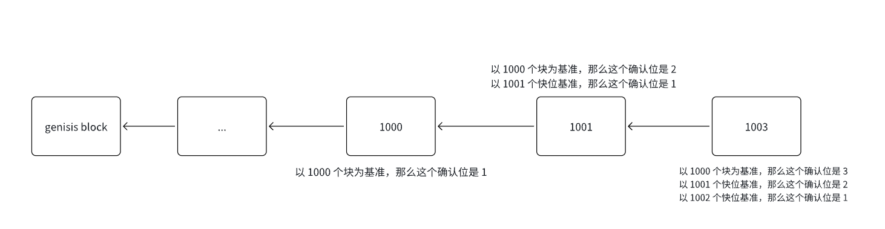
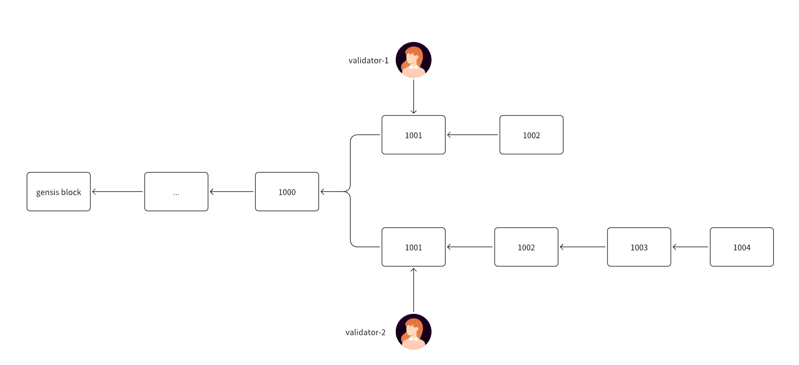
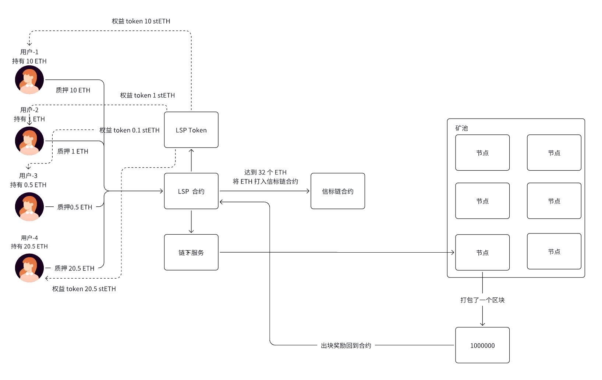
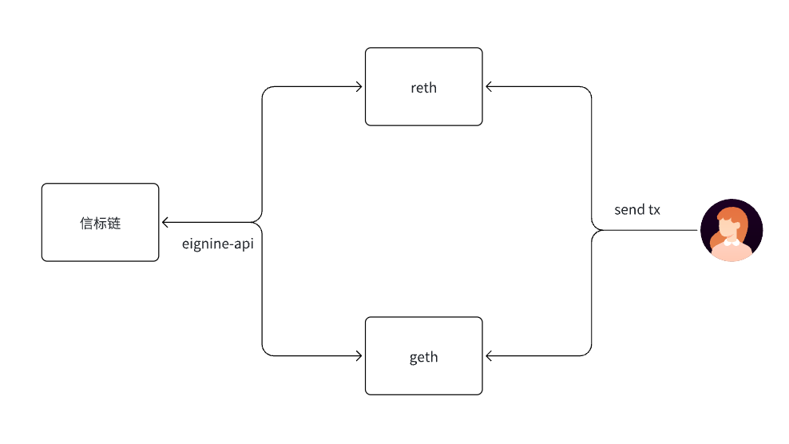
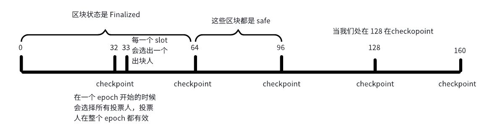
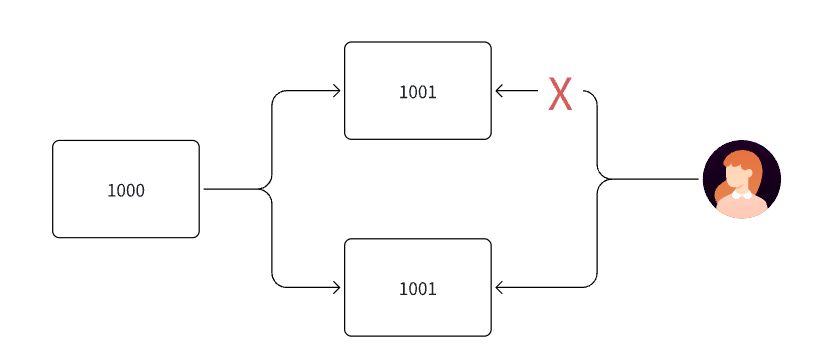
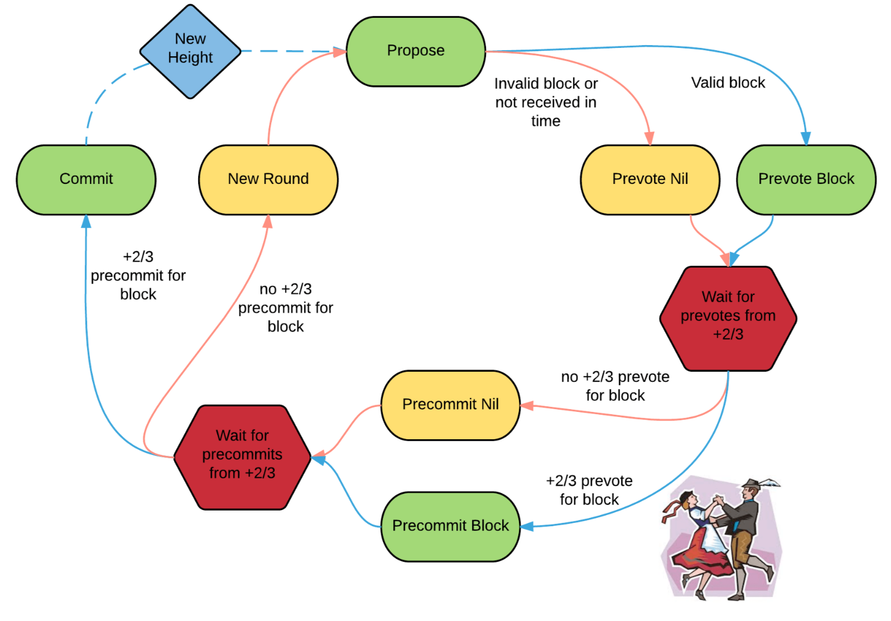
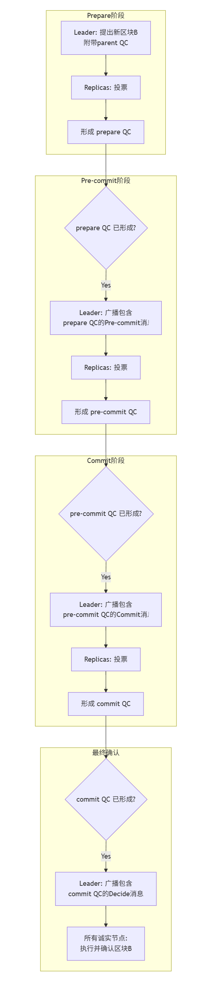
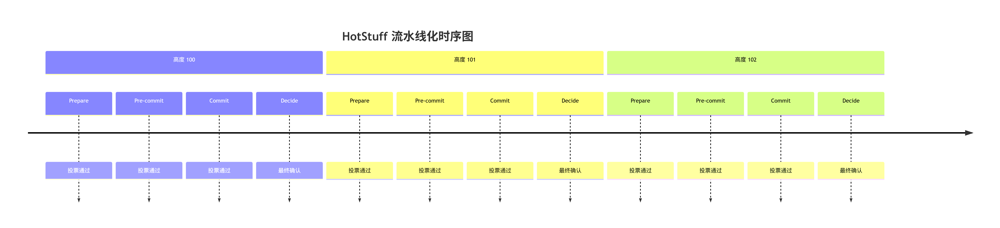
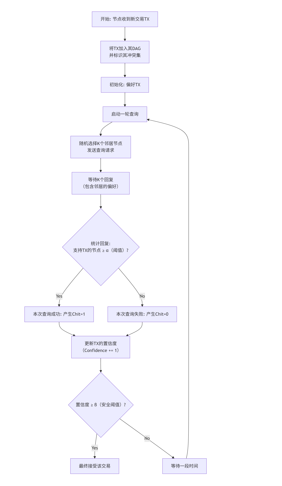

# 四. 共识算法

## 一. 内容提要

- 共识算法

  POW，POS，DPOS，PBFT

## 二. 共识算法

### 1. 怎么去理解共识算法

- 多方对某一提案达成一致的过程叫做共识过程，共识过程需要一些算法机制，比方说POW，POS等

- 最简单的例子，班级选择一个班长，如果是老师直接指定->中心化

  如果是投票选举出来，这就是一种去中心化的共识算法。

### 2. 常见的共识算法

### 2.1 确认位

### 2.2 POW（工作量证明）

**POW（工作量证明）**是一种通过计算工作来证明网络贡献的共识机制。矿工需要消耗计算资源来解决数学难题，第一个找到解的矿工获得出块权和奖励。

**参数：**

- Nonce:节点公式过程中要寻找的值
- Target：是挖矿的目标值（难度值）， Target越小，挖矿难度越大

**挖矿过程：**

- 矿工需要找到一个随机数(Nonce)

- 使得 Hash(区块头 + Nonce) 的结果满足难度要求：Hash(nonce, blockdata) < target

**挖矿难度调节：**

- 没过2016个块，会进行一次难度调整，按照每10分钟出一个块的话，每次调整大约是两周
- new_difficult=old_diffcult*(actual_time/target_time)
- 目标：维持稳定的出块时间，出块时间控制在10分钟左右，保证区块不发生分叉丢失

**竞争机制：**

  - 所有矿工同时竞争解决同一个难题

  - 最先找到解的矿工广播新区块

  - 其他节点验证并接受有效区块

  - 当产生分叉时，按照最长链原则：接受最长的有效链（解决分叉问题）

    

bitcoin 总量是2100万枚，每隔21万个块会发生一次减半：

- 50
- 50/2
- 50/4
- 50/8
- 50/n
- 减半的公式：50 (1/2 + 1/4 + 1/8 + ... + 1/n) = 2100万

比特币挖矿是有挖矿奖励的，validator 产生一个区块的时候他有两层奖励

- 第一层：挖矿奖励（区块里面的第一笔交易为挖矿奖励的交易）
- 第二层：正常的交易手续

### 2.3 POS (proof of staking)

**POS（权益证明）**是一种基于持币数量和时间来选择验证者的共识机制。不同于POW的算力竞争，POS通过质押代币来获得出块权，大幅降低了能耗并提高了效率。是使用质押投票的机制完成共识过程的一个共识算法：

**奖惩机制**:

  - 奖励：诚实验证获得区块奖励和交易费
  - 惩罚：恶意行为会被没收部分或全部质押
  - Slashing：严重违规可能永久失去验证者资格

**过程：** 用户质押代币 → 成为验证者 → 获得出块/验证权 → 获得奖励

- 第一层：资金质押

- 第二层：投票
- 第三层：正常投票（不作恶）就会获得奖励
- 第四层：异常投票（作恶）质押的资金就会被罚没

**验证者选择**

  - 随机性：结合质押数量和随机算法选择
  - 轮换机制：定期更换验证者避免中心化
  - 最低门槛：设定最低质押数量（如以太坊32 ETH）

参与投票共识前提，你必须先质押，一般情况，很多质押协议都要求最小质押量，要大于这个最小质押量才有机会参与网络的共识。（以太坊最小质押量32个ETH）

#### 2.3.1 以太坊的LSD

- 背景知识
  - 在 ETH2.0 升级时候，限定如果要在以太坊生成启动一个节点，需要质押 32 个 ETH，小于 32 个 ETH，不能启动该节点，大于 32 个 ETH 也不行
  - 在 pactra 升级，限定启动一个节点参与 ETH 网络共识至少还是需要 32 个 ETH, 最大可以到 2048 个 ETH
  - 质押范围在 pactra 升级是 32 ETH，不能多也不能少；在 pactra 升级之后，质押范围 32-2048 个 ETH
  - 以太坊目前正在运行版本质押范围是 32-2048 个 ETH
- LSD/LST/LSP 产品思路
  - 很多人的手上持有的 ETH 数量极大可能是低于 32 个 ETH，这样很多人都无法参与以太坊质押收益，lido 横空出世。
  - 将散户 ETH 收集起来，再去启动节点进行质押给信标链，再去启动节点参与网络共识
- 图解 LSD/LST/LSP 产品

- 第一步：用户质押 ETH，LSP mint 对应权益 token 给到用户
- 第二步：当 LSP 里面的资金大等于 32 ETH 时，链下服务监听到该事件之后，驱动将 LSP 资金充值到信标链合约，当新质押再进来，先将该节点质押的数量补充到 2048； 最新的质押达到 32 ETH 再去启动新的节点。
- 第三步：充值完成值，启动一个信标链节点参与网络的共识出块
- 第四步：出块完成之后，节点会获得奖励，矿池节点进行奖励抽成（节点拿 5-8%），剩余的奖励给到 LSP 产品侧
- 第五步：LSP 产品侧拿到奖励之后，抽成之后（LSP 拿 5-8%），将奖励分发给用户
- 第六步：用户取回质押，需要将权益 token 退回去，合约 burn 权益 token 之后释放 ETH 给到用户
- 第七步：LSP 退出，停掉节点，取回信标链合约资金

#### 2.3.2 POS的共识过程（以ETH2.0为例子说明）

信标链（Beacon Chain）是以太坊2.0（现称为Ethereum共识层）的核心组件，它引入了权益证明（Proof of  Stake）共识机制。

  主要功能:

-   共识协调：管理验证者网络，协调区块提议和验证过程

-   质押管理：处理ETH质押、验证者注册和奖惩机制

-   随机性：为网络提供加密随机数，用于选择区块提议者和验证委员会

-   最终性：通过checkpoint机制确保交易的最终确认

步骤：

- 第一步：用户将交易发送节点，进入 geth 或者 reth 的 txpool 
- 第二步：信标链将交易生成 payload
- 第三步：信标链节点会去 get_payload 进行验证
- 第四步：信标节点执行 payload 将其生成 block  插入区块链
- 第五步：当过来 32 slot （1个epoch）之后，之前区块变成 safe 
- 第六步：当过了 64 个 slot (2个epoch) 之后，之前区块变成 Finalized 

#### 2.3.3 理解区块的推导过程

- Epoch: 以太坊共识出块的一个周期，在一个周期内，参与区块投票的人是一样（不能增加或者退出）, 一个 epoch 包含32 个slot 
- Slot：用装载区块的，每一个 slot 里面包含一个区块，每12秒出现一个slot，如果在这期间没有交易，没有区块，这个slot就是空的。
- Block：用来打包交易的，每一区块需要放到一个 slot,  区块分为三个状态，分别初始状态，safe,  finalized 
- Checkpoint: 每隔 32 个 slot 就有一个 checkpoint ：

- 图中我们以128这个点开始理解：

  - 64-96 个 slot 里面区块已经过一个 checkpoint,  过了 32 slot, 这里面区块状态都是 safe
  - 0-64 个 slot 里面的区块已经过了两个 checkpoint, 也就是说过了 64个slot，这里面区块状态都是 Finalized

  

#### 2.3.4 以太坊的分叉问题怎么解决

**双重投票惩罚**：验证者如果对同一高度投票两次，将被大幅削减质押金：在以太坊，不允许同一个对两个分叉块同时投票，只允许给其中一个区块进行投票；以太坊叔块是有奖励的，但是比特币分叉块是没有奖励的。

**自动重组**：节点自动选择最长/权重最大的有效链

**检查点最终性：**每个epoch（32 个slot ）产生checkpoint，经过两个checkpoint后，一旦超过2/3验证者确认，该点之前的区块状态都是 Finalized

### 2.4 DPOS (Delegated Proof of Stake)

DPOS: 委托质押协议，超级节点的机制，不是所有都可以参与出块，而是选举一群人具备出块的权限

代表链：EOS 21个超级节点，Solona,101个超级节点

**DPOS 的工作流程**

- 委托投票机制：

  质押的 Token 越多，具备的权益越大

  所有质押人投票选举出来少数验证者（通常21-101个）来进行网络的出块和验证交易

- 轮流出块流程：

  被选举出来人，开始打包，验证和区块出出来。

  验证者按预定顺序轮流生产区块。

  每个验证者在固定时间窗口内出块，提高了出块速度和网络吞吐量。

- 实时投票：

  代币持有者可随时更改投票选择，表现不佳的验证者会被替换，保证验证者的责任性和活跃度

- 如果出块出现分叉，将由 PBFT 共识算法来解决

​	

**Solana共识** = POH + DPOS + PBFT 

- POH：交易的排序，按照一定规则进行交易排序
- DPOS：质押选举出块人，超级节点负责出块
- PBFT：负责区块状态达成一致

### 2.5 PBFT(Practical Byzantine Fault Tolerance)

- **拜占庭将军问题**：在分布式系统中，部分节点可能出现任意故障（恶意行为、数据篡改、网络分区等），如何确保正常节点达成一致性。

- PBFT 最早用在区块链里面，应该是 Hyperledger Fabric(IBM 出的**联盟链**，只有 Hyperledger Fabric  0.6 之前的版本使用了 PBFT， 1.0 之后用户的 kafka + zookeeper )

- **拜占庭容错算法**：

   N = 3f + 1;  n 代表的节点总数， f 代表允许出异常的节点； f = (N -1)/3;  

  例如我们有 10 个节点，公式会变成如下情况

  10 = 3f + 1 ====> f = (10 - 1)/3 = 3;   在 PBFT， 需要有 2/3 以上的节点是正常，这个网络才能正常工作

#### 2.5.1 Hyperledger Fabric  0.6（应用 PBFT）

Hyperledger Fabric  0.6 算法分为三个阶段 pre-prepare, prepare 和 commit 

- pre-prepare（view change 过程耗时比较长）
  - 客户端将需要共识消息发送到 server, 当网络收到需要共识消息，会进行一次 view change,  选择出一个主节点完成整个共识过程
- prepare
  - 主节点收到需要共识消息之后，会全网广播一个 prepare 的一个消息体，其他的副本节点收到消息之后，验证消息的真实性，然后对这个消息进行确认，给主节点回复确认消息。
- commit
  - 主节点收到 2/3 以上的节点对消息的确认之后，再广播 commit 的消息，消息确认之后，主节点直接打包生成区块，返回给到客户端。

View change: 选择主节点的过程，如果网络主节点挂了，也会发一次 view change 重新选择主节点。

#### 2.5.2 CometBFT

CometBFT 采用Tentmint 共识，一种易于理解、基本异步的 BFT 共识算法。该算法遵循一个简单的状态机，如下所示：

上图展示了 **Tendermint BFT 共识流程**，描述了一个区块从提议（Propose）到最终提交（Commit）的完整过程。Tendermint 共识采用**三阶段投票机制（Prevote、Precommit、Commit）** 来确保区块最终性。以下是详细解析：

##### （1）流程分解

- 新高度（New Height）
  - 在前一个区块提交后，链进入新的高度（New Height）。
- 提议阶段（Propose）
  - 提议者（Proposer） 选出一个区块并广播。
  - 可能情况：
    - 若区块有效且按时收到，则进入 Prevote Block。
    - 若区块无效或未及时收到，则进入 Prevote Nil。
- Prevote 阶段（预投票阶段）
  - Prevote Block（若收到有效区块）：
    - 等待至少 2/3 的 Prevote 票数（Wait for prevotes from +2/3）。
  - Prevote Nil（若未收到有效区块）：
    - 进入 Precommit Nil，即该轮未能达成共识。
- Precommit 阶段  （预提交阶段）
  - Precommit Block（若 2/3 以上的节点 Prevote 了该区块）：
    - 进入 等待 Precommit（Wait for precommits from +2/3）。
  - Precommit Nil（若未达成 2/3 Prevote）：
    - 进入新的轮次（New Round），重新开始提议流程。
- Commit 阶段
  - 若 2/3 以上的节点 Precommit 了该区块：
    - 区块最终被 提交（Commit），状态更新，进入新高度（New Height）。
  - 否则，重新进入 New Round，重复上述流程。

##### （2）核心逻辑总结

- 三阶段投票机制（Prevote → Precommit → Commit）
  - 需要 2/3 以上的投票支持 才能进入下一阶段。
  - 若任何阶段未能达成 2/3 共识，则进入新一轮（New Round）。
- 区块有效性判断
  - 若提议区块无效或未按时收到，节点会投 Prevote Nil，影响共识进展。
  - 在 Prevote 或 Precommit 阶段，若未达到 2/3，进入新轮次。
- 最终性（Finality）
  - 当 2/3 以上的节点 Precommit 了某个区块，则该区块最终会被 Commit，不会被回滚。

##### （3）对比Hyperledger Fabric 0.6

- Hyperledger Fabric 的 PBFT 有 pre-prepare 选择主节点的过程，但是 cometBFT 没有，这就很大程度上提高了算法的效率，准确说cometBFT是个完整的中间件，他的共识引擎**实现并优化了HotStuff算法**。

#### 2.5.3 Hotstuff BFT算法（扩展）

##### (1) 细节流程：

1. **主节点（Leader）**： 每个“视图（View）”都有一个主节点，负责收集交易并发起提案。
2. **副本节点（Replica）**： 网络中的其他节点，负责对主节点的提案进行投票。
3. **法定人数证书（Quorum Certificate, QC）**： 当一个提案获得超过 2/3 节点的投票后，会形成一个 QC。QC 是共识达成的证明。
4. **三阶段投票**： HotStuff 的核心流程包含三个连续的投票阶段：`prepare`、`pre-commit`、`commit`。每个阶段都需要收集到一个 QC，提案才能最终被确认。
5. **流水线化（Pipelining）**： 这是 HotStuff 的精髓。多个高度的区块（如区块100，101，102）的三个阶段可以同时进行，极大提高了吞吐量。

**流程图**：

**阶段一：Prepare（准备）**

- **步骤1 - 提案**： 主节点收集交易，打包成一个新的区块 `B`。这个区块中包含了前一个区块的 **commit QC**（这实际上构成了一个链式结构）。主节点将 `〈PREPARE, B, parent_commit_QC〉` 消息广播给所有副本节点。
- **步骤2 - 投票**： 每个副本节点收到提案后，会进行验证：
  1. 区块语法正确。
  2. 主节点确实是当前视图的主节点。
  3. `parent_commit_QC` 是有效的，并且指向的是当前链的最后一个已确认区块。
     如果验证通过，副本节点会向主节点发送 `〈PREPARE-VOTE〉` 投票消息，并对整个消息进行签名。
- **步骤3 - 生成QC**： 主节点等待收到 **超过 2/3** 的 `PREPARE-VOTE` 消息后，将这些投票聚合起来，形成一个 **prepare QC**。这个 QC 证明了网络中大多数节点已经“准备”好接受区块 `B` 了。

> **至此，区块B达到了“prepared”状态。** 这意味着它有成为链上区块的资格，但还未最终确定。

**阶段二：Pre-commit（预提交）**

这个阶段是为了确保所有诚实节点都**知道**阶段一已经成功完成。

- **步骤4 - 广播Pre-commit消息**： 主节点生成 `〈PRECOMMIT, B, prepare_QC〉` 消息并广播。这个消息本身不包含区块，只包含刚刚生成的 `prepare_QC`。
- **步骤5 - 投票**： 副本节点收到后，验证 `prepare_QC` 是否有效。有效则发送 `〈PRECOMMIT-VOTE〉` 消息。
- **步骤6 - 生成QC**： 主节点再次收集超过 2/3 的投票，形成 **pre-commit QC**。

> **至此，区块B达到了“pre-committed”状态。** 这意味着所有诚实节点都已知晓区块B已经处于“prepared”状态，为最终提交奠定了基础。

**阶段三：Commit（提交）**

这个阶段是最终确认的关键。

- **步骤7 - 广播Commit消息**： 主节点生成 `〈COMMIT, B, pre-commit_QC〉` 消息并广播。
- **步骤8 - 投票**： 副本节点验证 `pre-commit_QC` 有效后，发送 `〈COMMIT-VOTE〉` 消息。**此时，副本节点可以安全地锁定这个区块**，因为知道它很快就会被最终确认。
- **步骤9 - 生成QC**： 主节点收集投票，形成 **commit QC**。

> **至此，区块B达到了“committed”状态。** 这个 **commit QC** 将会被放入下一个区块中，作为链式结构的证明。

**最终步：Decide（决定）**

- **步骤10 - 通知确认**： 主节点（或任何拥有 `commit_QC` 的节点）广播 `〈DECIDE, commit_QC〉` 消息。副本节点收到后，无需等待，直接执行区块 `B` 中的交易，并将区块标记为已确认。

##### (2) 流水线化操作

流水线化操作：提高效率的关键

如果每个区块都必须独立走完三个阶段再处理下一个，效率会很低。HotStuff 的巧妙之处在于**流水线化**。

假设现在要连续出块 100, 101, 102：

- 当区块100完成 **Prepare** 阶段后，它可以立即进入 **Pre-commit** 阶段。
- **同时**，区块101可以立刻开始它的 **Prepare** 阶段。
- 当区块100进入 **Commit** 阶段时，区块101可能在 **Pre-commit** 阶段，而区块102则开始了 **Prepare** 阶段。

#### 2.5.4 Avalanche:  雪崩链自研 PBFT 算法

##### (1) Avalanche共识协议概述

Avalanche协议的核心思想是通过重复的子抽样（sub-sampling）来引导网络达成共识。每个节点通过随机查询一小部分其他节点来收集意见，然后根据反馈调整自己的状态，最终所有诚实节点会以极大概率收敛到同一决策。

想象在一个拥挤的房间里，每个人对某个选择（比如“A”或“B”）犹豫不决。他们不会进行全体投票，而是随机问身边的几个人：“你选什么？”如果多数人选A，他就倾向于选A。这个过程不断重复，很快整个房间的人会以极高的概率收敛到同一个选择。Avalanche 就是这个过程的数字化、严谨化实现。

##### (2) 核心概念与术语

1. **交易（Transaction）**： 需要达成共识的数据单元。
2. **冲突集（Conflict Set）**： 一组互斥的交易。例如，双花交易（花费同一笔UTXO）就属于一个冲突集。共识的目标是让网络在每个冲突集中**最终接受一个且仅一个交易**。
3. **DAG（有向无环图）**： Avalanche 并不严格按链式区块组织交易，而是将所有接受的成功交易组织成一个 DAG。每个新交易在发布时，会指向它之前看到的多个交易（通常是其冲突集中最偏好的那个），形成一个不断生长的图结构。这极大地提高了并发吞吐量。
4. **查询（Query）**： 节点向一组随机节点询问他们对某个交易的偏好。
5. **Chit** 和 **置信度（Confidence）**：
   - **Chit**: 一次查询中，如果收到足够多的“偏好”回复，则本次查询对该交易产生一个值为1的 `chit`，否则为0。`chit` 是二元的（0或1）。
   - **置信度（Confidence）**: 一个交易历史所有轮查询的 `chit` 值之和。它是一个累积值，随着成功查询轮次的增加而增长。

##### (3) 流程：

1. **开始**：节点启动。

2. **接收交易**：节点从网络或用户接收交易。

3. **初始化交易状态**：为交易初始化偏好、置信度和chit值。

4. **查询轮次**：对于每个未决定的交易，随机选择k个节点发送查询。

5. **等待响应**：等待其他节点返回查询响应。

6. **更新状态**：根据响应更新交易的chit值、置信度和偏好。

7. **检查决策条件**：如果置信度达到阈值，则标记交易为已决定。

8. **广播决策**：将决策广播给网络。

9. **进入下一轮**：等待下一轮开始。

   

##### (4) 与 PBFT/HotStuff 的关键区别

| 特性           | Avalanche                                              | PBFT/HotStuff                           |
| :------------- | :----------------------------------------------------- | :-------------------------------------- |
| **通信模式**   | **O(k log n)**，随机抽样，可扩展性极强                 | **O(n²)** 或 **O(n)**，所有节点参与投票 |
| **最终性**     | **概率性最终性**，随着置信度增加，回滚概率呈指数级下降 | **绝对最终性**，一旦达成共识，不可回滚  |
| **领导节点**   | **无领导者**，完全对等                                 | **有领导者**，主节点负责提案            |
| **活动性假设** | 需要“部分同步”网络假设来保证活性                       | 同左                                    |
| **吞吐量**     | 极高，得益于DAG结构和异步处理                          | 高，但通常低于Avalanche，受限于区块传播 |

