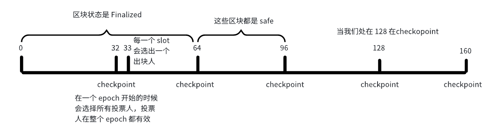
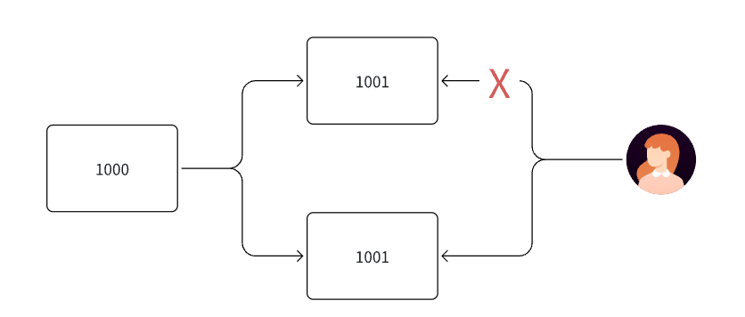

# 四. 共识算法与点对点通信协议

## 一. 内容提要

- 共识算法

  POW，POS，DPOS，PBFT

- P2P通信

  协议介绍，协议过程

## 二. 共识算法

### 1. 怎么去理解共识算法

- 多方对某一提案达成一致的过程叫做共识过程，共识过程需要一些算法机制，比方说POW，POS等

- 最简单的例子，班级选择一个班长，如果是老师直接指定->中心化

  如果是投票选举出来，这就是一种去中心化的共识算法。

### 2. 常见的共识算法

### 2.1 确认位

### 2.2 POW（工作量证明）

**POW（工作量证明）**是一种通过计算工作来证明网络贡献的共识机制。矿工需要消耗计算资源来解决数学难题，第一个找到解的矿工获得出块权和奖励。

**参数：**

- Nonce:节点公式过程中要寻找的值
- Target：是挖矿的目标值（难度值）， Target越小，挖矿难度越大

**挖矿过程：**

- 矿工需要找到一个随机数(Nonce)

- 使得 Hash(区块头 + Nonce) 的结果满足难度要求：Hash(nonce, blockdata) < target

**挖矿难度调节：**

- 没过2016个块，会进行一次难度调整，按照每10分钟出一个块的话，每次调整大约是两周
- new_difficult=old_diffcult*(actual_time/target_time)
- 目标：维持稳定的出块时间，出块时间控制在10分钟左右，保证区块不发生分叉丢失

**竞争机制：**

  - 所有矿工同时竞争解决同一个难题

  - 最先找到解的矿工广播新区块

  - 其他节点验证并接受有效区块

  - 当产生分叉时，按照最长链原则：接受最长的有效链（解决分叉问题）

    

bitcoin 总量是2100万枚，每隔21万个块会发生一次减半：

- 50
- 50/2
- 50/4
- 50/8
- 50/n
- 减半的公式：50 (1/2 + 1/4 + 1/8 + ... + 1/n) = 2100万

比特币挖矿是有挖矿奖励的，validator 产生一个区块的时候他有两层奖励

- 第一层：挖矿奖励（区块里面的第一笔交易为挖矿奖励的交易）
- 第二层：正常的交易手续

### 2.3 POS (proof of staking)

**POS（权益证明）**是一种基于持币数量和时间来选择验证者的共识机制。不同于POW的算力竞争，POS通过质押代币来获得出块权，大幅降低了能耗并提高了效率。是使用质押投票的机制完成共识过程的一个共识算法：

**奖惩机制**:

  - 奖励：诚实验证获得区块奖励和交易费
  - 惩罚：恶意行为会被没收部分或全部质押
  - Slashing：严重违规可能永久失去验证者资格

**过程：** 用户质押代币 → 成为验证者 → 获得出块/验证权 → 获得奖励

- 第一层：资金质押

- 第二层：投票
- 第三层：正常投票（不作恶）就会获得奖励
- 第四层：异常投票（作恶）质押的资金就会被罚没

**验证者选择**

  - 随机性：结合质押数量和随机算法选择
  - 轮换机制：定期更换验证者避免中心化
  - 最低门槛：设定最低质押数量（如以太坊32 ETH）

参与投票共识前提，你必须先质押，一般情况，很多质押协议都要求最小质押量，要大于这个最小质押量才有机会参与网络的共识。（以太坊最小质押量32个ETH）

#### 2.3.1 以太坊的LSD

- 背景知识
  - 在 ETH2.0 升级时候，限定如果要在以太坊生成启动一个节点，需要质押 32 个 ETH，小于 32 个 ETH，不能启动该节点，大于 32 个 ETH 也不行
  - 在 pactra 升级，限定启动一个节点参与 ETH 网络共识至少还是需要 32 个 ETH, 最大可以到 2048 个 ETH
  - 质押范围在 pactra 升级是 32 ETH，不能多也不能少；在 pactra 升级之后，质押范围 32-2048 个 ETH
  - 以太坊目前正在运行版本质押范围是 32-2048 个 ETH
- LSD/LST/LSP 产品思路
  - 很多人的手上持有的 ETH 数量极大可能是低于 32 个 ETH，这样很多人都无法参与以太坊质押收益，lido 横空出世。
  - 将散户 ETH 收集起来，再去启动节点进行质押给信标链，再去启动节点参与网络共识
- 图解 LSD/LST/LSP 产品

- 第一步：用户质押 ETH，LSP mint 对应权益 token 给到用户
- 第二步：当 LSP 里面的资金大等于 32 ETH 时，链下服务监听到该事件之后，驱动将 LSP 资金充值到信标链合约，当新质押再进来，先将该节点质押的数量补充到 2048； 最新的质押达到 32 ETH 再去启动新的节点。
- 第三步：充值完成值，启动一个信标链节点参与网络的共识出块
- 第四步：出块完成之后，节点会获得奖励，矿池节点进行奖励抽成（节点拿 5-8%），剩余的奖励给到 LSP 产品侧
- 第五步：LSP 产品侧拿到奖励之后，抽成之后（LSP 拿 5-8%），将奖励分发给用户
- 第六步：用户取回质押，需要将权益 token 退回去，合约 burn 权益 token 之后释放 ETH 给到用户
- 第七步：LSP 退出，停掉节点，取回信标链合约资金

#### 2.3.2 POS的共识过程（以ETH2.0为例子说明）

信标链（Beacon Chain）是以太坊2.0（现称为Ethereum共识层）的核心组件，它引入了权益证明（Proof of  Stake）共识机制。

  主要功能:

-   共识协调：管理验证者网络，协调区块提议和验证过程

-   质押管理：处理ETH质押、验证者注册和奖惩机制

-   随机性：为网络提供加密随机数，用于选择区块提议者和验证委员会

-   最终性：通过checkpoint机制确保交易的最终确认

步骤：

- 第一步：用户将交易发送节点，进入 geth 或者 reth 的 txpool 
- 第二步：信标链将交易生成 payload
- 第三步：信标链节点会去 get_payload 进行验证
- 第四步：信标节点执行 payload 将其生成 block  插入区块链
- 第五步：当过来 32 slot （1个epoch）之后，之前区块变成 safe 
- 第六步：当过了 64 个 slot (2个epoch) 之后，之前区块变成 Finalized 

#### 2.3.3 理解区块的推导过程

- Epoch: 以太坊共识出块的一个周期，在一个周期内，参与区块投票的人是一样（不能增加或者退出）, 一个 epoch 包含32 个slot 
- Slot：用装载区块的，每一个 slot 里面包含一个区块，每12秒出现一个slot，如果在这期间没有交易，没有区块，这个slot就是空的。
- Block：用来打包交易的，每一区块需要放到一个 slot,  区块分为三个状态，分别初始状态，safe,  finalized 
- Checkpoint: 每隔 32 个 slot 就有一个 checkpoint ：

- 图中我们以128这个点开始理解：

  - 64-96 个 slot 里面区块已经过一个 checkpoint,  过了 32 slot, 这里面区块状态都是 safe
  - 0-64 个 slot 里面的区块已经过了两个 checkpoint, 也就是说过了 64个slot，这里面区块状态都是 Finalized

  

#### 2.3.4 以太坊的分叉问题怎么解决

**双重投票惩罚**：验证者如果对同一高度投票两次，将被大幅削减质押金：在以太坊，不允许同一个对两个分叉块同时投票，只允许给其中一个区块进行投票；以太坊叔块是有奖励的，但是比特币分叉块是没有奖励的。

**自动重组**：节点自动选择最长/权重最大的有效链

**检查点最终性：**每个epoch（32 个slot ）产生checkpoint，经过两个checkpoint后，一旦超过2/3验证者确认，该点之前的区块状态都是 Finalized
