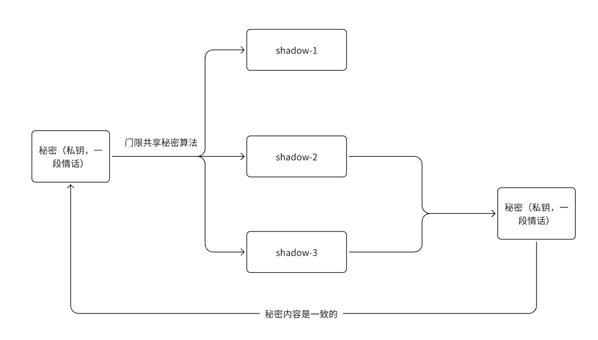
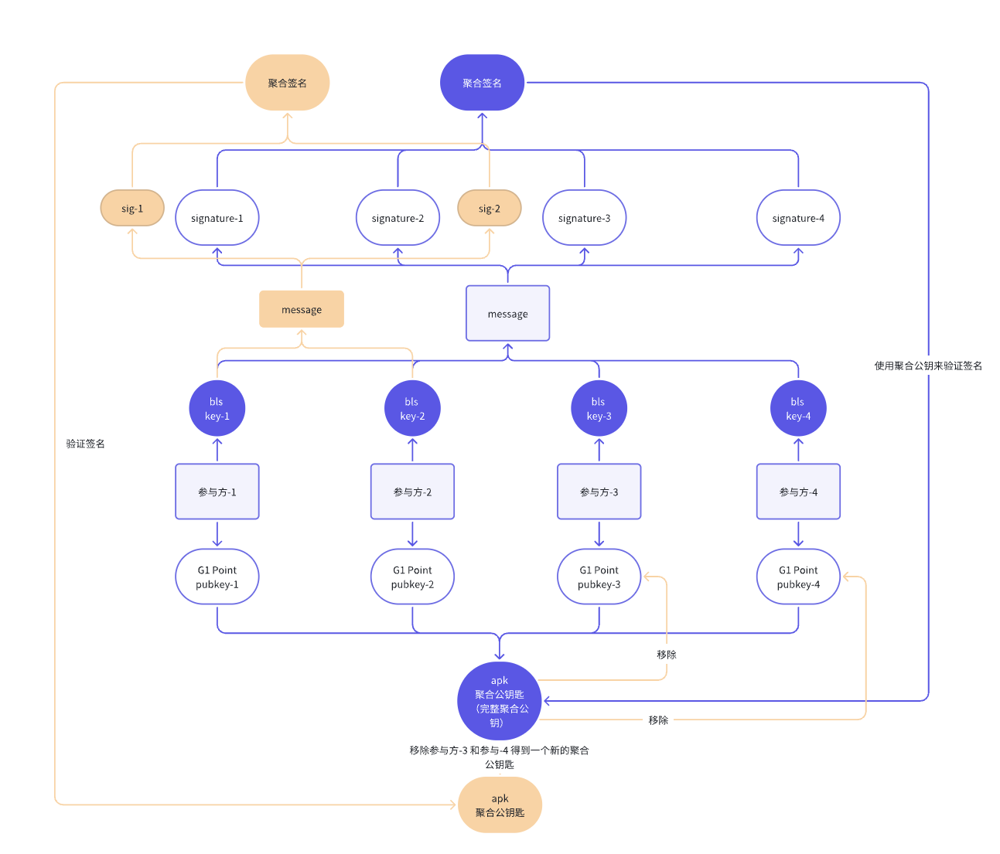
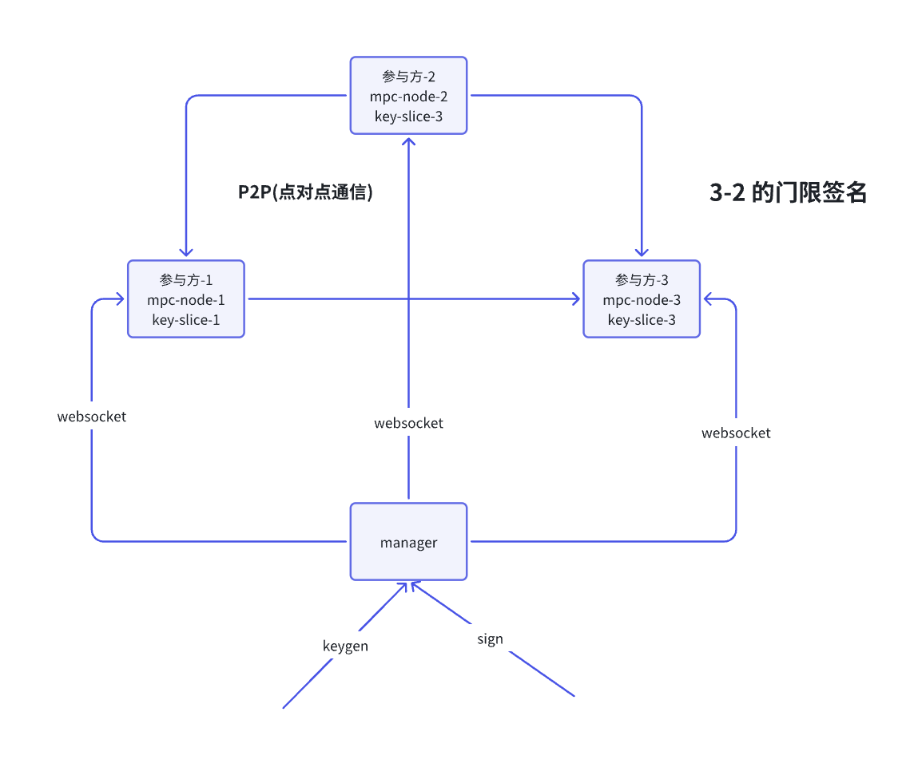

## 二. 区块链和密码学

密码学是区块的底层的依赖，区块链以密码学为基础构建的，没有密码学就无法实现区块链的逻辑，数字货币也叫加密货币。

### 1. Hash 函数

**哈希函数**，也称为单向散列函数或杂凑函数，是一种将任意长度输入数据（如文本、文件）转换为固定长度、唯一输出字符串（即哈希值）的密码学算法

**核心特性：**

- **单向性**（不可逆）：给定输入 X，可以轻松计算出其哈希值 H(X)。但无法从哈希值 H(X) 反向推导出原始输入 X。

- **碰撞性**：

  理论上：不同的输入应产生不同的哈希值。实际：由于输出长度固定，而输入无限，因此存在两个不同的输入（X 和 X'）产生相同哈希值（H(X) = H(X')）的可能性，这被称为“哈希碰撞”。

- **雪崩效应**：输入的任何一个微小的变动（哪怕只是一个比特），都会导致输出的哈希值产生巨大、不可预测的变化。

### 2. 对称加密和非对称加密

- 对称加密（单密钥加密）：

  (1) 加密密钥和解密密钥是同一把密钥

  (2) 常见密码学算法代表 AES,DES,3DES

- 非对称加密（公钥密码学）：

  密钥：加密密钥是公开的，称为公钥；解密密钥是需要保密的，称为私钥

  加解密过程：用公钥加密，私钥解密

  签名验签过程：用私钥签名，用公钥验签

  常用算法：RSA，

  ECC(几乎所有公链都是椭圆曲线算法)

  - ECDSA
    - Secp256k1
    - Secp256r1
  - EdDSA
    - ed25519
  - BLS 底层依赖椭圆曲线的点的映射
  - Schnnor

### 3. 门限共享和门限签名：

1. **门限共享**

将一个秘密拆分为 n 个份额（称为影子份额），并设置一个阈值 k（其中 n ≥ k），使得只需获取任意 k 个份额即可恢复原始秘密，而少于 k 个份额则无法获得任何秘密信息。



以上图为例子：我们将秘密拆分成 3 份(n = 3)， 分别是 shadow-1, shadow-2 和 shadow-3，设置 2 份可以恢复（k = 2）,  当我们需要恢复时候，我们只需要其中 2 份（可以是 shadow-1 和 shadow-2 组合，也可以是 shadow-1 和 shadow -3 的组合，也可以是 shadow-2 和 shadow-3 的组合）就可以恢复完整的秘密。

2. **门限签名**

我们一共有 n 个人，设置 k 个人签名交易有效（n >= k）, 当一笔交易通过 k 个签名之后就有效了


- 私钥-1 和私钥-2 签名交易有效
- 私钥-2 和私钥-3 签名交易有效
- 私钥-1 和私钥-3 签名交易有效

### 4. BLS 签名

BLS 基于椭圆曲线映射的算法，每一个参与方 G1 和 G2 Point 都会持有一个对BLS  公私钥,  BLS 里面也是门限签名机制。特点是支持签名聚合的数字签名方案，能将多个签名合并成一个，从而实现高效的批量验证。

##### （1）特点：

签名快，验证签名慢。

对比**ECDSA**：

| 签名方案  | 验证 N 个签名所需操作         | 特点                                                         |
| :-------- | :---------------------------- | :----------------------------------------------------------- |
| **ECDSA** | **需要验证 N 次**             | 每个签名都必须单独验证。验证时间随签名数量 **线性增长**。验证 1000 个签名，就需要做 1000 次独立的验签操作。 |
| **BLS**   | **只需要验证 1 次（聚合后）** | 无论有多少个签名，都可以聚合成一个单一的签名。验证这个聚合签名**只需要一次配对运算**（和单个验证的代价几乎一样）。验证时间**是常数**，不随 N 增加。 |

##### （2）BLS 聚合签名图解：



- **图解蓝色部分**

  - 一共四个参与对 message 进行签名，签名之后分别产生 signature-1,   signature-2,  signature-3 和  signature-4；  signature-1 是参与方-1 用自己的私钥签名得到,  signature-2 是 参与方-2 用自己的私钥签名得到,  依此类推。

  - 生成聚合签名

    - ```
      聚合签名 = signature-1 +  signature-2 + signature-3 +  signature-4
      ```

  - 参与方 1，2，3， 4 用户自己的公钥聚合成 apk 

    - ```
      apk(聚合公钥) = 参与方-1 的 pubkey-1(G1 Point)  + 参与方-2 的 pubkey-2(G1 Point) + 参与方-3 的 pubkey-3(G1 Point) + 参与方-4 的 pubkey-4(G1 Point)
      ```

  - 验证签名：由于聚合是 4 参与方签名，图中也是 4 个参与方，4-4 的签名模式，4 个参与方的聚合公钥验证4 个参与方的聚合签名。

- **图解绿色部分**

  - 虽然我们网络有 4 个参与方，但是只有参与方-1和参与方-2对消息进行签名， 参与方-1签名得到 sig-1, 参与方-2签名得到 sig-2

    - ```
      聚合签名 = sig-1 + sig-2
      ```

      这里聚合签名是 4-2

  - 网络中是有完整的聚合公钥(也就是蓝色部分聚合公钥)， 由于真实聚合签名只有`参与方-1` 和 `参与方-2` 参与签名, 所以验证聚合聚合也只能是`参与方-1` 和`参与方-2` 的聚合公钥。

    - ```
      聚合公钥 = 完整聚合公钥 - （参与方-3 的公钥 + 参与方-4 的公钥）
      ```

  - 使用聚合公钥对签名进行验证即可


### 5. Shnnor签名

- 是比特 taproot 升级之后使用一种签名算法
- 特点：短签名，签名比较快，安全性高，具备一定隐私性，在 shnnor 的底层里面的算法是有一些零知识证明体系在里面的。

- 在比特币的 taproot 升级里面有两个特性
  - Schnnor 签名
  - Merkle 抽象语法树：使得比特具备简单合约验证功能

### 

### 6. MPC

简介：MPC 是一个安全多方计算的算法，里面也是有由多个参与方协作完成算法，也具备门限签名机制，在 MPC 网络，没有出现过完整的私钥，每个参与方都是持有是私钥分片。



- MPC 网络前提
  - 在整个 MPC 网络里面没有出现过完整的私钥（理念是通过安全多方计算生成密钥分片，不允许完整的私钥出现），这个网一旦出现完整私钥，整个网络相关私钥分片将是无效。
  - MPC 网络也具备门限签名的机制，当一个消息发到 MPC 网络进行签名时，如果是 n-m(n 是密钥分片的总数，m 签名的阈值， n >=m),  只有需要 m 个节点或者参与方签名这个交易就是有效的。
- 业务流程
  - 在整个网络中有三个参与，分别参与方-1, 参与方-2 和 参与方-3, 参与方与参与方之间使用 P2P 通信协议
  - Keygen: 当 manager 收到 keygen 的消息之后，它广播消息给到 MPC 网络中所有参与方，节点收到这个消息，开启多轮交互计算，计算出各自节点的密钥，同时每个节点都生成自己聚合公钥匙，将聚合公钥匙提交给 manager, manager 收到聚合公钥和节点的数量是一致的，并所有聚合公钥都相等，意味着 keygen 
  - Sign: manger 收到签名指令，将 message 和签名指令广播给所有的节点，通过多轮共识交互进行签名，满足 m 个节点签名交易，签名的数据就是有效，将签名返回给 manager 
- MPC 算法特点
  - 签名慢，验证签名快


### 7. ZKP 简介

#### 什么是零知识证明

允许一方（证明者）向另一方（验证者）证明某个陈述是真实的，而不会透露任何超出该陈述本身的有效信息。简单来说，就是能够证明自己知道某个秘密或拥有某种资格，却不用泄露秘密的具体内容。零知识算法主要用隐私保护，或者 L2 的证明系统

它必须满足三个关键属性：

1. **完整性**：如果你真的知道秘密，你总能成功证明。
2. **可靠性**：如果你不知道秘密，你几乎不可能欺骗验证者。
3. **零知识性**：验证者除了“你知道秘密”这个事实外，什么额外信息都得不到。

例子：有一张照片，我们证明你在那个位置，但是我不能别人看到你真实面貌，我把你从这张照片抠掉，抠掉那个地方就是你所在的位置。

#### 零知识算法类别

- zk-snark
- zk-stark

#### 常见的 Zk 算法

- Kzg: 效率高，为什么效率高，因为它的实现里面有 trustset,  安全性比较；由于它的高效性，经常用在 DA 网络，例如：EigenDA, Eip4844, Celestia
- Fri: 安全性比较高的算法，但是效率相对低一些，它用户安全需求比较高的网络，例如 Polygon ZKEVM 
- Plonk， Growth 和 halo2 等