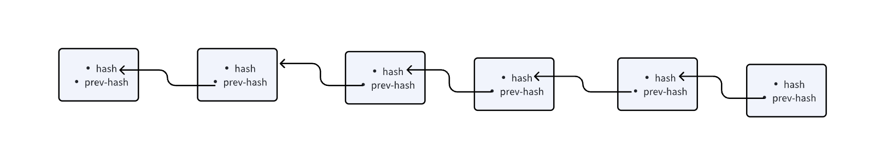
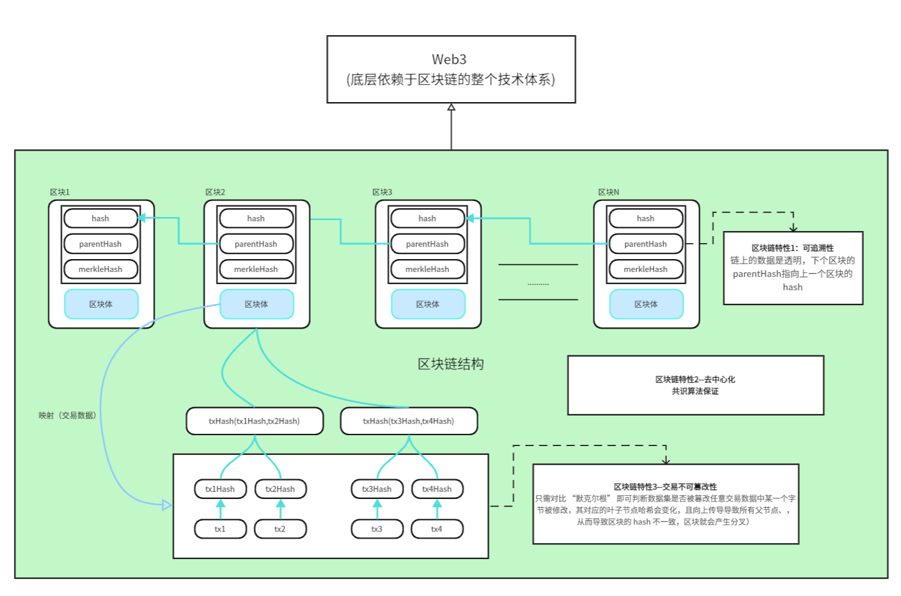
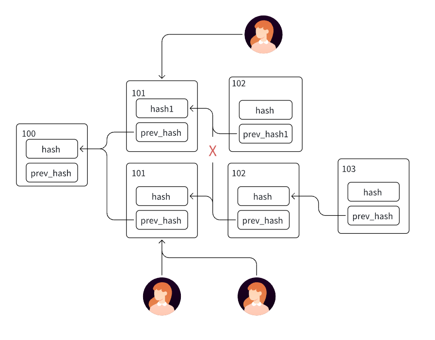

## 一. 区块链和 web3

### 区块链

**结构**：链式结构，由不同的 block 链接而成，每一个点就是一个区块，交易数据存储在区块里，在链上是透明可追溯的。

(1) **链式结构**：每个区块（区域）通过 prev-hash 指向前一个区块的 hash，形成一条不可篡改的链。

(2) **创世区块**：区域 1 是第一个区块（创世区块），其 prev-hash 通常为 null 或 0。

(3) **箭头方向**：箭头表示区块链的增长方向（从区域 1 到区域 n），但实际链接是通过 prev-hash 反向指向的

(4) **merkleHash**: 每个区块的头部会存储 “默克尔根”（所有交易的顶层哈希）。只需对比 “默克尔根” 即可判断数据集是否被篡改 —— merkle 树的叶子节点 hash 是交易 Hash 生成，merkle 树的根哈希是由叶子节点 Hash 生成， merkle 树的根哈希有参与区块 hash 的计算，哪怕任意交易数据中某一个字节被修改，其对应的叶子节点哈希会变化，且向上传导导致所有父节点、，从而导致区块的 hash 不一致，区块就会产生分叉（一旦分叉，就只能自己玩了）。

```
┌─────────────────────────────────────┐
│             区块 #n                  │
├─────────────────────────────────────┤
│ 区块头(Header):                      │
│   • Hash: [当前区块哈希值]            │
│   • Prev-Hash: [前区块哈希引用]       │
│   • MerkleHash: [根哈希]             │
├─────────────────────────────────────┤
│ 区块体(Body):                        │
│   • 交易数据记录                      │
│   • 智能合约代码                      │
│   • 状态变更记录                      │
└─────────────────────────────────────┘
```

**特性：**

- 不可篡改：密码学 + 共识保证
- 去中心化：共识算法保证、
- 可追溯：链上的数据是透明

### Web3:

Web3: 第三代互联网，底层依赖于区块链的整个技术体系，不同于 web2 数据集中在公司，资产在银行；更强调数据主权，价值流动性

### 区块链的特性和区块链和 Web3 关系图：



- 从密码学层面来看，是如何做到不可篡改的，由上图可以看出：交易的 Hash 是由交易数据生成，merkle 树的叶子节点 hash 是交易 Hash 生成，merkle 树的根哈希是由叶子节点 Hash 生成， merkle 树的根哈希有参与区块 hash 的计算，当改变任意交易数据的时候，都会导致层级的 Hash 发生变化，最终导致 merkle 树的根哈希不一致，从而导致区块的 hash 不一致，区块就会产生分叉（一旦分叉，就只能自己玩了）。
- 从共识层面来看，以比特币为例子，所有的区块生成都是 POW，最终找到 nonce 值生成区块，如果节点改变任何一笔交易，他将生成的交易和其他节点不一致，其他节点不会认证。


