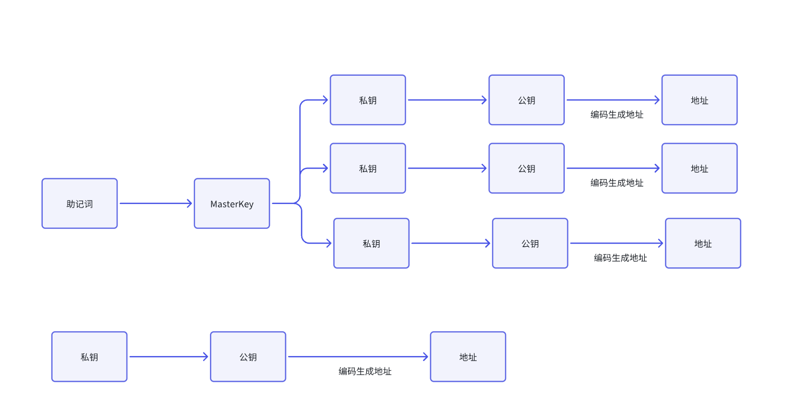

# 一.内容提要

- 智能合约
- Token
- 钱包
  - 私钥
  - 公钥
  - 地址
- NFT 和 Defi

# 二. 智能合约

智能合约也称为链上代码（chain-code）, 一段可以在链上执行的代码，可以有自己的逻辑，一般合约是公开，人人都可以。

在早期的时候，智能合约是不支持升级，早期智能合约一旦有漏洞，项目基本完成，因为安全事故频繁出现，后来出现了可以升级合约；

- 不可能升级合约：去中心化程度高，才是真正的 "code is law" 
- 可升级合约：基本上是中心化，可以通过升级方式改变代码里面任意逻辑，带来的影响就是 "code is law" 被弱化了。
- OZ 出了合约升级的时间锁定，通时间锁机制延长智能可以升级进程

智能合约

- Ethereum 的智能合约用 solidity，最早用得比较多的 vyper(几乎没人用户)
- EOS 的智能合约是用 C++ 编写
- Sui 和 Aptos 智能合约编程 sui-move, aptos-move 
- Solana 的智能合约是 rust
- Ton 的智能合约编程是 func
- Tezos 的智能合约编程是 smartpy(其实就是 Python)

# 二. Token（代币）

区块链出现的目的是为金融服务，比特币白皮书《点对点的支付》具备 Token,  Bitcoin 的链上的 Token 就是 BTC

Ethereum 链上代币是 ETH， 不管是 Bitcoin 的 BTC 还是 Ethereum 的 ETH 都叫做 Native Token(主链代币)

除了Native Token，其实就是非主链币，非主链币每一条链的叫法不太一样

- Ethereum 非 ETH 代币（同质化代币）
  - ERC20 代币:  同质化代币（可以拆分的币);  例如 USDT, UNI, USDC 和 DAI 等代币
  - ERC721 Token: 非同质化代币（不可以拆分）；例如：蒙娜丽莎那幅画，清明上河图，无聊猿
  - ERC1155 Token: 半同质化代币, 主要是以交易包的形式进行交易
- Solana 非 SOL 代币
  - SLP-Token: 包含同质化代币和非同质化代币
- Bitcoin 非 BTC 代币
  - BRC20 协议代币：铭文
  - 符文协议，符文属于同质化代币，很多比特币的发射平台，使用就是符文资产进行发射

# 三. 钱包

- 存放 token 的地方，钱包是 Web3 入口，所有交易，支付，链上保险，NFT 盲盒，socialFi, gameFI, EventFI 都是需要钱包支撑，无钱包不 Web3。
- 钱包里面重要的概念
  - 助记词：为了让用户不用去记忆复杂的的私钥，取而代之通过好记忆的助记词帮助用户管理钱包
  - 私钥：钱包持有私有的物品，在 Web3 世界，如果丢了钱包的私钥，那么就是把钱丢，助记词，丢失助记词可能比丢失私钥更惨，为什么这样说
    - 私钥：管理的是一个钱包
    - 助记词：管理多链多钱包
  - 公钥：公钥是公开的，任何人都拿到别人的公钥
  - 地址： 地址是由公钥编码生成

# 四. Defi 解析

## 1. 稳定币

市场波动比较小的代币， 例如：USDT， USDC， USDE,  DAI 等

- 法币稳定币：USDT， Tether 每往银行存 1 美金，就发行一个 USDT，
- 高额质押稳定币：Dai,  若发行 100 DAI，需要超额抵押物，可能需要 150 USDT ETH 质押才能发行 100 DAI
- 抵押物稳定币：USDC，通过债券等来抵押发行
- 算法稳定币：LUNA 和 UST,  孙哥发行的算法稳定 USTT

算法稳定币的核心特点是：**它没有或只有很少的链上实物资产（如美元、黄金）作为抵押担保**。它的“稳定性”主要通过**算法和智能合约**来调控市场供需，从而将价格锚定在目标值（通常是1美元）。

主要的调控机制包括：

- **代币销毁与铸造**：通常涉及两种代币：稳定币本身（如UST）和一个波动性的治理代币（如LUNA）。
  - **当UST > 1美元时**：用户可以用价值1美元的LUNA来铸造1个UST，然后在市场上以高于1美元的价格卖出，赚取差价。这个过程会增加UST的供应，使其价格回归1美元。
  - **当UST < 1美元时**：用户可以销毁1个UST，换回价值1美元的LUNA。这个过程会减少UST的供应，提升其价格。

## 2. 交易平台

- 去中心化交易所是 DEFI 比较重要的一环，主要就是使用自动做市商模型开发的 DEX，代币产品：Uniswap, PanCake 等
- 去中心化衍生品交易所：Dydx, Apex, Hyperliquid, Aster 等
- NFT 交易平台：例如 OpenSea,  SolSea
- 发射平台：代币发行和代币交易的一体化平台，主要代币产品：pumpfun, gmgn, odifun
- 事件预测平台:  Polymarket 

## 3. XXXFI 

- SocialFI: 社交金融，主要代表项目 lens protocol
- GameFi:  游戏金融，stepN
- EventFi:  FishCake 
- CeFi: 中心金融：主要是 交易所 等产品
- tradeFI: 交易金融

## 4. 质押借贷协议

- Compound
- AAVE 

## 5. LSP 和 Restaking 

- LSP: 主要代表产品：lido， meth
- Restaking 主要代币产品：eigenlayer 和 symbiotic 
- BTC 质押：Babylon 等

## 6. 其他的基础

- CCIP 跨链互操作协议
- Oracle(price Feed, RWA feed)
- VRF 