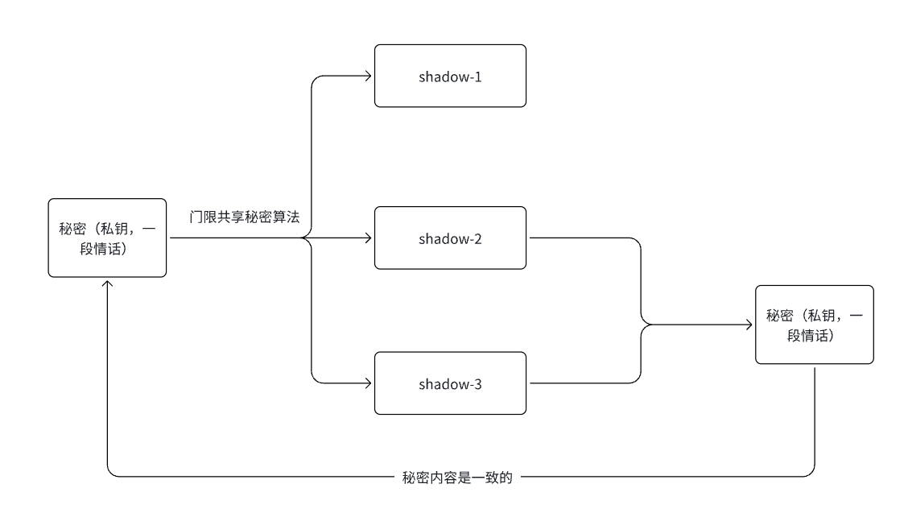
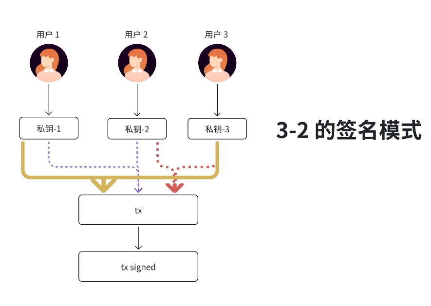
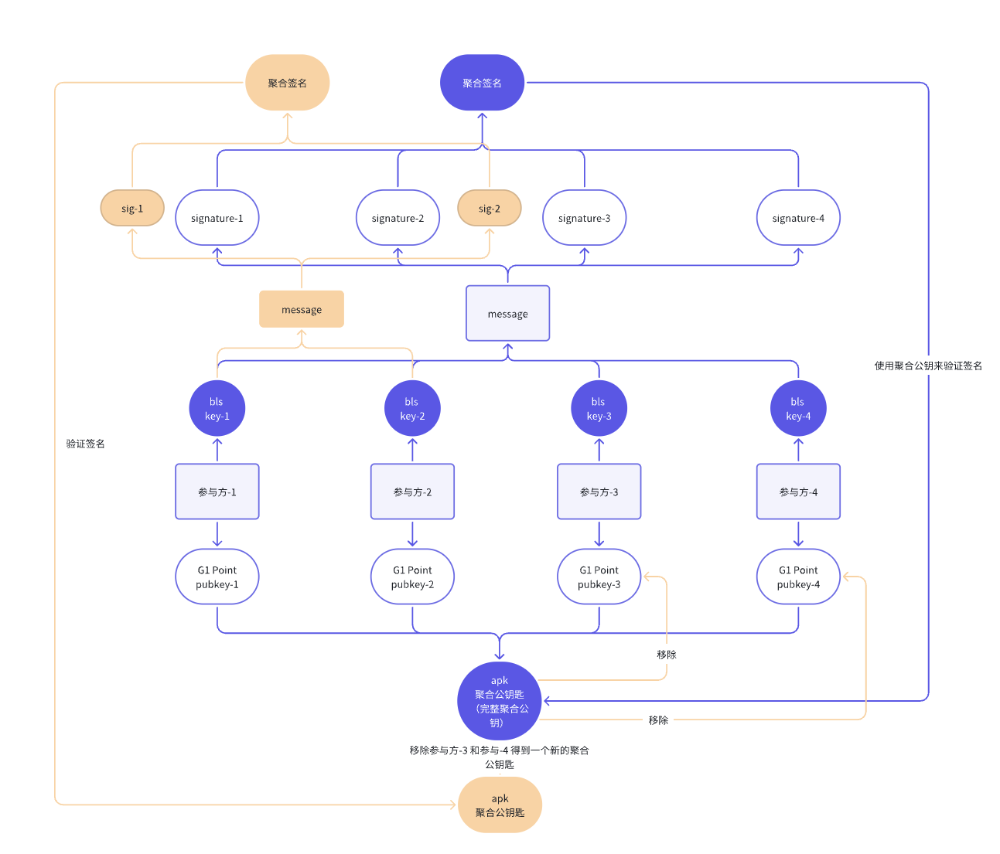
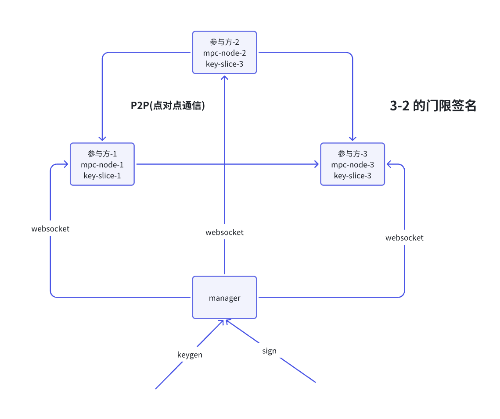
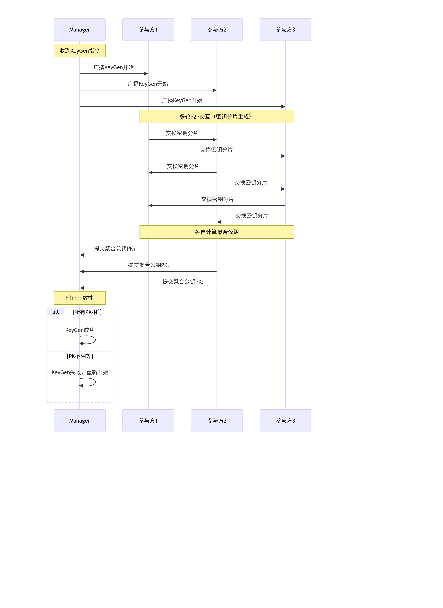
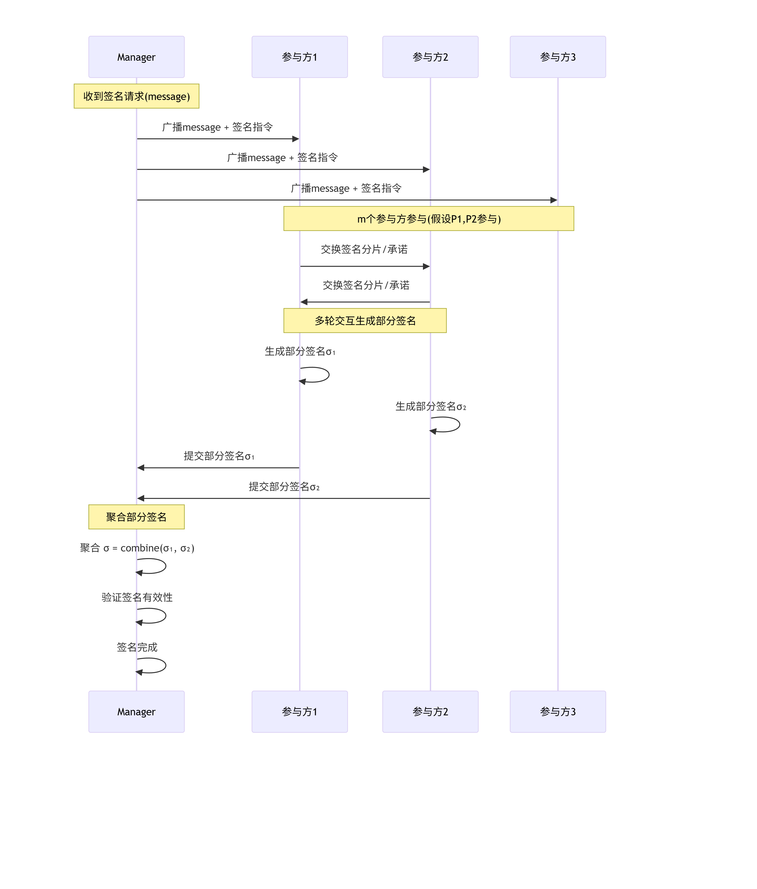

## 区块链和密码学

密码学是区块的底层的依赖，区块链以密码学为基础构建的，没有密码学就无法实现区块链的逻辑，数字货币也叫加密货币。

### 1. Hash 函数

**哈希函数**，也称为单向散列函数或杂凑函数，是一种将任意长度输入数据（如文本、文件）转换为固定长度、唯一输出字符串（即哈希值）的密码学算法

**核心特性：**

- **单向性**（不可逆）：给定输入 X，可以轻松计算出其哈希值 H(X)。但无法从哈希值 H(X) 反向推导出原始输入 X。

- **碰撞性**：

  理论上：不同的输入应产生不同的哈希值。实际：由于输出长度固定，而输入无限，因此存在两个不同的输入（X 和 X'）产生相同哈希值（H(X) = H(X')）的可能性，这被称为“哈希碰撞”。

- **雪崩效应**：输入的任何一个微小的变动（哪怕只是一个比特），都会导致输出的哈希值产生巨大、不可预测的变化。

### 2. 对称加密和非对称加密

- 对称加密（单密钥加密）：

  (1) 加密密钥和解密密钥是同一把密钥

  (2) 常见密码学算法代表 AES,DES,3DES

- 非对称加密（公钥密码学）：

  密钥：加密密钥是公开的，称为公钥；解密密钥是需要保密的，称为私钥

  加解密过程：用公钥加密，私钥解密

  签名验签过程：用私钥签名，用公钥验签

  常用算法：RSA，

  ECC(几乎所有公链都是椭圆曲线算法)

  - ECDSA
    - Secp256k1
    - Secp256r1
  - EdDSA
    - ed25519
  - BLS 底层依赖椭圆曲线的点的映射
  - Schnnor

### 3. 门限共享和门限签名：

1. **门限共享**

将一个秘密拆分为 n 个份额（称为影子份额），并设置一个阈值 k（其中 n ≥ k），使得只需获取任意 k 个份额即可恢复原始秘密，而少于 k 个份额则无法获得任何秘密信息。



以上图为例子：我们将秘密拆分成 3 份(n = 3)， 分别是 shadow-1, shadow-2 和 shadow-3，设置 2 份可以恢复（k = 2）,  当我们需要恢复时候，我们只需要其中 2 份（可以是 shadow-1 和 shadow-2 组合，也可以是 shadow-1 和 shadow -3 的组合，也可以是 shadow-2 和 shadow-3 的组合）就可以恢复完整的秘密。

2. **门限签名**

我们一共有 n 个人，设置 k 个人签名交易有效（n >= k）, 当一笔交易通过 k 个签名之后就有效了



- 私钥-1 和私钥-2 签名交易有效
- 私钥-2 和私钥-3 签名交易有效
- 私钥-1 和私钥-3 签名交易有效

### 4. BLS 签名

BLS 基于椭圆曲线映射的算法，每一个参与方 G1 和 G2 Point 都会持有一个对BLS  公私钥,  BLS 里面也是门限签名机制。特点是支持签名聚合的数字签名方案，能将多个签名合并成一个，从而实现高效的批量验证。

### (1) 特点：签名快，验证签名慢。

对比**ECDSA**：

| 签名方案  | 验证 N 个签名所需操作         | 特点                                                         |
| :-------- | :---------------------------- | :----------------------------------------------------------- |
| **ECDSA** | **需要验证 N 次**             | 每个签名都必须单独验证。验证时间随签名数量 **线性增长**。验证 1000 个签名，就需要做 1000 次独立的验签操作。 |
| **BLS**   | **只需要验证 1 次（聚合后）** | 无论有多少个签名，都可以聚合成一个单一的签名。验证这个聚合签名**只需要一次配对运算**（和单个验证的代价几乎一样）。验证时间**是常数**，不随 N 增加。 |

###  (2) 算法流程：

####  1.  定义

- G1 和 G2，下面的 Fₚ 指的是有限域，也叫素数域，其模数是一个素数 p。Fₚ =Z/pZ
  - G1Point：Fₚ 上的曲线点。
  - G2Point：Fₚ² 上的曲线点，编码为 `(a,b)` 形式，其中 `a + b·i`。
  
- BN254 椭圆曲线的定义式为：
  $$
  E: y^2 \equiv x^3 + 3 \pmod p
  $$
  ， 其中p=21888242871839275222246405745257275088696311157297823662689037894645226208583

- G1 群：点 (x,y) 的坐标都属于这个有限域 Fₚ。这意味着所有椭圆曲线运算（加、倍点、求逆等）都在模 p 的整数范围内进行。

- BLS 的公私钥

  - 私钥：sk = 随机数
  - 公钥： pk = G1 * sk(pk 属于 G1 类型) /  pk = G2 * sk (pk 属于 G2 类型)

#### 2. BLS254 算法流程:

##### 2.1 介绍

下面给出 BLS 签名方案 在 BN254 曲线上的完整数学流程与验证步骤。BLS 签名的安全性依赖于 BN254 双线性配对
$$
e: G_1 \times G_2 \to G_T
$$
； 其中 G1、G2、GT 分别是 BN254 曲线上定义的群。

##### 2.2 参数与群

- 基域：有限域
  $$
   \mathbf F_p
  $$
  ， p 为 BN254 的素数。

- 子群阶：r = 2188824…（FR_MODULUS）。

- 生成元：

  - $$
    g_1 \in G_1 （通常取 (1,2)）。
    $$

    

  - $$
    g_2 \in G_2
    $$

    

- 配对性质：
  $$
  e(aP, bQ) = e(P, Q)^{ab}， 对所有 a,b \in \mathbb Z_r 成立
  $$
  

##### 2.3 密钥生成

- 私钥 sk：从 
  $$
   \mathbb Z_r^*
  $$
  中随机选择: 

  - $$
    sk \xleftarrow{\$} \mathbb Z_r
    $$

- 公钥 pk：

  - 如果采用签名在 G1、公钥在 G2 的常见模式：
    $$
    pk = sk \cdot g_2 \;\in G_2
    $$
    

  - 如果采用签名在 G2,  公钥在 G1 的常见模式：
    $$
    pk=sk⋅g1∈G1
    $$
    ， 这里的生成元是 G1 的基点 g1=(1,2)

##### 2.4 签名

- G2 的常见模式签名（签名在 G1, 公钥在 G2）

  - 哈希到曲线 (G1)： 使用安全哈希函数 H：
    $$
    H(m) \xrightarrow{} P_m \in G_1
    $$
    ， 

  - 生成签名： 
    $$
    \sigma = sk \cdot P_m \;\in G_1
    $$
    

- G1 的常见模式签名(签名在 G2, 公钥在 G1)

  - 哈希到 G2： 把消息 m 哈希到 G2：
    $$
    H_2(m) \in G_2
    $$
    （需采用针对 Fₚ² 的安全哈希到曲线算法）

  - 生成签名 
    $$
    σ=sk⋅H2(m)∈G2
    $$
    

##### 2.5 验证签名

- G2 的常见签名模式验证签名

  - 验证者接收
    $$
    (m,\sigma, pk)
    $$
    

    - 重新计算消息点：
      $$
      P_m = H(m)
      $$
      

    - 检查配对等式：
      $$
      e(\sigma, g_2) \stackrel{?}{=} e(P_m, pk)
      $$
      

      - 左边：签名与 G2 生成元的配对。
      - 右边：消息哈希与公钥的配对。
      - 如果成立，则签名有效。

  - 理由：
    $$
    e(\sigma, g_2) = e(sk \cdot P_m, g_2) = e(P_m, g_2)^{sk} = e(P_m, sk \cdot g_2) = e(P_m, pk)
    $$
    

- G1 的常见签名模式验证签名

  - 验证者收到 
    $$
    (m, \sigma, pk)
    $$
    

    - 计算  
      $$
      H_2(m)
      $$
      

    - 检查配对等式：
      $$
      e(pk, H_2(m)) \stackrel{?}{=} e(g_1, \sigma)
      $$
      ， 其中：

      - 左边：公钥与消息哈希配对
      - 右边：G1 生成元与签名配对

  - 正确性：
    $$
    e(g_1, \sigma) = e(g_1, sk \cdot H_2(m)) = e(g_1, H_2(m))^{sk} = e(sk \cdot g_1, H_2(m)) = e(pk, H_2(m))
    $$
    

### (3) BLS 聚合签名图解：



- **图解蓝色部分**

  - 一共四个参与对 message 进行签名，签名之后分别产生 signature-1,   signature-2,  signature-3 和  signature-4；  signature-1 是参与方-1 用自己的私钥签名得到,  signature-2 是 参与方-2 用自己的私钥签名得到,  依此类推。

  - 生成聚合签名

    - ```
      聚合签名 = signature-1 +  signature-2 + signature-3 +  signature-4
      ```

  - 参与方 1，2，3， 4 用户自己的公钥聚合成 apk 

    - ```
      apk(聚合公钥) = 参与方-1 的 pubkey-1(G1 Point)  + 参与方-2 的 pubkey-2(G1 Point) + 参与方-3 的 pubkey-3(G1 Point) + 参与方-4 的 pubkey-4(G1 Point)
      ```

  - 验证签名：由于聚合是 4 参与方签名，图中也是 4 个参与方，4-4 的签名模式，4 个参与方的聚合公钥验证4 个参与方的聚合签名。

- **图解绿色部分**

  - 虽然我们网络有 4 个参与方，但是只有参与方-1和参与方-2对消息进行签名， 参与方-1签名得到 sig-1, 参与方-2签名得到 sig-2

    - ```
      聚合签名 = sig-1 + sig-2
      ```

      这里聚合签名是 4-2

  - 网络中是有完整的聚合公钥(也就是蓝色部分聚合公钥)， 由于真实聚合签名只有`参与方-1` 和 `参与方-2` 参与签名, 所以验证聚合聚合也只能是`参与方-1` 和`参与方-2` 的聚合公钥。

    - ```
      聚合公钥 = 完整聚合公钥 - （参与方-3 的公钥 + 参与方-4 的公钥）
      ```

  - 使用聚合公钥对签名进行验证即可


### 5. Shnnor签名

- 是**比特币** taproot 升级之后使用一种签名算法
- 特点：短签名，签名比较快，安全性高，具备一定隐私性，在 shnnor 的底层里面的算法是有一些零知识证明体系在里面的。

- 在比特币的 taproot 升级里面有两个特性
  - Schnnor 签名
  - Merkle 抽象语法树：使得比特具备简单合约验证功能


### 6. MPC

简介：MPC 是一个安全多方计算的算法，里面也是有由多个参与方协作完成算法，也具备门限签名机制，在 MPC 网络，没有出现过完整的私钥，每个参与方都是持有是私钥分片。



- **MPC 网络前提**
  
  - 在整个 MPC 网络里面没有出现过完整的私钥（理念是通过安全多方计算生成密钥分片，不允许完整的私钥出现），这个网一旦出现完整私钥，整个网络相关私钥分片将是无效。
  - MPC 网络也具备门限签名的机制，当一个消息发到 MPC 网络进行签名时，如果是 n-k(n 是密钥分片的总数，k 签名的阈值， n >=k),  只有需要 k个节点或者参与方签名这个交易就是有效的。
  
- ##### 流程：
  
  ##### 第一阶段：KeyGen（密钥生成）
  
  1. 当网络中的Manager 收到 keyGen的消息后，广播到MPC网络的参与方节点。
  
  2. 参与方之间进行P2P通信，执行上述KeyGen步骤，生成各自的私钥分片和共同的聚合公钥，将聚合公钥匙提交给 manager
  
  3. manager 验证收到聚合公钥和节点的数量是一致的，并所有聚合公钥都相等，则KeyGen成功。
  
     
  
  ##### 第二阶段：Sign（签名生成）
  
  1. Manager广播签名指令和消息m给所有参与方。
  
  2. 参与方之间进行P2P通信，执行上述Sign步骤，多轮交互生成部分签名，提交部分签名给Manager
  
  3. Manager收集到至少k个有效的部分签名后，通过特定算法聚合成最终签名。
  
     
  
- **MPC 算法特点**
  
  - 签名慢，验证签名快


### 7. ZKP 简介

#### 什么是零知识证明

允许一方（证明者）向另一方（验证者）证明某个陈述是真实的，而不会透露任何超出该陈述本身的有效信息。简单来说，就是能够证明自己知道某个秘密或拥有某种资格，却不用泄露秘密的具体内容。零知识算法主要用隐私保护，或者 L2 的证明系统

它必须满足三个关键属性：

1. **完整性**：如果你真的知道秘密，你总能成功证明。
2. **可靠性**：如果你不知道秘密，你几乎不可能欺骗验证者。
3. **零知识性**：验证者除了“你知道秘密”这个事实外，什么额外信息都得不到。

例子：有一张照片，我们证明你在那个位置，但是我不能别人看到你真实面貌，我把你从这张照片抠掉，抠掉那个地方就是你所在的位置。

#### 零知识算法类别

- zk-snark
- zk-stark

#### 常见的 Zk 算法

- Kzg: 效率高，为什么效率高，因为它的实现里面有 trustset,  安全性比较；由于它的高效性，经常用在 DA 网络，例如：EigenDA, Eip4844, Celestia
- Fri: 安全性比较高的算法，但是效率相对低一些，它用户安全需求比较高的网络，例如 Polygon ZKEVM 
- Plonk， Growth 和 halo2 等