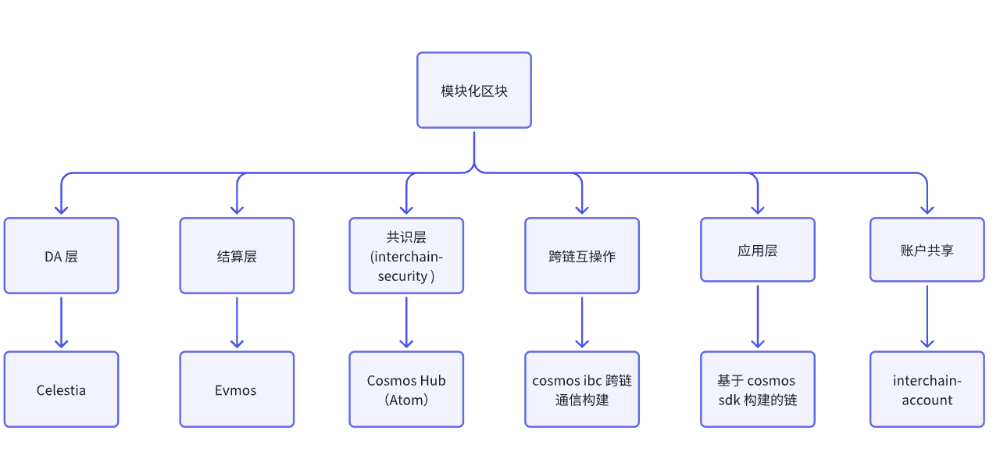
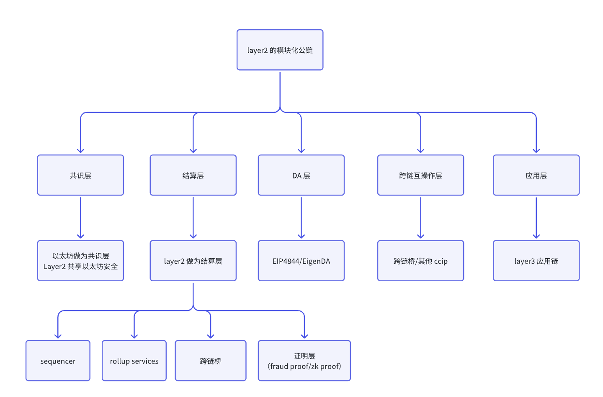

# 联盟链，公链，跨链和模块化区块链

## 一.内容提要

- 联盟链的基本概念，发展过程和主流联盟链举例
- 公链的基本概念，发展历程和主要公链举例
- 跨链的基本概念，跨链的主流方案和应用案例举例
- 模块化区块链的由来以及发展过程

## 二.联盟链，公链，跨链和模块化区块链基本概念

- **联盟链**，也称为**许可链**或**行业链**，是一种介于公有链和私有链之间的区块链。 由一组一群人/公司协作发布一条链，共识出块只能由这些公司/群体，其他外部人是没有资格参与出块；

- 联盟链的一般都是 **CA 中心**（证书颁发中心），联盟链上是**不会发行 token**(但是很多联盟链是**支持 NFT** 发行的)
  - 代表项目：hyperledger fabric,  蚂蚁链，长安链，百度超级链，京东链，Bili的联盟链，致信链

- **公链**（如比特币、以太坊）：任何人都可以参与共识出块的链就是公链，例如：Bitcoin 只要有矿机，就可以参与打包出块；Ethereum, 只要质押 32-2048 个 ETH，就可以参与网络共识出块。公链无准入，任何都可以参与挖矿，参与共识出块；公链一般都是用来发行 token 的。

- **私有链**：一个公司/内部小团体/一个人自己发行一条，除了自己，没有任何人可以参与网络共识出块，例如：JuCoin, HyperLiquid,  L2/L3 也算是私链

- **跨链**：主要承载链与链之间通信，一般使用的是**跨链互操作协议**，跨链互操作协议把链与链之间链接起来，实现链与链之间可以进行资产跨链，消息跨链，数据跨链等。

- **模块化区块区块链**：

  - 最早出现在联盟链，而且 Hyperledger Fabric,  主打的概念模块化，可插拔

  - 公链里面，最早出现项目 cosmos,  celestia 出来之后，主打模块化区块，当时想法如下：

    

  - Layer2: 第一个把模块化区块引入到 Layer2 是 mantle, mantle 一开始第一模块化 layer2 区块链，后来所有的 layer2 和 layer3 都说自己模块化，mantle 就改成了 mass adoption。

  - 链抽象：这也是模块化区块链扩展，关于链抽象后面会有专门的专题讲解。

  

## 三.联盟链

最早出现联盟链项目是 hyperledger fabric，是由 IBM 研发，分界面线特别明显的是，在 0.6 之前版本更区块链一点，使用的共识算 PBFT，在 1.0(含 1.0)之后，他不太算是一个区块链了，共识改成 kafka + zookeeper, 项目的整体架构也变了，peer + order;  在 1.0 之后的版本它更像一个分布式应用。hyperledger fabric 在 16 年的时候特别火。

- 联盟链代表项目
  - hyperledger fabric，是由 IBM 研发
  - 蚂蚁链：阿里的一条联盟链 
  - 长安链：是由海淀市政府，腾讯和微芯研究院一起合作搞的，现在也是兼容 EVM 的一条链
  - 致信链：腾讯内部的联盟链，主要要和云服务器结合的解决方案
  - 百度超级链： 基于 cosmos 构建的联盟链，这个链表现一般
  - 京东链：使用 java 开发的一条链，虽然是使用，但是借助很多 HyperLedger Fabric 的设计理念
  - BiliBili 的联盟链：  基于 cosmos 构建的联盟链，B 站以前发了一个 NFT，火了一段时间

## 四.公链

最早出现的公链是 **Bitcoin**, 也开创整个区块链/web3 的项目，围绕 Bitcoin 的技术方案出现了 Doge, Litcoin;  BCH, BSV 是比特币的分叉链，现在大家都把 Bitcoin 称为“数字黄金”.

第一个将智能合约引入到区块链的项目是 Ethereum,  区块链上出现了任何人都可以发行代币的协议--ERC20, 以太坊也被称“数字石油”； 一台 Web3 计算机；到目前为止，以太坊还是承载整个 Web3 应用的基础设施；meme, Defi, Layer2 和 restaking 等创新代币和协议都是以太坊生态出来，其他生态都是抄作业。

- Layer1:  BSC, Polygon POS 链（其实 Cosmos 和 Ethereum 结合体，他共识组件用了 cosmos 生态的组件）
- Layer2:  
  - OP:  很多链基于op stack 来构建，opBNB, mantle, manta, base 等等
  - Arbi:  以太坊 layer2,  orbit， 好多 layer2 基于 orbit 构建
  - Polygon（PolygonZkEvm, Polygon ZkVm 和 polygon Pos）:  Polygon CDK,  现在使用有 x-layer2, zkfair 等
  - Zksync, scroll, starknet, linea
- DA:  Eip4844 和 EigenDA,  EIP4844 是以太坊原生的 DA， EigenDA 由 layr-labs 构建 DA 层

第一个提出模块区块链和应用链协议是 Cosmos, 也是目前为止很多项目使用基础设施，cosmos 是一个区块底层技术框架，到目前为止，绝大多的 layer2 公链或者上层应用都基于 cosmos 构建，比方 dydx chain, evmos, secret 等等

其他公链

- Solana: 虽然我们把它叫公链，严格意义，它更像一个私有链，因为并不是所有都可以参与共识出块，它是有超级节点的，应该 101 超级节点
- BSC：几乎算是私有链，准入的，只有币安自己的节点在出块
- 其他公链：多数都是私有或联盟链，只是基本发行 token 能力而已

总结：世界上只有两条公链

- Bitcoin 
- Ethereum

其他链更多是联盟链或者是私有链，但是多数都具备发行 token 能力而已

## 五.跨链

跨链存在目的：可以实现任意链到任意链的消息，数据和资产的跨链，主流解决方案如下

- Cosmos IBC:  cosmos 提供一套跨链技术解决方案，只支持在基于 cosmos 构建链之间进行跨链

- ChainLink CCIP:  ChainLink 提供一套跨链技术解决方案，由 ChainLink 本身自己部署，几乎可以支持任意生态的链跨链互操作。

- DappLink CCIP: DappLink 提供一套跨链技术解决方案,  定制化一个技术服务提供，我们不会自己部署，而是将源码出售给项目方，他们自行部署；目前集成公链主要有

  - CpChain 跨链互操作
  - 资产跨链协议，会集成 The Web3 公链
  - 和香港合作 RAW 跨链互操作

  

## 六. 模块化区块链

- 最早出现在联盟链，而且 Hyperledger Fabric,  主打的概念模块化，可插拔； 公链里面，最早出现项目 cosmos,  celestia 出来之后，主打模块化区块，当时想法如下：

- Layer2: 第一个把模块化区块引入到 Layer2 是 mantle, mantle 一开始第一模块化 layer2 区块链，后来所有的 layer2 和 layer3 都说自己模块化，mantle 就改成了 mass adption。

