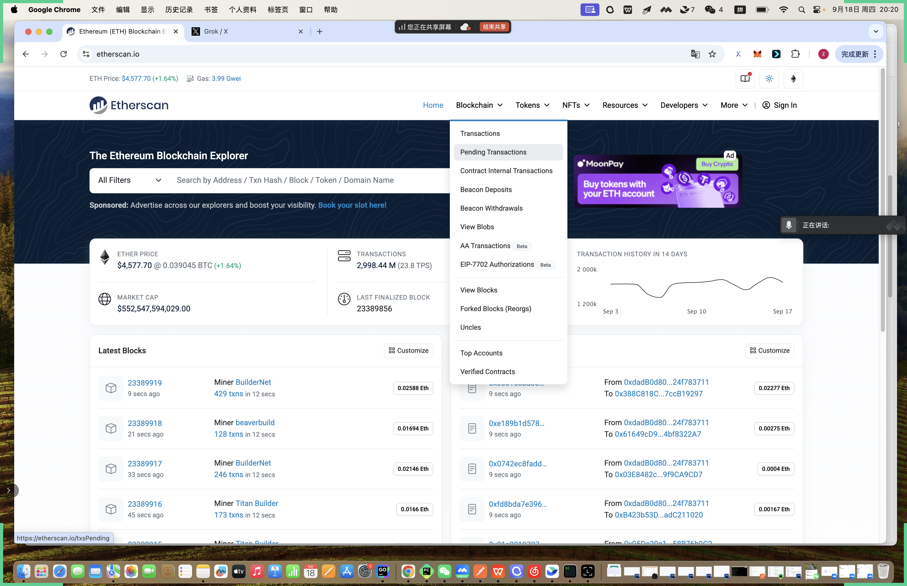
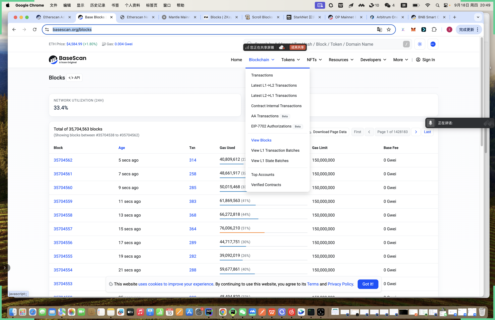
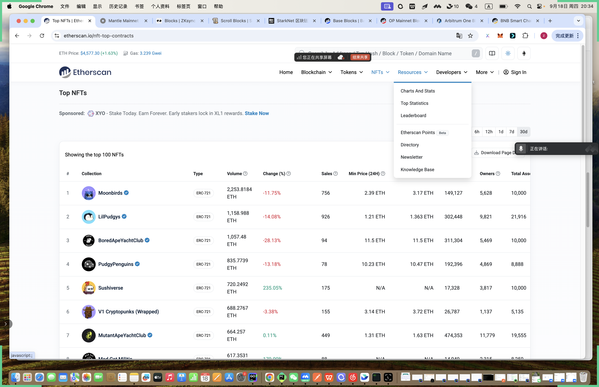
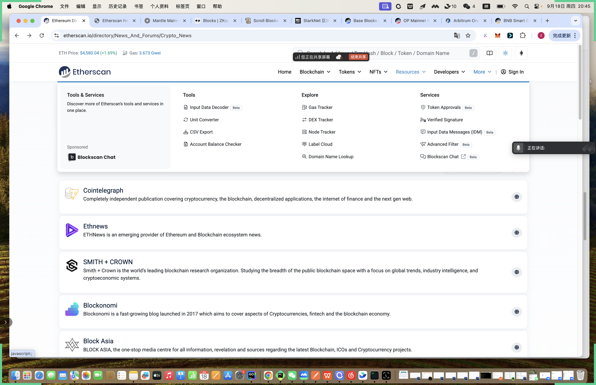

# 一.内容提要

- 数据平台的基本使用
- 浏览器的基本使用

# 二.浏览器的基本使用

## 1. 比特币浏览器

- **Mempool**
  - 网站链接：https://mempool.space/
  - 分析当前 Mempool 交易的情况
  - 区块和区块链的交易
  - 符文和铭文
  - 全球矿池的分布和各家矿池的数据
- **OkLink**
  -  网站链接：https://www.oklink.com/bitcoin
  - 分析当前 Mempool 交易的情况
  - 区块和区块链的交易
  - 符文和铭文
  - 全球矿池的分布，各家矿池和矿池的哈希率
  - 对铭文符文进行单独 tag 显示
  - 持币排名前 300 大户，代币持有最富有的人
  - 闪电网络相关的信息
- BtcScan
  - 网站：https://btcscan.org/
  - 区块和区块链的交易
  - 符文和铭文
  - https://btcmempool.org/mining 
    - Mempool 和矿池信息

## 2. 以太坊的浏览器

- **Etherescan**

  - Etherescan: 是一家专门做 EVM 生态链的浏览器技术提供方，两年前---主网浏览器 150 万美金/年； 测试网：50 万美金/年

  - 为 Ethereum, BSC, Polygon, OP, Base, Arbi 等公司都做浏览器，浏览器的功能是几乎一致的

  - Ethereum 的浏览器

    - https://etherscan.io/

    - Blockchain 模块

      

      - 上链的交易
      - 还没有上链的交易
      - 合约的内部交易
      - 信标链的提现
      - 信标链的充值
      - 区块信息
      - AA 钱包交易
      - EIP7702（抽象账户钱包）交易
      - 重组回滚的区块
      - 叔块
      - Top 账户
      - 已经验证合约
      - 注意：在 Layer2 区块链里面：有 L1->L2 充值，有 L2->L1 提现

      

    - Token 模块

      - Top token
      - Token transfer
      - Token 流转的可视化图

    - NFT

      - Top nft
      - [Top Mints](https://etherscan.io/nft-top-mints)
      - 最新的交易
      - 最新的转账
      - 最新的 mint 

    - Resource 板块

      - 
      - 数据可视化与数据统计---> 信标链的充提，Dex 的数据统计
      - Top 的数据统计-- 转入收入 ETH 前 10 的地址数据，GasFee
      - [Leaderboard](https://etherscan.io/leaderboard):  排行榜
      - 项目收录的目录
      - 快讯
      - 知识库

    - More

    - 

    - Gas Tracker

    - Dex Tracker

    - Node Tracker

    - Label Cload: 地址标签

- OkLink

  - 常规的浏览器
    - 交易
    - 区块
    - 验证者列表（信标链的功能）
    - Blob: L2 提交交易数据交易
    - 信标链质押和解除质押（信标链功能）
    - 富豪地址
    - 已验证合约
    - NFT 相关
  - 生态
    - 将 Ethereum 主流 Defi 项目都收录，方便你去查询 Defi 项目的信息

- Blockscout

  - 简单版本的浏览器

## 3.Solana 浏览器器

- **SolScan**
  - Solana 整个网络的数据分析
    - Staking 
    - 稳定币
    - Fee
    - lunchpads
  - Defi 项目数据分析
  - MEV， Token, Nft 等的排行榜
  - 正常区块链浏览器
    - 区块
    - 交易
    - 验证人

# 三.数据平台的基本使用

- **CoinMarketCap**
  - 网站链接：https://coinmarketcap.com/
  - 项目介绍： 全球知名的加密货币行情与数据聚合平台，现已归属 币安（Binance） 旗下。 核心功能：
    - 实时监控不同类型代币的价格、成交量、市场深度
    - 提供 CEX（中心化交易所）与 DEX（去中心化交易所）的交易数据分析
    - 支持市值排名、历史价格趋势、链上流通情况等多维度查询
- CoinGecko
  - 网站链接：https://www.coingecko.com/
  - 项目介绍： 另一家全球顶尖的加密数据聚合平台。 核心功能：
    - 全面覆盖不同类别代币的交易分析
    - CEX 和 DEX 的交易深度数据
    - NFT 交易分析（独特优势）
    - 代币经济模型及发行机制的可视化展示
- TradingView
  - 网站链接：https://www.tradingview.com/
  - 项目介绍： 全球领先的金融图表与技术分析平台，广泛用于加密货币、股票和外汇市场。 核心功能：
    - 提供专业级 K 线图表服务
    - 多种技术指标与策略脚本
    - 可与各类交易所 API 连接，实现实时行情与策略回测
- **DeFiLlama**
  - 网站链接：https://defillama.com/
  - 项目介绍： DeFi 领域最权威的 TVL（锁仓量）与数据分析平台。 核心功能：
    - 收录各大公链生态的 DeFi 项目与锁仓数据
    - 详细查询协议 TVL、收益率、链上资金流动
    - 可通过 https://chainlist.org/ 查询所有链的 RPC/ChainID 等网络信息
- DeBank
  - 网站链接：https://debank.com/
  - 项目介绍： 一站式 DeFi 与链上钱包数据聚合平台。 核心功能：
    - 支持个人钱包资产及协议交互分析
    - 为 B 端机构提供链上数据 API 和可视化服务
    - 覆盖主流公链生态的实时 DeFi 数据
-  非小号
  - https://www.feixiaohao.com/wallet/ 钱包排行榜

# 四.项目代码与安全分析

## 1. GitHub / GitLab

 查看项目的源代码、Commit 频率、贡献者数量、代码开源程度

很多数据平台或者是交易所，都提供了项目的 github 入口，以下内容以 OP 为例子来讲解

- Github 地址：https://github.com/ethereum-optimism/
- 主仓库代码：https://github.com/ethereum-optimism/optimism
  - 代码最新提交：https://github.com/ethereum-optimism/optimism/commit/9e5f1a9e0c5663dc8db7bd037f40bb3569f21d8f
  - 最新的一天还有 5 个 PR 的提交，项目开发是比较活跃
  - 贡献者：423 个贡献者
  - 代码完全开源
  - 有 30145 个项目用到了 OP 的代码
  - 项目开发 feature 和 bug: https://github.com/ethereum-optimism/optimism/issues
  - 每个 issure 都对应一个修复 PR，如没有修复那就没有 PR 
  - https://github.com/ethereum-optimism/optimism/discussions 很多项目都会在 github 里面讨论项目的一些进展，这里面可以看到 OP 的情况，这里能隐约找到一些项目的未来规划

以 jucoin 为例子

- 没有开源代码，判定成垃圾币

## 2. Smart Contract Audits、审计报告查询

了解项目合约安全性和漏洞情况, 以 eigenlayer 为例子

- 在github 找到他的审计报告：https://github.com/Layr-Labs/eigenlayer-contracts/tree/main/audits

以 OP 为例子

- Op 的审计报告：https://github.com/ethereum-optimism/optimism/tree/develop/docs/security-reviews

从审计报告里面我们了解到该项目经过哪些公司的审计，审计公司越多，项目相对安全性越高

## 3. Code4rena、Immunefi、Bug Bounty 平台，

公开的合约审计和漏洞赏金平台，评估项目安全

大型一点，正规一点的项目都会做 bug  Bounty

Code4rena: https://code4rena.com/

Immunefi: https://immunefi.com/

当一个项目一直做 bug bounty，说明项目方比较注重项目的安全，这类项目价值相对高一些

# 五.社区与社交媒体分析

从社交媒体角度，我们可以分析出项目活跃度，项目方正面评价

- Twitter：一直在活跃，说明项目还在做事，推特评论，正面评论比较，说项目的人品还行
- Telegram：最直接能反映大家对项目态度，在 telegram 群里的，任意可以去评价这个项目，如果群里正面比较多，说明的人品可以；如果很多人在维权或者在骂，说明项目方至少是很垃圾的。
- Discord：discord 里面项目方一般有很多 channel
  - 可以看到项目方的项目进展
  - 也可以大家对项目评价
- Reddit：项目社交媒体，反映项目的人品好坏

