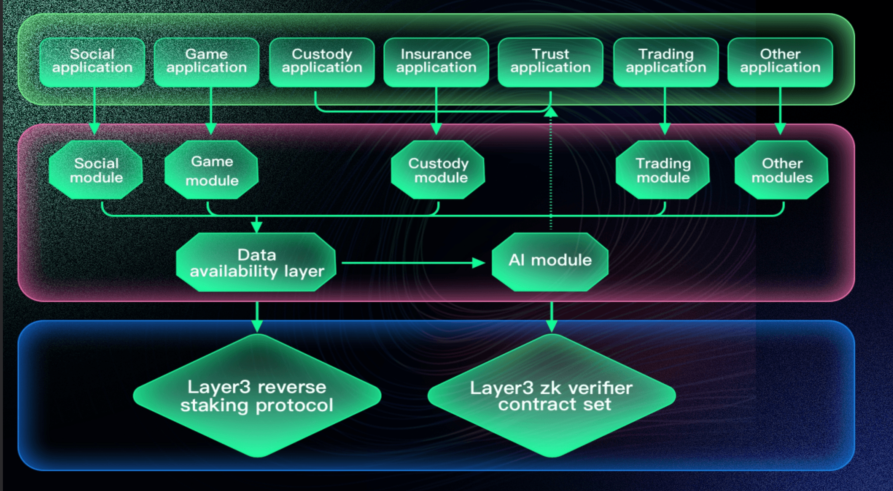
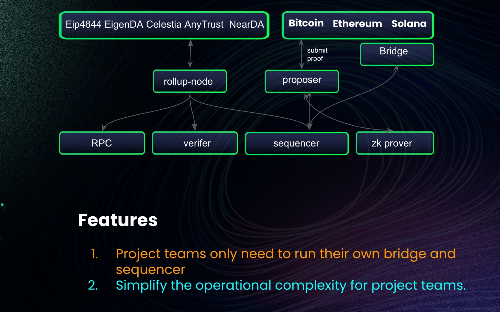

# 一.内容提要

- L1 公链（简单介绍与基本结构）
- L2 公链（简单介绍与基本结构）
- L3 公链（简单介绍与基本结构）
- 链抽象（以 DappLink 链抽象技术解决方为例子讲解）

# 二. 公链

## 1. Layer1 公链

- 什么是 L1:  具备所有区块具备特性链，安全性依赖来源自己的共识协议，具备自己共识层，执行层，代表项目：Bitcoin, Ethereum

## 2. layer2 

layer2 安全性依赖于 Layer1, 目前主流的方案有 zk rollup 和 op rollup,  这种 rollup 方案使得 layer2 不再具备自己共识层，而是使用 Layer1 共识层保障自己的安全性；在今天 layer2 生态，我们更直观把 layer2 看成一个结算层，或者是应用层 

不管是 zk rollup(零知识证明 rollup） 和 op rollup（乐观 rollup）， layer2 都具备以下这些组件

- zk rollup 和 op rollup

  - Zk  rollup:  认为每一笔是作恶，都要全部进行证明，交易有效性证明。
  - Op rollup: 认为多数情况是不会作恶，若发生悲观情况就是作恶，通过欺诈证明解决。

- **Sequencer**: 定序器，主要用于区块排序与打包交易，一般的 layer2 都是单 sequencer 

  - **核心职责**：
    1. **交易排序**：决定交易在区块中的先后顺序。这是非常关键的权利，因为它可以影响如套利等操作的成败。
    2. **批量处理**：将数百甚至数千笔 Layer 2 交易打包成一个“批次”。
    3. **发布数据**：将这个批次压缩后的**交易数据（称为 Call Data）** 发布到 Layer 1（如以太坊主网）。这一步是为了确保**数据可用性**，即所有人都能获取并验证这些数据。

- **跨链桥**：资产可以从 layer1 充值 Layer2, 可以 layer2 提现到 Layer1 

  - **两种主要操作**：
    1. **充值（Deposit）**：将资产从 L1 转移到 L2。
       - 用户将资产（如 ETH）存入 L1 上的一个官方**桥合约**。
       - 该合约会锁定这些资产，并在 L2 上为用户铸造等量的“封装”资产（如 Wrapped ETH）。
    2. **提现（Withdrawal）**：将资产从 L2 转移回 L1。
       - **OP Rollup**：用户发起提现请求后，需要等待一个**挑战期**（通常为7天），以确保该笔提现没有被质疑为欺诈。
       - **ZK Rollup**：用户发起提现请求，当 Sequencer 将包含该提现的批次以及一个**有效性证明**提交到 L1 后，即可立即完成提现，无需等待期。这是 ZK Rollup 的一大优势。

- **Rollup Sevices**（Rollup 服务 / 全节点）

  - **核心职责**：

    - **同步数据**：从 Layer 1 获取由 Sequencer 发布的所有交易数据批次。

    - **重建状态**：像在 Layer 1 上一样，从头开始执行所有这些交易，独立计算出 Layer 2 的完整最新状态（例如，每个账户的余额、每个合约的状态）。

    - **提供数据**：为钱包、区块浏览器、DApp 提供查询区块链状态和发送交易的入口（RPC 端点）。

  - DA Rollup:  不将完整的交易数据发布到昂贵的 Layer 1（如以太坊主网），而是发布到更便宜、更专用的**外部数据可用性层**。比如，将 Layer2 交易数据 rollup 到 DA 层（EIP4844或者 EigenDA ）,  它只将最小的必要信息（通常是**数据承诺**，一个代表数据的加密指纹）发布到 L1。 L1 上的合约通过验证这个“指纹”来确认数据在 DA 层上**确实可用**。
  - 证明 Rollup:  将 fraud proof 或者 zk Validity Proof   ，多个小证明聚合成一个大的证明，再提交到layer1 链上进行证明

- **证明系统**

  - **有效性证明（Validity Proof）** - **ZK Rollup 使用**:  
    - zk-prover, zk-verifer, zk-prover 是一个链下生成证明的服务，zk-verifier 链上验证合约，验证链下生成的证明是否正确
    - **机制**：Sequencer 在将交易批次发布到 L1 的同时，会提交一个名为 **ZK-SNARK** 或 **ZK-STARK** 的密码学证明。
    - **作用**：这个证明无需重新执行所有交易，就能向 L1 上的验证合约证明：“我打包的这些交易，从旧状态 S 转换到新状态 S‘ 的过程是完全正确的，符合所有规则”。
    - **特点**：**即时最终性**，提现无需等待期，安全性更高，但生成证明的计算量非常庞大。
  - **欺诈证明（Fraud Proof）** - **OP Rollup 使用**
    - **机制**：系统“乐观地”假设所有提交的状态都是正确的。 链下的 stateroot 的处理提交，只有发生欺诈的时候在链下找不一样 op-code, 提交到链上进行认证，一般有一个 7 天的挑战期，在这个期间之内，有人作恶，都可以发起挑战. 但是如果过了 7 天，即使有作恶的交易，没人提交欺诈证明，那也认为这个交易是有效的。
    - **结果**：如果挑战成功，错误的状态将被回滚，挑战者获得奖励，作恶的定序器会受到惩罚。
    - **特点**：计算成本低，但提现需要漫长的等待期。

## 3. Layer3

安全性依赖于 Layer2, 共识层是 L2, 很多 Layer3 只是把 Layer3 再往上挪一层，形成 Layer2, 其他的链结构和 Layer2 类似，Layer3 更偏向于 zkvm, Layer2 更多 zkevm;  zkvm 在应用链里面也是很广泛。 

还有一种 Layer3 叫做专用链，Cosmos 为专用链提供 sdk, cosmos 可以自定义自己模块，而且他还有很多可以复用 的模块，后面公链讲 Cosmos 的会提到。

DappLink layer3

# 三.链抽象（以 DappLink 链抽象技术解决方为例子讲解）

以 Layer2 的链抽象为例

- 项目方自己运行
  - Sequencer 和跨链桥是和**资金强相关**
- layer2 链抽象的服务
  - Rollup Sevices
    - DA Rollup:  多路 DA 抽象服务
    - 证明 Rollup：多链 Rollup 
  - 证明系统
    - Zk Rollup:  
      - zk-prover
      - Zk-verifer
    - Fraud proof: 
      - 链下生成欺诈，链上验证

